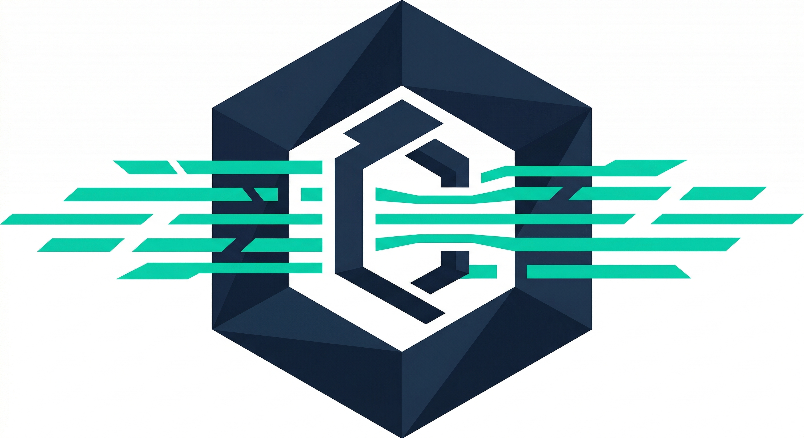

<p align="center">
  
</p>

<h1 align="center">Culvert</h1>

<p align="center">
  <strong>Self-hosted Secure Web Gateway &amp; identity-aware forward proxy</strong><br/>
  HTTP &middot; HTTPS &middot; SOCKS5 &middot; WebSocket &nbsp;|&nbsp; Single Go binary &middot; No runtime service dependencies
</p>

<p align="center">
  <a href="https://github.com/KidCarmi/Culvert/actions/workflows/ci.yml"></a>
  <a href="https://github.com/KidCarmi/Culvert/actions/workflows/codeql.yml"></a>
  <a href="https://github.com/KidCarmi/Culvert/actions/workflows/security-release-gate.yml"></a>
  <a href="https://opensource.org/licenses/MIT"></a>
  <a href="https://goreportcard.com/report/github.com/KidCarmi/Culvert"></a>
</p>

---

## What is Culvert?

Culvert is a **Secure Web Gateway (SWG)** - a policy-enforcing forward proxy that sits between your users and the internet, deciding what traffic is allowed, inspecting it, and recording it. It delivers the capabilities enterprises buy from commercial appliances - TLS inspection, identity-aware policy, malware scanning, threat intelligence, SSO, and centralized management - as a **single Go binary** you run yourself.

There is no agent to install, no plugin marketplace to assemble, and no external database or message bus to operate. The binary is statically linked (no CGO); the only optional runtime companion is a ClamAV sidecar if you enable antivirus scanning.

**Who it's for:** security teams that need egress control and DLP-style inspection; network and platform teams that need a manageable forward proxy with SSO; and operators who want the transparency and cost profile of open source without giving up an admin console, metrics, and a control plane.

```bash
docker compose up -d          # a working proxy + admin UI, no config required
```

---

## Core Capabilities

| Domain | What you get |
|---|---|
| **Proxy** | HTTP/HTTPS forward proxy, full CONNECT tunneling, SOCKS5 (RFC 1928/1929, CONNECT), WebSocket relay, PAC auto-config, upstream proxy chaining |
| **TLS inspection** | Opt-in MITM with on-the-fly ECDSA P-256 leaf certs, per-host bypass, bounded leaf cache (10k entries / 1h TTL) |
| **Policy** | Priority-ordered, first-match rules across 8 condition types; default-deny (Zero Trust); Allow / Drop / Block Page / Redirect actions; per-rule TLS inspect-or-bypass |
| **Identity** | Local (bcrypt), OIDC (Auth-Code + PKCE), SAML 2.0, LDAP/AD; multi-IdP with email-domain routing; TOTP 2FA; admin RBAC (admin/operator/viewer) |
| **Content security** | ClamAV antivirus, pure-Go YARA engine, URLhaus + OpenPhish threat feeds, regex DPI on decrypted responses, file-type blocking, domain blocklists, UT1 URL categories, CDR |
| **Observability** | Prometheus metrics, live SSE dashboard, structured JSON logs, syslog forwarding (RFC 3164/5424), signed webhook alerts, tamper-evident audit trail |
| **Distributed** | gRPC Control Plane / Data Plane with mTLS, config-snapshot sync, node groups, per-group bandwidth/QoS, config versioning, rolling upgrades, optional etcd fencing lease for HA |
| **Supply chain** | Signed release catalog (Ed25519 + Sigstore keyless), digest-pinned image dispatch, SLSA L3 provenance, Cosign-signed artifacts |

See the interactive **[architecture overview](docs/architecture.md)** and the **[Admin UI / Control Plane reference](CLAUDE.md#admin-ui--control-plane)** for detail.

---

## Quick Start

### One-line install (Linux)

This script does more than start containers - it provisions the host. Tested on Ubuntu, Debian, RHEL, CentOS, Rocky, Alma, Fedora, Amazon Linux, and Arch.

```bash
curl -fsSL https://raw.githubusercontent.com/KidCarmi/Culvert/main/scripts/install.sh | bash
```

What it does:

1. Installs Docker Engine + Compose v2 from Docker's official repo (removing conflicting snap/distro packages first).
2. Provisions `/srv/culvert` (override with `CULVERT_DIR=...`) **without cloning the source repo**: it seeds the local `culvert/proxy:pinned` image (pulled from the public `ghcr.io/kidcarmi/culvert`), extracts the deployment files (compose files + maintenance-agent packaging) from the image's built-in `/app/deploy` bundle, and runs `docker compose up -d`. Running the script from inside a source checkout uses the checkout's files instead; images that predate the bundle fall back to a git clone.
3. Sets up **encryption at rest** - prompts for (or auto-generates) a passphrase and writes it to `.env`.
4. **Installs the host-side maintenance agent as a systemd service** (`culvert-maint`) - a best-effort, opt-out step that creates a `culvert-maint` user, a systemd unit, a scoped `sudoers` entry, and `/etc/culvert-maint/config.toml`, then wires Release Management to the proxy over a local Unix socket. The agent binary comes from the image's deploy bundle (falling back to the cosign-verified signed-release download, then a local source build). It never mounts the Docker socket into the proxy, and a failure here never fails the install. The `/srv/culvert` default is what makes the wiring work out of the box — a home-directory stack under a `0700` home (EC2, modern Ubuntu) is unreachable for the unprivileged agent user, and the installer then skips the agent fail-closed (the Release Management panel shows "Agent unreachable").

> **Opt out of the systemd agent** with `CULVERT_SKIP_MAINT_AGENT=1`, and skip only the Release-Management wiring with `CULVERT_SKIP_RELEASE_AGENT_WIRING=1`. If you want a containers-only install with no host-side service, set `CULVERT_SKIP_MAINT_AGENT=1` before running the script, or use the [Docker (manual)](#docker-manual) path below.

### Docker (manual)

```bash
git clone https://github.com/KidCarmi/Culvert
cd Culvert
docker build -t culvert/proxy:pinned .   # seed the local-only image tag the compose file resolves
docker compose up -d
```

No configuration is required - the setup wizard creates your first admin account on first visit.

> **`pull access denied for culvert/proxy`?** The compose file intentionally resolves the
> local-only tag `culvert/proxy:pinned` (the proxy image is pinned at the sudo boundary and
> never pulled by name). Seed it with the `docker build` line above, or:
> `docker pull ghcr.io/kidcarmi/culvert:latest && docker tag ghcr.io/kidcarmi/culvert:latest culvert/proxy:pinned`

### Endpoints

| Endpoint | URL | Notes |
|---|---|---|
| HTTP/HTTPS proxy | `http://localhost:8080` | Point your browser / PAC here |
| SOCKS5 proxy | `socks5://localhost:1080` | Disabled by default (`socks5_port: 0`); enable in config |
| PAC file | `http://localhost:8080/proxy.pac` | Browser auto-config |
| Admin UI | `https://localhost:9090` | Accept the self-signed cert on first visit |
| Health (liveness) | `http://localhost:8080/health` | `{"status":"ok", ...}` |
| Readiness | `http://localhost:8080/ready` | `200 {"status":"ready","checks":{…}}` or `503 not_ready` |
| Prometheus metrics | `http://localhost:8080/metrics` | Optional bearer-token protection |

> Note: `/health`, `/ready`, and `/metrics` are served on the **proxy** port (`8080`), not the admin-UI port.

```bash
curl http://localhost:8080/health
curl -x http://localhost:8080 https://example.com
```

### First-run checklist

1. **Setup wizard** - open `https://<host>:9090`, accept the cert, create the first admin. Required before any other API call.
2. **Verify readiness** - `curl http://<host>:8080/ready` should return `200`; see [`docs/OPERATIONS.md`](docs/OPERATIONS.md) for the full checks map.
3. **Review Diagnostics** - Admin UI → **Infrastructure → Diagnostics** surfaces the operator contract (storage, policy load, root CA, session key, cluster TLS posture, release-management and config-version health). Resolve any `fail` rows before taking traffic.
4. **Enforce Zero Trust** - a fresh install with **no policy rules** starts in passthrough so you can't lock yourself out. Set `default_action: deny` (or add rules) to enforce default-deny from boot. See [Policy Model](#policy-model).

### Monitoring stack (optional)

> Requires a source checkout (see [Docker (manual)](#docker-manual)) — `docker-compose.monitoring.yml`
> and its `deploy/prometheus.yml` + `deploy/grafana` assets are not part of the one-line
> installer's source-free `/srv/culvert` bundle.

```bash
docker compose -f docker-compose.yml -f docker-compose.monitoring.yml up -d
# Grafana → http://localhost:3000  (user: admin, password: $GF_ADMIN_PASSWORD, default "changeme")
```

The 12-panel **Culvert Overview** dashboard is auto-provisioned from `deploy/grafana/dashboards/culvert-overview.json`.

---

## Configuration

Culvert runs with sensible defaults and can be driven by the Admin UI, a YAML file, CLI flags, or any combination. See [`config.example.yaml`](config.example.yaml) for all documented fields.

### Minimal `config.yaml`

```yaml
proxy:
  port: 8080
  ui_port: 9090
  socks5_port: 1080        # 0 = disabled

default_action: deny       # allow (passthrough) | deny (zero-trust). Auto-detected if empty.

# LDAP is a TOP-LEVEL block (a sibling of `auth:`), not nested under it.
ldap:
  url: ldaps://ldap.corp.com:636
  bind_dn: "cn=svc-culvert,ou=Services,dc=corp,dc=com"
  base_dn: "ou=Users,dc=corp,dc=com"
  required_group: "proxy-users"

security:
  ip_filter_mode: allow    # allow | block | "" (off)
  ip_list:
    - 192.168.1.0/24
  rate_limit: 60           # requests/min per IP
  max_conns_per_ip: 256

upstream:
  proxies:
    - url: http://parent-proxy:3128
  health_interval: 30s        # sibling of `proxies` (a field on `upstream`, not on a proxy entry)
  circuit_breaker:
    threshold: 5
    timeout: 30s

rewrite:
  - host: "*.internal.example.com"
    req_set:
      X-Forwarded-By: Culvert
    resp_remove:
      - Server
```

### Key CLI flags

```
Core        -port 8080  -ui-port 9090  -socks5-port 0  -config <file>
TLS         -ca-path <bundle>  -tls-cert  -tls-key  -ui-no-tls
Auth        -ui-users-file <db>  -ui-allow-ip <cidrs>  -session-timeout 8
Filtering   -blocklist  -policy  -geoip-db  -clamav-addr  -yara-rules-dir  -threat-feed-db
Logging     -logfile  -log-max-mb 50  -request-log-max-mb 100  -audit-log  -syslog
Metrics     -metrics-token  -rate-limit  -otlp-endpoint <url>
Control Pl. -cp-grpc-addr  -cp-grpc-cert  -cp-grpc-key  -cp-grpc-ca
Data Plane  -dp-cp-addr  -dp-node-id  -dp-cert  -dp-key  -dp-ca
```

> In the shipped Docker image, persistence paths such as `/data/ca.bundle` and `/data/ui_users.json` are supplied by the compose command line, not by binary flag defaults.

### Environment variables

| Variable | Purpose |
|---|---|
| `CULVERT_CA_PASSPHRASE` | CA private-key encryption passphrase (**required** for TLS inspection) |
| `CULVERT_LOG_PASSPHRASE` | Encryption-at-rest passphrase for the persistent log store. Falls back to `CULVERT_CA_PASSPHRASE` if unset; empty (both unset) = encryption off. |
| `CULVERT_C2_ENFORCE` | Admin RBAC enforcement mode. Default `enforce` (fail-closed); set `false`/`0`/`no`/`off` for shadow (log-only). Read once at startup. |
| `CULVERT_RELEASE_PROXY_REPO` | Bare image repository allowed for release dispatch (default `ghcr.io/kidcarmi/culvert`; no tag/digest). |
| `CULVERT_MAINT_AGENT_URL` | Local maintenance-agent endpoint (default Unix socket `/run/culvert-maint/culvert-maint.sock`). |
| `CULVERT_RELEASE_CATALOG_TRUST_KEYS` | JSON array of **public** Ed25519 catalog trust roots. Public keys only. |
| `CULVERT_RELEASE_CATALOG_VERIFY` | Signature mode: enforce (default when a trust root is present), `permissive`, or `disabled`. **Break-glass only** - leave unset in production. |
| `CULVERT_RELEASE_CATALOG_URL` | Optional signed-catalog origin for verified auto-seed at startup (enforce mode only). |
| `CULVERT_RELEASE_SIGSTORE_IDENTITY` / `_TRUSTED_ROOT` | Optional overrides for the keyless (Sigstore-identity) release-trust policy. Public material only. |

---

## Policy Model

The policy engine evaluates rules in **priority order and stops at the first match** (`policy.go`). Each rule combines any of **8 condition types**:

1. **Source IP / CIDR**
2. **Authenticated identity**
3. **IdP group membership**
4. **Auth source** (OIDC / SAML / LDAP / local)
5. **Destination FQDN** - exact + wildcard
6. **URL category** (UT1 + curated: Social, Streaming, Gambling, Malicious, Adult, …)
7. **Destination country** (GeoIP; **fail-closed** - unknown country does not match)
8. **Time schedule** - day-of-week + time window + IANA timezone

**Actions:** `Allow`, `Drop`, `Block Page`, `Redirect`. Every rule also carries a **TLS action** - `Inspect` (full MITM) or `Bypass` (transparent tunnel).

**Default-deny (Zero Trust):** once any rule exists or `default_action: deny` is set, unmatched traffic is blocked. A fresh install with **zero rules and no explicit `default_action`** starts in passthrough by design, so you can't lock yourself out - enforce deny explicitly for production.

**Conflict detection:** overlapping rules with the same priority but different actions are surfaced as warnings at load and in the UI. **Policy Tester** dry-runs any host/user/IP against the live ruleset. Per-rule hit counters are exported to Prometheus (cardinality-capped at 200 series).

---

## Security Model

Culvert is built defense-in-depth. Every claim below is enforced in code.

| Area | Implementation |
|---|---|
| **Zero Trust** | Default-deny policy engine (see [Policy Model](#policy-model)) |
| **SSRF prevention** | `isPrivateHost()` resolves DNS and rejects private/loopback/metadata IPs before every outbound dial, **and re-checks the resolved IP at connect time** to close the DNS-rebinding TOCTOU window |
| **Log injection (CWE-117)** | `sanitizeLog()` strips CR/LF/TAB and C0 controls; `%q` formatting; internally generated request IDs are safe by construction |
| **Open redirect** | `isSafeRedirectURL()` requires absolute URL, http/https scheme, and non-private resolvable host |
| **Brute-force** | IP + user lockout after 5 failures (15-min cooldown), plus a 20-failure account-wide tier over a 10-min window |
| **Admin API rate limiting** | 60 req/min per IP on mutating (`POST`/`PUT`/`DELETE`) `/api/` endpoints |
| **Slowloris** | 60s read deadline on TLS-inspected client connections, re-armed per read |
| **CSRF** | Origin-based same-origin enforcement on mutating requests + `X-Frame-Options: DENY` and CSP |
| **Session security** | HMAC-SHA256 signed cookies, per-session 128-bit `jti`, dynamic `Secure` flag, fresh token per login, disk-persisted revocation list synced across the cluster via the control plane |
| **CA key protection** | AES-256-GCM with PBKDF2-SHA256 (600,000 iterations, NIST SP 800-132) at rest; atomic bundle writes |
| **Certificate revocation** | Upstream OCSP checking (fail-closed when a published responder is unreachable). CRL checking is **not yet implemented** - see [Limitations](#limitations--known-gaps) |
| **Hop-by-hop stripping** | RFC 7230-compliant - parses the `Connection` header for dynamically listed hop-by-hop names |
| **Header scrubbing** | Strips private IPs from `X-Forwarded-For`, drops private `X-Real-IP`, always removes `X-User-Identity` before forwarding |
| **Password complexity** | 8+ chars, mixed case, and a digit required |
| **Admin RBAC (defense-in-depth)** | Metadata-driven enforcement layer *in addition to* per-handler `requireRole`; report-only audit-completeness and role-divergence detectors; read-only governance surface at `/api/governance/control-plane` |

### Post-Quantum key exchange

Culvert runs on Go 1.26, whose `crypto/tls` **auto-negotiates the hybrid X25519 + ML-KEM-768 key exchange** when the peer supports it - protecting confidentiality against "Harvest Now, Decrypt Later" attacks on all TLS connections. This capability is inherited from the Go toolchain rather than configured by Culvert, and adds ~1ms to the initial handshake with no ongoing cost. Certificate **signing** remains classical ECDSA P-256; PQC signatures (ML-DSA) will follow when the Go standard library adds native support.

### Supply-chain integrity

- **Signed release catalog** - the Control Plane loads a catalog validated with fail-closed manifest-hash binding and **Ed25519 signatures (enforce-by-default when trust roots are present)**, plus a second **Sigstore keyless (identity-pinned)** scheme; freshness (`expires_at`) and rollback (`catalog_version`) protection are enforced in enforce mode. An unsigned catalog is never auto-trusted.
- **Digest-pinned dispatch** - releases resolve to an immutable `repo@sha256:<digest>` ref; the image is pinned at the sudo boundary and retagged locally, so a compromised maintenance user can only run a digest of the one configured repo.
- **Provenance & signing** - releases ship **SLSA Level 3** provenance and **Cosign keyless** signatures on images, binaries, SBOMs, and the catalog itself.

---

## Observability

### Prometheus metrics (`GET /metrics`, proxy port)

| Metric | Type | Description |
|---|---|---|
| `culvert_requests_total` | counter | All proxy requests |
| `culvert_requests_allowed` | counter | Forwarded requests |
| `culvert_requests_blocked` | counter | Blocked requests (all reasons) |
| `culvert_requests_auth_fail` | counter | Authentication failures |
| `culvert_bytes_sent_total` / `culvert_bytes_recv_total` | counter | Bytes to client / from upstream |
| `culvert_request_duration_seconds` | histogram | Request latency (11 buckets, 5ms-10s) |
| `culvert_policy_rule_hits_total{rule="..."}` | counter | Per-rule hit counter (capped) |
| `culvert_clamav_blocked_total` | counter | ClamAV blocks |
| `culvert_yara_blocked_total` | counter | YARA blocks |
| `culvert_threat_feed_blocked_total` | counter | Threat-feed blocks |
| `culvert_blocklist_size` | gauge | Blocklist entry count |
| `culvert_uptime_seconds` | gauge | Proxy uptime |

> Metric names are authoritative as of `metrics.go`. Run `curl -s localhost:8080/metrics | grep culvert_` against your build for the full current set.

### OTLP export (metrics + traces)

Optional push export to an OTLP/HTTP collector (e.g. the OpenTelemetry Collector, Grafana Alloy), independent of the pull-based `/metrics` endpoint above. Configure via `-otlp-endpoint <url>` / `otlp_endpoint` in `config.yaml`, or from the Admin UI's OpenTelemetry (OTLP) panel — cluster-synced and admin-durable, no restart required to change the endpoint. Unset by default (no export).

### Logging & SIEM

- **Structured logging** - text or JSON, with rotating files (configurable size thresholds).
- **Syslog forwarding** - UDP/TCP, RFC 3164 and RFC 5424, for Splunk / Elastic / QRadar.
- **Live SSE feed** - the Admin UI dashboard streams request activity in real time.
- **Signed webhook alerts** - HMAC-SHA256 (`X-Culvert-Signature`) for threats, blocks, and lockouts.
- **Tamper-evident audit trail** - JSONL of every admin action, enriched with the authenticated actor.

---

## Deployment

### Single node

A single node with TLS inspection + ClamAV comfortably serves ~500 concurrent users. Minimum footprint for a full-feature deployment:

```
2 vCPU | 1.5 GB RAM | 2.5 GB disk (SSD recommended)
```

Proxy-only (no AV, no inspection): `1 vCPU | 128 MB RAM | 100 MB disk`.

### Control Plane / Data Plane cluster

Beyond ~500 users or ~1 Gbps sustained, scale horizontally with a gRPC Control Plane and stateless Data Plane nodes.

| Component | CPU | RAM | Storage | Role |
|---|---|---|---|---|
| Control Plane | 2 vCPU | 512 MB | 500 MB | Config sync, enrollment, dashboard - **no proxy traffic** |
| Data Plane node | 2 vCPU | 1 GB | 1 GB | Handles proxy traffic; receives full config from CP on connect |
| DP + ClamAV | 2 vCPU | 2 GB | 1.5 GB | Add ~1 GB RAM + 300 MB disk for AV |

- **DP nodes are stateless** - they receive their entire config (policy, blocklist, PAC, threat feeds, session key, bandwidth policies, node groups) from the CP over mTLS gRPC. Lose one, spin up a replacement, it auto-enrolls in seconds.
- **HA fencing** - optional etcd fencing lease (`-ha-etcd-*`) provides fail-closed leader election with epoch-based fencing; without it, the legacy leader/standby model applies. See [`docs/operator/ha-lease-failover.md`](docs/operator/ha-lease-failover.md).
- **Config versioning** - every mutation snapshots automatically (50-version history) with side-by-side diff and one-click rollback.
- **Backup / restore** - via the profile-gated `cli` compose service; see [`docs/operator/docker-compose-backup-restore.md`](docs/operator/docker-compose-backup-restore.md).
- **Catalog-driven install** - a fresh install selects its image from the signed release catalog (not GHCR tags), verifying the verifier binary, catalog, and image under one pinned identity. Operator inputs, fallback matrix, release-cutover checklist, and identity-rotation runbook: [`docs/operator/catalog-bootstrap-install-runbook.md`](docs/operator/catalog-bootstrap-install-runbook.md).

Detailed single-node, multi-node, and upstream-chaining topologies are in the **[Deployment Guide](docs/deployment-guide.md)**. Full sizing tables (per-connection memory, cluster throughput) are in [`docs/OPERATIONS.md`](docs/OPERATIONS.md).

---

## Development

Requires **Go 1.26+**.

```bash
go build -o culvert .                        # build
go test -race ./...                          # full suite with race detector
go test -coverprofile=cover.out ./...        # coverage
go test -fuzz FuzzIsPrivateHost -fuzztime=30s  # fuzz the SSRF guard
```

**Repository layout:** everything is `package main` at the root (composition roots and thin shims); logic/state/persistence live in 63 packages under `internal/`. A handful of standalone tools (the Maintenance Agent, the OpenAPI bundler, CI diagnostics) live under `cmd/` instead. Coding conventions, the `internal/` decomposition, and the admin-API route-metadata contract are documented in [`CLAUDE.md`](CLAUDE.md).

**Fuzz targets:** `FuzzIsPrivateHost`, `FuzzIsSafeRedirectURL`, `FuzzParseClamResponse`, `FuzzNormaliseFeedURL`, `FuzzMatchDest`, `FuzzParseYARALiteral`.

### CI & security pipeline

Pull requests are gated by two required checks - **Fast PR Gate** and **Deep PR Gate** - covering fmt/vet/build, diff-scoped `golangci-lint` (22 linters), the full `-race` suite with a 55% coverage floor, `govulncheck`, `gosec`, `gitleaks`, Trivy, and image/compose validation.

The main/tag security-release gate adds **9 blocking checks** - gosec, govulncheck, Trivy (filesystem + image), gitleaks, staticcheck, hadolint, `-race` tests, the coverage floor, and license compliance (blocks GPL/AGPL/LGPL) - plus **CodeQL** SAST, an informational **CycloneDX SBOM** (Syft), **Cosign** keyless signing, and **SLSA L3** provenance on releases.

---

## Limitations & Known Gaps

Stated plainly, because a security product should be honest about its edges:

- **Revocation:** OCSP only - **CRL checking is not implemented**. OCSP fails open when a certificate publishes no responder.
- **Fresh-install posture:** with zero rules and no `default_action`, the proxy starts in passthrough (allow), not deny. Enforce Zero Trust explicitly.
- **Post-quantum:** key exchange is quantum-resistant (inherited from Go 1.26); certificate signing remains classical ECDSA P-256.
- **SOCKS5:** CONNECT only - UDP ASSOCIATE is rejected.
- **License gate:** blocks GPL/AGPL/LGPL; CPAL is not currently enforced by the license check.
- **Sizing figures** in the deployment tables are engineering estimates, not published benchmarks - validate against your own workload before capacity planning.

---

## Roadmap

Development phases, production-readiness items, and the engineering governance model are tracked under [`roadmap/`](roadmap/) and [`docs/engineering/`](docs/engineering/). Near-term focus: CRL support, GUI parity for the remaining startup-scoped HA settings, and completing the catalog-driven release path as the default update mechanism.

---

## Contributing

1. Fork and branch (`git checkout -b feature/my-feature`)
2. `go test -race ./...`
3. Keep the admin-API route-metadata and config-surface parity tests green (see [`CLAUDE.md`](CLAUDE.md))
4. Open a PR - the full CI pipeline (CodeQL, security gate, golangci-lint) runs automatically

---

## License

[MIT](LICENSE)
