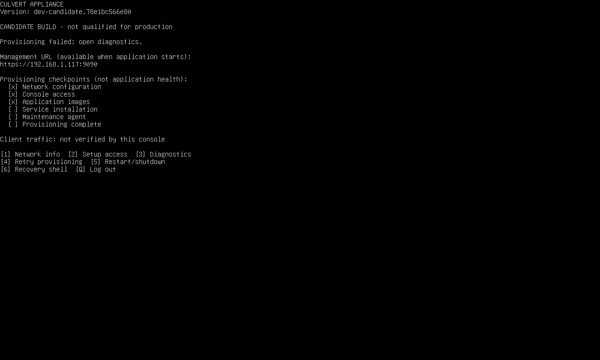
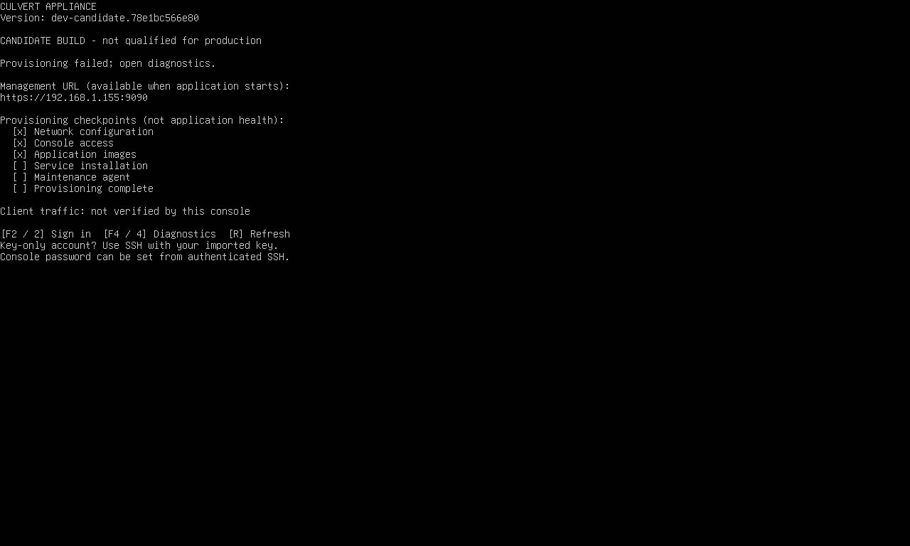

# Culvert boot console — first implementation slice

This additive component provides an ESXi-style local console after power-on.
It is a static Go host binary built with the root `go.mod` toolchain,
independent of Docker and the Culvert application. There is no new network
listener. The displayed application URL remains `https://<address>:9090` and is
explicitly labelled unavailable until the application starts.

The public screen shows version/candidate status, assigned IPv4 addresses,
recorded firstboot checkpoints and live service observations. `F2` or `L` starts
normal Linux/PAM login as `culvert`; `F4` or `4` shows sanitized diagnostics.
Number keys work when a browser console intercepts function keys.

After authenticating, the operator gets network information, setup-token access
through the existing privileged status command, diagnostics, a confirmed retry
of incomplete provisioning, confirmed reboot/shutdown and a recovery shell.
The menu logs out after five minutes without input. An explicitly opened shell
retains normal shell behavior. Key-only installations still require the imported
SSH key; the menu never unlocks the account or invents a default password.
An administrator can set a console password through their authenticated SSH
session with `sudo passwd culvert`.

## Integration boundary with Opus

The Go command lives in `cmd/culvert-console`, with domain logic and white-box
tests in `internal/applianceconsole`. Packaging files stay here to avoid
conflicts with the ongoing firstboot/image fix. This slice does **not** modify
`build-ova.sh`, `prepare-guest.sh`, firstboot,
the network helper, the existing status CLI, or the application UI. It does not
change the existing application readiness contract.

Two build hooks are needed when this component is accepted:

1. In `build-ova.sh`, beside the provision/os-maintenance overlay copy, copy
   `appliance/console` to `$OV/opt/culvert-appliance/console`, then build from the
   repository root using its pinned Go compiler:

   ```bash
   CGO_ENABLED=0 GOOS=linux GOARCH=amd64 go build -trimpath \
     -o "$OV/opt/culvert-appliance/console/culvert-console" ./cmd/culvert-console
   ```

   The executable must be copied with mode 0755. It is a build artifact and is
   ignored by Git; no compiler or Python runtime is needed in the guest.
2. In `prepare-guest.sh`, after the `culvert` account and existing helpers have
   been installed, run:

   ```bash
   bash /opt/culvert-appliance/console/install.sh
   ```

The installer checks that the binary executes, PAM login, sudo and the account before
installing the tty1 getty override and root-owned login profile hook. It does
not restart a live console, add sudo rules, change the firewall or configure
autologin. Normal tty2/serial/SSH login remains available. Do not add an ordering
dependency on Docker, network-online or culvert-firstboot: an unavailable
dependency must not prevent the menu appearing.

To evaluate in an **owned disposable guest** after copying this directory:

```bash
sudo bash /tmp/culvert-console-dev/install.sh
sudo systemctl daemon-reload
sudo systemctl restart getty@tty1.service
```

The latter command ends any tty1 session; run it through authenticated SSH only
in the disposable qualification VM. Reboot validation must then prove the same
menu appears without manually restarting getty.

Rollback through SSH or tty2:

```bash
sudo rm /etc/systemd/system/getty@tty1.service.d/culvert-console.conf
sudo rm /etc/profile.d/culvert-console.sh
sudo systemctl daemon-reload
sudo systemctl restart getty@tty1.service
```

## Shared status contract (schema version 1)

```bash
/opt/culvert-appliance/bin/culvert-console --json
/opt/culvert-appliance/bin/culvert-console --text
```

These are read-only and never include a setup token, `.env`, raw journals or
OVF data. Seven fixed probes execute concurrently with four-second subprocess
timeouts (HTTP probes have two-second deadlines). Requests use loopback only,
disable proxies, do not follow redirects, and limit response size. Only the
self-signed loopback setup-status read uses a TLS verification exception.
No Docker API or command is required to render the display.

- `phase`: `unknown`, `waiting`, `running`, `failed`, `provisioned`, `ready`.
- `reason`: stable reason code; `message`: operator explanation.
- `steps`: each existing checkpoint is `recorded` or `not_recorded`. This is
  deliberately evidence of a marker, not a fabricated current step or percentage.
- `firstboot`: allowlisted systemd fields. A previous failure remains visible
  during automatic retry. An inactive incomplete unit is explicitly not running.
- `administrator_enrolled`: true only on HTTP 200 and an explicit `needsSetup: false`.
- `ready`: requires application health HTTP 200, explicit enrollment, readiness
  HTTP 200 and `ok` for policy_loaded, policy_posture, ca and setup_complete.
  Missing rows are not success. This is a conservative console summary.
- `traffic_verified`: always false; local health probes cannot prove a client
  successfully passes through the proxy.

Terminal text is restricted to printable ASCII so untrusted metadata cannot
inject terminal controls. The installed binary and hooks are root-owned.
Public key presses can only refresh,
view this sanitized status, or invoke `/bin/login culvert` without `-f`.
Recovery actions additionally check the effective Unix identity, use fixed argv
and existing sudo authorization. No password is captured by the console program.
Setup-token output stays on the authenticated terminal and is not a diagnostic
export. The public root-owned process is a narrow getty/login wrapper, not an
HTTP server and not an unauthenticated shell.

## Package boundary design

This records the new boundary required by `CLAUDE.md` and the package-isolation
roadmap. `internal/applianceconsole` owns status interpretation, display layout,
key-to-action policy and recovery guards. `NewCollector` and `NewActions` copy
explicit dependencies into private fields. The package does not depend on the
application's main package, singletons, Docker or a generic common service.

`cmd/culvert-console` owns process startup, fixed production paths, signal
cancellation, bounded subprocess probes, effective-identity checks, Linux
terminal I/O and concrete command wiring. It uses the existing `x/sys/unix`
dependency. No module dependencies are added. Terminal text is CLI output, not
application logging; raw probe stderr and credential-bearing output never enter
the public status snapshot.

Collection is read-only: existing firstboot code owns marker persistence and
the application owns enrollment/readiness. A collection call starts seven bounded
probes and joins them before returning. There are no detached background workers.
The command owns cancellation; child processes use that context. Menu input uses
bounded polling, never a background stdin reader that could consume a later
PAM password. Terminal modes/cursor are restored before login, confirmation or
recovery actions; those actions synchronously own input until they exit. systemd
owns the getty process and its shutdown process group. The console adds no
persistent mutable state or service listener.

GUI parity scope: `--login` and `--admin` select getty/PAM process roles, while
`--json` and `--text` serialize the same read-only host status. They introduce no
application configuration knobs. This first slice is explicitly local recovery;
host recovery API/UI and browser wizard parity remain follow-on work. Existing
application setup continues at the displayed management URL. This is not a claim
that the complete provisioning experience or its GUI parity has shipped.

## Tests and remaining work

```bash
go test -race -shuffle=on -count=2 ./internal/applianceconsole ./cmd/culvert-console
go vet ./internal/applianceconsole ./cmd/culvert-console
golangci-lint run ./internal/applianceconsole/... ./cmd/culvert-console/...
CGO_ENABLED=0 go build -trimpath -o appliance/console/culvert-console ./cmd/culvert-console
bash -n appliance/console/install.sh
bash -n appliance/console/profile.sh
```

Tests cover absent/broken services, malformed observations, stale checkpoints,
readiness/enrollment distinctions, terminal escape filtering, secret exclusion,
unauthenticated action refusal and retry/power confirmation boundaries.

Real ESXi smoke results are recorded separately; unit tests do not establish
PAM/getty/keyboard behavior. The incomplete ClamAV image remains a product
failure even if the console handles it correctly.

The [Go ESXi smoke report](evidence/esxi-go-smoke.json) identifies implementation
commit `654af2fe`, compiler, base OVA and installed binary/hook hashes. Both Go
test packages passed twice with shuffled execution inside Ubuntu. Linux race
CI, vet, the static build/compiler check and focused repository lint passed.
Real PAM password rejection, authenticated login/logout, Docker-independent
operation and automatic console startup after reboot passed. Machine identity
was retained. The owned VM was deleted and per-run private files removed.



The [retained reboot screenshot](evidence/esxi-go-boot-partial.png) is partial,
even after a tty2/tty1 redraw. It is **not** full visual proof of the boot screen.
The complete public menu was separately verified in the guest's `/dev/vcs1`
buffer after reboot. This capture limitation remains open. The Go console
service reported 10,149,888 bytes at one observation, not a peak or whole-VM
resource qualification. This was a development overlay, not a rebuilt OVA.

The [historical Python ESXi smoke report](evidence/esxi-smoke.json) records the exact base OVA
and installed overlay hashes. All 26 tests passed in the Ubuntu guest; real
VMware keyboard/PAM login, invalid-password refusal, logout, stopped-Docker
operation and automatic console startup after reboot passed. The owned VM was
deleted afterward. This is development-overlay evidence, not a rebuilt OVA.
These results and the image below apply only to the superseded Python prototype,
not the Go implementation. The prototype service reported about 14.1 MiB at one observation; this is not a
peak or whole-appliance resource qualification.



Some ESXi screenshot captures were partial even though the guest's virtual
terminal buffer held the complete menu. The retained reboot capture follows a
tty2/tty1 switch to force a redraw; no image editing was used. This capture
limitation remains recorded rather than counting a partial image as visual proof.

Follow-on work: persistent explicit firstboot step/error events, guided network
editing with host-side rollback (the current menu provides information/recovery
only), independent browser bootstrap service, and application wizard integration.
No network Apply button is offered before rollback is implemented. The proposed
full browser setup experience is not delivered by this console slice.


## Visual console integration

The home view follows the supplied 80-column terminal composition: cyan brand
and selection, appliance/network identity, a scoped status and next action,
browser handoff, four visible choices, and an authentication footer. Both 80x25
and 80x24 preserve the bottom margin. Smaller terminals show a compact paged
view; details wrap long values and support Up/Down or PageUp/PageDown. Terminals
smaller than 20x7 request resizing. Numbers open views immediately; arrows/Tab
select only the four visible entries, and Enter opens. B/Escape returns home.

1. Network information: read-only observed addresses, links, gateways and DNS.
2. Setup access: existing web onboarding; S invokes the existing privileged
   setup-status helper only after PAM authentication.
3. Diagnose readiness: observed failure, source/time and recorded checkpoints.
4. Installation report: current build, setup and check observations, with the
   JSON equivalent available through `culvert-console --json` over SSH.

L/F2 signs in; Q logs out of the authenticated menu. 0 opens authenticated
recovery (retry, confirmed power operations, shell). Public recovery requests
only enter normal login; they do not queue an action to run after login. Network
E opens authenticated recovery. No new network writer or rollback claim is
introduced. Mode remains unknown instead of inferring DHCP/static from an IP.
The report is a current observation, not a persisted receipt or attestation;
configuration revision and external traffic verification are not collected.

| Display fact | Authoritative observation |
| --- | --- |
| Host / build | Bounded `/etc/hostname` and existing build-info JSON |
| Interfaces / addresses / link | Fixed `ip -j address show scope global`; sysfs physical/lower interfaces; IPv4 and IPv6 |
| Gateways | Fixed IPv4/IPv6 `ip -j route show default` |
| DNS | IP-only nameserver entries from `/run/systemd/resolve/resolv.conf`; absent means unknown |
| Setup availability / enrollment | HTTP 200 plus typed `needsSetup` boolean from the existing loopback 9090 setup endpoint |
| Status / checkpoints | Existing systemd fields and firstboot marker files |
| Application checks | Existing health/readiness endpoints; no traffic verification inferred |

The management URL uses observed addresses and the existing appliance's
published 9090 port contract (`appliance/provision/culvert-status` and firstboot),
not the reference demo's 8443 placeholder. The URL is offered only after the
local management probe succeeds. This does not prove a browser can reach it,
verify a certificate from that browser, or discover custom listener bindings.

Rendering supports basic ANSI colors on known compatible terminals, monochrome
on vt100 or with NO_COLOR, and printable line-oriented output for TERM=dumb or
unknown terminals. Plain mode updates on operator input rather than repeatedly
scrolling status. Bracketed paste is discarded; queued input is flushed before
PAM/recovery handoff. ASCII sanitization precedes the addition of renderer-owned
escape sequences. No external UI library or module dependency is introduced.

Tests include deterministic readiness fixtures, layout/long-field/paging checks,
privilege boundaries and real Linux pseudo-terminal navigation, resize, paste
and termios restoration. Fixture addresses in tests are never production data.
Historical smoke evidence above applies to its recorded implementation commit;
new visual verification is recorded separately.
