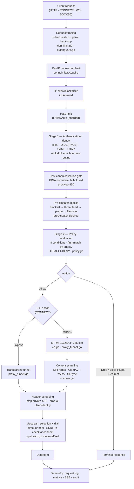
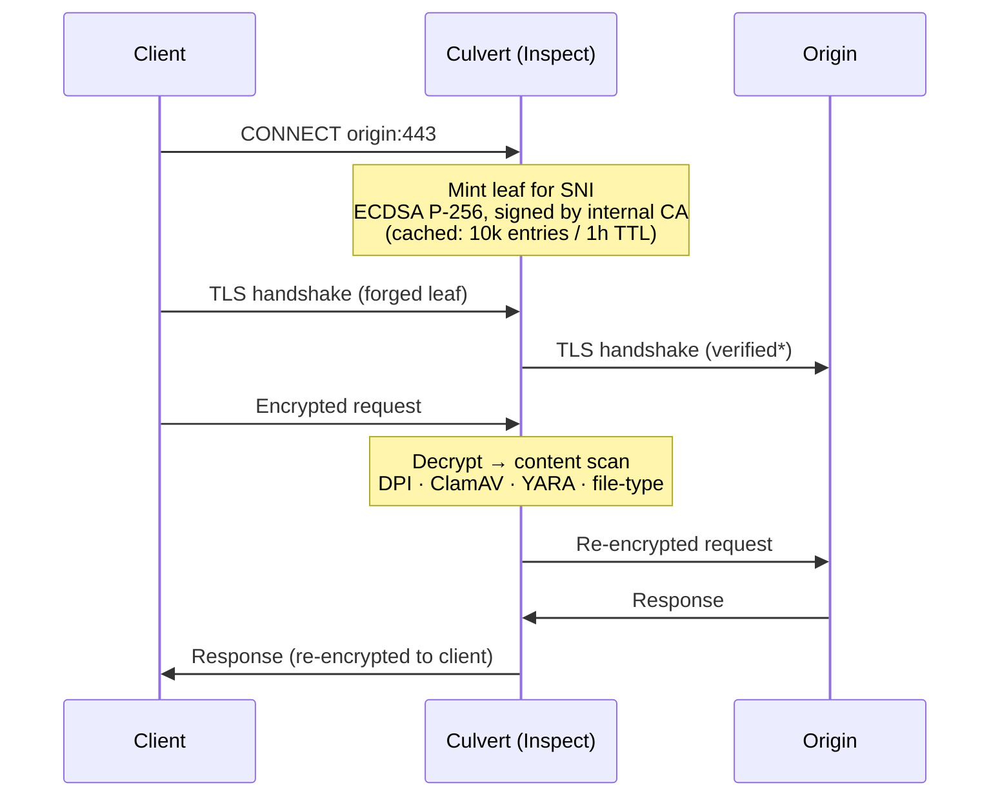
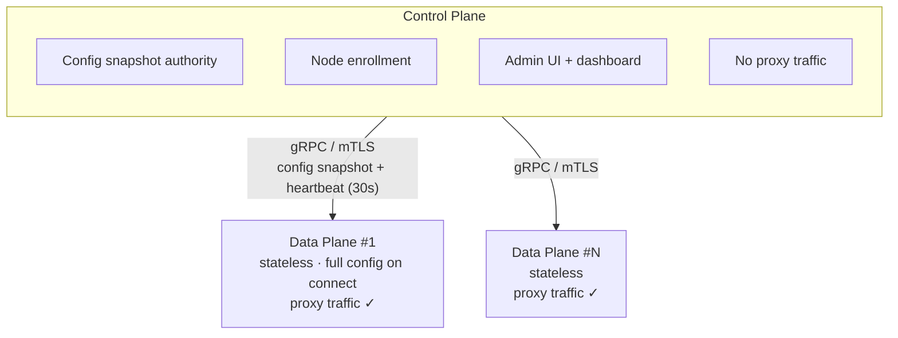

# Architecture

Culvert is a single-process Secure Web Gateway. Client traffic flows through an
ordered request pipeline; in a cluster, a Control Plane distributes
configuration to stateless Data Plane nodes. This article describes both, with
each stage tied to the source that implements it. It is the verified,
website-facing companion to the in-repo [`../../../docs/architecture.md`](../../../docs/architecture.md).

For the capability inventory this architecture delivers, see
[What is Culvert](what-is-culvert.md).

---

## Purpose

Understanding the pipeline order matters operationally: it tells you **which
control blocks a request first**, where a decision is logged, and what a given
failure mode short-circuits. The order below is taken directly from
`proxy.go:handleRequest` (the proxy request entry point), not from a design
document — where the two differ, the code is authoritative.

## Request pipeline

Every proxied request is evaluated through this ordered pipeline. Any stage can
short-circuit and write a terminal response; only traffic that survives every
gate reaches the upstream.

### Stage reference

| # | Stage | What it enforces | Source |
|---|---|---|---|
| 1 | Tracing + crash guard | Assigns `X-Request-ID`; record-only panic backstop (never corrupts a hijacked tunnel) | `connlimit.go`, `crashguard.go` |
| 2 | Per-IP connection limit | Caps concurrent connections per client IP; `503` on exceed | `proxy.go` (`connLimiter.Acquire`) |
| 3 | IP filter | Allow/block CIDR lists; `403 IP_BLOCKED` | `proxy.go` (`ipf.Allowed`), `security.go` |
| 4 | Rate limit | Per-IP request rate (sharded limiter); `429 RATE_LIMITED` | `proxy.go` (`rl.AllowAuto`) |
| 5 | Stage 1 — Authentication | Resolves identity from local/OIDC/SAML/LDAP; writes `407`/redirect/`403` itself | `proxy.go` (`resolveRequestAuth`), `auth_*.go` |
| 6 | Host canonicalization | IDNA-normalizes the destination; **fail-closed** — an un-normalizable host is blocked `INVALID_HOST` | `proxy.go:850-859` |
| 7 | Pre-dispatch blocks | Domain blocklist, threat feed, plugin decision, file-type profile — in that order | `proxy.go` (`preDispatchBlocked`) |
| 8 | Stage 2 — Policy | 8-condition, first-match-by-priority evaluation; default-deny | `policy.go` (`Evaluate`) |
| 9 | Action | `Allow` · `Drop` · `Block Page` · `Redirect` | `proxy.go`, `policy.go` |
| 10 | TLS action (CONNECT) | Per-rule `Inspect` (MITM) or `Bypass` (transparent tunnel) | `proxy_tunnel.go`, `policy.go` |
| 11 | Content scanning | On inspected traffic: DPI regex, ClamAV, YARA, file-type | `scanner.go` |
| 12 | Header scrubbing | Strips private `X-Forwarded-For`, drops `X-User-Identity` before forwarding | `proxy.go` (`scrubForwardedHeaders`) |
| 13 | Upstream + SSRF | Direct or pooled upstream; `isPrivateHost` re-checked at connect (anti DNS-rebinding) | `upstream.go`, `internal/ssrf` |
| 14 | Telemetry | Request log, metrics, SSE feed, audit — for every outcome | `store.go`, `metrics.go`, `events.go` |

> **Pipeline order note.** This ordering is verified against `handleRequest`.
> It refines the ASCII diagram in `docs/architecture.md`, which places the
> plugin chain before authentication and omits the rate-limit and
> host-canonicalization stages; in code the plugin decision runs *after*
> Stage-1 auth inside `preDispatchBlocked` (`proxy.go:435`).

### Default-deny nuance

Deny is enforced once any rule exists or `default_action: deny` is set
(`setDefaultPolicyAction`, `proxy.go`). A fresh install with **zero rules and no
explicit `default_action`** starts in passthrough so operators cannot lock
themselves out — enforce Zero Trust explicitly before taking production traffic.

---

## TLS inspection internals

When a rule's TLS action is `Inspect`, Culvert terminates the client TLS session
with an on-the-fly leaf certificate signed by its internal CA, then
re-originates TLS to the upstream.

- **Leaf certs:** ECDSA P-256, minted per SNI, in a bounded cache (10,000
  entries, 1h TTL, LRU). All forged leaves share one process-wide, memory-only
  signing key — generated once, never persisted or sent on the wire
  (`internal/ca/ca.go:78-79`, `:763`).
- **CA key at rest:** AES-256-GCM with PBKDF2-SHA256 (600,000 iterations, NIST
  SP 800-132); passphrase from `CULVERT_CA_PASSPHRASE`
  (`internal/ca/ca.go:138,352,358`).
- **Upstream verification (\*):** the upstream leg caches and resumes TLS
  sessions only after a **verified** handshake; the per-rule skip-verify path
  never stores or resumes a session (`docs/architecture.md` §2).
- **Bypass:** rules carry `Bypass` to tunnel sensitive destinations (banking,
  health) without decryption; per-host bypass patterns are managed in the UI
  (`internal/sslbypass`).
- **Post-quantum:** the TLS key exchange auto-negotiates hybrid
  X25519 + ML-KEM-768 via the Go 1.25 standard library — inherited from the
  toolchain, not configured by Culvert (`pqc_test.go:59`).

Enabling inspection is a deliberate interception with legal and privacy
obligations; see [TLS inspection administration](../04-tls-inspection/tls-inspection.md).

---

## Control Plane / Data Plane

A single Culvert process runs proxy, admin UI, and control plane together. To
scale horizontally, split them: a **Control Plane** owns configuration and the
admin UI and carries no proxy traffic; **Data Plane** nodes are stateless
proxies that enroll and receive the full configuration on connect.

- **DP nodes are stateless.** On connect they receive the entire config
  snapshot — policy rules, blocklist, PAC exclusions, threat-feed data, session
  HMAC key, bandwidth policies, node groups. Replace a node and it re-enrolls in
  seconds (`controlplane_snapshot.go`).
- **The snapshot is a walled surface.** Capture, apply, redaction, and
  wire-wipe parity are enforced by tests, so sensitive fields (session key, IdP
  secrets) are redacted before being sent to a non-enrolled caller
  (`controlplane_server.go:91-100`).
- **mTLS with an enrollment bootstrap.** The gRPC server verifies enrolled-node
  certificates (`verifyNode`); enrollment itself uses
  `VerifyClientCertIfGiven` so a new node can call `Enroll` before it holds a
  cert (`controlplane_tls.go:91`).
- **HA fencing (optional).** An etcd fencing lease provides fail-closed leader
  election with epoch-based fencing (`-ha-etcd-*`,
  `internal/halease/etcd.go`, key `/culvert/ha/leader`, epoch =
  `CreateRevision`). See [High availability](../08-distributed/high-availability.md).
- **Node groups & QoS.** Label selectors (with auto GeoIP labels) drive
  per-group token-bucket bandwidth policies, enforced per-DP so limits scale
  with node count (`nodegroup.go`, `bandwidth.go`).

---

## Defense-in-depth layers

| Layer | Control | Source |
|---|---|---|
| Ingress | Per-IP connection cap, admin-API rate limit (60/min mutating), IP allow/block | `connlimit.go`, `security.go` |
| Identity | Local bcrypt, OIDC (PKCE), SAML 2.0, LDAP/AD, multi-IdP routing, TOTP 2FA, RBAC | `auth_*.go`, `internal/totp`, `ui_rbac.go` |
| Egress safety | SSRF guard with connect-time re-resolution (anti DNS-rebinding), open-redirect guard | `internal/ssrf`, `security.go` |
| Content | ClamAV, YARA, DPI regex, file-type profiles, domain blocklist, threat feeds, CDR | `scanner.go`, `internal/*` |
| Session | HMAC-SHA256 cookies, 128-bit `jti`, disk-persisted revocation synced across cluster | `internal/session` |
| Data at rest | AES-256-GCM + PBKDF2 (600k) for CA key and secrets | `internal/ca`, `internal/backupcrypt` |
| Transport | Upstream OCSP (fail-closed on unreachable responder), hop-by-hop stripping (RFC 7230) | `ocsp.go`, `proxy_tunnel.go` |
| Admin plane | Metadata-driven RBAC enforcement + per-handler `requireRole`; governance surface | `ui_metadata_enforcement.go` |
| Supply chain | Signed release catalog (Ed25519 + Sigstore keyless), digest-pinned dispatch, SLSA L3 | `release_wiring.go`, CI |

---

## Failure modes

| Condition | Behavior | Where |
|---|---|---|
| Client exceeds per-IP connection cap | `503 Too Many Connections` | Stage 2 |
| Client IP not permitted | `403`, logged `IP_BLOCKED` | Stage 3 |
| Client exceeds rate limit | `429`, logged `RATE_LIMITED` | Stage 4 |
| Missing/invalid credentials (auth required) | `407` or redirect to IdP | Stage 5 |
| Destination host cannot be IDNA-normalized | Blocked, logged `INVALID_HOST` (fail-closed) | Stage 6 |
| Host on blocklist / threat feed | Blocked, logged `BLOCKED` / `THREAT_BLOCKED` | Stage 7 |
| No policy rule matches (deny enforced) | Blocked (default-deny) | Stage 8 |
| GeoIP country unknown (cache miss) | Country rule does **not** match (fail-closed) | Stage 8 |
| Upstream target resolves to a private/loopback IP | SSRF guard rejects at connect | Stage 13 |
| Upstream cert publishes a responder that is unreachable | OCSP **fails closed** | Stage 13 |

---

## Known limitations

See the [What is Culvert → Known limitations](what-is-culvert.md#known-limitations)
section. Architecture-relevant highlights: revocation is OCSP-only (no CRL);
post-quantum protection covers key exchange only (signing stays ECDSA P-256);
the audit trail is bounded/append-only, not cryptographically tamper-evident.

## Related documentation

- [What is Culvert](what-is-culvert.md) — capability inventory.
- [Policy engine & Zero-Trust authoring](../03-policy/policy-engine.md).
- [TLS inspection administration](../04-tls-inspection/tls-inspection.md).
- In-repo: [`../../../docs/architecture.md`](../../../docs/architecture.md).

## Source evidence

Claim-evidence ledger: [`architecture.evidence.md`](architecture.evidence.md).
