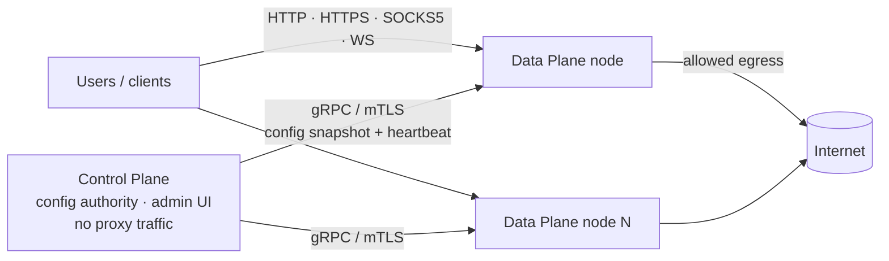

# What is Culvert?

Culvert is a self-hosted **Secure Web Gateway (SWG)**: a policy-enforcing
forward proxy that sits between your users and the internet, decides what egress
traffic is allowed, optionally inspects it, scans it for threats, and records
every decision. It provides the controls organizations usually buy from a
commercial SWG appliance — TLS inspection, identity-aware policy, malware
scanning, threat intelligence, SSO, and centralized fleet management — as a
single Go binary you run and own.

This page is the verified capability inventory. Every row in the tables below is
backed by product source, a test, an API/configuration contract, or an
architecture decision. Where a capability is partial or planned, it is labeled
as such rather than implied to be complete.

---

## Purpose

Culvert exists to give a security or platform team direct, auditable control of
outbound web traffic without operating a distributed system of agents,
databases, and message buses. It answers three operational questions for every
request:

1. **Who** is making it (identity, from local accounts or a federated IdP)?
2. **Is it allowed** (a priority-ordered, default-deny policy)?
3. **Is it safe** (TLS inspection plus antivirus, YARA, DPI, and threat feeds on
   decrypted content)?

Every answer is emitted to metrics, a live dashboard, structured logs, syslog,
and a bounded, append-only audit trail.

## Who it is for

- **Security teams** that need egress control, TLS inspection, and DLP-style
  content scanning with a full audit record.
- **Network and platform teams** that need a manageable forward proxy with SSO,
  PAC distribution, and upstream chaining.
- **Operators** who want the transparency and cost profile of open source
  without giving up an admin console, metrics, and a control plane.

Readers are assumed to be comfortable with TLS, HTTP proxying, identity
federation (OIDC/SAML/LDAP), and container operations.

## How it is delivered

Culvert ships as one statically linked Go binary with no runtime service
dependencies. The release build is compiled with `CGO_ENABLED=0`, producing a
static binary that runs on any Linux distribution the operator targets
(`Dockerfile:20`, `Dockerfile:37`). There is no agent to install on clients, no
plugin marketplace to assemble, and no external database or message bus to
operate. The only optional runtime companion is a **ClamAV sidecar**, required
only if you enable antivirus scanning.

```bash
docker compose up -d          # a working proxy + admin UI, no config required
```

### Default endpoints

| Endpoint | Default | Where it is served | Evidence |
|---|---|---|---|
| HTTP/HTTPS proxy | `:8080` | proxy port | `main.go:502` (`firstNonZero(..., 8080)`) |
| Admin UI (HTTPS) | `:9090` | UI port | `main.go:503` (`firstNonZero(..., 9090)`) |
| SOCKS5 proxy | disabled (`0`) | proxy host | `config.go:23` (`socks5_port`, `0 = disabled`) |
| Liveness | `/health` | proxy port | README endpoints table; `healthcheck.go` |
| Readiness | `/ready` | proxy port | `healthcheck.go` (`handleReady`) |
| Prometheus metrics | `/metrics` | proxy port | `metrics.go` |
| PAC file | `/proxy.pac` | proxy port | `pac.go` |

> The health, readiness, and metrics endpoints are served on the **proxy** port
> (`8080`), not the admin-UI port (`9090`).

---

## Verified capability inventory

Capabilities are grouped by domain. The **Status** column is deliberate:
*Supported* means implemented and exercised in the running product; *Partial*
and *Planned* mark edges that are not yet complete, quoted from the code or the
project's own limitations statement.

### Proxy and transport

| Capability | Status | Evidence |
|---|---|---|
| HTTP/HTTPS forward proxy with full CONNECT tunneling | Supported | `proxy.go`, `proxy_tunnel.go` |
| SOCKS5 (RFC 1928/1929), CONNECT method; **UDP ASSOCIATE rejected** | Partial | `socks5.go`; README Limitations |
| WebSocket relay | Supported | `proxy_tunnel.go` (`handleWebSocket`) |
| PAC auto-configuration file | Supported | `pac.go`, `internal/pac` |
| Upstream proxy chaining with health checks + circuit breaker | Supported | `upstream.go`, `internal/upstream` |

### TLS inspection

| Capability | Status | Evidence |
|---|---|---|
| Opt-in MITM inspection with on-the-fly ECDSA P-256 leaf certs | Supported | `ca.go`, `internal/ca`, `docs/architecture.md` §2 |
| Per-rule Inspect / Bypass decision (per-host bypass patterns) | Supported | `policy.go`, `internal/sslbypass` |
| Bounded leaf-cert cache: 10,000 entries, 1h TTL (LRU) | Supported | `internal/ca`; `docs/architecture.md` §2 |
| CA private key at rest: AES-256-GCM + PBKDF2-SHA256 (600,000 iters) | Supported | `internal/ca`; `docs/architecture.md` §2 |
| Decryption Profiles (reusable "how to decrypt" objects) | Supported | `internal/decryptprofile`, `docs/operator/decryption-profiles.md` |
| Adaptive decryption exclusion (fail-open, auto-learn), opt-in per profile | Supported | `internal/autoexclude` |

### Policy

| Capability | Status | Evidence |
|---|---|---|
| Priority-ordered, first-match rule evaluation | Supported | `policy.go` |
| Default-deny (Zero Trust) once a rule exists or `default_action: deny` | Supported | `config.go:84`, `policy.go` |
| Fresh install, zero rules, no `default_action` → **passthrough** by design | Documented posture | README Limitations; `docs/architecture.md` §1 |
| 8 condition types (IP/CIDR, identity, IdP group, auth source, FQDN, URL category, country/GeoIP, schedule) | Supported | `policy.go`, `internal/urlcat`, `geoip.go` |
| Actions: Allow, Drop, Block Page, Redirect | Supported | `proxy.go`, `policy.go` |
| GeoIP condition is **fail-closed** (unknown country does not match) | Supported | `geoip.go`; README Security Model |
| Policy conflict detection (same-priority, different-action warnings) | Supported | `policy.go` |
| Policy Tester (dry-run host/user/IP against the live ruleset) | Supported | admin API + UI |

### Identity and access

| Capability | Status | Evidence |
|---|---|---|
| Local auth (bcrypt) | Supported | `auth.go` |
| OIDC — Authorization Code + PKCE, and token introspection (RFC 7662) | Supported | `auth_oidc_flow.go`, `auth_oidc.go` |
| SAML 2.0 SP | Supported | `auth_saml.go` |
| LDAP / Active Directory bind + search with group resolution | Supported | `auth_ldap.go` |
| Multi-IdP registry with email-domain routing | Supported | `auth_idp.go` |
| TOTP 2FA (RFC 6238), in-repo, no external dependency | Supported | `internal/totp` |
| Admin RBAC — admin / operator / viewer | Supported | `ui_rbac.go`, `ui_routes_meta.go` |
| Session security — HMAC-SHA256 cookies, per-session `jti`, disk-persisted revocation | Supported | `session.go`, `internal/session` |

### Content security

| Capability | Status | Evidence |
|---|---|---|
| ClamAV antivirus (INSTREAM), via optional sidecar | Supported | `internal/clamav`, `scanner.go` |
| Pure-Go YARA rule engine | Supported | `internal/yara` |
| Regex DPI on decrypted responses | Supported | `scanner.go` |
| File-type blocking — extension profiles + magic-byte/MIME detection | Supported | `internal/fileblock`, `internal/filemagic` |
| Threat feeds — URLhaus + OpenPhish, with domain allowlist | Supported | `threatfeed.go`, `internal/threatfeed` |
| UT1 + curated URL categories | Supported | `internal/urlcat`, `internal/feedsync` |
| Content Disarm & Reconstruction (CDR) — **via external Sluice CDR engine** (gRPC/mTLS) | Supported (companion engine) | `cdr.go`, `cdrpolicy.go` |

### Observability

| Capability | Status | Evidence |
|---|---|---|
| Prometheus metrics under `culvert_*` (per-rule hits, latency histogram) | Supported | `metrics.go` |
| Live SSE dashboard broadcaster | Supported | `events.go`, `internal/sse` |
| Rotating file logger, JSON mode | Supported | `logger.go` |
| Syslog forwarding (RFC 3164 / 5424, UDP/TCP), async drop-on-full delivery | Supported | `syslog.go`, `internal/syslog` |
| Signed webhook alerts with retry | Supported | `alerts.go`, `internal/alerts` |
| Bounded, append-only audit ring (500 entries, JSONL) | Supported | `internal/audit` (`MaxRing = 500`) |

### Distributed operation

| Capability | Status | Evidence |
|---|---|---|
| gRPC Control Plane / Data Plane with mTLS | Supported | `controlplane.go`, `controlplane_tls.go` |
| ConfigSnapshot sync (policy, blocklist, PAC, threat feed, session key, QoS, node groups) | Supported | `controlplane_snapshot.go` |
| Node groups with label selectors + auto GeoIP labels | Supported | `nodegroup.go` |
| Per-group bandwidth/QoS token-bucket limiting | Supported | `bandwidth.go` |
| Config versioning — numbered JSON snapshots, 50-version max | Supported | `configversion.go`, `internal/configver` |
| Optional etcd fencing lease for HA (fail-closed leader election) | Supported | `internal/halease`, `ha_lease.go` |

### Supply-chain integrity

| Capability | Status | Evidence |
|---|---|---|
| Signed release catalog — Ed25519 and Sigstore keyless (identity-pinned) | Supported | `release_wiring.go`, `release_catalog_sigstore.go` |
| Enforce-by-default verification when a trust root is present | Supported | `release_wiring.go` (`VerifyEnforce`) |
| Digest-pinned image dispatch (`repo@sha256:…`) pinned at the sudo boundary | Supported | `roadmap/D1.6c-pin-value-binding-plan.md`; packaging |
| SLSA L3 provenance + Cosign-signed artifacts | Supported (CI pipeline) | `.github/workflows/ci.yml` |

---

## Deployment shapes

Culvert runs as a **single node** (proxy + admin UI + control plane in one
process) or as a **Control Plane / Data Plane cluster**:

- **Control Plane (CP)** owns configuration, node enrollment, and the admin UI;
  it carries no proxy traffic.
- **Data Plane (DP)** nodes are stateless. On connect they receive the entire
  config snapshot and begin serving proxy traffic; replace a node and it
  re-enrolls in seconds.

See [Architecture](architecture.md) for the request pipeline and the CP/DP model.



---

## Security implications

TLS inspection is a deliberate act of interception: enabling it means Culvert
terminates client TLS and re-originates it, so it can read otherwise-encrypted
content. This requires distributing Culvert's CA to clients and carries legal,
privacy, and operational obligations. Culvert makes inspection **opt-in per
rule** and supports **Bypass** for destinations that must not be decrypted
(banking, health). The CA signing key is encrypted at rest and never sent on the
wire. See [TLS inspection administration](../04-tls-inspection/tls-inspection.md).

The default posture is defense-in-depth: SSRF guarding with connect-time
re-resolution, default-deny policy, brute-force lockout, CSRF and body-limit
enforcement on the admin API, and RBAC enforced both by a metadata-driven layer
and per-handler checks. See the Security Model summary in
[`../../../README.md`](../../../README.md).

---

## Known limitations

Stated plainly, from the project's own limitations register:

- **Certificate revocation:** OCSP only — **CRL checking is not implemented**.
  OCSP fails open when a certificate publishes no responder, and fails closed
  when a published responder is unreachable.
- **Fresh-install posture:** with zero rules and no `default_action`, the proxy
  starts in passthrough (allow), not deny. Enforce Zero Trust explicitly.
- **Post-quantum:** the TLS *key exchange* is quantum-resistant (hybrid
  X25519 + ML-KEM-768, inherited from the Go 1.25 standard library, not
  configured by Culvert); certificate **signing** remains classical ECDSA P-256.
- **SOCKS5:** CONNECT only — UDP ASSOCIATE is rejected.
- **Decryption Profiles:** some profile postures (`permissive` certificate
  verification, `fail-open` on unsupported TLS) are marked *coming soon* in the
  code; see [Decryption Profiles](../04-tls-inspection/tls-inspection.md).
- **Sizing figures** in deployment tables are engineering estimates, not
  published benchmarks — validate against your own workload.

---

## Related documentation

- [Architecture](architecture.md) — request pipeline and CP/DP model.
- [Quick start & first boot](../02-getting-started/quick-start.md).
- [Policy engine & Zero-Trust authoring](../03-policy/policy-engine.md).
- [TLS inspection administration](../04-tls-inspection/tls-inspection.md).
- In-repo: [`../../../docs/architecture.md`](../../../docs/architecture.md),
  [`../../../README.md`](../../../README.md), [`../../../CLAUDE.md`](../../../CLAUDE.md).

## Source evidence

The claim-evidence ledger for this article is
[`what-is-culvert.evidence.md`](what-is-culvert.evidence.md).
