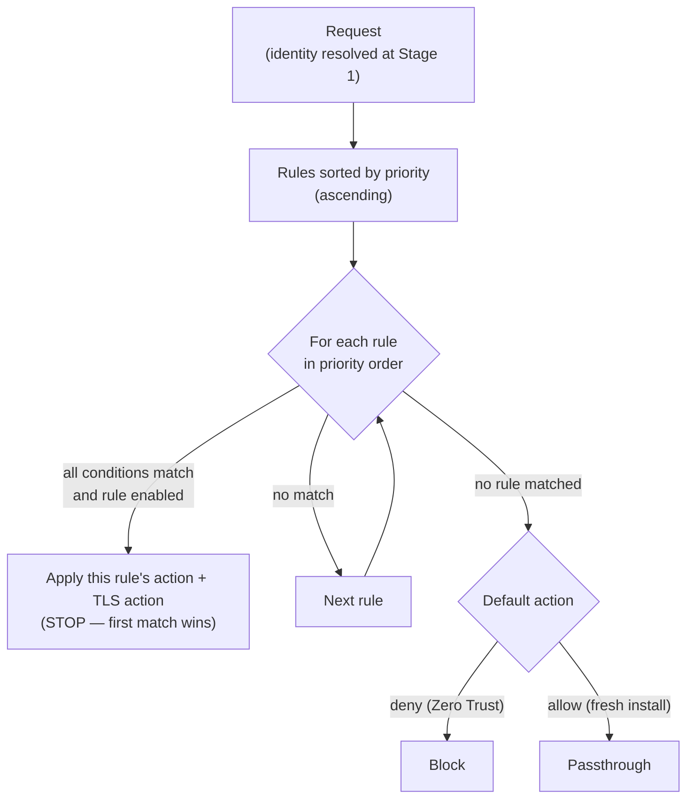

# Policy engine & Zero-Trust authoring

Culvert's policy engine decides, for every request, whether to allow, block, or
redirect it — and whether to inspect its TLS. Rules are evaluated in **priority
order** and the **first match wins**. When no rule matches, the engine's default
governs: **deny** (Zero Trust) once configured, or passthrough on a fresh
install.

This guide covers the rule model, evaluation semantics, the eight condition
types, the admin workflow for authoring rules, and how to roll out Zero Trust
without locking yourself out.

Prerequisite reading: [Architecture → Request pipeline](../01-overview/architecture.md)
(policy is Stage 8) and [Quick start](../02-getting-started/quick-start.md).

---

## Purpose

- Express egress policy as ordered, auditable rules over identity, destination,
  geography, and time.
- Decide TLS inspection per rule (`Inspect` vs `Bypass`).
- Enforce default-deny so anything not explicitly permitted is blocked.

## Supported use cases

- **Zero-Trust egress:** default-deny, allow only sanctioned destinations.
- **Identity-scoped access:** different rules per user, IdP group, or auth
  source.
- **Selective decryption:** inspect general web traffic, bypass banking/health.
- **Time- and geo-bounded access:** business-hours-only, country-restricted.
- **Category control:** allow/block by URL category or category group.

## Prerequisites

- An admin or operator account (rule mutations require write RBAC).
- For identity conditions: an identity source configured (see
  [Identity & access](../05-identity/identity-and-access.md)).
- For `Inspect` rules: TLS inspection set up (see
  [TLS inspection administration](../04-tls-inspection/tls-inspection.md)).

---

## The rule model

Each rule is a `PolicyRule` (`policy.go`). The fields most operators use:

| Field (JSON) | Meaning | Empty / default |
|---|---|---|
| `priority` | Evaluation order; lower numbers evaluated first | required |
| `name` | Human label; also the persistence key for hit counters | — |
| `sourceIP` | Single IP or CIDR | any |
| `sourceIdentity` | Authenticated username | any |
| `sourceGroup` | IdP group / role | any |
| `authSource` | IdP name (`okta`, `adfs`, `ldap`, `local`) or `unauth` | any |
| `destFQDN` | Exact or wildcard FQDN | any |
| `destCategory` / `destCategoryGroup` | URL category or category group | any |
| `destCountry` | List of ISO 3166-1 alpha-2 codes | any |
| `schedule` | Day/time/timezone window (`null` = always active) | always |
| `action` | `Allow` · `Drop` · `Block_Page` · `Redirect` | required |
| `redirectURL` | Target when `action = Redirect` | — |
| `sslAction` | `Inspect` (MITM) or `Bypass` (transparent tunnel) | — |
| `decryptionProfile` | Named Decryption Profile governing *how* to inspect | none |
| `fileFiltering` / `fileProfile` | Enable file-type scanning + named profile | off |
| `enabled` | `false` skips the rule during evaluation | active |

> Action wire values are exact: `Allow`, `Drop`, `Block_Page` (underscore),
> `Redirect` (`policy.go:23-26`). SSL actions are `Inspect` / `Bypass`
> (`policy.go:33-34`).

## Evaluation semantics



- **First-match by priority.** `Evaluate` scans the priority-sorted snapshot and
  returns on the first rule whose conditions all match (`policy.go:1083`,
  first hit `:1140`).
- **Conditions are AND.** Within a rule, every non-empty condition must match;
  an empty condition means "any".
- **Default-deny.** When no rule matches, the default action applies. Deny is in
  effect once any rule exists or `default_action: deny` is set
  (`setDefaultPolicyAction`, `proxy.go:19` — `0 = deny (default)`). A fresh
  install with zero rules and no `default_action` runs in passthrough.

## The eight condition types

| # | Condition | Field | Match semantics | Evidence |
|---|---|---|---|---|
| 1 | Source IP / CIDR | `sourceIP` | Single IP or CIDR containment | `policy.go` (`srcIPNet`) |
| 2 | Authenticated identity | `sourceIdentity` | Exact username from Stage-1 auth | `policy.go:95` |
| 3 | IdP group | `sourceGroup` | Group/role membership | `policy.go:96` |
| 4 | Auth source | `authSource` | IdP name or `unauth` | `policy.go:97` |
| 5 | Destination FQDN | `destFQDN` | Exact or wildcard (normalized) | `policy.go:98` |
| 6 | URL category | `destCategory` / `destCategoryGroup` | UT1 + curated category / group | `policy.go:99`, `internal/urlcat` |
| 7 | Destination country | `destCountry` | GeoIP; **fail-closed** on unknown | `policy.go:1384-1389` |
| 8 | Time schedule | `schedule` | Day-of-week + `HH:MM`–`HH:MM` window in an IANA timezone (empty tz = UTC) | `policy.go:214-219` |

> **GeoIP is fail-closed.** On a GeoIP cache miss the country is *unknown* and a
> country rule **does not match** — it will not accidentally allow traffic it
> cannot geolocate (`policy.go:1384-1389`).

Schedule example (business hours, US Eastern):

```json
"schedule": {
  "days": ["Mon","Tue","Wed","Thu","Fri"],
  "timeStart": "09:00",
  "timeEnd": "17:00",
  "timezone": "America/New_York"
}
```

## Actions and TLS action

- **`Allow`** — permit; combine with `sslAction` `Inspect` or `Bypass`.
- **`Drop`** — silently drop the connection.
- **`Block_Page`** — serve the configured block page.
- **`Redirect`** — 302 to `redirectURL`.

Every allowed rule independently chooses `Inspect` (full MITM, enabling content
scanning) or `Bypass` (transparent tunnel, no decryption).

---

## Configuration procedure

Author rules from the **Policy** panel in the admin UI, or via the admin API.
All routes are registered in `ui_policy.go` and pinned in `uiRoutes`; mutations
require operator/admin, reads require viewer.

| Route | Method | Purpose |
|---|---|---|
| `/api/policy` | GET | List rules (with hit counts) |
| `/api/policy` | POST | Create/update a rule |
| `/api/policy` | DELETE | Delete rule(s) by priority |
| `/api/policy/reorder` | POST | Reorder rules by priority list |
| `/api/policy/move` | POST | Move a rule to a position |
| `/api/policy/test` | POST | **Policy Tester** — dry-run a request |
| `/api/policy/draft` | GET/PUT | Draft (require-commit) mode |
| `/api/policy/draft/commit` · `/revert` | POST | Commit / discard the candidate |

Create an allow rule for a sanctioned destination:

```bash
curl -sk -X POST https://<host>:9090/api/policy \
  -H 'Content-Type: application/json' \
  --cookie "$ADMIN_COOKIE" \
  -d '{
        "priority": 10,
        "name": "allow-github",
        "destFQDN": "*.github.com",
        "action": "Allow",
        "sslAction": "Inspect"
      }'
```

> **Draft / require-commit mode.** For change control, enable draft mode: edits
> accumulate as a candidate and take effect only on
> `POST /api/policy/draft/commit` (or are discarded with `/revert`). Enabling
> require-commit mode is an admin action; commit/revert are operator actions
> (`ui_policy.go:2153-2155`).

---

## Zero-Trust rollout (without locking yourself out)

1. **Author allow rules first.** Add rules for every destination users must
   reach (start broad, e.g. wildcard FQDNs or categories).
2. **Test before enforcing.** Use the Policy Tester (below) to dry-run
   representative requests against the live ruleset.
3. **Flip the default to deny.** Set `default_action: deny`, or rely on the fact
   that once any rule exists the default becomes deny. Confirm the intended
   default in the Policy panel.
4. **Verify with Diagnostics.** Resolve any `fail` rows in
   **Infrastructure → Diagnostics** before taking traffic.

## Validation steps

**Policy Tester** dry-runs a host/user/IP against the live ruleset and returns
the matched rule and resulting action, without sending traffic:

```bash
curl -sk -X POST https://<host>:9090/api/policy/test \
  -H 'Content-Type: application/json' --cookie "$ADMIN_COOKIE" \
  -d '{"host":"api.github.com","identity":"alice","sourceIP":"10.0.0.5"}'
```

The tester is the same evaluation path used at request time (`apiPolicyTest`,
trace in `ui_policy.go:1880`).

## Operational behavior

- **Hit counters.** Each rule carries a `hitCount` and `lastHit`, exported to
  Prometheus as `culvert_policy_rule_hits_total` (cardinality-capped at 200
  rules; `metrics.go:332`). Use these to find dead or over-broad rules.
- **Conflict detection.** Rules with the same priority but different actions
  that overlap are surfaced as warnings at load and in the UI
  (`DetectConflicts`, `policy.go:877`). Resolve them — first-match on equal
  priority is order-sensitive.

## Failure modes

| Condition | Result |
|---|---|
| No rule matches, default = deny | Request blocked (Zero Trust) |
| No rule matches, fresh install (no `default_action`) | Passthrough (allow) — **enforce deny explicitly** |
| GeoIP cache miss on a `destCountry` rule | Rule does **not** match (fail-closed) |
| `Redirect` action with empty `redirectURL` | Misconfiguration — validate before commit |
| Overlapping equal-priority rules, different actions | Conflict warning; evaluation order decides |

## Security implications

- Default-deny is the safe posture; the passthrough default exists only to
  prevent first-boot lockout and must be replaced before production.
- An `Allow` + `Bypass` rule intentionally forgoes inspection for its
  destinations — scope bypass narrowly (exact/wildcard FQDNs), not broad
  categories, or you create blind spots.
- `tlsSkipVerify` disables upstream certificate verification for a rule; use it
  only for known-broken internal origins, never broadly.

## Known limitations

- Conditions within a rule are ANDed; there is no OR within a single rule —
  express alternatives as separate rules.
- `destCountry` depends on the GeoIP database being loaded; without it, country
  conditions never match (fail-closed).
- Category matching depends on the URL-category database / feeds being present.

## Related documentation

- [Architecture](../01-overview/architecture.md) · [What is Culvert](../01-overview/what-is-culvert.md).
- [TLS inspection administration](../04-tls-inspection/tls-inspection.md).
- In-repo: [`../../../README.md`](../../../README.md) (Policy Model),
  [`../../../docs/enterprise/POLICY-ROLLOUT-GUIDE.md`](../../../docs/enterprise/POLICY-ROLLOUT-GUIDE.md).

## Source evidence

Claim-evidence ledger: [`policy-engine.evidence.md`](policy-engine.evidence.md).
