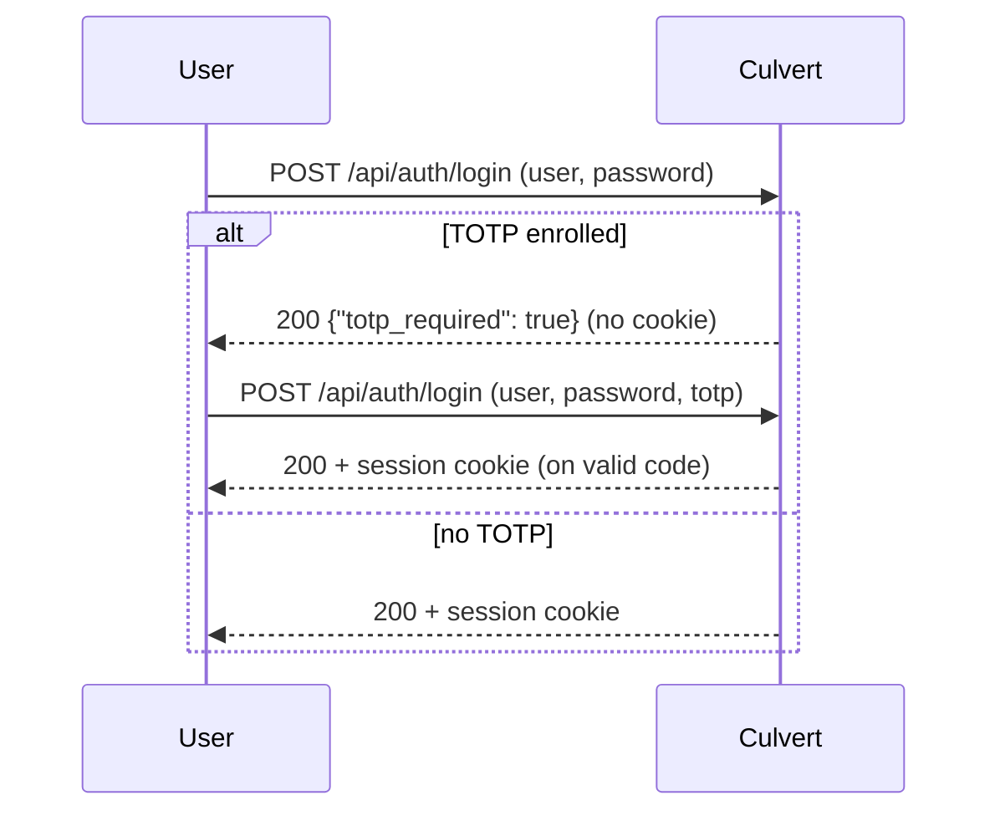

# Identity & access

Culvert authenticates two distinct populations: **proxy users** (whose identity
scopes egress policy) and **administrators** (who manage the product). This guide
covers the identity sources, multi-IdP routing, TOTP two-factor authentication,
the admin RBAC model, session security, and brute-force protection — each tied
to the code that enforces it.

Prerequisite reading: [Policy engine](../03-policy/policy-engine.md) (identity is
conditions 2–4) and [Quick start](../02-getting-started/quick-start.md) (first
admin creation).

---

## Purpose

- Establish who is making a request so policy can be identity-aware.
- Federate to enterprise IdPs (OIDC, SAML, LDAP/AD) and route users to the right
  one by email domain.
- Protect the admin plane with RBAC, 2FA, signed sessions, and lockout.

## Supported identity sources

| Source | Protocol / method | Evidence |
|---|---|---|
| Local | bcrypt password hashing | `store.go:436` (`bcrypt.GenerateFromPassword`) |
| OIDC | Authorization Code + PKCE (S256); token introspection (RFC 7662) | `auth_oidc_flow.go:386-387`, `auth_oidc.go` |
| SAML 2.0 | SP-initiated SSO (crewjam/saml) | `auth_saml.go:45` (`NewSAMLProvider`) |
| LDAP / Active Directory | Bind + search, group check | `auth_ldap.go:162` (`memberOf`), `:194` (`isMember`) |

## Multi-IdP routing

Culvert maintains an IdP registry and routes an authenticating user to the
correct IdP by the **email domain** they present (`RouteByDomain`,
`auth_idp.go:487-501`; `EmailDomains` per IdP, `:31`). This lets a single
deployment federate several identity providers — e.g. `@corp.com` → Okta,
`@contractor.net` → a partner IdP.

Manage IdPs via the admin API:

| Route | Method | Purpose |
|---|---|---|
| `/api/idp` | GET / POST | List / create an IdP |
| `/api/idp/discover` | POST | Run OIDC discovery against an issuer |
| `/api/idp/{id}` | GET / PUT / DELETE | Read / update / delete an IdP |
| `/api/idp/{id}/groups` | — | Group mapping for the IdP |

(Registered in `ui_auth.go:950-952`.)

## Two-factor authentication (TOTP)

Culvert implements TOTP (RFC 6238) in-repo with no external dependency
(`internal/totp/totp.go` — standard library only). Authentication is a
**step-up** flow (`ui_auth.go:30-94`):



- The second step accepts a 6-digit code **or a backup code** (`ui_auth.go:40`).
- Verification uses a replay counter, so a code cannot be reused
  (`VerifyTOTPReturnCounter`, `internal/totp/totp.go:43`).

## Admin RBAC

Three roles govern the admin plane (`store.go:318-323`):

| Role | Capability |
|---|---|
| `admin` | Full control, including user and IdP management |
| `operator` | Write operations (e.g. policy mutations) |
| `viewer` | Read-only |

RBAC is enforced in two layers (defense-in-depth): a metadata-driven
enforcement middleware **and** per-handler `requireRole` checks. For example,
`/api/policy` GET requires `viewer`, POST/DELETE require `operator`
(`ui_policy.go:39,45`). Never rely on only one layer — both are contractual.

User management routes:

| Route | Method | RBAC |
|---|---|---|
| `/api/auth/users` | — | admin only |
| `/api/auth/change-password` | POST | any role (self-service) |
| `/api/auth/lockouts` | GET / clear | admin (unlock) |

(Registered in `ui_auth.go:945-947`.)

## Session security

Admin sessions use HMAC-SHA256-signed cookies (`internal/session/session.go:427`)
with:

- A per-session 128-bit `jti` (`:362`), so individual sessions can be revoked.
- A configurable TTL, default 8h (`:311`).
- A disk-persisted revocation list synced across the cluster
  (`revocationsPath`, `:242-253`).
- A dynamic `Secure` cookie flag based on TLS state.

A fresh token is issued on each login; the session HMAC key must be initialized
for the node to report ready (see [Quick start → readiness](../02-getting-started/quick-start.md#readiness)).

## Brute-force protection

Login lockout has two tiers (`internal/lockout/lockout.go`):

- **Per (IP, user):** lock after 5 failed attempts, 15-minute cooldown
  (`:42`, `:49`).
- **Account-wide:** an additional tier over a rolling window, with a trusted-IP
  bypass (`:25,44`).

Admins can list and clear active lockouts at `/api/auth/lockouts`.

Password complexity is enforced at 8+ characters with mixed case and a digit
(`store.go:644-663`).

---

## Configuration procedure

1. **Create the first admin** via the setup wizard (see
   [Quick start](../02-getting-started/quick-start.md#3-first-boot-create-the-first-administrator)).
2. **Add an IdP:** `POST /api/idp`, optionally running `POST /api/idp/discover`
   first for OIDC. Set the IdP's `EmailDomains` so users route correctly.
3. **Map groups:** configure group mapping under `/api/idp/{id}/groups` so
   policy `sourceGroup` conditions can match.
4. **Enroll 2FA** for admin accounts from the admin UI.
5. **Assign roles** to admin users via `/api/auth/users`.

## Validation steps

```bash
# Auth status (whether a session is present / setup complete)
curl -sk https://<host>:9090/api/auth/status
# Login (returns totp_required if 2FA enrolled)
curl -sk -X POST https://<host>:9090/api/auth/login \
  -H 'Content-Type: application/json' \
  -d '{"user":"admin","password":"…"}'
```

Then author an identity-scoped policy rule (`sourceIdentity`, `sourceGroup`, or
`authSource`) and dry-run it with the [Policy Tester](../03-policy/policy-engine.md#validation-steps).

## Failure modes

| Condition | Behavior |
|---|---|
| Wrong credentials, ≥5 times for (IP, user) | Locked out 15 min |
| Account-wide failure tier crossed | Account-wide lockout (trusted IPs exempt) |
| 2FA enrolled, code omitted | `200 {"totp_required": true}`, no cookie |
| Reused TOTP code | Rejected (replay counter) |
| Session HMAC key uninitialized | Node not ready; cookies cannot be issued |
| Email domain matches no IdP | Routing fails; user cannot federate |

## Security implications

- The session HMAC key and IdP client secrets are sensitive; they are redacted
  before being pushed to non-enrolled cluster nodes
  (`controlplane_server.go:91-100`).
- Enforce 2FA on all admin accounts; combine with IP allow-listing on the admin
  UI for defense-in-depth.
- Keep both RBAC layers — the metadata middleware and per-handler `requireRole`
  — in place; removing either weakens the contract.

## Known limitations

- **LDAP group resolution** checks membership against a single configured
  `RequiredGroup` DN rather than extracting the user's full group list
  (`auth_ldap.go:42,194`). Model access accordingly, or use OIDC/SAML group
  claims for richer group-based policy.
- IdP management endpoints are admin-scoped; there is no self-service IdP
  onboarding.

## Related documentation

- [Policy engine](../03-policy/policy-engine.md) (identity conditions) ·
  [Quick start](../02-getting-started/quick-start.md).
- In-repo: [`../../../docs/enterprise/IDENTITY-AND-ACCESS-DEPLOYMENT.md`](../../../docs/enterprise/IDENTITY-AND-ACCESS-DEPLOYMENT.md).

## Source evidence

Claim-evidence ledger: [`identity-and-access.evidence.md`](identity-and-access.evidence.md).
