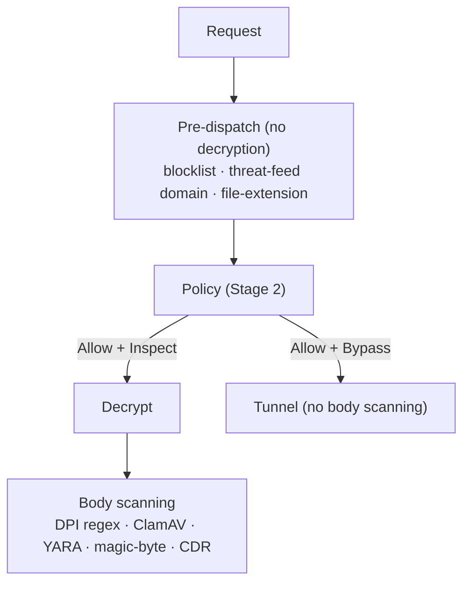

# Content security

Culvert can inspect what flows through it — not just where it goes. This guide
covers the content-security controls: antivirus (ClamAV), the pure-Go YARA
engine, regex DPI, file-type blocking, threat feeds, the domain blocklist, and
Content Disarm & Reconstruction (CDR). The single most important operational
fact is stated first: **body scanning only sees traffic you decrypt.**

Prerequisite reading: [Policy engine](../03-policy/policy-engine.md) (the
`Inspect`/`Bypass` decision) and [TLS inspection](../04-tls-inspection/tls-inspection.md).

---

## Purpose

Detect and block malware, sensitive-data patterns, and dangerous file types in
proxied traffic, and enrich policy with threat intelligence.

## Where each control runs

Content controls split into two groups by *what they need to see*:

| Group | Controls | Needs decryption? | Pipeline stage |
|---|---|---|---|
| Host / URL level | Domain blocklist, threat-feed domain match, file-extension-by-URL | No | Pre-dispatch (stage 7) |
| Body level | Regex DPI, ClamAV, YARA, magic-byte/MIME, CDR | **Yes** (`Inspect` rule) | Content scanning (stage 11) |

> **Implication:** a `Bypass` rule (or any non-inspected HTTPS) is a body-scan
> blind spot. Host/URL-level controls still apply, but ClamAV, YARA, DPI, and
> CDR never see the payload. Scope bypass deliberately.

---

## The controls

### Antivirus — ClamAV

Culvert streams decrypted bodies to a ClamAV daemon over the INSTREAM protocol
(`internal/clamav/clamav.go:168`, `zINSTREAM`). ClamAV is an **external
sidecar**; enable it with `-clamav-addr` (e.g.
`unix:/run/clamav/clamd.sock` or `tcp:clamav:3310`, `main.go:267`). When
configured, ClamAV connectivity is a **gating** readiness check
(`healthcheck.go:156-166`). Blocks increment `culvert_clamav_blocked_total`.

### YARA — pure-Go engine

A pure-Go YARA engine evaluates rules without cgo or libyara
(`internal/yara/yara.go`). Point it at a rules directory with `-yara-rules-dir`
(`main.go:268`). Manage rules at runtime:

| Route | Purpose |
|---|---|
| `/api/security-scan/yara/rules` | List / CRUD rule files |
| `/api/security-scan/yara/validate` | Dry-run validate rule source |
| `/api/security-scan/yara/reload` | Reload from the rules directory |
| `/api/security-scan/yara/settings` | Engine runtime config |

(`ui_security.go:1333-1337`.) The engine supports a documented subset of YARA;
validate rules before relying on them.

### Regex DPI

Pre-compiled regex signatures are applied to decrypted HTTP response bodies
(`internal/scanner/scanner.go`). Manage signatures at `/api/dpi` and the
per-host bypass list at `/api/dpi/bypass` (`ui_security.go:1326-1342`; the older
`/api/content-scan` paths are retained as aliases). Blocks increment
`culvert_dpi_blocked_total`.

### File-type blocking

Two layers (`ui_policy.go:2145-2146`):

- **Extension profiles** — named profiles (e.g. Executables, Archives) blocked
  by extension; evaluated pre-decryption from the URL
  (`internal/fileblock/fileprofile.go`).
- **Magic-byte / MIME detection** — examines the first bytes of a decrypted body
  to catch archives disguised as safe types and Content-Type mismatches
  (`internal/filemagic`); requires an `Inspect` rule.

Enable per policy rule via `fileFiltering` + `fileProfile` (see
[Policy engine](../03-policy/policy-engine.md#the-rule-model)). Manage profiles at
`/api/fileblock/profiles`. Blocks increment `culvert_file_blocked_total`.

### Threat feeds

Culvert syncs URLhaus and OpenPhish and blocks matching destinations
(`internal/threatfeed/threatfeed.go:103-104`). Popular hosting domains are
exempt from **domain-level** blocking via an allowlist (URL-level blocking still
applies), managed at `/api/security-scan/feeds/domain-allowlist`
(`ui_security.go:1332`). Force a sync with `/api/security-scan/feeds/sync`.
Persist the feed DB with `-threat-feed-db` (`main.go:269`).

### Domain blocklist

A separate operator-managed blocklist runs at pre-dispatch:

| Route | Purpose |
|---|---|
| `/api/blocklist` | Manage entries |
| `/api/blocklist/mode` | Blocklist mode |
| `/api/blocklist/feed` · `/feed/sync` | External blocklist feeds |
| `/api/blocklist/exceptions` | Per-entry exceptions |

(`ui_policy.go:2144-2167`.)

### Content Disarm & Reconstruction (CDR)

CDR strips active content from files and rebuilds them. In Culvert, CDR is a
**client to an external "Sluice" CDR engine** over gRPC/mTLS (`cdr.go`); the
disarm/reconstruct algorithm runs in that companion service, not in the proxy
binary. Outcomes are logged as `CDR_SANITIZED` / `CDR_BLOCKED`
(`internal/reqlog/reqlog.go`). Manage at:

| Route | Purpose |
|---|---|
| `/api/cdr/config` | CDR configuration |
| `/api/cdr/instances` (+ `/enroll`, `/revoke`) | Engine instance registry |
| `/api/cdr/policies` | CDR policies |
| `/api/cdr/health` · `/api/cdr/test` | Health / test |

(`cdr_ui.go:949-955`.) CDR requires deploying the Sluice engine — treat it as a
prerequisite, like the ClamAV sidecar.

### Scan exclusions & result cache

Hosts or content hashes can be excluded from scanning at
`/api/security-scan/exclusions` (`ui_security.go:1338`). A SHA-256 result cache
(`internal/hashcache`) avoids re-scanning identical content within a TTL.

---

## Configuration procedure

1. **Enable inspection** on the rules whose bodies you want scanned
   (`sslAction: Inspect`) — body scanning depends on it.
2. **Antivirus:** run a ClamAV sidecar; set `-clamav-addr`.
3. **YARA:** set `-yara-rules-dir`; add/validate rules via the API.
4. **DPI:** add signatures at `/api/dpi`; scope `/api/dpi/bypass` narrowly.
5. **File blocking:** attach a `fileProfile` to rules; tune profiles at
   `/api/fileblock/profiles`.
6. **Threat feeds / blocklist:** set `-threat-feed-db`; manage the allowlist and
   blocklist via their APIs.
7. **CDR (optional):** deploy Sluice, enroll it at `/api/cdr/instances/enroll`,
   set policies.

## Validation steps

- **ClamAV:** request the EICAR test file through an `Inspect` rule; expect a
  block and `culvert_clamav_blocked_total` to increment. Confirm connectivity
  via `/api/security-scan/status` and the `clamav` readiness check.
- **DPI:** add a benign signature (e.g. a unique token), fetch a page containing
  it through an `Inspect` rule, expect a block.
- **YARA:** `/api/security-scan/yara/validate` a rule before enabling it.

## Failure modes

| Condition | Behavior |
|---|---|
| ClamAV configured but unreachable | `/ready` returns `503` (gating check fails) |
| Traffic matched a `Bypass` rule | Body scanners never see it (host/URL controls still apply) |
| CDR engine (Sluice) down | CDR unavailable; check `/api/cdr/health` |
| Invalid YARA rule loaded | Rejected at validate/reload; existing rules unaffected |
| Content hash in the result cache | Re-scan skipped within the TTL |

## Security implications

- Body scanning is only as complete as your inspection coverage — every
  `Bypass` is an intentional blind spot; document why each exists.
- ClamAV and CDR are external services; secure their transport (CDR uses
  mTLS with TOFU pinning) and network path.
- Scan exclusions and DPI bypass lists weaken coverage; keep them narrow and
  audited.

## Known limitations

- **CDR requires the external Sluice engine** — not an in-binary capability.
- The YARA engine supports a documented subset of the full YARA language.
- ClamAV requires a sidecar; without `-clamav-addr` antivirus is off.
- Body-level scanning cannot inspect certificate-pinned destinations you must
  bypass.

## Related documentation

- [Policy engine](../03-policy/policy-engine.md) ·
  [TLS inspection](../04-tls-inspection/tls-inspection.md) ·
  [Observability](../06-observability/observability.md).
- [What is Culvert → Content security](../01-overview/what-is-culvert.md#content-security).

## Source evidence

Claim-evidence ledger: [`content-security.evidence.md`](content-security.evidence.md).
