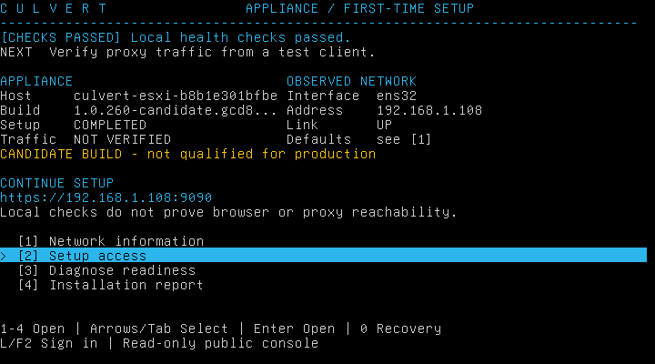
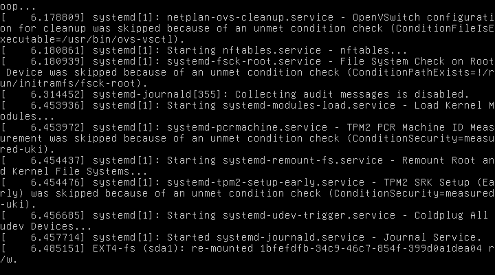
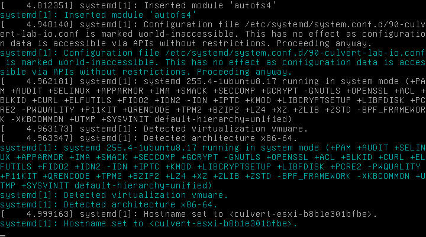

# cd8 ESXi visual follow-up

The delayed/failed-service fixture, authenticated console inspection and
Alt+F12/Alt+F1 probes completed. A later exact reviewed-splash probe also
**passed Esc**, revealing readable early kernel and systemd diagnostics.
Two passive screenshot sequences ended in capture failures, so they do not
establish continuous boot coverage.

Only the following three screenshots were explicitly reviewed as safe before
copying to this report. No bootstrap credential screen or unreviewed capture
was exported:

Full image hashes, dimensions, sanitized operation outcomes and evidence hashes
are recorded in [esxi-visual-followup.json](esxi-visual-followup.json). All three images
are 720x400, corresponding to 80 columns by 25 rows with nine-pixel cell pitch.
The reviewed menu shows a usable management URL; the final Alt+F1 result exactly
matches its SHA256. The kernel image contains readable diagnostic messages.

## Verified observations

Authenticated pre/post inspection reported tty1 in KD_TEXT, 80x25 dimensions,
`TTYReset=yes`, and an existing EFI/ubuntu directory. The bounded empty
`/dev/console` open returned 0 in 0.002413s before and 0.002202s after the fixture
boot. These are measurements on this VM, not proof that every virtual-hardware
configuration exposes the same console behavior. Existing Ubuntu bootloader
identity and the PAM/local-sudo/operator-SSH boundary were preserved.

The one-time delay service started at guest 13.012157s and finished successfully
at 58.039502s: 45.027345s elapsed. The separate intentional-failure service started
at 13.015015s and ended at 13.356351s with exit 1 and Result=exit-code. These results
prove the slow/failed boot fixture ran; incomplete screenshots do not prove that
every corresponding message was visible during Plymouth.

Alt+F12 completed with private before/after receipts and a reviewed diagnostic
screen. The first Alt+F1 attempt refused a changed screenshot hash before
creating any intent marker; no key was sent. A separately reviewed cursor-state
attempt then completed Alt+F1, returning to the exact reviewed menu image.
No blind key retries or credentials were used in the visual-key helper.

Fixture removal returned 0 and retained its audit receipt after checking owned
unit bytes/links and inactive/failed states. Only the two lab units' failed
states and files were removed. This fixture boot was kept separate from the
three formal availability cycles and their unchanged 120s/5s acceptance gates.

## Capture failures and timing limits

The original visual-fixture observer retained 9 validated frames through 19.203s
of its sequence and no completion event. Its process receipt ended at
2026-10-07T23:06:31.931133Z. The separately named tail observer retained 24 frames
through 54.563s and no completion event; its receipt ended at
2026-10-07T23:08:32.759394Z. Parent observation identified HTTP 409 Conflict from
the govc screenshot download in both cases. The shared `govc-error.json` retains
only the latest failure, so this report cannot independently recover a separate
raw error record or precise failure instant for the first sequence.

The first, hash-refused return-menu probe completed at 23:08:32.880407Z, about
121ms after the tail observer exited. The successful kernel-VT key completed
about 13s earlier. This establishes temporal overlap with another screenshot
operation; it does **not** establish that concurrency caused the 409. The latest
raw fault identifies a same-endpoint `/screen?id=...` download conflict. Raw URLs
and errors remain private. No guest fault, security exception or service repair
is inferred from this screenshot API failure.

Both partial sequences and the earlier 95-frame incomplete cold-boot sequence
remain evidence gaps. A subsequent bounded capture can observe later frames or
a separately authorized boot, but cannot recreate the missing first-run data.
The final successful Esc probe closes the functional Esc check; it does not
fill these earlier gaps. Serial-only/headless behavior remains outside this
VGA follow-up.

## Final Esc and second fixture observations

The additive `reviewed-splash-esc.py` controller at
`85de2c7f12addb62bf953d4b3e3b9d5c9b41def5` verified the original capture controller,
the geometry controller and two previously reviewed splash images. Both pinned
references were 720x400 with zero unknown glyph cells. It compared the complete
live decoded text exactly, allowing only foreground-color differences already
supported by the frozen glyph decoder; it did not crop, normalize, repair or
infer characters. It held the operation and passive-capture locks together,
recorded durable intent, sent one Esc, and retained the after-image. Root's
review confirmed readable early kernel and systemd diagnostics. The visible
systemd build feature `+CURL` is diagnostic text. No credential screen was copied.

The successful Esc after-image SHA256 is
`b823b5b6d365f602d5297437a4bee517c3eb578c67ee17ddf56e096f59c5b7ba`.
The helper's raw SHA256 is
`6e77bfdcd58e6c6d7108747f60c9fb36692a45e56471f97fe7856af025cb5de2`.
The operation completed at 2026-10-07T23:28:39.842227Z. Its begin, intent, sent,
completion and operation-receipt hashes are retained in the companion JSON.
This test used an ordinary clean boot after the second fixture was removed.

A separately named `capture-followup` fixture preserved the original fixture's
audit directory and used distinct units. Its delay ran from guest 13.244241s to
58.267918s, succeeding after 45.023677s; its intentional failure returned 1 with
Result=exit-code at 13.294387s. Authenticated installation, unit observation,
post-inspection and removal all returned 0. These extra visual boots remain
separate from the three formal availability cycles.

The original hash-only Esc probes remain refusals, not successes: the clean-boot
attempt and both capture-followup attempts stopped before creating an intent
marker because the reviewed PNG had changed. Observed changes included animated
dot colors and transition to the menu. No key was sent by those attempts.
The additive observer subsequently closed the test without weakening or editing
the original hash guard. The completed clean-boot and followup-early passive
sequences retained 131 and 32 frames respectively; they provide sampled coverage,
not continuous video and not a reconstruction of earlier missing frames.

## Pre-authentication input uncertainty

The first capture-followup installation attempt stopped with exit 90 while
waiting for PAM after F2. All 26 retained exact-decoded captures still showed
the public menu. No credential was sent and no fixture transport was created;
the installation did not execute. That failed receipt remains intact.
A separately recorded explicit lowercase `l` navigation then reached a real
PAM prompt and authenticated recovery shell with one password attempt, allowing
a separately named installation operation. Another explicit `l` login before
cleanup also passed with one password attempt. Neither was a failed-password
retry or an authentication bypass.

The F2 cause remains unresolved. Source review found support for Linux F2's
escape sequence and no new F2-parser change in this candidate. The controller's
keyboard helper leaves some modifier fields unspecified and discards the API's
injected-key count; these are transport uncertainties, not established causes.
No keyboard implementation was changed during this run. The successful explicit
L path demonstrates the preserved PAM boundary while retaining the F2 failure
as a follow-up finding.

Final authenticated post-Esc inspection again confirmed tty1 KD_TEXT at 80x25,
Ubuntu EFI identity, and getty TTYReset/TTYVHangup/TTYVTDisallocate enabled. The
empty `/dev/console` open succeeded in 0.002052662s. Sampler removal subsequently
returned 0; its private operation receipt/hash remains in the companion JSON.
These observations precede the separately controlled identity-reset campaign.

After the distinct fresh-appliance restore passed, the final authenticated shell
was exited through the existing console flow and the session logged out. The
[reviewed retained menu](esxi-cd8-restored-menu.png) shows the correct management
URL and completed setup, with no exposed credential or transport URL. Its
[receipt](retained-console-logout.json) records the screenshot and helper hashes.
The public UI does not inherit the controller's external traffic-test verdict.
