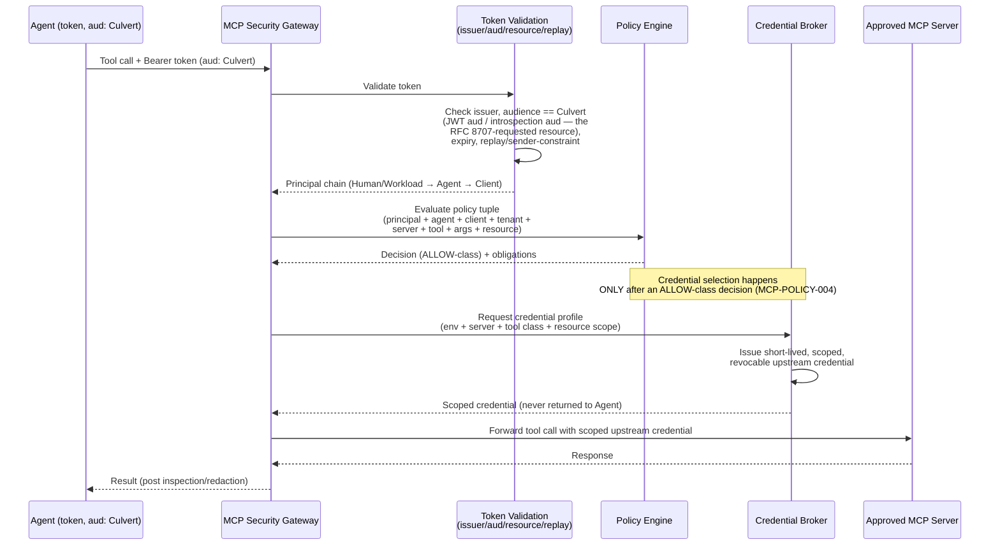

# Auth and Credential Model

This document defines the identity, delegation, token and credential-broker model for the two MCP
capabilities — the Culvert Management MCP Server and the MCP Security Gateway. It specifies who/what
is authenticated at each hop of an MCP tool call, how a bearer token is validated and bound to Culvert,
how replay protection is (and is not yet) provided, and how an upstream credential is selected only
after a policy decision. It is the authoritative source for requirement IDs in the `MCP-AUTH-*` and
`MCP-CRED-*` families; see [SECURITY-REQUIREMENTS.md](SECURITY-REQUIREMENTS.md) for the full table and
[THREAT-MODEL.md](THREAT-MODEL.md) for the threat IDs this model closes.

**Status: PR-0 design artifact (Proposed).**

> **Update (PR-3) — identity/auth core IMPLEMENTED.** The principal model (§3), capability-specific
> OAuth client/resource/scope validation (§4), JWT and opaque-token validation, audience/tenant
> isolation, short-TTL/temporal checks, and the DPoP/mTLS sender-constraint primitives with bounded
> proof-`jti` replay protection (§5) are now realized, listener-independently, in `internal/mcp/identity`,
> `internal/mcp/authn`, `internal/mcp/senderconstraint`, and the shared `internal/mcp/jose` leaf
> (`MCP-ID-001..008`, `MCP-AUTH-001..008`). The `[INFER] net-new` / `NOT-VERIFIED` provenance tags below
> describe the pre-PR-3 codebase and are retained as the historical evidence record; where a cell says a
> control is "net-new" or "absent today", read it together with this note: the control now exists as code,
> but remains dormant (no listener, no `package main` wiring, no network I/O — all key material,
> introspection results and TLS-binding thumbprints are explicit inputs). Credential-profile selection /
> brokering (§7) stays PR-4 and is deliberately still absent.

> **Decision status — D-2 CLOSED (2026-07-24, [`ADR-0024 §D-2`](../../adr/0024-mcp-agent-security-gateway-trust-boundary.md)).**
> Culvert is the **OAuth protected resource server** (Option A): client tokens terminate at Culvert;
> clients request the canonical Culvert MCP resource via RFC 8707 `resource` and Culvert validates the
> resulting audience restriction, so audience identifies the canonical Culvert MCP resource (`/mcp/management` or
> `/mcp/gateway/{server-id}`, or an approved Culvert-controlled logical resource); the upstream server/tool/
> resource are **policy + credential-broker inputs, never the token audience**; separate Mgmt/Gateway OAuth
> clients + disjoint scopes. Option C = an issuer topology under A; Option B = edge token-exchange only.
> **Replay protection is reframed (see §5, corrected below): it is NOT access-token `jti` one-time-use.**

---

## 1 · Scope and Doctrine

Per [BLUEPRINT.md](BLUEPRINT.md) §03, this document keeps the two capabilities strictly separate:

- **Capability A — Culvert Management MCP Server** (`AI Client → /mcp/management → Culvert management`):
  read-only default, tenant-scoped, RBAC-gated, redacted, rate-limited, audited.
- **Capability B — MCP Security Gateway** (`AI Agent → /mcp/gateway/{server-id} → Approved MCP Server →
  Enterprise System`): authenticates and authorizes agent tool calls, selects a scoped upstream
  credential, and enforces policy on the traffic to an approved downstream MCP server.

Their OAuth clients, scopes, token audiences and credential profiles are **never shared** (**[REQ]
MCP-AUTH-008**). Everything below applies to both unless a subsection says otherwise.

---

## 2 · Identities (Separate Principals)

**[FACT]** The repository's only existing identity model is a flat, human-only struct:
`Sub`/`Email`/`Name`/`Groups`/`Provider` (`identity.go:9-27`). It carries no tenant, workload, agent or
delegation concept. **[REC]** it is reusable, after refactor, only as the concrete representation of the
**Human** principal below (see **MCP-ID-001**) — it cannot stand in for Workload, Agent, Client, Tenant,
MCP Server, Tool or Resource, which are new principal types this program must introduce.

The eight principal types below extend [BLUEPRINT.md](BLUEPRINT.md) §10's seven-entity identity table
with **Tenant** elevated from a field on Human/Resource to its own principal type (marked `[INFER]`
net-new below), each defined separately because policy evaluates them independently — collapsing any
two loses the distinctions a decision needs (e.g. "which agent, owned by which human, running in which
client, against which tenant").

| Identity | Minimum Fields | Policy Use | Notes |
|---|---|---|---|
| **Human** | subject, tenant, groups, assurance level, session | Who delegated the action and under which assurance. | **[FACT]** Maps to today's `identity.go:9-27` (`Sub`/`Email`/`Name`/`Groups`/`Provider`) as a starting point; tenant + assurance level are **[INFER]** net-new fields (**MCP-ID-001**). |
| **Workload** | service identity, namespace, environment, attestation | Automation acting without a human session. | **[INFER]** net-new; no equivalent exists today. |
| **Agent** | agent ID, owner, version, managed status, risk | The autonomous entity actually requesting the tool call. | **[INFER]** net-new; distinct from both the owning Human and the hosting Client. |
| **Client / Application** | OAuth client, application ID, deployment, trust | The application hosting/executing the Agent. | **[INFER]** net-new. **[FACT]** the closest existing analog, OIDC `client_id`, is reused today as the token *audience* in the browser SSO flow (`auth_oidc_flow.go:523`) — a pattern this model explicitly does NOT carry forward for MCP (see §4). |
| **Tenant** | tenant ID, isolation boundary, data residency | Cross-tenant isolation; scopes every downstream check. | **[INFER]** net-new; no tenant concept exists in `identity.go`. |
| **MCP Server** | registry ID, owner, environment, TLS identity | The approved destination and policy boundary for Capability B. | **[INFER]** net-new; would live in the PR-2 registry/catalog. |
| **Tool** | name, canonical schema hash, description hash, risk | Precise per-action authorization, not just server-level access. | **[INFER]** net-new; see [BLUEPRINT.md](BLUEPRINT.md) §12 for the tool-identity fingerprint. |
| **Resource** | repository, project, database, tenant, record scope | Least-privilege narrowing to the specific target of the call. | **[INFER]** net-new. |

**[FACT]** RBAC roles that already exist (`RoleAdmin`/`RoleOperator`/`RoleViewer`, `store.go:317-336`,
enforced by `requireRole`, `ui_rbac.go:46-53`) are a Human-principal, admin-UI-scoped concept only — they
do not extend to Agent, Workload, Server, Tool or Resource principals and are not reused as-is for MCP
authorization decisions.

---

## 3 · Delegation Chain, Assurance Level, Session Identity

The MCP tool-call path is a chain of delegation, not a single identity check. Each link narrows privilege
and must be independently recorded (without storing secrets — see **MCP-AUTH** requirements below):

```
Human (or Workload)
   → delegates to → Agent
      → hosted/executed by → Client / Application
         → calls → Culvert MCP endpoint (Management or Gateway)
            → (Gateway only) → routes to → approved MCP Server
               → invokes → Tool
                  → scoped to → Resource
```

- **Assurance level** travels with the Human/Workload link and can be elevated by step-up authentication;
  policy may require a minimum assurance level before permitting write or high-risk actions
  ([BLUEPRINT.md](BLUEPRINT.md) §10 Authorization Rules: "Sensitive operations may require higher
  assurance, step-up authentication or approval").
- **Session identity** is the bound, short-lived context (session ID, max calls, revoke handle) used by
  the `ALLOW_FOR_SESSION` policy action ([BLUEPRINT.md](BLUEPRINT.md) §11); it is distinct from the
  long-lived Agent/Client identities and from the existing admin-UI session cookie.
  **[FACT]** the existing UI session primitive is an HttpOnly cookie, not a bearer token
  (`internal/session/session.go:345-363`) — it is a useful *pattern* (server-side revocable state) but is
  not itself the MCP session-identity mechanism, which must be bearer-token-based per §4.
- Missing or ambiguous identity anywhere in the chain produces **DENY** for write and high-risk
  operations ([BLUEPRINT.md](BLUEPRINT.md) §10).
- The full chain (Human/Workload → Agent → Client → Server → Tool → Resource) is recorded on every
  decision event so an audit reader can answer "who ultimately caused this," never just "which token
  arrived" — see [BLUEPRINT.md](BLUEPRINT.md) §16 for the decision-event shape.

---

## 4 · Token Model

Each MCP request (Management or Gateway) carries a bearer token evaluated against five properties:

| Property | Requirement | Status Today |
|---|---|---|
| **Issuer** | Trusted issuer for the calling principal (Human/Workload/Agent/Client), verified via JWKS. | **[FACT]** JWKS + `iss` + `exp` validation exists for the browser OIDC ID-token flow (`auth_oidc_flow.go:499-566`) — reusable *pattern*, not an MCP implementation. |
| **Audience** | **MUST** identify the Culvert MCP resource, not any other service. | **[FACT]** Today's SWG flow binds audience to the OIDC **`client_id`** (`auth_oidc_flow.go:523`), and `auth_oidc.go:247` only optionally checks a `RequiredAudience`. Neither is "audience = the MCP server." **MCP-AUTH-002** requires a genuine Culvert-identifying audience and rejection of foreign `aud`. |
| **Resource** | Audience restriction **MUST** be obtained *through the authorization flow*: the client sends `resource=<canonical Culvert-controlled MCP resource URI>` on the authorization/token request (RFC 8707 §2 — which **MAY** encode the target server ID, e.g. the Culvert resource for `/mcp/gateway/{server-id}`), and Culvert verifies the **resulting** restriction (`aud` for JWTs, introspection `aud`/resource metadata for opaque tokens) — **never** the upstream business MCP server (ADR-0024 §D-2). RFC 8707 `resource` is a *request* parameter, so Culvert **MUST NOT** demand a bespoke resource claim inside the token. | **[FACT]** RFC 8707 resource indicators are **absent today** (grep 0 in VERIFIED EVIDENCE) on both the request side and the validation side. This is net-new — **MCP-AUTH-003**. |
| **Scopes** | Fine-grained, per-capability, per-tool-class scopes (never a blanket "MCP access" scope). | **[INFER]** net-new; must be disjoint between Management and Gateway (**MCP-AUTH-008**). |
| **Credential profile** | Not carried in the token itself — selected server-side, after the policy decision, from the credential broker (§7). | **[INFER]** net-new; see §7 and **MCP-POLICY-004** / **MCP-CRED-001**. |

**Token state to be enforced (not yet present):**
- The token's **effective audience MUST** identify **Culvert** — the canonical Culvert-controlled MCP
  resource URI (which may encode the server ID), **not** the upstream business MCP server; the SWG's
  `client_id`-as-audience shortcut (`auth_oidc_flow.go:523`) is explicitly **not** an acceptable substitute
  for MCP (**MCP-AUTH-002**, **MCP-AUTH-003**; closes **MCP-T-003** wrong audience and **MCP-T-004** wrong
  resource).
- The binding is established **at the authorization server** (client sends `resource`, AS returns an
  audience-restricted token) and **verified at Culvert** from standard token metadata — `aud` for JWT
  access tokens, the introspection response for opaque ones. Culvert's protected-resource metadata **MUST**
  publish the same canonical resource URI its clients are told to request. An **absent audience is rejected
  for EVERY operation class, not just write/high-risk** — a token with no verifiable audience cannot be shown
  to target Culvert at all, so read/low-risk requests fail closed too (this is the unconditional form of
  **MCP-AUTH-002**). Culvert **MUST NOT** require a non-standard resource claim to be present inside the
  token (**MCP-AUTH-003**).
- Tokens **MUST** be short-TTL, with expiry enforced (**MCP-AUTH-004**). **[FACT]** `exp` enforcement
  already exists in the OIDC flow (`auth_oidc_flow.go:653-659`) and is a reusable pattern.
- Tokens **MUST NOT** appear in query strings; validate the bearer token on every relevant request
  (**MCP-AUTH-001**).

---

## 5 · Replay and Sender-Constraint (Corrected Analysis)

This is the single most important correction in this document: **the repository's reusable bearer-token
path provides no defense against MCP access-token replay.** Specifically:

- **[FACT]** The access-token path used for API calls is RFC 7662 token introspection
  (`auth_oidc.go:166-265`). The token cache that sits in front of it (`auth_oidc.go:114-151,282-319`) is a
  **performance** cache (avoid re-introspecting on every request) — it is **not** an anti-replay
  mechanism. A captured, still-valid bearer token replays successfully through this path exactly as many
  times as an attacker chooses, up to expiry.
- **[FACT]** Nonce validation exists **only** on the browser-facing PKCE ID-token flow
  (`auth_oidc_flow.go:557-561`), bound to a single-use PKCE entry (`pkceStore` pop-once,
  `auth_oidc_flow.go:248-259`, TTL `pkceEntryTTL=10m`). This protects the *authorization-code exchange*,
  not the resulting *access token's* reuse — and MCP calls are not browser PKCE redirects, so this
  mechanism does not apply to the MCP path at all.
- **[FACT]** There is **no DPoP, no `cnf` claim, and no other sender-constraint mechanism** anywhere in
  the codebase (grep 0). A stolen bearer token is fully usable by any holder from any origin.

**Conclusion: MCP anti-replay / token-abuse defense is net-new and its presence in the current codebase is
NOT VERIFIED.** Do not assume introspection, caching, or the browser-flow nonce provide it.

**Corrected model (D-2, [`ADR-0024 §D-2`](../../adr/0024-mcp-agent-security-gateway-trust-boundary.md)
items 7–9).** MCP-AUTH-006 **MUST NOT** be defined as one-time-use rejection of an access-token `jti`:
**reuse of a still-valid access token is not, by itself, evidence of replay.** Instead the required
posture is a layered set of controls:

- **TLS on every request** (transport confidentiality/integrity).
- **Short token lifetime** and enforced expiry (MCP-AUTH-004).
- **Audience and resource restriction** to the canonical Culvert MCP resource (MCP-AUTH-002/003).
- **Issuer, signature, expiry, tenant and scope validation** on every call.
- **Introspection or revocation support** where applicable (RFC 7662 / revocation lists).
- **Client / session correlation, rate limits, and anomaly signals** (detect abnormal reuse patterns
  rather than treating each reuse as replay).
- **Sender-constrained tokens (mTLS or DPoP)** for **high-risk or externally reachable deployment
  profiles** when supported.

**When DPoP is used, replay detection applies to the per-request DPoP proof** — proof `jti`, HTTP method,
URI, issue time (`iat`), access-token hash (`ath`), and server nonce where required — **not** to the
underlying access token, which is never treated as one-time-use. This is the anti-replay boundary that
lets Capability B sit in front of write / high-risk upstream actions. MCP-AUTH-006 is PR-3 scope and a
hard gate, not an optimization.

---

## 6 · Hard Requirements

Each row is a MUST/MUST NOT with its governing requirement ID. Full rationale, acceptance evidence and
target PR live in [SECURITY-REQUIREMENTS.md](SECURITY-REQUIREMENTS.md); threat closure lives in
[THREAT-MODEL.md](THREAT-MODEL.md).

| # | Rule | Requirement ID |
|---|---|---|
| 1 | The gateway **MUST NOT** allow token passthrough — the client's bearer token is never forwarded unchanged to an upstream system. Existing no-passthrough posture (`proxy.go scrubForwardedHeaders:46-73`, `proxy_tunnel.go removeHopHeaders:1288-1304` stripping `Proxy-Authorization`) is **precedent only** — it proves the codebase has the discipline, not that MCP token isolation is implemented. | **MCP-AUTH-005** |
| 2 | The gateway **MUST NOT** accept a bearer token carried in a query string. | **MCP-AUTH-001** |
| 3 | The gateway **MUST** validate token audience against the Culvert MCP resource and reject foreign audiences. | **MCP-AUTH-002** |
| 4 | Culvert's clients **MUST** request the **canonical Culvert-controlled MCP resource URI** via RFC 8707 `resource` (which may encode the server ID), and the gateway **MUST** verify the resulting audience restriction from standard metadata (`aud` for JWTs, introspection for opaque tokens) — never accepting the upstream business server as the audience, and never requiring a bespoke in-token resource claim. | **MCP-AUTH-003** |
| 5 | The gateway **MUST** implement bearer-token replay protection (net-new; see §5). | **MCP-AUTH-006** |
| 6 | Tokens **MUST** be short-TTL with enforced expiry. | **MCP-AUTH-004** |
| 7 | Management MCP and Gateway MCP **MUST** use SEPARATE OAuth clients and scopes — never shared. | **MCP-AUTH-008** |
| 8 | Upstream credential selection **MUST** occur only AFTER an ALLOW-class policy decision — never before, never speculative. | **MCP-POLICY-004**, **MCP-CRED-001** |
| 9 | Upstream credentials **MUST** be short-lived and scoped (environment/server/tool/resource); over-privileged credentials **MUST** be rejectable by policy. | **MCP-CRED-002**, **MCP-CRED-003** |
| 10 | Credentials **MUST** support immediate revoke and rotation without downtime. | **MCP-CRED-003** |
| 11 | Secrets **MUST NOT** appear in logs, metrics, traces, errors or decision events. | **MCP-CRED-004** |
| 12 | The broker **MUST** fail closed for write/high-risk operations on any failure (unavailable, rotating, expired, scope-mismatch). | **MCP-CRED-006** |

---

## 7 · Credential Broker Model

> Selling point ([BLUEPRINT.md](BLUEPRINT.md) §13): agents never receive production credentials. The
> agent's token is valid only for Culvert; after a policy ALLOW-class decision, Culvert's broker selects
> a short-lived, scoped, revocable upstream credential on the agent's behalf.

> **Update (PR-4) — the credential broker is IMPLEMENTED (dormant).** The model in this section is realized
> listener-independently in `internal/mcp/credentials/{profile,provider,broker}` (`MCP-CRED-001..006`,
> `MCP-AUTH-005`): immutable credential profiles (§7.1) with opaque ids scoped by tenant/environment/server/tool/
> resource and a power ceiling; a narrow provider interface (§7.2) returning an OPAQUE `secret.Sealed` handle +
> non-secret lease (never raw bytes/strings/secret-bearing errors); a two-phase `Plan`→`Materialize` flow where an
> injected pre-materialization gate runs BEFORE any cache decrypt or provider fetch (policy = PR-6, durable events
> = PR-8 supply the gate later); the §7.3 failure matrix (high-risk fail-closed, low-risk cached fallback only under
> explicit policy); atomic rotation + immediate revocation; and a bounded, partitioned, encrypted-envelope-only
> cache. It reuses the `internal/secret` containment boundary (two minimal audited additions, `NewSealed`/
> `MemoryProvider`) — no second secret container. The agent still never holds a credential and the client token is
> never forwarded upstream (the broker consumes only the PR-3 resolved identity; the provider request carries only
> the one-way correlation digest). NOT wired into `package main`; no network I/O — the actual upstream call, the
> policy decision and the durable event spool are PR-5/PR-6/PR-8. Provenance/`[INFER]`-net-new tags below describe
> the pre-PR-4 codebase and are retained as the historical record.

### 7.1 Credential Profiles

Profiles are partitioned by:

- **Environment** (prod / staging / dev)
- **MCP Server** (the specific approved downstream server)
- **Tool class** (read vs. write vs. destructive/administrative)
- **Resource scope** (repository, project, database, tenant, record scope)

A profile never spans more privilege than its narrowest dimension requires; policy may reject a
resolved credential that is broader than the action needs (**MCP-CRED-002**).

### 7.2 Provider Interfaces

The broker is provider-agnostic and integrates with external secret/identity systems rather than
minting or storing long-lived secrets itself:

- **Vault**, **KMS**, **Secrets Manager** — dynamic short-lived secret issuance.
- **Workload identity** (cloud IAM roles, SPIFFE/SPIRE, mTLS client certs) — **preferred over static
  secrets** wherever the upstream supports it, per [BLUEPRINT.md](BLUEPRINT.md) §13.

**[FACT]** `internal/secret` (KEK containment + provider model, ADR-0007-secret) is **reusable prior
art** for the broker's at-rest containment layer — it demonstrates the KEK/provider abstraction this
program needs, but it is not itself an upstream-credential broker and requires refactor/extension before
reuse (same caveat as `identity.go` in §2: existing primitive, new purpose). `internal/redaction`
(fail-closed `DataClass`) is likewise reusable for **MCP-CRED-004** secret-scrubbing in events/logs.

### 7.3 Broker Failure Matrix

From [BLUEPRINT.md](BLUEPRINT.md) §13, the failure semantics differ sharply by risk class — this
asymmetry is deliberate and is what makes **MCP-CRED-006** enforceable:

| Failure | Read-only / Low-Risk | Write / High-Risk |
|---|---|---|
| **Broker unavailable** | Fail open ONLY with a valid cached credential AND an explicit policy permitting it. | Fail closed. |
| **Rotation in progress** | Use the current valid version until grace expiry. | Use ONLY the approved active version. |
| **Credential expired** | Deny; retry after refresh within budget. | Deny. |
| **Scope mismatch** | Deny. | Deny AND emit a security event. |

No cell in the Write/High-Risk column ever fails open. The credential cache backing the "valid cached
credential" cell must itself be bounded and encrypted at rest (**MCP-CRED-005**).

---

## 8 · Sequence: Token → Policy → Credential → Approved Server



---

## 9 · Cross-References

- Principal-type gaps and full acceptance criteria: **MCP-ID-001** in
  [SECURITY-REQUIREMENTS.md](SECURITY-REQUIREMENTS.md).
- Token/replay requirement details: **MCP-AUTH-001..008** in
  [SECURITY-REQUIREMENTS.md](SECURITY-REQUIREMENTS.md).
- Credential requirement details: **MCP-CRED-001..006** in
  [SECURITY-REQUIREMENTS.md](SECURITY-REQUIREMENTS.md).
- Threats closed by this model: **MCP-T-001** (token theft), **MCP-T-002** (token replay, net-new/NOT
  VERIFIED), **MCP-T-003** (wrong audience), **MCP-T-004** (wrong resource), **MCP-T-005** (token
  passthrough, Critical), **MCP-T-006/007** (agent/workload impersonation), **MCP-T-008** (cross-user
  session confusion), **MCP-T-022** (over-privileged credential), **MCP-T-023** (credential leakage,
  Critical), **MCP-T-024** (cred-cache compromise), **MCP-T-025** (scope mismatch), **MCP-T-046**
  (confused deputy) — see [THREAT-MODEL.md](THREAT-MODEL.md).
- Policy-decision shape and the nine actions this model feeds into: [BLUEPRINT.md](BLUEPRINT.md) §11.
- Identity/delegation source figure: [BLUEPRINT.md](BLUEPRINT.md) §10.
