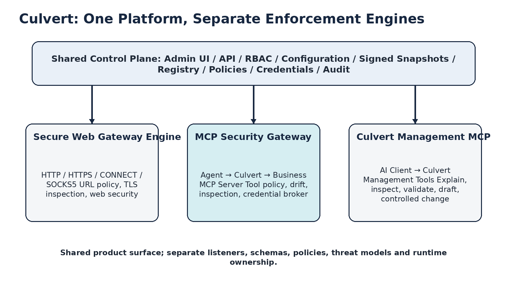
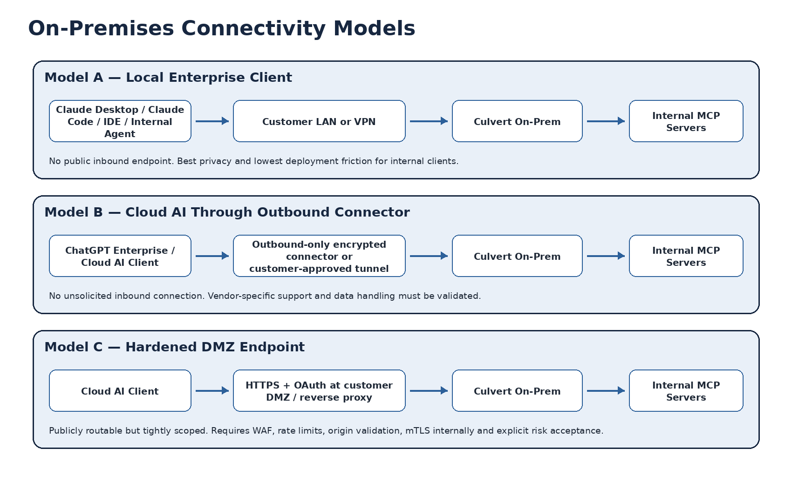
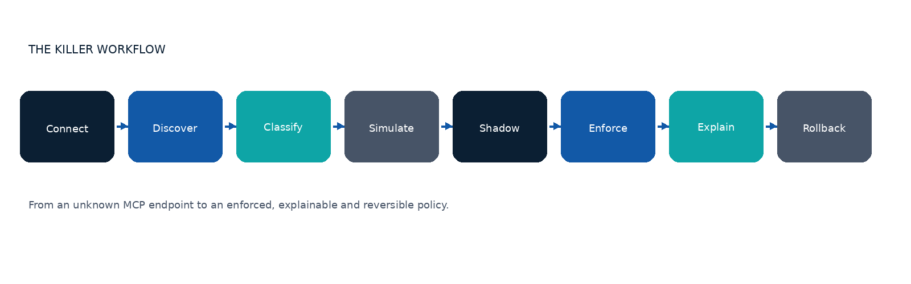
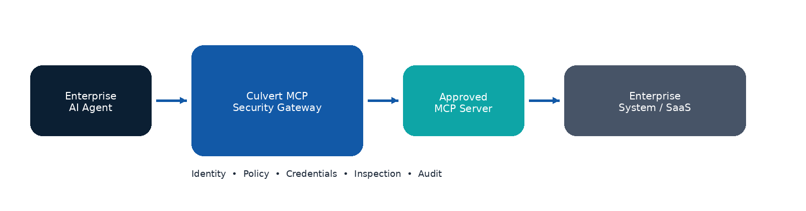
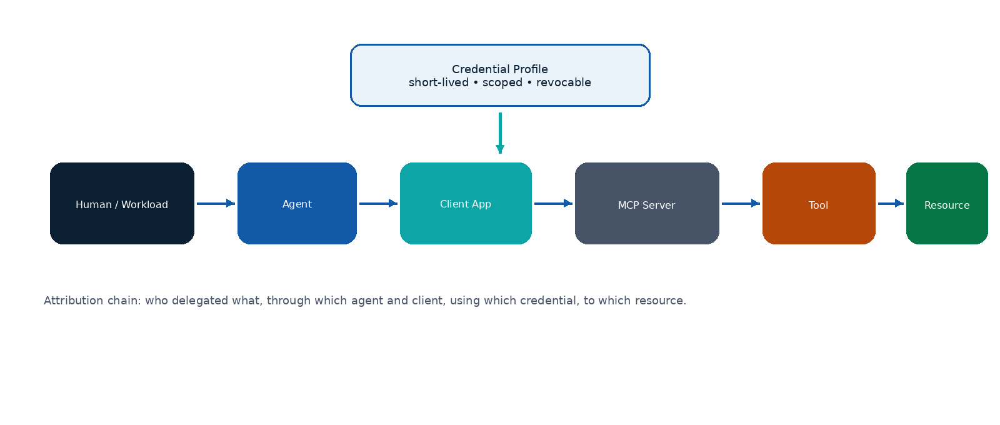
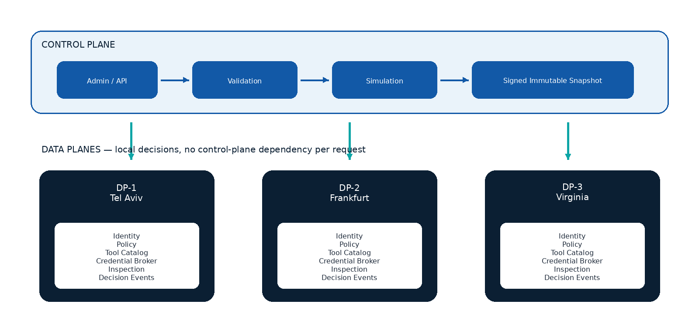

# Culvert MCP Agent Security Gateway — Product, Security & Delivery Blueprint

> **Faithful Markdown normalization of the source DOCX.**
> Source of truth for product direction: [`source/Culvert_MCP_Agent_Security_Gateway_Blueprint_EN.docx`](source/Culvert_MCP_Agent_Security_Gateway_Blueprint_EN.docx) (preserved unchanged).
> This file reproduces the blueprint content; it introduces **no new claims**. Where conversion was
> uncertain, the text is marked `SOURCE REVIEW REQUIRED`. Diagrams are embedded from
> [`assets/`](assets/) as extracted PNGs (relative links); Mermaid recreations of the data flows live in
> [`DATA-FLOW-DIAGRAMS.md`](DATA-FLOW-DIAGRAMS.md).
>
> **Version 1.1 · English Review Edition · July 2026.**
> **Internal working document. This document is not an endorsement, approval or certification by Palo
> Alto Networks or any external vendor.**

---

> **CULVERT MCP Agent Security Gateway — Enterprise Product, Security and Delivery Blueprint.**
> Vision: the identity, policy, credential, tool, inspection and audit control point between AI agents
> and enterprise systems.

> **Design verdict: GO WITH CONDITIONS.** The product direction is strong; production approval requires
> completed security artifacts and executable evidence.

---

## 00 · Document Control

| Field | Value |
|---|---|
| Document name | Culvert MCP Agent Security Gateway — Product, Security & Delivery Blueprint |
| Purpose | Define a product that can be sold, built, secured, operated and approved through measurable evidence. |
| Audience | Product, Engineering, Product Security, Architecture, IAM/PAM, AI Platform, SRE, Support and Executive Sponsors. |
| Status | Design baseline. Implementation requires a documentation-only PR-0, repository SHA freeze, approved ADR and threat model. |
| Initial scope | Remote MCP over Streamable HTTP. Local stdio and localhost coverage require a separate endpoint bridge roadmap. |
| Core principle | Default deny for unknown actions; no token passthrough; production credentials never reach the agent. |
| English edition changes | Adds explicit separation between Management MCP and MCP Security Gateway, plus on-premises connectivity models and a vendor-style acceptance scorecard. |

### Decision Statement

> The product direction is approved as a bounded program. Start with PR-0 and do not expose a public
> listener or production runtime until threat modeling, policy semantics, on-prem connectivity, rollout
> controls and evidence requirements are closed.

### Table of Contents

1. Executive Assessment and Vendor-Style Readiness
2. Product Thesis and Value Proposition
3. Two MCP Capabilities, One Culvert Platform
4. On-Premises Connectivity and Data Flow
5. Buyers, Users and Jobs to Be Done
6. Product Principles and Boundaries
7. V1 Scope and Coverage Map
8. Core Experience and Killer Workflow
9. Target Architecture and Trust Boundaries
10. Identity, Delegation and Authorization
11. Policy Model and Decisions
12. Discovery, Risk and Drift
13. Credential Broker
14. Inspection, DLP and Human Approval
15. Management Experience and UX
16. Events, Audit and Explainability
17. Threat Model and Risk Prioritization
18. SSDLC, Supply Chain and Governance
19. Control Plane, Data Plane and HA
20. SLOs, Capacity and Operations
21. Rollout, Rollback and Production Readiness
22. Business and Product Success Metrics
23. Roadmap and Implementation Slices
24. Go / No-Go Checklist
25. Open Decisions and Assumptions
26. Practical Appendices and External Alignment

---

## 01 · Executive Assessment and Vendor-Style Readiness

Culvert Agent Security Gateway is a central enforcement point between AI agents, MCP servers and the
systems behind them. It identifies the acting entity, validates the target, applies deterministic
policy, isolates credentials, inspects inputs and outputs, and produces a decision record that can be
explained and reconstructed.

| Dimension | Score | Assessment |
|---|---|---|
| Product direction | 9.0/10 | Clear enterprise problem, credible buyer set and a defensible identity/policy/credential wedge. |
| Architecture blueprint | 9.0/10 | Strong separation of protocol, identity, registry, policy, credential, inspection and event responsibilities. |
| Security design | 8.8/10 | Threat categories and controls are strong; PR-0 still must produce formal DFDs, STRIDE and traceability artifacts. |
| Operational design | 8.5/10 | SLOs, rollback and runbooks are defined as targets; they are not yet proven by tests or production evidence. |
| Commercial readiness | 8.2/10 | Positioning and POV are strong; pricing, packaging, competitive proof and validated willingness-to-pay remain open. |
| Production approval today | 3.0/10 | A blueprint cannot substitute for code, test evidence, signed artifacts, support readiness and customer validation. |
| Blueprint quality after this edition | 9.3/10 | Appropriate for a serious internal architecture/product-security review, with explicit gaps and closure conditions. |

### Would a Palo Alto Networks–style review receive this positively?

Likely yes as an initial architecture and product-security blueprint, because the document emphasizes
identity-first control, discovery, least privilege, credential isolation, fine-grained policy,
auditability, pre-change simulation, staged rollout and software-supply-chain evidence. These themes
align with Palo Alto Networks' public descriptions of agent identity security, Prisma AIRS, policy
analysis and secure SDLC practices. [P1–P5]

However, no responsible reviewer could award a genuine 10/10 production approval based on a document
alone. A large security vendor would expect repository-grounded requirements, formal threat models,
design reviews, compatibility evidence, abuse testing, performance results, SBOMs, signed provenance,
operational readiness, privacy review, support ownership and verified rollback behavior.

> Honest verdict: "warmly received as a strong design baseline" is defensible. "Palo Alto approved" or
> "10/10 production ready" is not.

### What remains before a true 10/10 review package

- Formal DFDs and STRIDE analysis for every component and trust boundary, not only an executive threat summary.
- A threat → control → test → evidence matrix with stable requirement IDs, owners, residual-risk acceptance and closure dates.
- Current MCP protocol compatibility matrix backed by conformance fixtures and malicious/non-compliant server tests.
- On-premises connectivity decisions for local clients, outbound connectors and DMZ endpoints, including data-residency diagrams.
- Executable evidence: unit, integration, fuzz, race, OAuth-negative, SSRF, DNS rebinding, streaming, load, soak, chaos and HA results.
- Supply-chain evidence: pinned dependencies and actions, machine-readable SBOM, signing, provenance and vulnerability-remediation SLA.
- Operational evidence: dashboards, paging, runbooks, support ownership, upgrade/downgrade procedures and rollback rehearsal.
- Customer evidence: validated pain, successful paid pilot, time-to-value and willingness-to-pay.

### Three Product Pillars

| Pillar | Customer Question | Flagship Capability |
|---|---|---|
| Discover | Which agents, servers and tools exist, and what changed? | Inventory, ownership, tool fingerprint, usage graph, drift and risk. |
| Govern | Who may perform which action, under which conditions? | Identity-aware policy, simulation, shadow mode, approvals and reason codes. |
| Protect | How do we prevent credential abuse, data leakage and tool poisoning? | Credential broker, inspection, quarantine, rate controls and durable audit. |

---

## 02 · Product Thesis and Value Proposition

### Positioning

> Culvert governs every approved remote MCP tool call using enterprise identity, least privilege,
> credential isolation, inline inspection and explainable policy.

Plain-language promise: Culvert lets enterprises connect AI agents to real systems without giving those
agents direct access, unmanaged tools or open production credentials.

### Problem the Customer Pays to Solve

| Pain | Why Existing Approaches Fall Short | Culvert Response |
|---|---|---|
| Shadow MCP | Agents and clients connect to servers without central inventory. | Discovery, ownership, allowlist and an enforceable traffic path. |
| Over-privileged agents | A token or service account grants broader access than a single action requires. | Short-lived credential profiles scoped by server, tool, resource and environment. |
| Tool drift / rug pull | A tool name stays constant while schema, description, identity or behavior changes. | Fingerprint, diff, risk re-score and quarantine. |
| No attribution | The organization cannot prove who initiated an action and on whose behalf. | Identity chain: human/workload → agent → client → server → tool → resource. |
| Unsafe autonomy | Write or destructive operations execute without meaningful approval. | Risk-aware confirmation, security approval, allow-once/session and deny. |
| Weak investigations | Technical logs do not explain why an action was allowed. | Decision events with reason, revisions, evidence and remediation. |

### Recommended Category

Agent Security Gateway. Sub-definition: an MCP identity, policy and inspection enforcement point.
Culvert complements SWG, IAM, PAM, DLP and SIEM; it does not replace them.

### Defensible Moat

- A graph that connects humans, workloads, agents, clients, MCP servers, tools, credentials and resources.
- A history of tool fingerprints that distinguishes safe narrowing from privilege expansion.
- A policy simulator that calculates blast radius before publication.
- Decision events suitable for investigation, compliance and future behavioral analytics.
- Credential isolation that separates the agent token from upstream privilege.

---

## 03 · Two MCP Capabilities, One Culvert Platform

Culvert should support two different MCP use cases. They share the platform shell and selected
control-plane services, but they must not share the same listener, policy schema or threat model.



*One control plane; separate enforcement engines and trust boundaries.*

### Capability A — Culvert Management MCP Server

An AI client uses MCP to query, explain and eventually perform tightly controlled management operations
on Culvert itself.

> `AI Client → /mcp/management → Culvert management capabilities`

| Initial Tool Class | Examples | Default Posture |
|---|---|---|
| Read-only explanation | Explain a policy decision; show effective configuration; compare desired and actual state. | Allowed only to authorized roles; bounded output and tenant scope. |
| Health and analytics | Cluster health, node readiness, bounded security-event queries. | Read-only, redacted and rate limited. |
| Draft and validation | Draft a policy; validate syntax; simulate impact. | No activation. Requires full audit. |
| Mutation | Apply or publish configuration. | Out of scope until mature plan → validate → approve → apply controls exist. |
| Prohibited | Raw secret access, arbitrary command execution, unrestricted trace or log export. | Never exposed as MCP tools. |

### Capability B — MCP Security Gateway

Culvert sits between AI clients or agents and business MCP servers. It authenticates the client,
identifies the acting agent, discovers and fingerprints tools, evaluates policy, inspects arguments and
responses, selects a scoped upstream credential, calls the approved server and records the decision.

> `AI Agent → /mcp/gateway/{server-id} → Approved MCP Server → Enterprise System`

### Shared vs. Separate

| Shared Platform Services | Must Remain Separate |
|---|---|
| Admin UI shell and authentication | Listeners and endpoint exposure |
| RBAC framework and tenant model | Policy schemas and decision actions |
| Configuration publication and immutable snapshots | Trust boundaries and threat models |
| Audit conventions and export infrastructure | Runtime pools, quotas and failure semantics |
| OpenAPI, CI and release infrastructure | Management authorization vs. business-tool authorization |

> Commercially: one Culvert platform can expose multiple SKUs. Architecturally: one generic "policy for
> everything" would be a maintainability and security failure.

---

## 04 · On-Premises Connectivity and Data Flow

Culvert remains inside the customer environment. A cloud AI service cannot reach a private RFC1918
address without an approved connectivity mechanism. The product therefore needs explicit deployment
models rather than assuming that "Claude or ChatGPT connects to on-prem."



*Supported on-premises connectivity patterns. Vendor-specific capabilities must be verified during integration.*

### Recommended Deployment Priority

| Priority | Model | Best For | Security Position |
|---|---|---|---|
| 1 | Local enterprise client | Claude Desktop/Code, IDEs, internal agents, VDI and private AI platforms. | No public ingress; direct LAN/VPN access; simplest first production model. |
| 2 | Outbound-only connector | Approved cloud AI services where an enterprise connector/tunnel is supported. | Customer initiates the encrypted connection; no unsolicited inbound port. |
| 3 | Hardened DMZ endpoint | Cloud clients that require a routable remote MCP URL. | OAuth, WAF, origin/host validation, rate limits, internal mTLS and explicit risk acceptance. |

### Data Residency Truth

When a customer uses a cloud AI service, content that Culvert authorizes may still be processed by that
cloud service under the customer's contract and configuration. Culvert controls what may leave the
environment; it does not turn a cloud model into an on-premises model.

- Production credentials, policy, tool catalog, approval state and internal server connections remain on-premises.
- Only policy-approved request and response content crosses the selected AI connectivity path.
- DLP, redaction and destination controls execute before approved content leaves the environment.
- Every deployment requires a documented data-flow diagram, retention model, privacy review and customer-owned allowlist.
- The product must avoid promising universal compatibility with ChatGPT, Claude or any cloud vendor until the current connector requirements have been validated.

### Recommended Endpoints

```
/mcp/management
/mcp/gateway/{server-id}
/mcp/gateway/github-prod
/mcp/gateway/database-readonly
```

Management and business-gateway traffic must use distinct client registrations, scopes, policy
namespaces, rate limits, audit categories and operational runbooks.

---

## 05 · Buyers, Users and Jobs to Be Done

| Persona | Primary Goal | Core Fear | Proof of Value |
|---|---|---|---|
| CISO / Product Security | Enable AI adoption without a new blind spot. | Agent with production privilege or data exfiltration. | Complete inventory, blocked test incidents, policy coverage and audit. |
| IAM / PAM | Apply least privilege and delegation to agents. | Shared credentials and missing attribution. | Credential profiles, delegated identity and rapid revoke. |
| AI Platform Team | Connect agents to tools quickly and consistently. | Security friction and one-off integrations. | Fast onboarding, standards compatibility and shadow mode. |
| Application Owner | Expose controlled access to an owned system. | A tool bypasses business controls or creates damage. | Tool-level policy, resource scope, approvals and usage visibility. |
| SOC / IR | Investigate and contain agent activity. | Insufficient logs or exposed credentials. | Decision trace, identity chain and no raw secrets. |
| SRE / Network | Operate a stable gateway without harming SWG. | Latency, exhaustion or split-brain. | Bounds, SLOs, immutable snapshots and rollback. |

### Jobs to Be Done

1. **Connect a new MCP server safely:** discover tools, classify risk, simulate policy and enter shadow mode without a custom security integration.
2. **Permit a dangerous action under control:** require confirmation or approval and ensure the credential is scoped exactly to the action.
3. **Respond to tool change:** show the diff and blast radius, prevent automatic allow, and route the change to an accountable owner.
4. **Investigate an incident:** identify who initiated the action, which rule and revisions applied, and whether the upstream server received the request.
5. **Prove governance:** answer which agents can modify production using graph, policy and event evidence.

### Buying Triggers

| Trigger | Buying Signal | POV |
|---|---|---|
| AI rollout to production | Agents begin receiving write access to real systems. | Onboard one server, inventory tools, run shadow policy and produce a decision trace in one day. |
| Security incident or audit finding | Shared token, unmanaged MCP or missing attribution is discovered. | Credential isolation, blocked test incident and complete report. |
| Platform standardization | Multiple teams create different MCP integrations. | Common onboarding, policy templates and API/GUI parity. |
| IAM/PAM modernization | The organization wants JIT and least privilege for agents. | Scoped credential profile with revoke and rotation demonstration. |
| Regulated data use | Agents touch PII, secrets or production data. | DLP/redaction, approval and audit evidence. |

---

## 06 · Product Principles and Boundaries

| Principle | Practical Meaning |
|---|---|
| No token passthrough | The user/agent token is never forwarded unchanged to the upstream server. Audience and resource validation enforce separation. |
| Default deny | Unknown server, tool, schema or identity never receives automatic allow. |
| Local data-plane decision | No Control Plane dependency for each tool call. |
| Immutable publication | Config, policy, catalog and credential metadata publish as a complete signed snapshot. |
| Explain every decision | No ALLOW or DENY without a reason code and revision context. |
| Bounded by design | Connections, payloads, SSE streams, queues, concurrency and event buffers are limited. |
| Product parity | GUI, API, configuration, CI and documentation evolve together. |
| Honest coverage | V1 covers remote MCP routed through Culvert; local bypass requires an endpoint component. |

### V1 Non-Goals

- Do not build a new LLM that promises to detect every prompt injection.
- Do not turn Culvert into a complete SIEM, PAM or secrets manager.
- Do not support every MCP transport, extension and protocol version on day one.
- **Do not add MCP fields to the existing SWG PolicyRule.**
- **Do not reuse the existing SWG OIDC proxy flow as a generic MCP authentication model.**
- Do not store raw arguments or raw tool outputs by default.
- Do not expose a production listener before PR-0 and a production-readiness review.

---

## 07 · V1 Scope and Coverage Map

| Capability | V1 | After V1 |
|---|---|---|
| Transport | Remote Streamable HTTP, version adapters and SSE lifecycle. | Additional transports based on demand and standards maturity. |
| Discovery | Server registration, tool inventory, fingerprints and diffs. | Behavioral learning and reputation feeds. |
| Policy | Identity + server + tool + arguments + resource + risk. | Adaptive recommendations based on observed usage. |
| Credentials | Brokered upstream credentials, rotation hooks, mTLS/workload identity. | Dynamic JIT credentials and broader vault integrations. |
| Inspection | Schema, size, secret/DLP patterns, URL and destination controls. | Specialized AI-threat inspection integrations. |
| Approvals | Confirm, allow once/session and security approval. | Multi-party and ticket/workflow integrations. |
| Local MCP | Out of scope. | Desktop/Endpoint Bridge for stdio and localhost. |
| Analytics | Dashboards, decision events and exports. | Behavioral anomaly models and risk trends. |

### Sellable MVP

- Remote Streamable HTTP
- Server and tool inventory
- Schema and description drift
- Identity-aware policy
- Credential separation
- Input/output secret inspection
- Decision trace and reason codes
- Shadow mode
- Approval for destructive tools
- Rollback

> Red line: an unknown tool, changed identity or privilege expansion never moves to automatic allow. It
> enters quarantine until review.

---

## 08 · Core Experience and Killer Workflow



*Connect → Discover → Classify → Simulate → Shadow → Enforce → Explain → Roll Back*

| Step | Action | Output |
|---|---|---|
| 1. Connect | Enter endpoint, owner, environment and auth method. | Server record in Pending state. |
| 2. Discover | Handshake, capability check and tool listing. | Inventory, fingerprints and compatibility report. |
| 3. Classify | Culvert computes risk; administrator reviews or overrides. | Tool risk tiers and policy recommendation. |
| 4. Simulate | Run against events and test vectors. | Blast radius, conflicts and expected decisions. |
| 5. Shadow | Real traffic; policy reports but does not block except hard failures. | False-positive report and rule tuning. |
| 6. Enforce | Enable for a small canary scope. | Allowed/blocked decisions and SLO evidence. |
| 7. Explain | Dashboard and decision trace. | Reason, matched rule, revisions and remediation. |
| 8. Roll Back | Return to the previous snapshot. | Measured recovery without partial state. |

### Initial Policy Recommendation

| Risk Class | Default | Examples |
|---|---|---|
| Read-only / bounded | ALLOW in shadow, then enforce for approved groups. | search, list, get status |
| Write / reversible | REQUIRE_CONFIRMATION or approval by scope. | create ticket, write file |
| Destructive | REQUIRE_APPROVAL or DENY. | delete, revoke, deploy production |
| Open-world / broad destination | MONITOR, restrict destinations and apply low rate. | fetch arbitrary URL, generic SQL |
| Unknown / changed | QUARANTINE. | new tool, changed schema, new TLS identity |

---

## 09 · Target Architecture and Trust Boundaries



*Core MCP Security Gateway request flow.*

| Logical Component | Responsibility | Must Not |
|---|---|---|
| MCP Listener / Protocol Kernel | Termination, framing, version adapters, lifecycle and bounds. | Decide business policy or contain business rules. |
| Identity Resolver | Validate token, audience/resource and agent/client/workload attribution. | Rely on IP alone or invent missing identity. |
| Server Registry | Store endpoints, ownership, TLS identity, environments and status. | Allow an unregistered server. |
| Tool Catalog | Store definitions, canonical hashes, risk, approvals and history. | Trust server annotations as the sole security boundary. |
| Policy Engine | Return deterministic decision and reason codes. | Perform network or other I/O during evaluation. |
| Credential Broker | Select a short-lived, scoped upstream credential. | Expose a secret to the agent or event pipeline. |
| Inspection Pipeline | Schema, size, DLP, destination, redaction and integrations. | Become a single unbounded queue. |
| Decision Event Pipeline | Durable events, export, sampling policy and backpressure. | Reuse a small debug audit ring as production evidence. |

### Trust Boundaries

- Agent/client ↔ Culvert: hostile input, token validation, Origin/Host controls, rate limits and protocol bounds.
- Culvert ↔ MCP server: mTLS/TLS identity, DNS/SSRF controls, credential isolation and server allowlist.
- Control Plane ↔ Data Planes: signed snapshot, revision/epoch/fencing and whole-snapshot validation.
- Runtime ↔ event/export systems: redaction, durability, bounded queues and explicit failure policy.
- Admin surfaces ↔ policy publication: RBAC, four-eyes approval, simulation and audit.
- Cloud AI ↔ customer network: customer-approved connector, data-flow classification, tenant binding and privacy controls.

### Suggested Go Package Boundaries

```
internal/mcp/protocol
internal/mcp/identity
internal/mcp/registry
internal/mcp/catalog
internal/mcp/policy
internal/mcp/credentials
internal/mcp/inspection
internal/mcp/events
internal/mcp/runtime
internal/mcp/management
internal/mcp/adminapi
```

*(These names are evaluated, not adopted, in [`RECOMMENDED-ARCHITECTURE.md`](RECOMMENDED-ARCHITECTURE.md).)*

---

## 10 · Identity, Delegation and Authorization



*Identity and privilege chain for an MCP tool call.*

| Entity | Minimum Fields | Policy Use |
|---|---|---|
| Human | subject, tenant, groups, assurance level, session | Who delegated the action and under which assurance. |
| Workload | service identity, namespace, environment, attestation | Automation without a human session. |
| Agent | agent ID, owner, version, managed status, risk | Autonomous entity requesting the tool call. |
| Client / Application | OAuth client, application ID, deployment, trust | Application hosting or executing the agent. |
| MCP Server | registry ID, owner, environment, TLS identity | Approved destination and policy boundary. |
| Tool | name, canonical schema hash, description hash, risk | Precise action, not only server-level access. |
| Resource | repository, project, database, tenant, record scope | Least-privilege narrowing to the target resource. |

### Authorization Rules

- Validate the Bearer token on each relevant request; never accept a token in the query string.
- Audience and resource must match Culvert. Reject a token intended for another service.
- No token passthrough. Select the upstream credential only after the policy decision.
- Missing or ambiguous identity produces DENY for write and high-risk operations.
- Record the delegation chain without storing secrets.
- Sensitive operations may require higher assurance, step-up authentication or approval.
- Management MCP and Gateway MCP use separate clients, scopes and authorization policies.

---

## 11 · Policy Model and Decisions

### Policy Tuple

```
Principal + Agent + Client + Tenant
+ Server + Tool Identity + Tool Risk
+ Arguments + Resource + Destination
+ Credential Profile + Environment + Time
→ Decision + Reason Code + Obligations
```

| Action | When | Possible Obligations |
|---|---|---|
| ALLOW | Approved action with controlled risk. | Logging, rate limit and destination scope. |
| DENY | Explicit rule or hard security failure. | Reason and remediation. |
| MONITOR | Learning or low-confidence classification. | Full telemetry, no block. |
| QUARANTINE | New or changed tool/server/identity. | Review required; no execution. |
| REQUIRE_CONFIRMATION | Initiating user must confirm. | Display exact action, resource and impact. |
| REQUIRE_APPROVAL | High-risk or production action. | Approver role, expiry and ticket/reference. |
| ALLOW_ONCE | Point exception. | One call, strict scope and short TTL. |
| ALLOW_FOR_SESSION | Time- and scope-limited series. | Session ID, max calls and revoke. |
| ALLOW_WITH_REDACTION | Execution allowed after removing a sensitive field. | Redaction evidence and transformed hash. |

### Policy Lifecycle

```
Draft → Validate → Simulate → Review → Approve
→ Publish Snapshot → Observe/Shadow → Canary → Active
→ Monitor → Roll Back / Retire
```

### Explainability Example

```
Decision: DENY
Matched:
  ✓ Managed agent
  ✓ Approved server
  ✓ User in Developers
  ✗ Tool schema changed after approval
  ✗ Repository scope includes production
Blocking rule: MCP-PROD-WRITE-14
Policy revision: 82
Catalog revision: 37
Suggested resolution: review drift or request temporary approval
```

---

## 12 · Discovery, Risk and Drift

### Tool Identity

```
server_registry_id
+ TLS / workload identity
+ tool name
+ canonical input schema hash
+ canonical output schema hash (when available)
+ description hash
+ credential profile
+ observed destination class
```

| Change | Example | Action |
|---|---|---|
| No material change | Whitespace or order only after canonicalization. | Continue and record observation. |
| Safe narrowing | Enum narrows or destination becomes more restrictive. | Notify; optional policy-controlled auto-accept. |
| Privilege expansion | New field permits admin, delete, branch selection or arbitrary URL. | Quarantine and approval. |
| Semantic drift | Description or behavior claim changes. | Re-score risk and review. |
| Identity change | TLS identity, endpoint owner or server binding changes. | Disable server until re-verified. |
| Unknown tool | A new tool appears. | Quarantine; never automatic allow. |

### Risk Signals

| Signal | Examples |
|---|---|
| Intent | read, write, destructive, administrative, financial |
| Input surface | free-form text, URLs, SQL, shell, file paths, credentials |
| Destination breadth | single approved service vs. arbitrary network |
| Credential power | read-only token vs. tenant administrator |
| Resource scope | single repository vs. all production |
| Reversibility | easy rollback vs. irreversible deletion |
| Observed behavior | destinations, volume, errors, schema mismatch |
| Human review | owner classification and accepted residual risk |

---

## 13 · Credential Broker

> Selling point: agents never receive production credentials. The agent token is valid only for Culvert.
> After policy approval, Culvert selects a short-lived, scoped and revocable upstream credential.

```
Agent token (audience: Culvert)
        ↓ validate + authorize
Policy decision and obligations
        ↓
Credential profile selection
        ↓
Short-lived upstream credential
        ↓ scoped to server / tool / resource
Approved MCP server
```

### Requirements

- Separate credential profiles by environment, server, tool class and resource scope.
- Rotate without downtime and support immediate revoke.
- Provide integration interfaces for Vault, KMS, Secrets Manager and workload identity.
- Prefer mTLS or workload identity when supported by the upstream.
- Never expose secrets in logs, metrics, traces, errors or decision events.
- Allow policy to reject a credential with more privilege than the action requires.
- Keep credential fetch/cache bounded, encrypted and fail-closed for high-risk operations.

| Failure | Read-only Low-Risk | Write / High-Risk |
|---|---|---|
| Broker unavailable | Fail open only with a valid cached credential and an explicit policy. | Fail closed. |
| Rotation in progress | Use current valid version until grace expiry. | Use only the approved active version. |
| Credential expired | Deny and retry after refresh within budget. | Deny. |
| Scope mismatch | Deny. | Deny and emit a security event. |

---

## 14 · Inspection, DLP and Human Approval

### Input Inspection

- JSON/schema validation, depth limits, field-count limits and payload-size limits.
- Path traversal, command/shell patterns, SQL/open-world arguments and URL validation.
- Secret detection for API keys, private keys, access tokens and credential-like strings.
- SSRF and destination controls for scheme, host, DNS resolution, IP ranges and redirects.
- Resource extraction for policy: repository, branch, tenant, database and project.

### Output Inspection

- Response size, content type, schema and truncation policy.
- Secrets and PII redaction or block according to classification.
- Unsafe URLs, embedded instructions and content intended to influence the agent are labeled and reported.
- Raw output is not stored by default; retain hashes, labels and minimum evidence.

### Approval UX

```
Agent requests: repository.write_file
Repository: KidCarmi/Culvert
Branch: main
Path: internal/mcp/policy.go
Impact: modifies protected branch
Requested by: Engineering Agent / Orel
Credential: github-prod-writer
Decision options:  Deny | Allow once | Allow for session | Request security approval
```

> An approval dialog that does not show the exact action, resource, impact and credential is not
> meaningful human-in-the-loop control.

---

## 15 · Management Experience and UX

### Navigation

```
MCP Overview · Servers · Tools · Tool Changes · Agents & Identities · Policies ·
Policy Simulator · Credentials · Approvals · Events & Incidents · Deployment · Health ·
Culvert Management MCP Access
```

### Dashboard Questions

| Widget | Question It Answers |
|---|---|
| Governed call coverage | What percentage of calls pass through Culvert with complete attribution? |
| High-risk tools | Which tools can modify production or export data? |
| Unapproved changes | Which schemas, identities or destinations changed? |
| Credential privilege | Which credentials are broader than observed usage? |
| Top denials | What broke, and was it an attack or a false positive? |
| Policy health | Conflicts, shadowed rules, stale approvals and gaps. |
| Deployment health | Which snapshot is active on each Data Plane, and is there drift? |

### Tool Screen Example

```
Tool: github.repository.write_file
Risk: High
Status: Approved
Schema changed: No
Used by: 7 agents
Credential profile: github-prod-writer
Allowed repositories: 3
Calls this week: 1,284
Denied: 47
Last reviewed: 4 days ago
```

### Policy Simulator Example

| Before Publish | After Publish / Observation |
|---|---|
| 148 additional calls would be allowed. | Track actual matched, denied and overridden decisions. |
| 17 currently allowed calls would be denied. | Compare expected and actual results. |
| 3 new tools would become visible. | Raise drift alerts if the catalog changes. |
| One shadowed rule and two conflicts. | Feed evidence into rule tuning. |
| 12 users would receive production write. | Audit actual use and approvals. |

---

## 16 · Events, Audit and Explainability

| Category | Required Fields |
|---|---|
| Identity | tenant, subject, principal type, agent ID, client ID, delegation/session |
| Target | server ID, endpoint class, tool name, fingerprint, resource |
| Decision | action, reason code, rule ID, obligations, approval reference |
| Revisions | config, policy, catalog, credential and inspection revisions |
| Inspection | input/output labels, redaction count, destination class and schema result |
| Execution | upstream attempted, status, latency, bytes and retry count |
| Integrity | event ID, timestamp, DP ID, snapshot hash and correlation ID |

### Privacy Defaults

| Not Stored by Default | Stored |
|---|---|
| Raw access tokens | Token issuer, subject and audience-validation result |
| Upstream secrets / private keys | Credential profile ID and version |
| Complete raw arguments | Extracted resource, labels, hashes and selected safe fields |
| Complete raw tool output | Size, classification, redaction evidence and output hash |

### Event Durability

The MCP event pipeline must be separate from, or materially extend beyond, a small in-memory debug
ring. Production security evidence requires bounded queues, backpressure, a **mandatory local encrypted
durable spool on every relevant Data Plane** (external export is **additive, never a substitute**), replay
identifiers and an explicit loss policy (D-5 / `ADR-0024 §D-5`, `MCP-EVENT-001`).

> Loss of authentication, deny, configuration or high-risk decision events is unacceptable, and the required
> response **differs by event kind** — do not collapse the two:
>
> 1. **Critical write / destructive / configuration-publication / credential / state-affecting-Management** —
>    the operation **MUST fail closed AND** the system **MUST** enter the defined degraded mode with alerting
>    and an integrity-protected loss counter. Degraded mode is **not** an alternative to fail-closed.
> 2. **Authentication-failure / authorization-DENIAL** — the triggering request is **already denied**, so
>    fail-closed is vacuous and this case is **NOT** relabeled as fail-closed. The system **MUST** enter the
>    isolated **denial lane** (`MCP-EVENT-007`: pre-queue admission control, attacker-rate-independent
>    coalescing, its own `P-DEN` quota, no access to the `P-CRIT` reserve) and, on aggregate-commit failure,
>    **`denial-lane-degraded`** with a distinct loss counter. **No write lockout is applied, and none may be** —
>    these events are attacker-mintable, so gating authenticated work on them yields a fleet-wide DoS
>    (`MCP-T-075`). There is **no emergency-policy bypass**.
>
> Read-only / low-risk operations may proceed **only** under an explicitly approved degraded-mode policy
> (`MCP-EVENT-002`, EVENT-MODEL §4a, `ADR-0024 §D-5`).

---

## 17 · Threat Model and Risk Prioritization

PR-0 must produce complete data-flow diagrams, trust boundaries, STRIDE analysis for each component and
flow, attack trees, abuse cases, a threat-control-test map, residual-risk owners and closure criteria.
The table below is an executive summary, not the formal threat model.

| Threat | Scenario | Primary Controls | Required Tests |
|---|---|---|---|
| Token theft / confusion | Stolen token or token intended for another resource. | Audience/resource validation, short TTL, replay controls, no passthrough. | Negative auth matrix, replay, malformed token and wrong audience. |
| Tool poisoning / drift | Server changes schema or description after approval. | Fingerprint, diff, risk re-score and quarantine. | Compatibility fixtures, malicious server, canonicalization and fuzz. |
| SSRF / DNS rebinding | Tool or endpoint reaches an internal/private network. | Registry allowlist, Origin/Host validation, DNS/IP re-check and redirect limits. | DNS-rebinding lab, private-IP matrix and redirect chains. |
| Credential abuse | Agent receives or invokes an overbroad credential. | Broker, scope matching, short-lived credentials and no secret logging. | Secret scanning, scope mismatch and broker-failure tests. |
| Data exfiltration | Secret is sent through a tool to an external party. | DLP, destination policy, redaction/block and approvals. | Synthetic secrets, encoded variants and output leakage. |
| Prompt/tool injection | Output attempts to trigger another agent action. | Content labels, policy boundaries, approvals and model-side integrations. | Malicious output corpus and multi-step abuse cases. |
| Resource exhaustion | SSE, payload, connection or event flood. | Bounds, quotas, per-entity rate limits and circuit breakers. | Load, soak, slowloris, queue saturation and chaos. |
| Config split-brain | Data Planes run different revisions or partial snapshots. | Immutable snapshots, fencing, whole-snapshot validation and rollback. | Mixed-version, stale epoch and corrupt/partial snapshots. |
| Admin abuse | Administrator expands policy without review. | RBAC, four-eyes review, simulation, audit and approvals. | Permission matrix, bypass attempts and audit completeness. |
| Management MCP abuse | AI client invokes a Culvert management capability outside intended scope. | Separate scopes, read-only default, bounded tools, plan/validate/approve/apply. | Tool-level RBAC, tenant escape, replay and mutation-negative tests. |
| Connector compromise | Outbound connector or DMZ endpoint is hijacked. | mTLS, connector identity, tenant binding, rotation and network egress policy. | Impersonation, certificate rollover, tunnel replay and failover. |

### Example Attack Tree — Unauthorized Production Change

```
Goal: Agent modifies production without authorized intent
├─ Steal or misuse identity token
├─ Bypass Culvert through direct or local MCP
├─ Call approved server with overbroad credential
├─ Exploit tool drift under an approved name
├─ Abuse arguments to target an unapproved resource
├─ Trick a human through ambiguous approval UX
├─ Exploit stale or inconsistent policy snapshot
└─ Abuse Management MCP to publish a change
```

### Residual Risk

- Culvert cannot control stdio or localhost traffic without an endpoint component.
- Pattern-based inspection cannot guarantee detection of every secret or prompt injection.
- An approved MCP server may still be compromised; identity, drift, destination and output controls remain necessary.
- Human approval can fail through social engineering; the UX must be explicit and auditable.
- Cloud AI data handling remains subject to the customer's vendor contract and configuration.

---

## 18 · SSDLC, Supply Chain and Governance

### Control Framework Mapping

| Framework | Application to Culvert |
|---|---|
| NIST SSDF | Prepare the organization, protect software, produce well-secured software and respond to vulnerabilities. |
| Microsoft SDL | Threat modeling, secure defaults, banned patterns, verification and response. |
| OWASP SAMM | Governance, design, implementation, verification and operations maturity. |
| BSIMM | Benchmark evidence across governance, intelligence, SSDL touchpoints and deployment. |
| OWASP ASVS / API Security | Authentication/authorization, validation, logging, SSRF, resource limits and API abuse. |
| SLSA | Provenance, hermetic/reproducible build goals, protected build service and signed artifacts. |

### Required Security Artifacts

- Security requirements with stable IDs.
- DFDs and STRIDE per component and flow.
- Attack trees and abuse cases.
- Threat → control → test → evidence traceability.
- Risk register with owner, severity, mitigation, residual risk and acceptance date.
- Architecture Decision Records for every exception or trust-boundary change.
- Release security checklist and production-readiness review.

### Supply-Chain Gates

| Gate | Requirement |
|---|---|
| Dependencies | Pinned versions, review policy, vulnerability/license SLA and minimal footprint. |
| CI actions | Pin actions to immutable commits; least-privilege tokens and protected environments. |
| SBOM | Generate and attach a machine-readable SBOM for every artifact. |
| Signing | Sign binaries, containers, SBOM and provenance; verify before deploy. |
| Provenance | Record source SHA, builder identity, inputs and build parameters. |
| Reproducibility | Measure reproducible or independently verifiable builds. |
| Secrets | Avoid long-lived CI secrets when workload identity is available. |
| Vulnerability response | Severity-based remediation SLA, emergency revoke and customer communication plan. |

### Blocking Test Gates

Unit, integration and compatibility; fuzz, race and property tests; SAST, SCA, secret scanning and
CodeQL; malicious MCP server tests; OAuth, audience and replay negative matrix; SSRF, DNS rebinding and
redirect tests; SSE lifecycle and resource-exhaustion tests; HA, mixed-version, stale-epoch and rollback
tests; load, soak and chaos; release signature and provenance verification.

---

## 19 · Control Plane, Data Plane and High Availability



*Immutable configuration publication from Control Plane to Data Planes.*

| Snapshot Field | Purpose |
|---|---|
| configuration_epoch | Fencing across Control Plane generations. |
| config_revision | Overall configuration revision. |
| policy_revision | Policy bundle revision. |
| catalog_revision | Server and tool inventory revision. |
| credential_revision | Credential-profile metadata/version, without secrets. |
| minimum_dp_version | Prevents publication to a Data Plane that cannot interpret required semantics. |
| content_hash / signature | Integrity, authenticity and rollback identity. |

### Data Plane Apply

1. Receive a complete snapshot.
2. Validate signature, schema, caps, revisions and minimum version.
3. Build indexes and runtime objects outside the active path.
4. Run self-validation and dry policy samples.
5. Atomically swap the active pointer.
6. Retain the previous snapshot for rollback.
7. Acknowledge the applied hash and health state.

> If the Control Plane is unavailable, the Data Plane continues to decide using the last valid snapshot.
> The request path never depends on a Control Plane round trip.

---

## 20 · SLOs, Capacity and Operations

The following values are design targets. They are not performance claims until verified in staging and
production-like environments.

| Metric | Initial Target | Note |
|---|---|---|
| Gateway availability | 99.95% | For the scope operating in enforcement mode. |
| Policy evaluation p99 | < 1 ms | Excludes external inspection calls. |
| Added latency p50 | < 5 ms | Gateway-local path. |
| Added latency p95 | < 10 ms | Without external inspection services. |
| Added latency p99 | < 25 ms | Under approved load. |
| Policy rollback | < 5 minutes | Operational objective; faster is preferred. |
| Attribution completeness | > 99.9% | Calls with principal + agent + server + tool. |
| Lost auth/deny/config events | 0 | Durability requirement. |
| MCP-off overhead | Zero or measurably negligible | No SWG regression while disabled. |
| Shadow duration | ≥ 14 days | Or equivalent evidence. |
| Canary enforcement | ≥ 7 days | No Sev-1/2 product defect. |
| Soak test | ≥ 24 hours | Realistic streams and event pipeline. |

### Capacity Dimensions

- Concurrent MCP connections and SSE streams per Data Plane.
- Tool calls per second by risk class.
- Maximum registered servers, tools, policies and tenants.
- Payload sizes and schema complexity.
- Credential fetch/cache rate.
- Event throughput, queue depth, export latency and spool size.
- Per-agent, per-tool and per-credential rate limits.

### Operational Runbooks

| Runbook | Primary Actions |
|---|---|
| Server compromise | Disable registry entry, revoke credentials, quarantine tools and search events. |
| Credential leak | Revoke/rotate, block profile and identify all calls and impacted resources. |
| Policy regression | Pause rollout, compare snapshots, roll back and export affected decisions. |
| Data Plane lag / split | Fence stale Control Plane, block partial apply, route traffic and recover from last good. |
| Event pipeline saturation | Apply loss policy, protect high-risk evidence, alert and scale/spool. |
| Protocol incompatibility | Use adapter/compatibility status and disable unsupported capability safely. |
| Connector outage | Maintain local enforcement, fail according to mode, alert and prevent unsafe management mutations. |

---

## 21 · Rollout, Rollback and Production Readiness

| Stage | Enforcement | Entry Criteria | Exit Criteria |
|---|---|---|---|
| Disabled | No listener or traffic. | PR-0 approved. | Build/test artifacts and lab ready. |
| Observe | No real upstream execution, or test environment only. | Protocol kernel, auth and bounded runtime. | Inventory and telemetry validated. |
| Shadow | Traffic passes; policy reports but blocks only hard failures. | Decision parity and event durability. | False-positive rate within target. |
| Canary | Enforcement for a small, read-first scope. | Rollback rehearsed; on-call ready. | SLO met and no critical defects. |
| Production | Enforcement for an approved scope. | Security and operations sign-off. | Continuous monitoring and review. |

### Hard Failures Blocked Even in Shadow

- Invalid or expired token; wrong audience or resource.
- Unregistered server or failed TLS identity.
- Credential scope mismatch or unavailable secret for a dangerous action.
- Payload or stream limits that threaten service availability.
- Explicit destination to private or blocked network.
- Unknown tool when upstream execution may be destructive.
- Management mutation without valid approval and publication workflow.

### Production Readiness Evidence

| Domain | Required Evidence |
|---|---|
| Security | Approved threat model, closed critical risks and passed negative tests. |
| Reliability | Load/soak/chaos, restart recovery and bounded-resource proof. |
| Compatibility | Supported-version matrix and malicious/non-compliant server suite. |
| Operations | Dashboards, alerts, runbooks, on-call and rollback rehearsal. |
| Privacy | Data inventory, retention, redaction and access controls. |
| Support | Known limitations, troubleshooting, upgrade/downgrade and customer communications. |
| Release | Signed artifacts, SBOM, provenance, change approval and source SHA. |
| Connectivity | Validated local, connector or DMZ deployment; documented data flows and failure semantics. |

---

## 22 · Business and Product Success Metrics

> North Star: the percentage of enterprise MCP calls that pass through Culvert with complete
> attribution, an explainable policy decision and an isolated credential.

| Metric | Target | Why It Matters |
|---|---|---|
| Time to first governed server | < 15 minutes | Proves onboarding, not consulting. |
| Initial inventory time | < 5 minutes | Fast time to value. |
| Discovery to shadow policy | < 30 minutes | Makes security an enabler. |
| Full attribution coverage | > 99.9% | Foundation for governance and investigation. |
| Unknown tools auto-allowed | 0 | Core trust principle. |
| Credentials delivered to agent | 0 | Primary differentiation. |
| Decisions without reason code | 0 | Product explainability. |
| False positive after shadow | < 1% | Enforcement without business disruption. |
| Policy rollback | < 5 minutes | Trust in change management. |
| High-risk calls with approval/effective deny | 100% | Control of critical operations. |
| Paid pilot conversion | Defined before GA | Evidence of commercial demand. |
| Connector deployment success | > 95% in supported patterns | Proves on-prem integration is a product, not bespoke services. |

### Executive Reporting

- Agents and servers onboarded, owners and unmanaged gaps.
- High-risk tools and over-privileged credentials.
- Blocked exfiltration, unauthorized write and drift incidents.
- Policy coverage, exception age and approval trends.
- Latency, availability, event loss and rollback readiness.
- Connectivity model, cloud data-flow scope and connector health.

---

## 23 · Roadmap and Implementation Slices

Delivery rule: do not build "everything" in one pull request. Every slice needs a defined trust
boundary, acceptance criteria, tests and rollback. PR-1 does not begin before PR-0 approval.

| Slice | Deliverable | Acceptance Criteria |
|---|---|---|
| PR-0 — Design Baseline | Repository evidence, product scope, DFDs, threat model, requirements, SSDLC mapping, on-prem connectivity, rollout and go/no-go. | Documentation only; evidence-backed; approved ADR; no runtime change. |
| PR-1 — Protocol Kernel | Parser/framing, version adapter, limits and test harness. | No public listener; fuzz/race/compatibility tests block. |
| PR-2 — Registry & Catalog | Server registration, discovery, fingerprints and quarantine. | Unknown/change behavior deterministic and tested. |
| PR-3 — Identity Principal | Human/workload/agent/client/tenant model and auth validation. | No reuse of SWG identity assumptions; negative auth matrix. |
| PR-4 — Credential Broker | Profiles, provider interface, rotation and scope. | No secret in logs/events; failure policy tested. |
| PR-5 — Observe Runtime | Dedicated listener, bounded pools and test/observe mode. | MCP disabled causes no measurable SWG regression. |
| PR-6 — Policy Engine | Rules, actions, reason codes and simulator. | Deterministic pure evaluation and traceable tests. |
| PR-7 — Inspection | Schema, secret/DLP, destination and redaction. | Abuse corpus and latency budgets. |
| PR-8 — Events | Durable decision events, exporters and backpressure. | Zero loss for critical classes under tested conditions, **and** the nine `MCP-T-075` containment tests green — headed by the attacker test: a saturated denial lane must leave authenticated allowed critical work in another tenant/listener/capability succeeding throughout. |
| PR-9 — API / GUI | Inventory, policies, simulator, approvals and health. | RBAC, OpenAPI and GUI parity. |
| PR-10 — CP/DP & HA | Immutable snapshots, fencing, acknowledgements and rollback. | Mixed-version, corrupt-snapshot and rollback tests. |
| PR-11 — Shadow / Canary | Modes, scope controls, dashboards and rollout guardrails. | Production-readiness evidence complete. |
| Production Qualification | Full evidence pack and Joint Go/No-Go board sign-off. | Security + reliability + compatibility + ops + privacy + support + release + connectivity evidence complete. |

> **Editorial note (PR-0 execution):** the source DOCX listed connectivity adapters and shadow/canary as
> separate PR-11 and PR-12 slices. Per the PR-0 execution instruction, the implementation sequence is
> normalized to **PR-0 … PR-11 followed by a separate Production Qualification gate**; connectivity
> adapters are folded across PR-5 (runtime/listener) and PR-10 (CP/DP), and any reinstatement of a
> distinct connectivity or PR-12 slice is deferred to [`OPEN-DECISIONS.md`](OPEN-DECISIONS.md).
> `SOURCE REVIEW REQUIRED` — the normalization is editorial, not a change to product intent. See
> [`IMPLEMENTATION-SLICES.md`](IMPLEMENTATION-SLICES.md).

### PR-0 Document Package

| PR-0 Artifact | PR-0 Artifact |
|---|---|
| VERIFIED-REPOSITORY-CONTEXT.md | PRODUCT-SCOPE.md |
| PROTOCOL-COMPATIBILITY.md | RECOMMENDED-ARCHITECTURE.md |
| DATA-FLOW-DIAGRAMS.md | THREAT-MODEL.md |
| ATTACK-TREES.md | ABUSE-CASES.md |
| SECURITY-REQUIREMENTS.md | AUTH-AND-CREDENTIAL-MODEL.md |
| MCP-POLICY-MODEL.md | TOOL-DISCOVERY-AND-DRIFT.md |
| EVENT-MODEL.md | CP-DP-HA-MODEL.md |
| ON-PREM-CONNECTIVITY.md | CONFIG-SURFACE-MATRIX.md |
| SSDLC-CONTROL-MAPPING.md | SUPPLY-CHAIN-SECURITY.md |
| TEST-TRACEABILITY-MATRIX.md | CI-GATES.md |
| ROLLOUT-AND-ROLLBACK.md | OPERATIONS-AND-SUPPORT.md |
| IMPLEMENTATION-SLICES.md | GO-NO-GO-CHECKLIST.md |

*(This package also includes [`OPEN-DECISIONS.md`](OPEN-DECISIONS.md), [`PR0-REVIEW-CHECKLIST.md`](PR0-REVIEW-CHECKLIST.md),
[`README.md`](README.md), this `BLUEPRINT.md`, and the Option-B [`ADR-PROPOSAL-mcp-trust-boundary.md`](ADR-PROPOSAL-mcp-trust-boundary.md).
The source DOCX index named the connectivity doc `ONPREM-CONNECTIVITY-MODEL.md`; PR-0 uses the
task-specified filename `ON-PREM-CONNECTIVITY.md`. `SOURCE REVIEW REQUIRED`.)*

---

## 24 · Go / No-Go Checklist

| Gate | GO When | NO-GO When |
|---|---|---|
| Scope | Remote coverage and non-goals approved. | Promises imply local/bypass coverage that is not built. |
| Architecture | Dedicated MCP subsystems and trust boundaries approved. | MCP fields are added to SWG PolicyRule or audit ring is blindly reused. |
| Dual MCP surfaces | Management and gateway engines have separate scopes, policies and threat models. | Management tools and business gateway calls share an unsafe generic policy. |
| Connectivity | Supported on-prem model is verified with documented data flow. | Cloud connectivity is assumed or a private endpoint is exposed without review. |
| Identity | Principal/delegation model and no-passthrough enforced. | Identity is ambiguous, token forwarded or audience not validated. |
| Threat model | All critical/high threats map to controls, tests and owners. | Open critical threat or residual risk without owner. |
| Policy | Default deny, drift quarantine, simulator and reason codes. | Unknown tool auto-allows or decisions are opaque. |
| Credentials | Brokered, scoped, revocable and no secret leakage. | Agent receives production secret or logs contain credentials. |
| Reliability | Bounds, HA, rollback and load/soak/chaos evidence. | Unbounded streams/queues or rollback not rehearsed. |
| Events | Critical decision events are durable and exportable. | Loss policy undefined or critical events can disappear. |
| SSDLC | CI gates, SBOM, signing, provenance and vulnerability SLA. | Release can ship without evidence or artifact verification. |
| Operations | On-call, dashboards, runbooks and support model. | No owner for incidents, upgrades or customer escalation. |
| Commercial | Customer pain and pilot success are validated. | Build continues without customer evidence or a clear buyer. |

### Approval RACI

| Deliverable | Responsible | Approver |
|---|---|---|
| Product scope and positioning | Product Lead | Executive Sponsor / GM |
| Architecture and ADR | Staff / Principal Engineer | Architecture Review Board |
| Threat model and security requirements | Product Security | Security Architecture |
| Identity and credential model | IAM/PAM + Engineering | Security Architecture |
| On-prem connectivity and privacy | Network/Security + Privacy | Architecture + Privacy/Legal |
| SLOs and operations | SRE / Engineering | Operations Readiness |
| Production go-live | Engineering + Product + SRE | Joint Go/No-Go Board |

---

## 25 · Open Decisions and Assumptions

| Topic | Decision Required | Closure Condition |
|---|---|---|
| Protocol baseline | Freeze supported stable versions and adapter policy. | Compatibility matrix approved and tested. |
| Authentication deployment | Resource server, gateway-issued token or enterprise broker integration. | Threat model and interoperability tests approved. |
| Credential providers | Which providers are required for MVP. | Interface and first production integration selected. |
| Approval channel | In-product only or ticket/chat integration. | UX and audit requirements finalized. |
| Event durability | Local spool, message bus or both. | Loss policy and load evidence approved. |
| Inspection depth | Built-in patterns vs. external DLP/AI security service. | Latency, privacy and failure mode approved. |
| Local MCP coverage | Endpoint bridge timing and platform scope. | Roadmap and commercial commitment agreed. |
| Cloud AI connectivity | Supported local, outbound and DMZ integrations. | Vendor requirements, data flow and failure semantics validated. |
| Management MCP scope | Read-only, draft or controlled mutation capability. | Separate threat model, RBAC and plan/validate/approve/apply workflow approved. |
| Packaging / licensing | Included in Culvert or separate SKUs. | Pricing, entitlement and support model approved. |

> Repository baseline: implementation must begin by re-verifying the default branch, current HEAD, CI
> status, conventions and current architecture. A previously inspected SHA is only a historical
> reference.

---

## 26 · Practical Appendices and External Alignment

### A. Decision Event Example

```json
{
  "event_id": "evt_01...",
  "principal": {"type": "human", "subject": "user-123", "tenant": "acme"},
  "agent": {"id": "engineering-agent", "managed": true},
  "client_id": "copilot-enterprise",
  "server_id": "github-prod",
  "tool": "repository.write_file",
  "tool_fingerprint": "sha256:...",
  "resource": {"repository": "KidCarmi/Culvert", "branch": "feature/x"},
  "decision": "allow",
  "reason_code": "MCP.ALLOW.APPROVED_SCOPE",
  "rule_id": "MCP-GITHUB-DEV-12",
  "policy_revision": 82,
  "catalog_revision": 37,
  "credential_profile": "github-prod-writer",
  "input_inspection": ["schema_valid", "no_secret"],
  "output_inspection": ["redacted:1"],
  "upstream_attempted": true,
  "upstream_status": 200,
  "latency_ms": 51
}
```

### B. Policy Example

```yaml
rule: MCP-GITHUB-DEV-WRITE
when:
  principal.group: developers
  agent.managed: true
  server.id: github-prod
  tool.name: repository.write_file
  tool.risk: [medium, high]
  resource.repository: KidCarmi/Culvert
  resource.branch: feature/*
require:
  tool.fingerprint_status: approved
  credential.profile: github-prod-writer
  input.secret_detection: clean
action: ALLOW
else_if:
  resource.branch: main
action: REQUIRE_APPROVAL
```

### C. Reason Code Taxonomy

| Prefix | Meaning | Examples |
|---|---|---|
| MCP.AUTH | Authentication and identity | INVALID_TOKEN, WRONG_AUDIENCE, IDENTITY_AMBIGUOUS |
| MCP.SERVER | Registry, TLS and server state | UNREGISTERED, DISABLED, IDENTITY_CHANGED |
| MCP.TOOL | Tool catalog and drift | UNKNOWN, SCHEMA_CHANGED, PRIVILEGE_EXPANSION |
| MCP.POLICY | Rule evaluation | NO_MATCH_DEFAULT_DENY, RESOURCE_SCOPE, TIME_WINDOW |
| MCP.CREDENTIAL | Broker and scope | UNAVAILABLE, SCOPE_MISMATCH, EXPIRED |
| MCP.INSPECTION | Input/output controls | SECRET_FOUND, SSRF_BLOCKED, SCHEMA_INVALID |
| MCP.RATE | Quota and abuse | AGENT_LIMIT, TOOL_LIMIT, CREDENTIAL_LIMIT |
| MCP.SYSTEM | Runtime and HA | SNAPSHOT_INVALID, EVENT_BACKPRESSURE, DEGRADED_MODE |
| MCP.MANAGEMENT | Culvert management MCP | TOOL_NOT_EXPOSED, MUTATION_NOT_APPROVED, TENANT_SCOPE |

### D. Definition of Done for a New Capability

- Requirement ID and threat mapping exist.
- API, GUI, configuration and documentation parity is defined and tested.
- Positive, negative, fuzz/race and failure tests exist.
- Bounds, metrics, alerts and runbook are defined.
- No-secret logging and privacy review have passed.
- Backward/forward compatibility and rollback are tested.
- CI evidence, SBOM, signature and provenance exist.
- Owner and support lifecycle are explicit.

### E. External Alignment References

- **[P1]** Palo Alto Networks, "Secure AI Agents — New Controls and Visibility for MCP Data Access," May 12, 2026. Public themes: AI agents as privileged identities, identity brokerage, least privilege, MCP discovery and audit.
- **[P2]** Palo Alto Networks, "Prisma AIRS AI Agent Security," May 15, 2026. Public themes: centralized visibility, policy and control, fine-grained access, prompt/data protections and full audit trails.
- **[P3]** Palo Alto Networks, "Configuration: Policy Analyzer." Public themes: pre-change and post-change analysis; detection of shadows, redundancies and conflicts.
- **[P4]** Palo Alto Networks, "Product Security Assurance and Vulnerability Disclosure Policy." Public themes: lifecycle security assurance and formal vulnerability handling.
- **[P5]** Palo Alto Networks, "What Is SDLC Security?" Public themes: threat modeling, policy-as-code gates, SBOM, reproducible builds, signing and supply-chain assurance.
- **[P6]** Palo Alto Networks, "Software supply chain security," Cortex Cloud documentation. Public themes: protecting systems/tools, third-party components, code identities and development pipelines.

These references demonstrate alignment with public practices only. They do not imply review,
endorsement, certification or product equivalence by Palo Alto Networks.

> **[EXT] EXTERNAL VERIFICATION REQUIRED:** citation titles and dates [P1–P6] are reproduced from the
> source DOCX and have not been independently verified against the vendor's published materials in this
> session. Verify before any external use.

### F. Final Conclusion

> Culvert can evolve from an SWG engine into a differentiated Agent Security Gateway if the focus remains
> on identity, policy, credential isolation, tool drift, on-prem connectivity and explainability.

Success is not measured by the number of "AI detectors" added. It is measured by how many agent actions
are governed, explained, revocable and executed without direct production credentials.
