# MCP Data-Flow Diagrams

> **PR-11 status (guarded execution / Shadow / Canary) — IMPLEMENTED, disabled by default.** The mode
> ladder, immutable revisioned scope, central hard-failure classifier, bounded Model-A upstream client,
> guarded execution (commit-before-side-effect, DLP-before-egress, credential containment, no client-token
> passthrough), and signed CP→DP rollout distribution now ship in `internal/mcp/{rollout,upstreamclient,execution}`
> and the `package main` composition. **Observe is non-executing; Shadow/Canary execute only inside an exact
> approved scope for Model A (local-client); Production remains qualification-locked** (no config/env/CLI/API
> bypass; no in-binary issuer). `outbound-connector`/`dmz-endpoint`, endpoint bridge, transparent discovery,
> and Management mutation remain excluded. Duration targets (14d/7d/24h) are measurable machinery, not
> completed evidence; Production Qualification is the separate gate. There is no PR-12.

Seventeen numbered data-flow diagrams (DFD-1 … DFD-17) for the MCP subsystem. Each marks its **trust
boundaries** (TB-1 … TB-7 from [`THREAT-MODEL.md`](THREAT-MODEL.md)) and the dominant threats. **Status:
PR-0 design artifact (Proposed).** These are design flows; no runtime exists. Diagrams are Mermaid so they
render on GitHub and diff cleanly. Management MCP (Capability A) and the Security Gateway (Capability B)
are kept as **separate** flows. **DFD-15 (the PR-1 protocol-kernel decode path) was added by the PR-1
remediation** (`PR1-READINESS-REMEDIATION.md`, finding M-3). **DFD-17 (transport rejection → terminal GET →
zero stream) was added by the RPR-4 remediation for [#929](https://github.com/KidCarmi/Culvert/issues/929).**

Trust-boundary legend: **TB-1** agent/client↔Culvert · **TB-2** Culvert↔MCP server · **TB-3** CP↔DP ·
**TB-4** runtime↔events · **TB-5** admin↔publication · **TB-6** cloud AI↔customer network · **TB-7**
Management MCP↔control surface.

---

## DFD-1 — Management MCP read-only request (Capability A)

Crosses TB-7. Threats: MCP-T-034, MCP-T-035, MCP-T-010, **MCP-T-031, MCP-T-055** (inbound rebinding / cross-origin — this flow validates `Host`/`:authority`/`Origin` per request at `HV1`, so it is a consumer of `MCP-INSP-009`). **`HV1` runs BEFORE the protocol kernel**, immediately after HTTP header parsing: [`PROTOCOL-COMPATIBILITY.md`](PROTOCOL-COMPATIBILITY.md) §Connect makes the Origin/Host check a **hard precondition on connect**, and the kernel's own stages (`MCP-PROTO-003` ID correlation, `MCP-PROTO-012` lifecycle/cancellation) touch session state — so a disallowed-origin request reaching the kernel first could consume or alter that state before the rebinding guard rejected it.

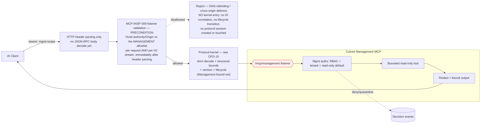
TB-7 at the listener/authz edge. No mutation tool exists (MCP-MGMT-001). Output redacted (MCP-MGMT-004).

## DFD-2 — Management MCP draft & validation (Capability A)

Crosses TB-7, TB-5. Threats: MCP-T-034, MCP-T-046, **MCP-T-031, MCP-T-055** (inbound rebinding / cross-origin — validated per request at `HV2`, `MCP-INSP-009`, **before the protocol kernel** for the same reason as DFD-1: the Origin/Host check is a precondition on connect, and the kernel's ID-correlation and lifecycle stages touch session state).

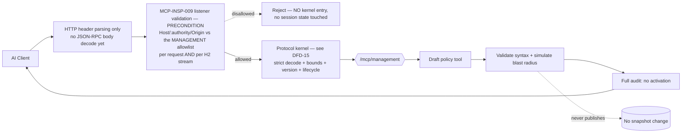
Draft/validate/simulate only; **no** activation (MCP-MGMT-001). Simulation is read-only.

## DFD-3 — Future Management MCP mutation approval (Capability A, out of scope V1)

Crosses TB-7, TB-5, TB-3. Threats: MCP-T-034, MCP-T-032, MCP-T-033.

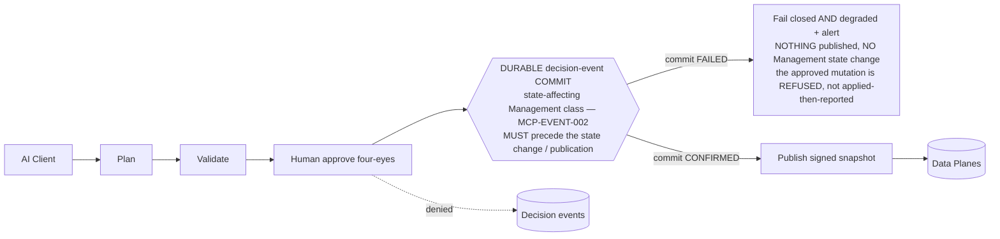
**Out of scope until plan→validate→approve→apply exists** (MCP-MGMT-001). Shown for completeness — but
**gated, because "future" is not "ungated".** This is the flow the **Future Management-Mutation Gate**
(`IMPLEMENTATION-SLICES.md`, ADR-0024 §D-13) owns, and its whole subject is the `MCP-EVENT-002`
commit-before-state-change assertion. Leaving `APPR --> PUB` direct would have documented a real mutation
path that publishes after approval **without** the assertion its own gate exists to enforce — so human
four-eyes approval is necessary but **not sufficient**: the decision event must be durably committed before
anything is published or any Management state changes.

## DFD-4 — Security Gateway tool discovery (Capability B)

Crosses TB-1, TB-2. Threats: MCP-T-011..017, MCP-T-020.

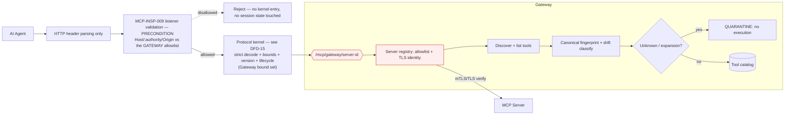
Unregistered server denied (MCP-SERVER-001); unknown tool quarantined (MCP-TOOL-006).

## DFD-5 — Security Gateway tool call (Capability B, primary path)

Crosses TB-1, TB-2. Threats: MCP-T-003..008, MCP-T-019, MCP-T-046.

```mermaid
flowchart LR
  A[AI Agent] -- bearer: aud=Culvert --> HDR5["HTTP header parsing only"] --> HV5["MCP-INSP-009 listener validation — PRECONDITION<br/>Host/:authority/Origin vs the GATEWAY allowlist"]
  HV5 -.disallowed.-> HVX5["Reject — no kernel entry, no session state touched"]
  HV5 -->|allowed| K15B["Protocol kernel — see DFD-15<br/>strict decode + bounds + version + lifecycle<br/>(Gateway bound set)"]
  K15B --> G{{/mcp/gateway/server-id}}
  subgraph Gateway
    G --> ID[Identity resolver: token+aud+resource+replay]
    ID --> II[Input inspection]
    II --> POL[Policy engine: pure, default-deny]
    POL --> DEC{Decision}
    DEC -- ALLOW-class --> CBP["Credential broker: PLAN only<br/>choose identity + scope, NO mutation"]
    DEC -- DENY/QUARANTINE/APPROVAL --> EV[(Decision events)]
    CBP --> WAL{{"DURABLE decision-event COMMIT — MCP-EVENT-002<br/>commit FAILED ⇒ CLASS-AWARE, see the arms below:<br/>critical classes fail closed and NOTHING runs;<br/>read-only/low-risk follows the configured loss policy<br/>see DFD-9"}}
    WAL -- "commit CONFIRMED" --> CB["Credential broker: MATERIALIZE<br/>mint / rotate / revoke"]
    WAL -- "commit FAILED — critical class<br/>(write / destructive / config-publication /<br/>credential / state-affecting Management)" --> FCG["Fail closed + degraded + alert<br/>no credential minted, no upstream call"]
    WAL -- "commit FAILED — read-only / low-risk:<br/>NOT unconditionally fail-closed<br/>see DFD-9 LP — the configured loss policy decides" --> LPG{"configured loss policy?<br/>mcp_{gateway,mgmt}_event_loss_policy"}
    LPG -- "degrade-and-alert AND no broker mutation needed<br/>(credential already valid from the PLAN phase)" --> LOWX["Proceed WITHOUT broker materialization<br/>degraded + alert + loss counter<br/>NOTHING minted, rotated or revoked"]
    LPG -- "degrade-and-alert BUT materialization required:<br/>minting/rotating IS the credential critical class<br/>— the low-risk policy CANNOT authorise it" --> FCG
    LPG -- "fail-closed" --> FCG
    LOWX --> CALL
    CB --> CALL[Call upstream with scoped cred]
    CALL --> OI[Output inspection]
    OI --> EV
  end
  CALL -- mTLS --> S[Approved MCP Server]
  OI --> A
  classDef tb fill:#fee,stroke:#c00;
  class G,CALL tb
```
No token passthrough (MCP-AUTH-005); credential selected **after** ALLOW (MCP-POLICY-004). **The commit gate is
class-aware, not unconditional:** a failed commit fails the operation closed for the five **critical** classes,
but a **read-only / low-risk** call follows the configured loss policy (`LPG`, mirroring DFD-9's `LP`) — under
`degrade-and-alert` it still proceeds. An unconditional `commit FAILED ⇒ fail closed` on this flow would make
`degrade-and-alert` behave as `fail-closed` for every low-risk call, since DFD-5 carries **all** ALLOW-class
traffic. DFD-6/DFD-10/DFD-11 have no such arm **by construction** — credential materialization and snapshot
publication are always critical classes.

**The degraded continuation is NON-MUTATING, and that boundary is load-bearing.** A low-risk call may proceed
after a failed commit **only** with a credential that is already valid from the non-mutating `PLAN` phase
(`LOWX`) — it **MUST NOT** reach `CB`, because `CB` performs **materialization** (mint / rotate / revoke),
which is itself the `MCP-EVENT-002` **credential critical class** and therefore requires a *confirmed* commit
(DFD-6 fails it closed unconditionally). If a low-risk call needs a fresh or rotated credential, the
materialization — **not** the low-risk call — is what the policy is being asked to authorise, and the low-risk
loss policy **cannot** authorise it: that arm fails closed. Routing `degrade-and-alert` straight into `CB`
would let broker state mutate *after* the commit failed, which is the exact failure `MCP-EVENT-002` exists to
prevent, reintroduced by the fix that restored the configured behaviour.

## DFD-6 — Credential selection (Capability B)

Crosses TB-2. Threats: MCP-T-022..025, MCP-T-005.

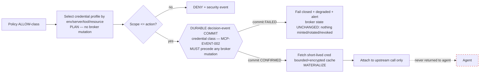
Agent never receives the credential (MCP-CRED-001); over-broad rejected (MCP-CRED-002); fail-closed on
broker failure for high-risk (MCP-CRED-006).

## DFD-7 — Input inspection (Capability B)

Crosses TB-1. Threats: MCP-T-026, MCP-T-036, MCP-T-037, MCP-T-041, MCP-T-040.

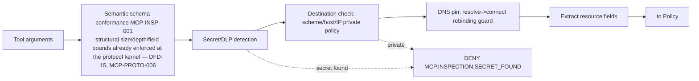
Reuses the SSRF peer-IP recheck primitive (`internal/ssrf` `Control` :126-139) — MCP-INSP-004/005.

## DFD-8 — Output inspection (Capability B)

Crosses TB-2, TB-4. Threats: MCP-T-027, MCP-T-038, MCP-T-039.

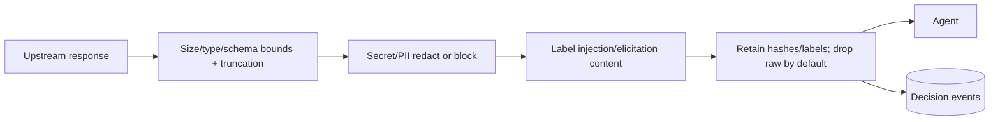
Raw output not stored by default (MCP-EVENT-003); injection labeled (MCP-INSP-007).

## DFD-9 — Decision event publication (Capability B/A)

Crosses TB-4. Threats: MCP-T-028, MCP-T-044, MCP-T-045, MCP-T-075.

```mermaid
flowchart LR
  DEC["Decision + request-side inspection<br/>NO execution yet"] --> RDX[Redact: no tokens/secrets/raw]
  RDX --> CLASSIFY{"AUTHENTICATED event,<br/>or attacker-mintable<br/>auth-failure / authz-denial?"}
  CLASSIFY -->|"attacker-mintable denial"| ADMIT[["DENIAL-LANE ADMISSION CONTROL<br/>pre-queue, attacker-rate-independent"]]
  ADMIT --> COAL["COALESCE by capability x normalized source<br/>x denial reason x window<br/>N denials ⇒ O(1) durable records<br/>count + first-seen + last-seen retained"]
  COAL --> PDEN[("P-DEN partition — own quota<br/>MUST NOT consume the P-CRIT reserve")]
  PDEN -->|"aggregate commit CONFIRMED"| INT
  PDEN -->|"aggregate commit FAILED or P-DEN quota reached"| DLD["denial-lane-degraded — LOCAL, capability-scoped<br/>+ alert + DISTINCT denial-loss counter<br/>request STILL rejected<br/>BLOCKS NO AUTHENTICATED WORK<br/>NO edge to LOSS, FC or any lockout"]
  CLASSIFY -->|"authenticated event"| Q[[Bounded queue + backpressure]]
  Q -->|"admitted (NOT yet a commit)"| SPOOL[("Mandatory local encrypted durable spool per DP<br/>P-CRIT RESERVED · P-ORD · P-DEN<br/>reclaim P-DEN → P-ORD → exported P-CRIT;<br/>UNEXPORTED P-CRIT never reclaimed")]
  SPOOL -->|"commit CONFIRMED"| GATE{Critical action class?}
  SPOOL -->|"commit FAILED: ENOSPC / fsync error / encryption-key failure"| LOSS
  GATE -->|"write / destructive"| XUP["Upstream call<br/>MCP-EVENT-002 write/destructive class"]
  GATE -->|"configuration publication"| XPUB["Snapshot SIGN → push → apply<br/>enters DFD-10 at SIGN, never earlier"]
  GATE -->|"credential issue / rotate / revoke"| XCRED["Broker MATERIALIZATION<br/>mint / rotate / revoke"]
  GATE -->|"state-affecting Management op"| XMGMT["Management state change<br/>out of V1 — ADR-0024 D-13"]
  GATE -->|"read-only / low-risk: NOT execution-gated"| XLOW["Execute read-only / low-risk call<br/>proceeds WITHOUT a commit gate<br/>see LOSS for the non-persistable case"]
  XLOW --> OUT
  XUP --> OUT["Outcome event — emitted AFTER the irreversible action<br/>NOT the fail-closed gate"]
  XPUB --> OUT
  XCRED --> OUT
  XMGMT --> OUT
  OUT --> RDXO["Redact outcome: no tokens/secrets/raw"]
  RDXO --> QO[[Bounded queue + backpressure]]
  QO -->|"admitted"| SPOOLO["Durable spool — OUTCOME lane"]
  SPOOLO -->|"commit CONFIRMED"| INT
  QO -->|"saturated"| ODEG
  SPOOLO -->|"commit FAILED"| ODEG["Degraded + alert + loss counter ONLY<br/>the operation ALREADY happened, so fail-closed is vacuous<br/>NEVER a re-execution path"]
  Q -->|"saturated"| LOSS{{"DURABILITY LOST — dispatch by event class<br/>IDENTICAL for queue saturation and spool commit failure"}}
  LOSS -->|"critical: write / destructive / config-publication /<br/>credential / state-affecting Management"| FC["Fail closed AND critical-durability-degraded + alert + loss counter<br/>the operation NEVER RUNS — commit precedes execution"]
  LOSS -->|"read-only / low-risk"| LP{"configured loss policy?<br/>mcp_{gateway,mgmt}_event_loss_policy"}
  LP -->|"degrade-and-alert"| LDEG["Degraded + alert + integrity-protected loss counter<br/>DECISION lane: the operation has NOT happened yet"]
  LDEG --> XLOW
  LP -->|"fail-closed"| FC
  FC --> SCOPE["DEGRADATION SCOPE — MAXIMUM AUTOMATIC DOMAIN:<br/>one node/DP runtime x one capability x the affected partition<br/>Mgmt and Gateway INDEPENDENT; no cross-tenant, cross-capability<br/>or cross-node propagation; NO fleet-wide escalation"]
  SCOPE --> REC{"RECOVERY PROBE — all four required:<br/>storage writable; P-CRIT reserve above recovery watermark;<br/>recovery marker COMMITTED and READ BACK;<br/>pending critical records within the safe bound"}
  REC -->|"any criterion false"| SCOPE
  REC -->|"all true"| RECOV["recovering ⇒ normal<br/>within ONE bounded probe interval"]
  SCOPE -.->|"survives process restart;<br/>corrupt metadata ⇒ stay LOCAL-degraded, never normal,<br/>never fleet-wide"| SCOPE
  INT[Integrity + replay-id + tenant tag]
  INT -. additive, async .-> EXP[Additive authorized, tenant-separated export — never a substitute]
```
**A low-risk durability loss follows the configured policy, and `degrade-and-alert` means the call still runs.** `mcp_gateway_event_loss_policy` / `mcp_mgmt_event_loss_policy` select it: under `degrade-and-alert` the degradation is recorded (alarm + integrity-protected loss counter) **and the low-risk operation proceeds** to `XLOW`; only `fail-closed` denies it. Terminating this arm at a degradation node would make `degrade-and-alert` behave as `fail-closed`, contradicting the config contract and `EVENT-MODEL` §4a. Note also that the decision-lane degradation node (`LDEG`) is **not** the outcome-lane one (`ODEG`): in the decision lane the operation has **not** happened yet, which is exactly why it can still proceed.

**The gate decides whether execution is *gated*, not whether it happens.** A committed **read-only / low-risk** decision proceeds to execution (`XLOW`) **without** being gated on the commit, and its outcome enters the outcome lane like any other — routing it straight to integrity/export would either drop every successful low-risk call or silently discard its outcome event, since DFD-5 sends **all** ALLOW-class traffic through this path. Only the **already-denied** classes terminate at `INT` without execution, because there is nothing left to run.

**`SPOOL` has NO unconditional onward edge.** Every path out of the spool is labelled: `commit CONFIRMED` reaches `GATE`, `commit FAILED` reaches `LOSS`. An unconditional `SPOOL --> INT` would let a failed commit continue to integrity/export and reach neither fail-closed nor a degraded state — which would make the dispatch below decorative.

**The lanes SPLIT BEFORE the shared queue, and that is the whole defense (`MCP-T-075`).** `CLASSIFY` is the first node after redaction, not an afterthought inside `GATE`: an **attacker-mintable** auth-failure / authz-denial never enters the authenticated queue, the shared spool path or `LOSS` at all. It is admission-controlled (`ADMIT`), **coalesced** (`COAL` — `N` equivalent denials in one bucket/window cost **O(1)** durable records while keeping a count and first/last-seen), and committed to `P-DEN`, which has its **own quota** and **cannot consume the `P-CRIT` reserve**. Its only failure terminal is `DLD`, which has **no edge to `LOSS`, `FC`, `SCOPE` or any lockout node** — an unauthenticated flood therefore exhausts **only itself**. The superseded diagram routed denial events into the same `LOSS` dispatch and out to a `DURABILITY LOCKOUT` node that blocked allowed write/high-risk operations; that made an unauthenticated actor the trigger of a fleet-wide outage, and it is deleted rather than narrowed.

**Durability loss dispatches by class, and every class has exactly one route.** Queue saturation and spool **commit failure** converge on `LOSS`, which routes the five critical classes (write, destructive, configuration publication, credential, **state-affecting Management**) to fail-closed + `critical-durability-degraded`, and read-only/low-risk to the **configured loss policy** (`LP`) — `degrade-and-alert` records the degradation and the operation **still proceeds** to `XLOW`, `fail-closed` denies it. That arm is a **policy branch, not a posture**: terminating it at a degradation node would make `degrade-and-alert` and `fail-closed` behave identically and delete a configurable contract. Omitting the Management class would leave a saturated Management state change with no route at all. `LOSS` has **no denial arm** — denials never reach it.

**Degradation is scoped, and recovery terminates.** `FC` leads to `SCOPE`, which fixes the **maximum automatic domain** at `one node/DP runtime × one capability × the affected partition`: Management and Gateway degrade independently, no node degrades another, and there is **no fleet-wide escalation edge** — broader action is a separately authorized human incident-response decision, which is why no automatic edge to one exists in this graph. `REC` is a **bounded** probe requiring **all four** exit criteria (storage writable, `P-CRIT` reserve above the recovery watermark, a recovery marker **committed and read back**, pending critical records within the safe bound); it returns to `SCOPE` while any criterion is false and reaches `normal` within one probe interval once all hold. The self-loop on `SCOPE` records **restart persistence**: the state and its scope survive a process restart, and corrupt or ambiguous recovery metadata resolves to the **narrow local** degraded state — never to `normal` (a restart bypass) and never to a fleet-wide state (the amplification this design removes).

**The gate dispatches by class, because each class has a different irreversible action** (`MCP-EVENT-002`): write/destructive → the upstream call; configuration publication → snapshot **sign/push/apply**, entering DFD-10 at `SIGN` and never earlier; credential → **broker materialization** (mint/rotate/revoke); state-affecting Management → the state change. A single edge to "upstream call" would leave publication and credential mutation ungated, since neither makes one.

**Two lanes, and they must never join.** The **decision** lane (`DEC → RDX → CLASSIFY → Q → SPOOL → GATE`) gates execution; the **outcome** lane (`XUP`/`XPUB`/`XCRED`/`XMGMT` → `OUT → RDXO → QO → SPOOLO → INT`) records what happened and **never returns to `GATE`** or to any execution node. Feeding outcome events back into the decision lane would re-enter the gate still carrying the critical action class, whose only matching edge is `EXEC` — i.e. it would re-execute the side effect, indefinitely. Outcome-lane loss is therefore **degraded + alert + loss counter only**: the operation has already happened, so fail-closed is vacuous for it, exactly as for an already-denied request. **Ordering is load-bearing:** for the critical classes the decision event is **durably committed BEFORE that class's OWN irreversible action**, so a saturated queue can still fail the operation closed. A durability check reached only *after* execution cannot fail closed at all — the side effect has already happened (`MCP-T-044`). The **outcome** event is emitted after execution and is explicitly **not** the fail-closed gate. Critical events never silently lost (MCP-EVENT-002); **not** the audit ring (`MaxRing=500`). `LOSS` has **two** branches, both authenticated: the five critical classes (write, destructive, configuration publication, credential, **state-affecting Management**) ⇒ **fail closed AND** `critical-durability-degraded`, scoped to one durability domain; **read-only / low-risk ⇒ the configured loss policy**, which is a selection between two behaviours and not a posture of its own. The **attacker-mintable** authentication-failure / authorization-denial class is **not a branch of `LOSS` at all** — it is diverted at `CLASSIFY`, before the queue, into the denial lane, and its worst outcome is `denial-lane-degraded`, which blocks nothing — EVENT-MODEL §4a/§4b, ADR-0024 §D-5.

## DFD-10 — Control Plane → Data Plane snapshot publication

Crosses TB-3, TB-5. Threats: MCP-T-047..050.

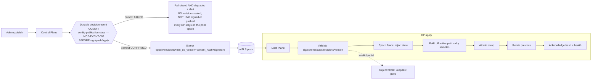
Reuses `halease`/`dpObserveEpoch` fencing; adds content_hash+signature (missing today) — MCP-CPDP-001/002. **The configuration-publication class is gated here, not on the Gateway call path:** its irreversible action is signing/pushing/applying the snapshot, so the `MCP-EVENT-002` durable commit precedes `SIGN`. Gating only "the upstream call" would have left this flow ungated entirely, since publication makes no upstream call.

## DFD-11 — Rollback

Crosses TB-3. Threats: MCP-T-047, MCP-T-048.

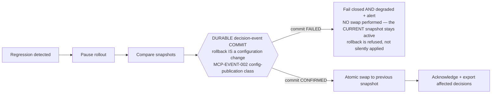
**Rollback is a configuration change, so it is gated like one.** An operator- or health-triggered rollback applies a snapshot, which is the `MCP-EVENT-002` configuration-publication class's irreversible action — so the durable commit **MUST precede the atomic swap**, and on commit failure the rollback is **refused with the current snapshot left active**, never applied-then-reported. Gating only DFD-10's forward publication would leave rollback as an ungated way to change configuration while the spool is failing.

Atomic; no partial state (MCP-HA-002); `configver` (DefaultMax=50) prior art.

## DFD-12 — Local enterprise client connectivity (Model A)

Crosses TB-1, TB-6(local). Threats: MCP-T-036, MCP-T-037, MCP-T-030, MCP-T-031/055.

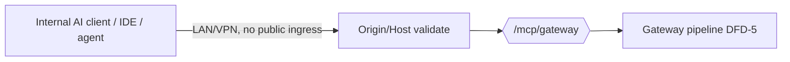
No public ingress; inbound Origin/Host validation required — enforced on this **live listener** by
**MCP-INSP-009** (PR-5), using the **MCP-INSP-008** validation primitive (PR-1). This guard is **missing
today**, and the PR-1 primitive alone does not make the listener safe.

## DFD-13 — Outbound-only connector (Model B)

Crosses TB-6. Threats: MCP-T-051, MCP-T-053, MCP-T-010.

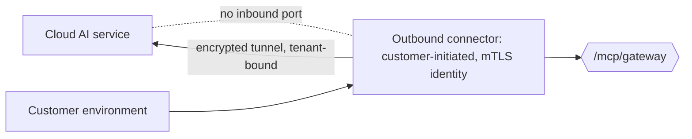
Customer initiates; no unsolicited inbound port; tenant-bound (MCP-CONNECT-001/004).

## DFD-14 — Hardened DMZ endpoint (Model C)

Crosses TB-6, TB-1. Threats: MCP-T-036, MCP-T-042, MCP-T-052, MCP-T-031.

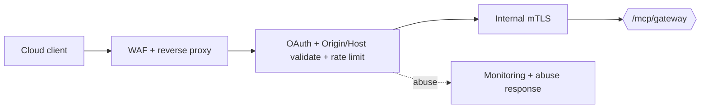
Explicit risk acceptance required (MCP-CONNECT-003); Origin/Host + rate limits mandatory — the
**listener-side** Origin/Host enforcement on this public path is **MCP-INSP-009** (Future DMZ gate;
`MCP-INSP-008` is the PR-1 validation primitive only), plus MCP-OPS-002.

## DFD-15 — Protocol-kernel decode path (Capability **A and B**, PR-1)

Crosses **TB-1, TB-7** — Gateway traffic crosses TB-1 and **Management traffic crosses TB-7**, since this kernel is on both listeners' paths. Threats: MCP-T-057..074 (parser/framing/version/protocol-state). **This is the SAME kernel for BOTH capabilities** — the config surface instantiates `MCP-PROTO-*` bounds per capability, so hostile **Management** traffic traverses strict decoding, **envelope** classification, structural bounds, version negotiation, **version-dependent method/capability admission** and the lifecycle state machine **before** reaching Management authorization or tool handling, exactly as Gateway traffic does, evaluated against the **Management** bound set. **Stage order is load-bearing twice over.** (1) `MCP-PROTO-002` requires classification **per the negotiated version**, so only the *envelope* half (request / response / notification + ID correlation) may precede `VER`; rejecting an unknown **method** or an unadvertised **capability** must happen **after** negotiation, or a valid version-specific method is refused and a version-specific one is checked against the wrong allowlist. (2) **Every inbound path now shows this kernel explicitly** — DFD-1, DFD-2 (Management) and DFD-4, DFD-5 (Gateway) each enter through `HDR → HV → K15…`, and `RECOMMENDED-ARCHITECTURE.md`'s component graph routes **both** the Management client and the Gateway agent through the protocol kernel. A caption asserting "both capabilities traverse the kernel" while the consuming diagrams drew a direct edge would have let an implementer follow either flow straight past strict decode, bounds, admission and lifecycle for one capability (round 43). DFD-1 and DFD-2 begin **downstream of this diagram for the message body only** — their `MCP-INSP-009` Origin/Host check runs **upstream of the kernel**, immediately after HTTP header parsing, because [`PROTOCOL-COMPATIBILITY.md`](PROTOCOL-COMPATIBILITY.md) §Connect makes it a **hard precondition on connect** and this kernel's `MCP-PROTO-003` correlation table and `MCP-PROTO-012` lifecycle machine **touch session state**. They are not an alternative path around the kernel; the kernel is simply not the first thing an HTTP-transport request meets. **PR-1 ships this decode
path and its test harness — but NO public/production listener** (the listener is PR-5). Requirements:
`MCP-PROTO-001..014`. No policy, credential, or upstream execution happens here. **PR-1 is
identity-agnostic:** the `MCP-PROTO-012` state machine holds an **immutable, opaque session context that
carries no resolved identity** — identity binding and the no-rebind guarantee are **`MCP-ID-008` at PR-3**,
so the **identity half of MCP-T-069 is NOT closed by this diagram**.

```mermaid
flowchart LR
  BYTES["Hostile PEER bytes (untrusted)<br/>parameterized by PEER ROLE: client-facing OR upstream-server-facing leg<br/>EITHER listener/capability — SAME kernel (MCP-PROTO-015)"] --> FRAME["Bounded transport / framing<br/>MCP-PROTO-005/006/008<br/>evaluated against THIS listener's own bound set"]
  FRAME --> DEC[Strict JSON-RPC decode<br/>single parser, no differential<br/>MCP-PROTO-001/007]
  DEC --> CLASS["ENVELOPE classification: req / resp / notif<br/>version-INDEPENDENT; ID correlation MCP-PROTO-003<br/>MCP-PROTO-002 (envelope half)"]
  CLASS --> STRUCT[Structural validation:<br/>size/depth/fields/string/number limits<br/>MCP-PROTO-006/007]
  STRUCT --> BOOT{"BOOTSTRAP admission — version-INDEPENDENT<br/>on an un-negotiated session the ONLY admissible method<br/>is the initialize handshake that SUPPLIES the version<br/>anything else is rejected BEFORE negotiation state is touched"}
  BOOT -. "un-negotiated session, method != initialize" .-> REJ
  BOOT --> VER[Protocol-version adapter<br/>allowlist + equivalence, no downgrade<br/>MCP-PROTO-010/011]
  VER --> ADMIT["METHOD / CAPABILITY admission — AFTER negotiation<br/>evaluated against the NEGOTIATED version's allowlist<br/>reject unknown methods + unadvertised capabilities/extensions<br/>MCP-PROTO-002 (version-dependent half)"]
  ADMIT --> NORM["Normalized internal message"]
  NORM --> STATE[Protocol-state machine<br/>immutable OPAQUE session context - no resolved identity<br/>lifecycle / cancellation / reconnect<br/>MCP-PROTO-012]
  STATE --> HANDOFF{{"Test harness (PR-1)<br/>/ later runtime boundary (PR-5)"}}
  FRAME -. limit exceeded / truncated .-> REJ
  DEC -. malformed / differential .-> REJ
  CLASS -. unclassifiable envelope / bad id .-> REJ
  ADMIT -. unknown method / unadvertised capability .-> REJ
  STRUCT -. over-limit .-> REJ
  VER -. unsupported version / downgrade .-> REJ
  STATE -. race / duplicate / out-of-order lifecycle .-> REJ
  REJ{{"Reject: branch by message class<br/>MCP-PROTO-013"}}
  REJ -->|request| ERR["Bounded JSON-RPC error<br/>no state leak<br/>MCP-PROTO-013"]
  REJ -->|notification| NORESP["NO wire response<br/>record rejection + loss/metric only<br/>one-way: replying would be reply amplification"]
  REJ -->|"response (uncorrelated / malformed / over-limit)"| DROP["DISCARD + record — NO wire response<br/>a reply to a response is a feedback loop<br/>free the OFFENDING MESSAGE's resources only<br/>outstanding-request entry released ONLY on trusted<br/>same-session correlation, else bounded timeout"]
  REJ -->|unclassifiable| NULLERR["At most one id:null error<br/>rate-bounded so it cannot become the amplifier"]
  ERR --> CLEAN["Deterministic cleanup<br/>UNCONDITIONAL - every class"]
  NORESP --> CLEAN
  DROP --> CLEAN
  NULLERR --> CLEAN
  classDef tb fill:#fee,stroke:#c00;
  class FRAME,DEC tb
```
Untrusted bytes are bounded and strictly decoded before any downstream stage. **Classification is split around version negotiation:** `CLASS` decides the JSON-RPC *envelope* (request / response / notification) and correlates IDs — both version-independent — while `ADMIT` rejects unknown methods and unadvertised capabilities/extensions **against the negotiated version's** allowlist, which is what `MCP-PROTO-002`'s "per the negotiated version" requires and what a single pre-negotiation classify stage could not implement. Rejection **branches by message class** (MCP-PROTO-013): a rejected **request** yields a bounded, non-leaky JSON-RPC error; a rejected **notification** yields **no wire response at all** (one-way — replying would recreate the notification-flood reply amplifier), only a recorded rejection and metric; a rejected **response** — uncorrelated, malformed or over-limit — is **discarded and recorded with no wire response** (answering a response is a feedback loop); the **offending message's** resources are freed, but an **outstanding-request entry is released only on trustworthy same-session correlation** — never on an ID lifted from the rejected message, since that would be a remote state-deletion primitive — and otherwise expires on its bounded timeout; an **unclassifiable** message yields at most one `id: null` error over a **rate-bounded** path. Deterministic cleanup is **unconditional across every class**. No hostile input may panic the kernel
(MCP-PROTO-009). **No policy/credential/upstream call exists on this path** — PR-1 is the kernel only.
The ingress is **parameterized by peer role** (client-facing vs upstream-server-facing); the `ADMIT` stage
resolves against the Culvert-reviewed [MCP-OPERATION-REGISTRY.md](MCP-OPERATION-REGISTRY.md), not the raw
negotiated-version method set. DFD-16 shows the two legs and the admission/owner branches.

## DFD-16 — Two-leg kernel & method admission (Capability **B**, PR-1)

Crosses **TB-1, TB-2**. Threats: MCP-T-076, MCP-T-077 (reverse-channel/requestor-direction state confusion; admitted-but-unpoliced dispatch). The SAME kernel decodes both the client-facing leg (TB-1) and the upstream-server-facing leg (TB-2) with **requestor-scoped** correlation; admission resolves against [MCP-OPERATION-REGISTRY.md](MCP-OPERATION-REGISTRY.md); **no reverse-channel proxying in V1**.

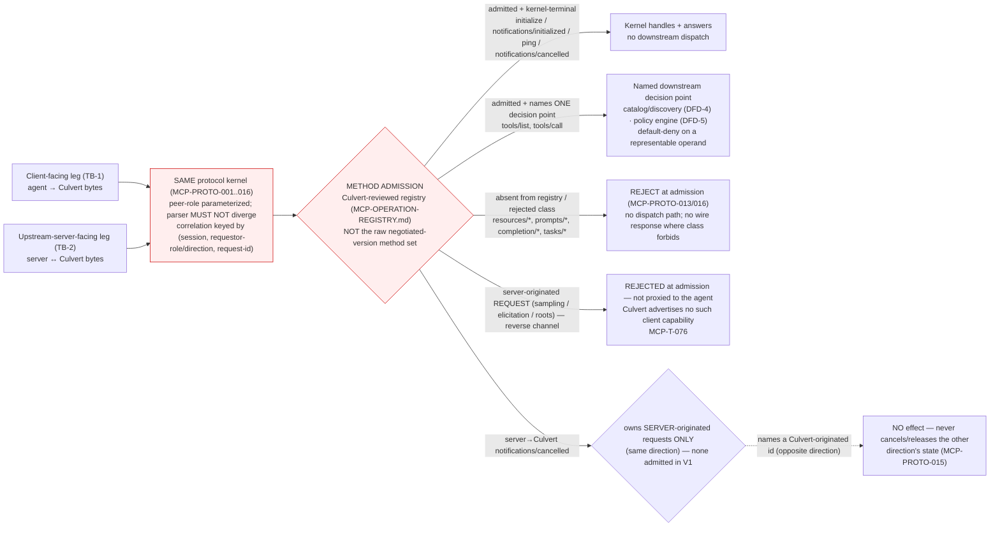

Both legs enter the **same** kernel; admission is the single choke point where a method is either
kernel-terminal, routed to exactly one named decision point, or rejected — never admitted-and-unpoliced and
never dispatched from outside the registry. A reverse-direction cancellation resolves **only** against the
same-direction outstanding set; an opposite-direction `id` match has no effect.

---

## DFD-17 — Transport rejection → terminal GET → zero stream (Capability **B**, PR-1/PR-5)

Crosses **TB-1**. Threats: MCP-T-078 (security-rejection-path legacy fallback + retained unauthenticated
stream). Shows that every security-motivated rejection is **terminal** and that the client's spec-mandated
follow-on GET is answered with **405** and allocates **zero** stream — the legacy `2024-11-05` `endpoint`
event is **not hosted**. Status/transport facts are bound to
[`TRANSPORT-FALLBACK-EVIDENCE.md`](TRANSPORT-FALLBACK-EVIDENCE.md); the sessionless absent-header ruling is
D-1 (OPEN).

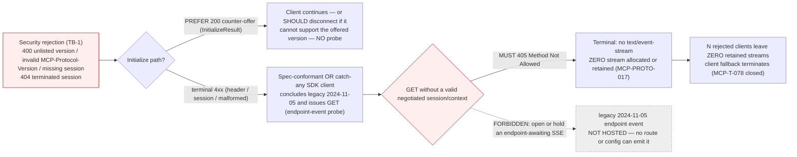

Both the initialize counter-offer and every terminal `4xx` avoid recruiting a stream: the counter-offer is
an HTTP 200 success so no probe fires, and a terminal rejection's follow-on GET is `405` with no allocation.
The forbidden dashed edge (opening or holding an `endpoint`-awaiting SSE) is the #929 vector, closed by
`MCP-PROTO-017`; the legacy endpoint event is not reachable by any route or configuration.

---

## Trust-boundary coverage summary

| DFD | Capability | Trust boundaries | Dominant threats |
|---|---|---|---|
| 1 | A (mgmt) | TB-7 | 034, 035, 010, **031, 055** |
| 2 | A (mgmt) | TB-7, TB-5 | 034, 046, **031, 055** |
| 3 | A (mgmt, future) | TB-7, TB-5, TB-3 | 034, 032, 033 |
| 4 | B (gateway) | TB-1, TB-2 | 011–017, 020 |
| 5 | B (gateway) | TB-1, TB-2 | 003–008, 019, 046 |
| 6 | B (gateway) | TB-2 | 022–025, 005 |
| 7 | B (gateway) | TB-1 | 026, 036, 037, 041, 040 |
| 8 | B (gateway) | TB-2, TB-4 | 027, 038, 039 |
| 9 | A/B | TB-4 | 028, 044, 045, 075 |
| 10 | platform | TB-3, TB-5 | 047–050 |
| 11 | platform | TB-3 | 047, 048 |
| 12 | connectivity | TB-1, TB-6 | 036, 037, 030, 031/055 |
| 13 | connectivity | TB-6 | 051, 053, 010 |
| 14 | connectivity | TB-6, TB-1 | 036, 042, 052, 031 |
| 15 | **A and B** (both listeners, PR-1 kernel) | **TB-1, TB-7** | 057–074 (parser/framing/version/state) |
| 16 | **B** (both legs, PR-1 kernel) | **TB-1, TB-2** | 076, 077 (reverse-channel/direction confusion; admitted-but-unpoliced dispatch) |
| 17 | **B** (transport rejection, PR-1/PR-5) | **TB-1** | 078 (security-rejection-path legacy fallback + retained unauthenticated stream) |

## STRIDE-divergence reconciliation (predicate-21 advisory arm)

`predicate-21` has two arms. Its **STRICT (gated)** arm proves that each DFD's own header threat/boundary
declaration equals the coverage-summary row above — those two are the **authoritative per-flow
enumeration** and are kept byte-parity-locked. Its **advisory (non-gated)** arm additionally compares each
header against the [`THREAT-MODEL.md`](THREAT-MODEL.md) §9 *"Dominant STRIDE threats"* row, which is a
**curated dominant-subset** summary — deliberately narrower than the full per-flow enumeration. A header ⊇
§9 relationship is therefore expected and is **not** a defect. This subsection adjudicates every divergence
the advisory arm reports, so none remains unexplained:

- **DFD-6 (credential selection).** Header adds `MCP-T-005` (credential-substitution) to the §9 dominant
  set `022–025`. **Intentional:** the credential-selection flow can be attacked by substitution, but §9
  lists only the dominant credential-scoping threats. Header is the authoritative superset.
- **DFD-7 (input inspection).** Header adds `MCP-T-040` to the §9 dominant set `026/036/037/041`.
  **Intentional:** `040` is an inspection-adjacent threat carried in the full flow enumeration; §9 lists the
  dominant subset.
- **DFD-12 (local enterprise client connectivity).** Header adds the inbound-rebinding pair
  `MCP-T-031/055` to the §9 dominant set `030/036/037`. **Intentional:** the local-client listener still
  crosses TB-1, where inbound rebinding applies (validated per request by `MCP-INSP-009`); §9 lists the
  connectivity-dominant subset.
- **DFD-13 (outbound-only connector, Model B).** **Corrected — this was a genuine transposition, now
  reconciled.** The connector's binding threats are the D-8 closure mapping (THREAT-MODEL §"decision→threat"
  closure: `D-8 → MCP-T-051 / MCP-T-053 / MCP-T-010`): connector compromise (`051`), cloud data-residency
  (`053`, residual R-5), and tenant-binding (`010`). The header, coverage row, **and** §9 now all read
  `051, 053, 010`. The prior `MCP-T-052` (DMZ endpoint abuse) belonged to the DMZ flow (DFD-14), not the
  connector — a connector has no unsolicited inbound port — and has been removed here.
- **DFD-14 (hardened DMZ endpoint, Model C).** **Corrected + intentional superset.** The DMZ's own
  endpoint-abuse threat is `MCP-T-052` (not the connector-compromise `MCP-T-051`), per the D-9 closure
  mapping (`D-9 → MCP-T-052 / MCP-T-031`); §9 now reads `036, 042, 052`. The header additionally carries
  `MCP-T-031` (inbound DNS-rebinding — a DMZ threat under D-9, enforced by `MCP-INSP-009`), so header ⊇ §9
  by the same intentional dominant-subset rule as DFD-6/7/12.

After this reconciliation the advisory arm reports only the three intentional header⊇§9 supersets
(DFD-6/7/12) plus DFD-14's single intentional `031` superset; DFD-13 now matches exactly. No unexplained
DFD-header vs THREAT-MODEL divergence remains.
