# MCP Data-Flow Diagrams

Fifteen numbered data-flow diagrams (DFD-1 … DFD-15) for the MCP subsystem. Each marks its **trust
boundaries** (TB-1 … TB-7 from [`THREAT-MODEL.md`](THREAT-MODEL.md)) and the dominant threats. **Status:
PR-0 design artifact (Proposed).** These are design flows; no runtime exists. Diagrams are Mermaid so they
render on GitHub and diff cleanly. Management MCP (Capability A) and the Security Gateway (Capability B)
are kept as **separate** flows. **DFD-15 (the PR-1 protocol-kernel decode path) was added by the PR-1
remediation** (`PR1-READINESS-REMEDIATION.md`, finding M-3).

Trust-boundary legend: **TB-1** agent/client↔Culvert · **TB-2** Culvert↔MCP server · **TB-3** CP↔DP ·
**TB-4** runtime↔events · **TB-5** admin↔publication · **TB-6** cloud AI↔customer network · **TB-7**
Management MCP↔control surface.

---

## DFD-1 — Management MCP read-only request (Capability A)

Crosses TB-7. Threats: MCP-T-034, MCP-T-035, MCP-T-010.

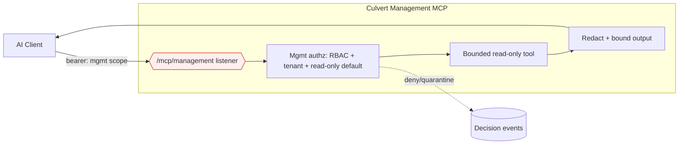
TB-7 at the listener/authz edge. No mutation tool exists (MCP-MGMT-001). Output redacted (MCP-MGMT-004).

## DFD-2 — Management MCP draft & validation (Capability A)

Crosses TB-7, TB-5. Threats: MCP-T-034, MCP-T-046.

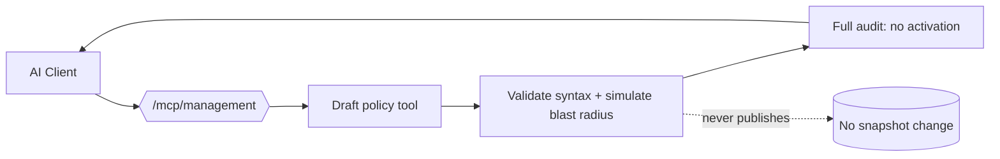
Draft/validate/simulate only; **no** activation (MCP-MGMT-001). Simulation is read-only.

## DFD-3 — Future Management MCP mutation approval (Capability A, out of scope V1)

Crosses TB-7, TB-5, TB-3. Threats: MCP-T-034, MCP-T-032, MCP-T-033.

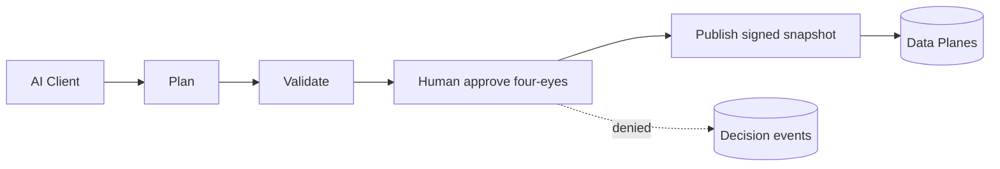
**Out of scope until plan→validate→approve→apply exists** (MCP-MGMT-001). Shown for completeness.

## DFD-4 — Security Gateway tool discovery (Capability B)

Crosses TB-1, TB-2. Threats: MCP-T-011..017, MCP-T-020.

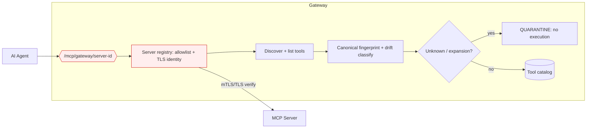
Unregistered server denied (MCP-SERVER-001); unknown tool quarantined (MCP-TOOL-006).

## DFD-5 — Security Gateway tool call (Capability B, primary path)

Crosses TB-1, TB-2. Threats: MCP-T-003..008, MCP-T-019, MCP-T-046.

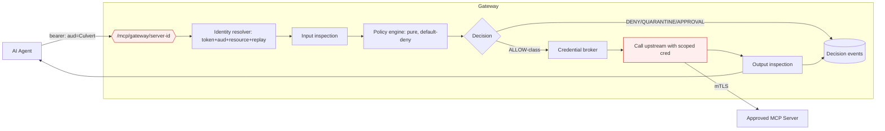
No token passthrough (MCP-AUTH-005); credential selected **after** ALLOW (MCP-POLICY-004).

## DFD-6 — Credential selection (Capability B)

Crosses TB-2. Threats: MCP-T-022..025, MCP-T-005.

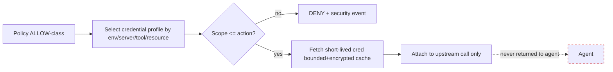
Agent never receives the credential (MCP-CRED-001); over-broad rejected (MCP-CRED-002); fail-closed on
broker failure for high-risk (MCP-CRED-006).

## DFD-7 — Input inspection (Capability B)

Crosses TB-1. Threats: MCP-T-026, MCP-T-036, MCP-T-037, MCP-T-041, MCP-T-040.

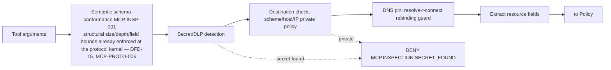
Reuses the SSRF peer-IP recheck primitive (`internal/ssrf` `Control` :126-139) — MCP-INSP-004/005.

## DFD-8 — Output inspection (Capability B)

Crosses TB-2, TB-4. Threats: MCP-T-027, MCP-T-038, MCP-T-039.

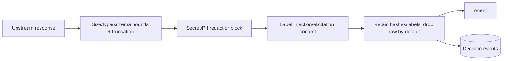
Raw output not stored by default (MCP-EVENT-003); injection labeled (MCP-INSP-007).

## DFD-9 — Decision event publication (Capability B/A)

Crosses TB-4. Threats: MCP-T-028, MCP-T-044, MCP-T-045.

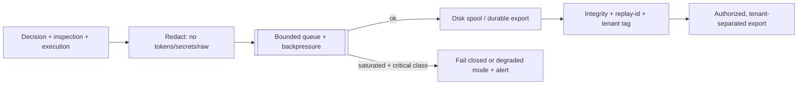
Critical events never silently lost (MCP-EVENT-002); **not** the audit ring (`MaxRing=500`).

## DFD-10 — Control Plane → Data Plane snapshot publication

Crosses TB-3, TB-5. Threats: MCP-T-047..050.

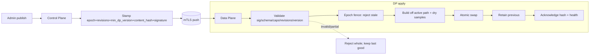
Reuses `halease`/`dpObserveEpoch` fencing; adds content_hash+signature (missing today) — MCP-CPDP-001/002.

## DFD-11 — Rollback

Crosses TB-3. Threats: MCP-T-047, MCP-T-048.

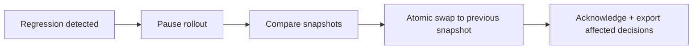
Atomic; no partial state (MCP-HA-002); `configver` (DefaultMax=50) prior art.

## DFD-12 — Local enterprise client connectivity (Model A)

Crosses TB-1, TB-6(local). Threats: MCP-T-036, MCP-T-037, MCP-T-030, MCP-T-031/055.

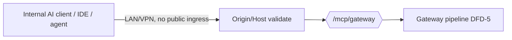
No public ingress; inbound Origin/Host validation required (MCP-INSP-008) — this guard is **missing today**.

## DFD-13 — Outbound-only connector (Model B)

Crosses TB-6. Threats: MCP-T-051, MCP-T-052, MCP-T-010.

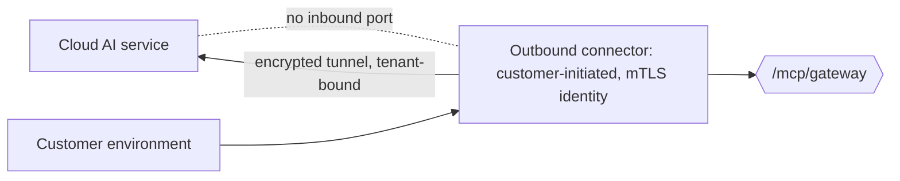
Customer initiates; no unsolicited inbound port; tenant-bound (MCP-CONNECT-001/004).

## DFD-14 — Hardened DMZ endpoint (Model C)

Crosses TB-6, TB-1. Threats: MCP-T-036, MCP-T-042, MCP-T-052, MCP-T-031.

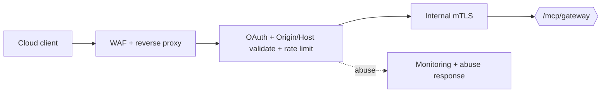
Explicit risk acceptance required (MCP-CONNECT-003); Origin/Host + rate limits mandatory (MCP-INSP-008,
MCP-OPS-002).

## DFD-15 — Protocol-kernel decode path (Capability B, PR-1)

Crosses TB-1. Threats: MCP-T-057..074 (parser/framing/version/protocol-state). **PR-1 ships this decode
path and its test harness — but NO public/production listener** (the listener is PR-5). Requirements:
`MCP-PROTO-001..013`. No policy, credential, or upstream execution happens here.

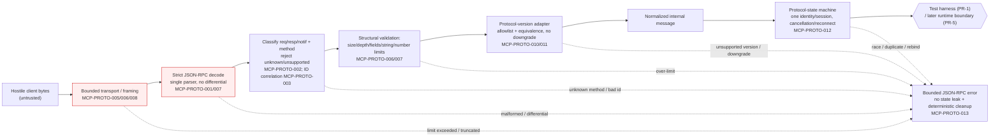
Untrusted bytes are bounded and strictly decoded before any downstream stage; every reject path yields a
bounded, non-leaky error with deterministic cleanup (MCP-PROTO-013). No hostile input may panic the kernel
(MCP-PROTO-009). **No policy/credential/upstream call exists on this path** — PR-1 is the kernel only.

---

## Trust-boundary coverage summary

| DFD | Capability | Trust boundaries | Dominant threats |
|---|---|---|---|
| 1 | A (mgmt) | TB-7 | 034, 035, 010 |
| 2 | A (mgmt) | TB-7, TB-5 | 034, 046 |
| 3 | A (mgmt, future) | TB-7, TB-5, TB-3 | 034, 032, 033 |
| 4 | B (gateway) | TB-1, TB-2 | 011–017, 020 |
| 5 | B (gateway) | TB-1, TB-2 | 003–008, 019, 046 |
| 6 | B (gateway) | TB-2 | 022–025, 005 |
| 7 | B (gateway) | TB-1 | 026, 036, 037, 041, 040 |
| 8 | B (gateway) | TB-2, TB-4 | 027, 038, 039 |
| 9 | A/B | TB-4 | 028, 044, 045 |
| 10 | platform | TB-3, TB-5 | 047–050 |
| 11 | platform | TB-3 | 047, 048 |
| 12 | connectivity | TB-1, TB-6 | 036, 037, 030, 031/055 |
| 13 | connectivity | TB-6 | 051, 052, 010 |
| 14 | connectivity | TB-6, TB-1 | 036, 042, 052, 031 |
| 15 | B (gateway, PR-1 kernel) | TB-1 | 057–074 (parser/framing/version/state) |
