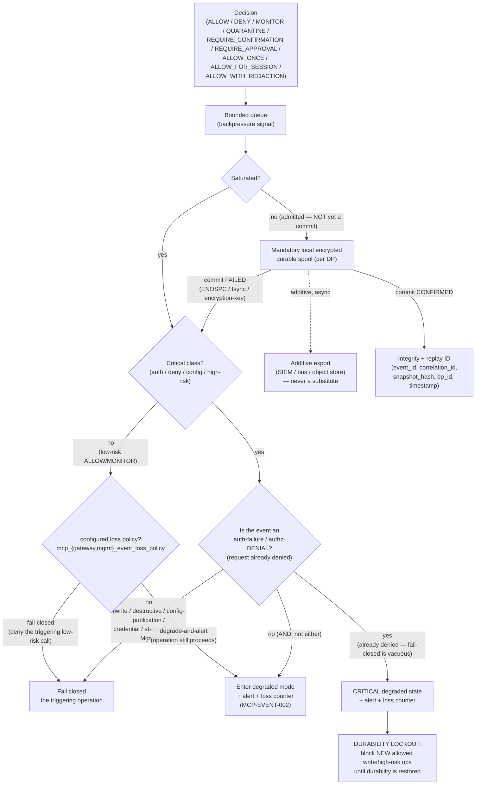

# MCP Security Gateway — Decision Event Model

Purpose: define the durable **decision-event** schema emitted by the Culvert MCP Security Gateway
(Capability B) and the Culvert Management MCP Server (Capability A) — the required field categories,
what is never stored by default, and the durability architecture (queues, backpressure, spool/export,
replay, loss policy) needed so these events function as production security evidence rather than a
debug trail. Each capability emits events into its **own** decision namespace; this document defines the
shared schema shape, not a merged event stream (see [`README.md`](README.md) doctrine: separate
enforcement engines and trust boundaries, shared conventions only).

> **Decision status — D-5 CLOSED (2026-07-24, [`ADR-0024 §D-5`](../../adr/0024-mcp-agent-security-gateway-trust-boundary.md)).**
> **Option C:** local encrypted durable spool on every relevant Data Plane, bounded queues + backpressure
> + replay IDs + pluggable asynchronous exporters; a message bus / SIEM is an **adapter**, never a
> mandatory runtime dependency. The per-action durability-unavailable semantics are fixed in **§4a** below.

**Status:** PR-0 design artifact (Proposed). No event pipeline described here is implemented; this
document is normative input to PR-8 (Durable decision events) per
[`SECURITY-REQUIREMENTS.md`](SECURITY-REQUIREMENTS.md#mcp-event--durable-decision-events) and
[`THREAT-MODEL.md`](THREAT-MODEL.md). Repository facts are cited from
[`VERIFIED-REPOSITORY-CONTEXT.md`](VERIFIED-REPOSITORY-CONTEXT.md) using the `[FACT]` legend; everything
else is `[INFER]`/`[REC]`/`[EXT]` per the PR-0 claim legend.

---

## 1. Durable decision-event categories

Every enforcement decision (Gateway) or management-capability invocation (Management MCP) emits exactly
one decision event carrying the following field categories. This table **mirrors and extends**
[BLUEPRINT.md §16](BLUEPRINT.md#16--events-audit-and-explainability): the first seven rows are the
blueprint's baseline categories; the last four (Approval, Connectivity, Deployment, Privacy) are added
here so the schema also covers human-in-the-loop actions, on-prem transport identity, deployment-path
provenance, and residency/tenancy evidence — each grounded in its own requirement family below.

| Category | Required Fields | Grounding |
|---|---|---|
| Identity | `tenant`, `subject` (principal ID), `principal_type` (human / agent / workload), `agent_id`, `client_id`, `delegation_id` / `session_id` | [MCP-ID-001..007](SECURITY-REQUIREMENTS.md#mcp-id--identity-principals--delegation) |
| Target | `server_id`, `endpoint_class`, `tool_name`, `tool_fingerprint`, `resource` (structured, minimal — see §3) | [MCP-SERVER-001..003](SECURITY-REQUIREMENTS.md#mcp-server--server-registry--tls-identity), [MCP-TOOL-001..006](SECURITY-REQUIREMENTS.md#mcp-tool--tool-catalog-fingerprint--drift) |
| Decision | `action` (one of the nine policy actions), `reason_code` (`MCP.*` taxonomy), `rule_id`, `obligations`, `approval_reference` | [MCP-POLICY-001..007](SECURITY-REQUIREMENTS.md#mcp-policy--policy-engine--decisions), [`MCP-POLICY-MODEL.md`](MCP-POLICY-MODEL.md) |
| Revisions | `policy_revision`, `catalog_revision`, `credential_revision`, `inspection_revision`, `config_epoch` | [MCP-CPDP-001](SECURITY-REQUIREMENTS.md#mcp-cpdp--mcp-ha--control-plane-data-plane--ha), [`CP-DP-HA-MODEL.md`](CP-DP-HA-MODEL.md) |
| Inspection | `input_inspection` (labels), `output_inspection` (labels), `redaction_count`, `destination_class`, `schema_result` | [MCP-INSP-001..008](SECURITY-REQUIREMENTS.md#mcp-insp--inspection-dlp--ssrf) |
| Execution | `upstream_attempted`, `upstream_status`, `latency_ms`, `bytes_in` / `bytes_out`, `retry_count` | [MCP-OPS-001..004](SECURITY-REQUIREMENTS.md#mcp-ops--operations--bounds) |
| Integrity | `event_id`, `timestamp`, `dp_id`, `snapshot_hash`, `correlation_id` | [MCP-EVENT-004, -005](SECURITY-REQUIREMENTS.md#mcp-event--durable-decision-events) |
| Approval | `approval_state` (none / pending / granted / denied / expired), `approver_subject`, `approval_method`, `approval_expiry`, `confirmation_scope` (once / session) | [MCP-POLICY-004..006](SECURITY-REQUIREMENTS.md#mcp-policy--policy-engine--decisions) (`REQUIRE_APPROVAL`/`REQUIRE_CONFIRMATION`/`ALLOW_ONCE`/`ALLOW_FOR_SESSION` obligations) |
| Connectivity | `connectivity_path` (direct / outbound-connector / dmz-endpoint), `connector_id`, `connector_cert_fingerprint`, `tenant_binding_id` | [MCP-CONNECT-001..004](SECURITY-REQUIREMENTS.md#mcp-connect--on-prem-connectivity), [`ON-PREM-CONNECTIVITY.md`](ON-PREM-CONNECTIVITY.md) |
| Deployment | `dp_version`, `minimum_dp_version_at_decision`, `deployment_mode` (shadow / canary / production), `ha_role` | [MCP-CPDP-003](SECURITY-REQUIREMENTS.md#mcp-cpdp--mcp-ha--control-plane-data-plane--ha), [MCP-HA-001..002](SECURITY-REQUIREMENTS.md#mcp-cpdp--mcp-ha--control-plane-data-plane--ha) |
| Privacy | `data_classification`, `residency_zone`, `cross_tenant_export` (bool, always false unless explicitly authorized), `retention_class` | [MCP-PRIVACY-001..003](SECURITY-REQUIREMENTS.md#mcp-privacy--data-residency--privacy) |

Field-level detail: every field in every category is **structured metadata about** a decision, never the
raw payload the decision was made about — see §3 for what is deliberately excluded.

---

## 2. Worked example: a decision event

Adapted from [BLUEPRINT.md Appendix A](BLUEPRINT.md#a-decision-event-example), extended with the
Revisions/Approval/Connectivity/Deployment/Privacy categories. No raw secrets, bearer tokens, or complete
raw tool arguments/output appear anywhere in this shape — see §3.

```json
{
  "event_id": "evt_01J8X9K7QZC3R4T5V6W7Y8Z9A0",
  "timestamp": "2026-07-24T14:02:11.483Z",
  "principal": { "type": "human", "subject": "user-123", "tenant": "acme" },
  "agent": { "id": "engineering-agent", "managed": true },
  "client_id": "copilot-enterprise",
  "delegation_id": "sess_9f2c...",
  "server_id": "github-prod",
  "tool": "repository.write_file",
  "tool_fingerprint": "sha256:2b7e1f...",
  "resource": { "repository": "KidCarmi/Culvert", "branch": "feature/x" },
  "decision": "REQUIRE_APPROVAL",
  "reason_code": "MCP.POLICY.RESOURCE_SCOPE",
  "rule_id": "MCP-GITHUB-DEV-12",
  "obligations": ["dual_control", "log_full_diff_hash_only"],
  "revisions": {
    "policy_revision": 82,
    "catalog_revision": 37,
    "credential_revision": 14,
    "inspection_revision": 6,
    "config_epoch": 5091
  },
  "inspection": {
    "input_inspection": ["schema_valid", "no_secret"],
    "output_inspection": ["redacted:1"],
    "destination_class": "internal",
    "schema_result": "valid"
  },
  "execution": {
    "upstream_attempted": false,
    "upstream_status": null,
    "latency_ms": 12,
    "retry_count": 0
  },
  "approval": {
    "approval_state": "pending",
    "approver_subject": null,
    "approval_method": "four_eyes_ui",
    "approval_expiry": "2026-07-24T14:32:11Z",
    "confirmation_scope": null,
    "approval_reference": "appr_7d1a..."
  },
  "connectivity": {
    "connectivity_path": "outbound-connector",
    "connector_id": "conn-acme-east-1",
    "connector_cert_fingerprint": "sha256:9c4f...",
    "tenant_binding_id": "tb_acme_9021"
  },
  "deployment": {
    "dp_version": "2026.7.2",
    "minimum_dp_version_at_decision": "2026.6.0",
    "deployment_mode": "canary",
    "ha_role": "active"
  },
  "privacy": {
    "data_classification": "internal",
    "residency_zone": "us-east",
    "cross_tenant_export": false,
    "retention_class": "standard-90d"
  },
  "integrity": {
    "dp_id": "dp-east-03",
    "snapshot_hash": "sha256:6a1e...",
    "correlation_id": "corr_4b2d..."
  }
}
```

Note the credential is represented only as `credential_revision` (an integer pointer into the broker's
revision history) — never a credential value, scope token, or upstream secret. The full argument
(`resource.branch`) is present because it is a **policy-relevant selector field**, not the complete raw
tool call; anything not needed to explain or replay the decision is excluded (§3).

---

## 3. Never stored by default

Per [MCP-EVENT-003](SECURITY-REQUIREMENTS.md#mcp-event--durable-decision-events), a decision event
**MUST NOT** contain the following, regardless of category:

| Never stored by default | Stored instead |
|---|---|
| Raw access tokens / bearer credentials | Token issuer, subject, and audience-validation result |
| Upstream secrets / private keys | Credential profile ID **and version** (`credential_revision`) |
| Complete raw tool-call arguments | Extracted resource, labels, hashes, and the specific policy-relevant selector fields |
| Complete raw tool output | Size, classification, redaction evidence, and an output hash |

This is a hard privacy boundary, not a redaction best-effort: a field that has not been explicitly
promoted into the schema (§1) by design **does not exist** in the event, rather than existing in
redacted form. [MCP-PRIVACY-002](SECURITY-REQUIREMENTS.md#mcp-privacy--data-residency--privacy) applies
the same non-existence rule across tenants (an event is scoped to one `tenant`, never a cross-tenant
join), and export of any event is itself an authorized, tenant-separated action (§4, `MCP-EVENT-006`).

---

## 4. Durability architecture

Production security evidence is not "logged and hoped for" — it is architected. The following elements
are **required**, each grounded in a stable requirement ID from
[`SECURITY-REQUIREMENTS.md`](SECURITY-REQUIREMENTS.md#mcp-event--durable-decision-events):

| Element | Requirement | Design intent |
|---|---|---|
| Bounded queue + backpressure | MCP-EVENT-001 | The decision path enqueues into a bounded, in-memory queue sized for burst absorption, not unbounded growth; backpressure signals (queue depth, enqueue latency) are observable before loss occurs. |
| Mandatory local encrypted durable spool (+ additive export) | MCP-EVENT-001 | Every relevant Data Plane **MUST** have a **local, encrypted, bounded, durable spool** (survives process restart); on sustained backpressure events are persisted there before being considered committed. An external durable sink (SIEM / message bus / object store) is an **additive exporter**, **never a substitute** for the local spool — the spool is required even when an exporter is configured, and export being unavailable does not by itself constitute durability. |
| Replay / correlation IDs | MCP-EVENT-004 | Every event carries a unique `event_id` plus a `correlation_id` linking related events (e.g. a `REQUIRE_APPROVAL` event and its later `approval_granted` follow-up) so an investigator or a replay tool can reconstruct a full decision sequence deterministically. |
| Explicit loss policy | MCP-EVENT-001, -002 | The system states, in advance, what happens when the bounded queue and the spool/export path are both saturated — see the CRITICAL constraint below. Silence is not an acceptable answer. |
| Degraded mode | MCP-EVENT-002 | A named, alertable state (distinct from normal operation) that the gateway enters when event durability cannot be guaranteed, so operators are not silently blind. §4a additionally defines a **critical** degraded state for a non-persistable denial event, which carries the **durability lockout** (new *allowed* write/high-risk operations blocked until durability returns) — the two states are distinct and **MUST NOT** be collapsed into one. |
| Integrity fields | MCP-EVENT-005 | `event_id`, `timestamp`, `dp_id`, `snapshot_hash`, `correlation_id` are present on every event and the event stream **SHOULD** be tamper-evident (e.g. hash-chained or append-only-store backed) so post-hoc tampering is detectable, not merely inconvenient. |
| Retention | MCP-PRIVACY-003 | Retention is a documented, per-deployment policy (`retention_class` in §1), not an implicit function of queue/disk size. |
| Tenant separation | MCP-EVENT-006, MCP-PRIVACY-002 | Events are partitioned by `tenant` at rest and in any export path; no query or export primitive may return events across tenants. |
| Export authorization | MCP-EVENT-006 | Reading or exporting the durable event stream is itself an authorized, audited action (RBAC-gated, per [`SECURITY-REQUIREMENTS.md`](SECURITY-REQUIREMENTS.md)), not an open file/API. |

### CRITICAL constraint

> Loss of authentication, deny, configuration, or high-risk decision events **MUST NOT** occur silently.
> If the durability path (bounded queue → **mandatory local encrypted spool** → additive export) cannot
> preserve such an event, the corresponding **critical write / destructive / config-publication / credential**
> operation **MUST fail closed AND** the system **MUST** enter the defined degraded mode (above) with alert
> and an integrity-protected loss counter — both, not either. This is
> [MCP-EVENT-002](SECURITY-REQUIREMENTS.md#mcp-event--durable-decision-events),
> tied to [MCP-T-044](THREAT-MODEL.md) (queue saturation / event-loss, **Critical**) in the canonical
> threat registry. A dropped `MONITOR` event on a low-risk `ALLOW` is a durability nuisance; a dropped
> `DENY`, auth-failure, config-change, or high-risk event is a security-evidence failure and must be
> treated as one architecturally, not just operationally.

---

## 4a. Durability-unavailable semantics by action class (D-5, closed)

Per [`ADR-0024 §D-5`](../../adr/0024-mcp-agent-security-gateway-trust-boundary.md), when a decision event
**cannot be durably persisted**, behavior is fixed by the class of action, not left to the moment.

> **Ordering precondition (load-bearing).** For every class whose behavior below is **fail closed**, the
> decision event **MUST be durably committed BEFORE credential use and before the upstream call**, and the
> operation runs **only** after that commit is confirmed. A fail-closed rule evaluated after execution is
> unimplementable — the side effect has already occurred and there is nothing left to deny. The **outcome**
> event is emitted separately after execution and is **not** the fail-closed gate
> ([MCP-EVENT-002](SECURITY-REQUIREMENTS.md#mcp-event--durable-decision-events), MCP-T-044).

> **The irreversible action is class-specific, and each class is gated at its own** — gating only "the upstream
> call" leaves configuration publication and credential mutation ungated, because neither makes one:
>
> | Class | Its irreversible action | Commit must precede | Absence assertion in the test |
> |---|---|---|---|
> | Write / destructive | the upstream call | the call | no upstream call occurred |
> | Configuration publication | signing / pushing / applying the snapshot | `SIGN` (DFD-10) | no revision created, nothing signed or pushed, every DP on the prior epoch |
> | Credential issue / rotate / revoke / high-risk selection | broker-side **materialization** (mint / rotate / revoke) | materialization — **planning may precede it** | broker credential state unchanged |
> | State-affecting Management operation | the state change | the change | no state change |
>
> **A confirmed commit, not an enqueue.** Queue admission is not durability: a full disk, an `fsync` error or an
> encryption-key failure is a commit FAILURE and must fail closed exactly as saturation does.


| Action class | Behavior when the decision event cannot be durably persisted |
|---|---|
| Read-only / low-risk `ALLOW` or `MONITOR` | May proceed **only** when an explicit degraded-mode policy permits it; raise a health alarm; increment an **integrity-protected loss/degradation counter**; keep retrying persistence/export within bounded budgets; **never fail silently**. |
| Write action | **Fail closed** (deny the operation) **AND** enter the defined degraded mode + alert + integrity-protected loss counter. |
| Destructive / production action | **Fail closed AND** enter degraded mode + alert + loss counter. |
| Configuration publication | **Fail closed AND** enter degraded mode + alert — do not publish a configuration change without a durable change event. |
| Credential issue / rotation / revoke / selection for a high-risk operation | **Fail closed AND** enter degraded mode + alert + loss counter. |
| State-affecting Management MCP operation | **Fail closed AND** degraded mode + alert (and out of V1 regardless — see [`ADR-0024 §D-13`](../../adr/0024-mcp-agent-security-gateway-trust-boundary.md)). |
| Authentication failure **or** authorization denial | The request is **already denied** — this is **not** relabeled as an additional "fail closed" action. If the denial event cannot be persisted, enter a **critical degraded state**, alert, increment integrity-protected loss counters, and **block new write/high-risk allowed operations until critical-event durability is restored**, unless an explicitly approved emergency policy states otherwise. |

**Required design coverage (PR-8).** The durable-event design **MUST** specify, in addition to the §4
elements: event-**ordering scope**, **deduplication**, **replay cursor**, **encryption at rest**,
**corruption recovery**, **tenant isolation**, **retention**, **disk-pressure behavior**, and
**restart/failover recovery**. (Management MCP and Gateway MCP **may** share the underlying durable event
transport only when events are separated by authorization domain, tenant, category, partitioning,
retention and query policy — [`ADR-0024 §D-13`](../../adr/0024-mcp-agent-security-gateway-trust-boundary.md)
items 4–5; two physically separate event systems are not required when logical + security isolation is
enforced and tested.)

---

## 5. Contrast with existing infrastructure — do not reuse the debug ring

`[FACT]` The repository already has several event/log sinks. None of them meets the bar in §4, and the
MCP decision-event pipeline **must not be built as an extension of the audit ring**:

| Existing primitive | Behavior | Why it is insufficient for MCP decision events |
|---|---|---|
| Audit ring (`internal/audit/audit.go`) | In-memory ring, `MaxRing = 500` (`audit.go:49`); optional JSONL rotation is **best-effort**, write errors are swallowed (`audit.go:76-108`, `:135`) | Bounded at 500 entries with silent error swallowing is the opposite of a loss policy — it is exactly the "small in-memory debug ring" [BLUEPRINT.md §16](BLUEPRINT.md#16--events-audit-and-explainability) says the MCP pipeline must be separate from or materially exceed. |
| SSE hub (`internal/sse/sse.go`) | `DefaultMaxClients = 256`; evicts slow clients (`sse.go:63-78`) | Designed to protect the server from slow consumers by dropping them — the opposite goal of preserving critical events. |
| Syslog forwarder (`internal/syslog`) | Bounded channel, `queueCap = 2048`, drop-on-full → `Drops` counter (`syslog.go:157-171`) | Explicit drop-on-full by design (correct for its purpose — a slow SIEM must cost drops, not proxy latency — but that is precisely the behavior MCP-EVENT-002 forbids for critical decision classes). |
| OTLP export (`otlp.go`) | Best-effort | No spool, no replay ID, no loss policy. |
| Request log (`internal/reqlog`) | `MaxRing = 5000` **plus** durable JSONL rotation and write-error counters | The **nearest durable primitive** in the repository today — but it still has no replay ID, no cursor/resume semantics, and no backpressure signal wired to a degraded-mode/fail-closed decision. |
| DP→CP queue | `maxPending = 1000` | A control-plane sync queue, not a decision-event durability path; same bounded-drop shape as the others. |

**Conclusion:** `[FACT]`-grounded, a durable, backpressured, replay-addressable MCP decision-event
pipeline meeting §4 **does not exist today** in the Culvert codebase. `internal/reqlog` is the closest
existing shape (bounded ring + durable rotation + error counters) and is the best **candidate to extend**
after refactoring (replay IDs, backpressure-to-degraded-mode wiring, tenant separation, export
authorization) — it is not usable as-is, and the audit ring, SSE hub, syslog forwarder, and OTLP exporter
are explicitly **not** candidates: each was designed to shed load or accept loss by contract, which is
the correct behavior for what they do and the wrong behavior for MCP-EVENT-001/002/004/005/006. PR-8
(Durable decision events) must build this pipeline; it must not grow out of `internal/audit`.

---

## 6. Decision-event flow



**Admission is not a commit.** `SAT -- no` means the event was *admitted* to the queue; the spool must still **confirm** the write. A commit failure after admission (`ENOSPC`, `fsync` error, encryption-key failure) routes into the **same** `CRIT` class decision as saturation, so it reaches the identical fail-closed / degraded / denial-lockout posture — for **both** critical-action and denial-event handling. A diagram in which `FAIL`/`DEG` are reachable only via `SAT -- yes` contradicts §4a and `MCP-EVENT-002`.

**Two distinct critical-class outcomes — do not conflate them** (§4a,
[MCP-EVENT-002](SECURITY-REQUIREMENTS.md#mcp-event--durable-decision-events),
[ADR-0024 §D-5](../../adr/0024-mcp-agent-security-gateway-trust-boundary.md),
[MCP-T-044](THREAT-MODEL.md)):

1. **Write / destructive / configuration-publication / credential / state-affecting-Management** — the
   triggering operation **fails closed AND** the system enters degraded mode with alert + integrity-protected
   loss counter. Both, never either.
2. **Authentication-failure / authorization-DENIAL** — the triggering request is **already denied**, so
   "fail closed" is **vacuous** and this case is **NOT** relabeled as fail-closed. Instead the system enters
   the **critical degraded state**, alerts, increments the loss counter, and applies a **durability
   lockout**: **new *allowed* write/high-risk operations are blocked until critical-event durability is
   restored** (unless an explicitly approved emergency policy states otherwise). Entering degraded mode
   **alone is not sufficient** — without the lockout, privileged work could continue after denial evidence
   was lost.

**The low-risk class follows the configured loss policy, and both values must have a route.** Saturation (or a
commit failure) on a low-risk `ALLOW`/`MONITOR` event always triggers degraded mode and an alert; whether it
**also blocks the underlying operation** is the operator's choice — `degrade-and-alert` lets the call proceed,
`fail-closed` denies it rather than lose its event (`mcp_gateway_event_loss_policy` /
`mcp_mgmt_event_loss_policy`, both enumerated in
[CONFIG-SURFACE-MATRIX.md](CONFIG-SURFACE-MATRIX.md)). Routing this class unconditionally to degraded-only
would make `fail-closed` unreachable in the diagram that **owns** the event model, and would contradict the
config surface's own enum. Unlike the two critical branches above, this arm is a **policy selection, not a
posture**.

---

## Related documents

- [`BLUEPRINT.md` §16](BLUEPRINT.md#16--events-audit-and-explainability) — the baseline category table
  and privacy-defaults table this document extends.
- [`SECURITY-REQUIREMENTS.md`](SECURITY-REQUIREMENTS.md#mcp-event--durable-decision-events) — normative
  MCP-EVENT-001..006 statements.
- [`THREAT-MODEL.md`](THREAT-MODEL.md) — MCP-T-044 (queue saturation / event-loss, Critical), MCP-T-045
  (audit tampering/repudiation).
- [`VERIFIED-REPOSITORY-CONTEXT.md`](VERIFIED-REPOSITORY-CONTEXT.md) — source of the `[FACT]` citations
  in §5.
- [`MCP-POLICY-MODEL.md`](MCP-POLICY-MODEL.md) — the nine policy actions and reason-code taxonomy
  referenced in §1/§2.
- [`CP-DP-HA-MODEL.md`](CP-DP-HA-MODEL.md) — snapshot revision/epoch fields referenced in the Revisions
  and Deployment categories.
- [`ON-PREM-CONNECTIVITY.md`](ON-PREM-CONNECTIVITY.md) — connector/DMZ identity fields referenced in the
  Connectivity category.
