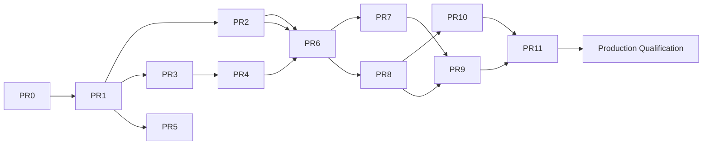

# MCP Implementation Slices

The delivery sequence: **PR-0 … PR-11, followed by a separate Production Qualification gate.** **No PR-12
exists** in this design-slice numbering — any reinstatement of a distinct connectivity/PR-12 slice is
deferred to [`OPEN-DECISIONS.md`](OPEN-DECISIONS.md) (D-12).

> **Naming note:** [`docs/operator/mcp-rollout-durable-state.md`](../../operator/mcp-rollout-durable-state.md)
> and `CLAUDE.md` separately use **"PR-12"** as the label for the later-shipped CP/DP signed-distribution
> composition + rollout-transaction work (`initMCPDistribution`, `applyMCPCapabilityEnvelope`). That is a
> reused number from a different, later sequence (the shipped-change log), not a reinstatement of the
> connectivity/shadow-canary "PR-12" slice this document rules out above — the two are unrelated pieces of
> work that happen to share a number.

**Status: PR-0 design artifact (Proposed).** This is a
plan; **no slice is implemented.** Per-slice fields: objective, scope, non-goals, trust boundary,
dependencies, security requirements, tests, acceptance criteria, rollback, owner, reviewer, release gate.

> **Editorial normalization:** the source DOCX listed connectivity adapters (PR-11) and shadow/canary
> (PR-12) as separate slices. Per the PR-0 execution instruction, shadow/canary is **PR-11**. The
> **local-listener** wiring for Model A folds into **PR-5** (dedicated listener/runtime) and CP/DP snapshot
> semantics into **PR-10**. `SOURCE REVIEW REQUIRED` for the folding.
>
> **Updated by D-8 (2026-07-24, [`ADR-0024 §D-8`](../../adr/0024-mcp-agent-security-gateway-trust-boundary.md)):**
> the **outbound connector (Model B) is NOT assigned to PR-11** and is **not** in V1 — PR-11 stays
> Shadow/Canary. The connector is a **post-V1 slice with its own design gate** (unless a human-approved
> roadmap change renumbers slices). The DMZ endpoint (Model C, D-9) is **default-off and deferred**.
> Inbound Origin/Host defence is **split**: the validation **primitive** (`MCP-INSP-008`) remains in
> **PR-1**, while the **listener-side enforcement** (`MCP-INSP-009` — bind configured interfaces, allowlist
> evaluated **per request / per H2 stream after header parsing** — never once per connection, since
> `Host`/`Origin` do not exist at socket accept — **E2E** rebinding proof **over a reused connection**) is **PR-5** for Model A / the Future DMZ gate for Model C. PR-1 binds
> no listener.

Delivery rule (BLUEPRINT §23): every slice needs a defined trust boundary, acceptance criteria, tests and
rollback. **PR-1 does not begin before PR-0 approval AND a numbered, Accepted ADR under `docs/adr/`**
(Option B — now [`docs/adr/0024`](../../adr/0024-mcp-agent-security-gateway-trust-boundary.md)).

> **PR-1 entry gate — CLOSED (2026-07-31, [`ADR-0024`](../../adr/0024-mcp-agent-security-gateway-trust-boundary.md)).**
> All four hard entry gates are complete: ADR-0024 is **`Status: Accepted`**; **D-1** (protocol-version
> baseline) is **CLOSED** (V1 baseline frozen); **D-15** (config anti-drift contract) is **CLOSED**; and the
> **repository build/test baseline is re-anchored to current `main` and recorded**. There is no ARB /
> committee ratification step in this project. **PR-1 implementation is GO** — see
> [`PR1-ENTRY-CLOSURE.md`](PR1-ENTRY-CLOSURE.md).

---

## PR-0 — Design Baseline (this package)
- **Objective:** repository-grounded design package enabling a PR-1 go/no-go.
- **Scope:** documentation under `docs/design/mcp/` only.
- **Non-goals:** any runtime/CI/config/dependency change; any listener.
- **Trust boundary:** none (documentation).
- **Dependencies:** the current repository at HEAD `c0ae2bc`.
- **Security requirements:** MCP-OPS-004 (document V1 limits).
- **Tests:** Phase 5 documentation consistency checks (no build/test executed).
- **Acceptance:** evidence-backed; two capabilities kept separate; go/no-go cleared; ADR **proposal**
  present.
- **Rollback:** delete the docs directory (no runtime effect).
- **Owner:** Staff Eng + Product Sec. **Review:** evidence-based across all lenses ([`PR0-REVIEW-CHECKLIST.md`](PR0-REVIEW-CHECKLIST.md)); no ARB / committee step.
- **Release gate:** GO-NO-GO cleared; numbered ADR accepted before PR-1.

## PR-1 — Protocol Kernel
- **Objective:** MCP parser/framing, version adapters, bounds, and a test harness — **no public listener**.
- **Scope:** an `internal/mcp/*` protocol-kernel package (**working name `internal/mcp/protocol` — `[REC]`, subject to implementation review**); inbound Origin/Host validation. **ADR-0024 §Decision item 8 ratifies the `internal/mcp/*` *namespace and boundary*, not the exact leaf-package name** — the concrete name/split stays `[REC]` in [`RECOMMENDED-ARCHITECTURE.md`](RECOMMENDED-ARCHITECTURE.md) even after ADR-0024 is Accepted.
- **Non-goals:** policy, identity, upstream calls.
- **Trust boundary:** TB-1 (agent/client ↔ Culvert).
- **Dependencies (all satisfied 2026-07-31):** PR-0 evidence review complete; **ADR-0024 Accepted**; **D-1 protocol baseline CLOSED** (V1 frozen); **repository build/test baseline re-anchored to current `main` + recorded**; **`D-15` config-surface registry integration CLOSED — implementation contract accepted**. *(All four hard PR-1 entry gates are complete — [`PR1-ENTRY-CLOSURE.md`](PR1-ENTRY-CLOSURE.md).)*
- **Config-surface ownership (`MCP-CFG-001`, `D-15`) — PR-1 owns this, deliberately.** PR-1 is the slice that builds the anti-drift wall for MCP config, **before** PR-2/PR-4/PR-8 add registry, credential and event rows behind it. Concretely PR-1 delivers: enumeration of every MCP config structure (including nested) in the parity inventory; the registry-class semantics from [`CONFIG-SURFACE-MATRIX.md`](CONFIG-SURFACE-MATRIX.md) §Registry semantics wired to real registry fields; and the anti-drift gate in [`CI-GATES.md`](CI-GATES.md) failing on **both** omission cases. Retrofitting after credential (`RC-2`) and server-registry (`RC-1`) rows exist is materially harder and leaves a live disclosure path to unenrolled peers in the interim. **Owner:** Eng — platform/config. **Approver:** Architecture **and** Product Security.
- **RPR-1 (#925/#928) additions — PR-1 owns these:** the kernel is **peer-role parameterized** (one decoder for the client-facing AND upstream-server-facing legs), correlation/cancellation state is **requestor-scoped** `(session, direction, id)` (**MCP-PROTO-015**), and admission resolves against the Culvert-reviewed **admitted-method registry** [`MCP-OPERATION-REGISTRY.md`](MCP-OPERATION-REGISTRY.md) with a **forward/reverse parity gate** (**MCP-PROTO-016**, executable as `predicates/predicate-28.py`). The registry admission + parity + protocol-state fixtures are blocking at **PR-1**; the per-method business-policy enforcement (e.g. `tools/call`) is blocking at **PR-6**.
- **RPR-4 (#929) additions — PR-1 owns the primitive, PR-5 the listener:** the transport-rejection posture (**MCP-PROTO-017**) — **no** legacy `2024-11-05` HTTP+SSE endpoint pair, a GET without a valid negotiated session/context → terminal **`405`** with **zero** stream, every security-motivated `4xx` follow-on GET terminal **`405`**, a **`200` `initialize` counter-offer preferred** over a `4xx` hard reject, and the **no-pre-negotiation-held-stream** invariant. The exclusion + terminal-status **primitive** and its legacy-negative / era-separation fixtures are blocking at **PR-1**; the **listener** held-stream / N-rejected-clients-zero-retained-streams load assertions are **PR-5**; version-set-dependent fixtures are **`D-1 BLOCKED`** (`MCP-T-078`, [`TRANSPORT-FALLBACK-EVIDENCE.md`](TRANSPORT-FALLBACK-EVIDENCE.md)).
- **Security requirements:** **MCP-PROTO-001..017** (protocol-kernel framing, structural bounds, UTF-8/Unicode identifier handling, version negotiation/adapter equivalence, protocol-lifecycle/opaque-session-context — the concrete replacement for the former undefined "protocol bounds") and **MCP-INSP-008** (the **pure Origin/Host validation primitive + test harness — NO listener**). **PR-1 binds no listener:** listener binding, configured-interface binding, host-allowlist enforcement and end-to-end rebinding are **MCP-INSP-009 at PR-5**. **`MCP-OPS-002` is NOT a PR-1 requirement** — deployed-listener/runtime bounding is **PR-5**; PR-1's parse-time bounds live in `MCP-PROTO-006/008`. **Identity is a non-goal in PR-1** — `MCP-PROTO-012` covers protocol lifecycle + an *immutable opaque* session context only; resolved-identity binding / no-rebind is **MCP-ID-008 at PR-3**.
- **Tests:** protocol-kernel fuzz (parser/framing/adapter/cancellation, panic/crash detection), race, structural-limit + parser-differential + protocol-state suite, compatibility fixtures (**D-1-gated**), inbound-rebinding, malformed JSON-RPC (all **new**; see [`TEST-TRACEABILITY-MATRIX.md`](TEST-TRACEABILITY-MATRIX.md) and [`CI-GATES.md`](CI-GATES.md)).
- **Acceptance:** no public listener; the protocol-kernel fuzz + race + structural/differential/protocol-state suites are green as **blocking PR-1 gates**; Origin/Host validated. **Compatibility conformance is green only after D-1 (protocol baseline) is externally verified and its fixtures exist — it MUST NOT be reported green before D-1 closes.**
- **Rollback:** feature-flag disabled build; no listener bound.
- **Owner:** Eng. **Reviewer:** Product Sec.
- **Release gate:** the **new blocking PR-1 protocol-kernel fuzz gate** (a bounded PR-time `go test -fuzz` wired into the Fast/Deep gate — **not** the advisory `fuzz-nightly.yml`), `-race`, and the structural/differential/protocol-state suites are green; **compatibility green only after D-1**. **CodeQL:** MCP code under `internal/mcp/**` is **already analyzed** by `codeql.yml` (its PR filter globs `internal/**`, verified at `origin/main` `2eef667`); `codeql.yml` is **not** branch-protection-required, so making it *block* MCP PRs is an optional branch-protection change, not a path-filter edit (finding M-1). See [`CI-GATES.md`](CI-GATES.md) for the gate homes; **no CI file is changed by PR-0 or this remediation**.

## PR-2 — Registry & Catalog
- **Objective:** server registration/discovery, tool fingerprints, drift classification, quarantine.
- **Scope:** `internal/mcp/registry`, `internal/mcp/catalog` [REC].
- **Non-goals:** policy decisions, execution.
- **Trust boundary:** TB-2.
- **Dependencies:** PR-1.
- **Security requirements:** MCP-SERVER-001,002,003; MCP-TOOL-001,002,003,005.
- **Tests:** canonicalization, drift fixtures, malicious/non-compliant server fixtures, identity-change.
- **Acceptance:** unknown/changed behavior deterministic and tested; unregistered denied.
- **Rollback:** registry read-only / disabled; no catalog publication.
- **Owner:** Sec/Eng. **Reviewer:** Sec Arch. **Release gate:** drift + malicious-server suites green.
- **Implementation status (code PR):** IMPLEMENTED under `internal/mcp/registry` (server identity, pinning, enable/disable, identity-change), `internal/mcp/catalog` (fingerprints, discovery ingestion, drift classification, quarantine/disabled states, immutable snapshots), and the shared leaves `internal/mcp/canonical` (strict JSON/JSON-Schema canonicalization + SHA-256) and `internal/mcp/limits` (`CatalogLimits`). Listener-independent and NOT wired into `package main` (dormant), matching the PR-1 posture. MCP-SERVER-001/002/003 and MCP-TOOL-001/002/003/005 are covered by Go tests, three fuzz targets, and a malicious/non-compliant server corpus; the MCP-TOOL-004/006 QUARANTINE **enforcement** (policy ALLOW block) remains PR-6 — PR-2 records the quarantined state only.

## PR-3 — Identity Principal
- **Objective:** human/workload/agent/client/tenant model + token/audience/resource validation.
- **Scope:** `internal/mcp/identity` [REC]; separate OAuth clients/scopes for Mgmt vs Gateway.
- **Non-goals:** reuse of SWG identity/OIDC-flow assumptions; policy.
- **Trust boundary:** TB-1.
- **Dependencies:** PR-1.
- **Security requirements:** MCP-AUTH-001..008; **MCP-ID-001..008** (`MCP-ID-008` = resolved-identity binding to a protocol session + no mid-session rebind, the identity half split out of the PR-1 `MCP-PROTO-012`).
- **Tests:** negative auth matrix, wrong-audience, wrong-resource, replay, tenant-escape, cross-session; **one resolved identity bound to one protocol session; mid-session identity rebind denied; concurrent sessions do not leak/exchange identity (MCP-ID-008)**.
- **Acceptance:** no reuse of SWG identity; negative auth matrix passes; replay defense present; **exactly one resolved identity per session, rebind denied, no cross-session identity leakage; PR-1 remains identity-agnostic (carries only the immutable opaque session context — `MCP-PROTO-012`)**.
- **Rollback:** identity module disabled → gateway denies (fail-closed).
- **Owner:** IAM/Eng. **Reviewer:** Sec Arch. **Release gate:** OAuth-negative + replay suites green.
- **Implementation status (code PR):** IMPLEMENTED under `internal/mcp/identity` (distinct principal types — Human/Workload/Agent/Client/Tenant/Server/Tool/Resource; immutable resolved context; delegation chain; capability/tenant consistency; per-session identity binding + no-rebind, `MCP-ID-001..008`), `internal/mcp/authn` (capability-specific immutable auth config; JWT and opaque-introspection validation; issuer/audience/canonical-resource/scope/time checks; cross-capability rejection, `MCP-AUTH-001..008`), `internal/mcp/senderconstraint` (DPoP proof verification + bounded per-capability partitioned proof-`jti` replay cache; mTLS `cnf.x5t#S256` thumbprint binding; fail-closed deployment profiles), and the shared leaf `internal/mcp/jose` (public-JWK parsing, asymmetric-JWS verify with an algorithm-confusion guard, RFC 7638 thumbprint) plus `internal/mcp/limits` (`AuthLimits`). Listener-independent — all request metadata, trusted keys, introspection results and TLS-binding material are explicit inputs; performs NO network I/O and is NOT wired into `package main` (dormant), matching the PR-1/PR-2 posture. Covered by the negative-auth matrix, anti-weakening tests, six fuzz targets, race/shuffle and benchmarks. Credential brokering (PR-4), listener/runtime (PR-5) and policy/tool authorization (PR-6) remain out of scope; no raw token is retained in the resolved context, errors, logs or fixtures.

## PR-4 — Credential Broker
- **Objective:** credential profiles, provider interface, rotation, scope, fail-closed semantics.
- **Scope:** `internal/mcp/credentials` [REC]; reuse `internal/secret` KEK/provider prior art.
- **Non-goals:** exposing secrets to agent/events.
- **Trust boundary:** TB-2.
- **Dependencies:** PR-3.
- **Security requirements:** MCP-CRED-001..006; MCP-AUTH-005.
- **Tests:** credential-flow, scope-mismatch, broker-failure, secret-scan, event-redaction.
- **Acceptance:** no secret in logs/events; failure policy tested; agent never holds a credential.
- **Rollback:** broker disabled → high-risk fails closed.
- **Owner:** IAM/PAM. **Reviewer:** Sec Arch. **Release gate:** secret-scan clean; fail-closed proven.
- **Implementation status (code PR):** IMPLEMENTED under `internal/mcp/credentials/{profile,provider,broker}` (`MCP-CRED-001..006`, `MCP-AUTH-005`). `profile` — opaque `ID`/`ProviderID`/`CredentialVersion`, immutable `Profile` bound to tenant/environment/`registry.ServerID`/tool/resource-scope with credential kind + power ceiling + cache/rotation/failure policy (rejects Management/unregistered/disabled/cross-tenant servers, wildcard scope, bad TTL/policy, duplicate, capacity) and copy-on-write `Store` snapshots. `provider` — narrow `Provider` interface (fetch/rotate/revoke/inspect) returning an OPAQUE `secret.Sealed` handle + non-secret `Lease`; the field codec seals plaintext and decodes into a scoped `Material` view; provider errors are sanitized to stable reasons (canary-proof). `broker` — two-phase `Plan` (pure; no provider/no plaintext) → immutable `CredentialPlan`; injected `PreMaterializationGate` invoked BEFORE any cache decrypt or provider fetch (high-risk requires durable confirmation); bounded, partitioned, TTL, deterministic-eviction, stampede-coalesced **encrypted** cache (envelopes only); scope+power validation against the plan; explicit rotation state machine (validate-before-publish, bounded grace) and immediate revocation (tombstone + cache-invalidate before provider); scoped, zeroize-on-success/error/panic materialization callback (single-use); sanitized `SafeResult`. Reuses the `internal/secret` boundary via two minimal audited additions (`NewSealed`, `MemoryProvider`) — no second secret container. Listener-independent, no network I/O, NOT wired into `package main` (dormant). No client-token passthrough (the broker consumes only the PR-3 `identity.ResolvedContext`; the provider request carries only the one-way correlation digest). Covered by the profile/plan/gate/provider/secret-containment/cache/rotation/revocation/scope-power matrices, anti-weakening mutants, five fuzz targets, benchmarks, race+shuffle, and canary scans. Listener/runtime (PR-5), policy (PR-6) and the durable event spool (PR-8) remain out of scope.

## PR-5 — Observe Runtime
- **Objective:** dedicated MCP listener, bounded pools, test/observe mode; **no SWG regression**.
- **Scope:** `internal/mcp/runtime` [REC]; separate ports for Gateway + Management; **folds connectivity
  listener wiring**.
- **Non-goals:** enforcement, upstream execution in production.
- **Trust boundary:** TB-1, TB-4.
- **Dependencies:** PR-1..PR-4.
- **Security requirements:** MCP-OPS-001,002; **MCP-INSP-009** (inbound listener: bind configured interfaces **at accept** + evaluate the host-allowlist and invoke the PR-1 `MCP-INSP-008` primitive **after header parsing on every request and every HTTP/2 stream — never once per connection**, since `Host`/`:authority`/`Origin` do not exist at socket accept + **E2E** rebinding enforcement **including connection reuse** — the listener the PR-1 Protocol Kernel deliberately did not bind).
- **Tests:** MCP-off overhead regression, load/soak/slowloris/queue bounds, streaming/reconnect, **E2E inbound-rebinding against the live listener (MCP-INSP-009)**.
- **Acceptance:** MCP disabled → no measurable SWG regression; bounds hold under load; **listener binds only configured interfaces and rejects rebinding end-to-end**.
- **Rollback:** listener disabled; runtime dormant.
- **Owner:** SRE/Eng. **Reviewer:** SRE. **Release gate:** MCP-off benchmark ≈ zero overhead.
- **Implementation status (code PR):** IMPLEMENTED under `internal/mcp/runtime` (`MCP-OPS-001/002`, `MCP-INSP-009`). Dedicated, physically + logically isolated Gateway and Management `Listener`s — each owns its own socket, TLS config, bounded worker pool + admission queue, `session.Manager`, `identity.BindingStore`, counters and shutdown state; nothing mutable is shared, so saturating one capability never degrades the other. The `pipeline` runs the ordered 15-step request path: admission → (listener: TLS/header bounds) → Host/:authority extract → **PR-1 `hostcheck` on every request AND every HTTP/2 stream** (re-checked per stream, proven end-to-end over reused H1.1 + H2 connections) → path/capability → Gateway server-id/registry resolve (`registry.Usable`) → body byte-limit → **PR-1 strict JSON-RPC decode** → version/session/lifecycle (`protocol.Negotiate` + `session.Manager`) → **PR-3 auth + sender-constraint** (`authn.ValidateJWT`/`ValidateOpaque` + `Authenticate`; the observed mTLS thumbprint is derived from the verified peer cert, never a client-supplied header; query-string/duplicate/malformed credentials rejected) → **immutable identity-session binding** (`identity.BindingStore`; a different identity on a bound session is rejected) → method admission → **observe-only disposition**. Kernel-terminal methods (initialize/ping/notifications-initialized/notifications-cancelled) complete normally; decision-point methods (tools/list, tools/call) end in a deterministic `observe_only` JSON-RPC rejection — **never** a policy call, credential materialization, upstream contact, or fabricated success. The transport contract is the frozen 2025 Streamable HTTP baseline: POST → pipeline; GET/DELETE/every other method → terminal `405` with **zero retained streams** (no legacy SSE, no held stream, no fallback); the only non-4xx transport outcome is the 200 initialize counter-offer, inside the pipeline. Every listener bound is validated BEFORE binding (unsafe/zero/negative/wildcard/conflicting address·port·resource·shared-limits fail closed); startup is transactional (both sockets bound before either serves, partial-failure rollback) and shutdown is bounded (stop admission → drain → force-close → close sockets → stop sweepers → no goroutine/timer/socket leak). Sanitized, immutable observe records flow to a bounded, non-blocking injected sink (a sink failure is advisory — it never turns a rejection into a success, never permits a decision-point op, never blocks shutdown) and never carry a token/proof/credential/raw-body/full-args/private-cert/unbounded-text value. **DISABLED BY DEFAULT:** wired into `package main` via `initMCPRuntime` as an always-disabled runtime (PR-5 ships NO enable/CLI/env surface and NO admin/UI workflow — production enablement + the admin surface are later slices); when off it binds no socket, starts no goroutine/timer, allocates nothing on the SWG path, and leaves the SWG byte-identical (MCP-off overhead benchmark ≈ zero). Covered by the config/limits-validation matrix, the transport/status matrix, live-listener H1.1 + H2 Host/Origin rebinding proofs, the auth/credential-extraction + immutable-binding matrix, registry/catalog gating, observe-disposition + no-secret-leak assertions, per-listener admission-saturation + cross-capability isolation, transactional-startup rollback, graceful-shutdown no-leak, anti-weakening mutants, three fuzz targets, and benchmarks (race + shuffle green). Upstream client/proxying, tool execution, policy (PR-6), inspection/DLP and the durable event spool (PR-8) remain out of scope.

## PR-6 — Policy Engine
- **Objective:** deterministic, I/O-free engine; nine actions; reason codes; simulator.
- **Scope:** `internal/mcp/policy` [REC]; **separate** from SWG `PolicyRule`.
- **Non-goals:** adding MCP fields to SWG PolicyRule; any network I/O during eval.
- **Trust boundary:** TB-5 (publication), decision at TB-1/TB-2.
- **Dependencies:** PR-2, PR-3.
- **Security requirements:** MCP-POLICY-001..007; MCP-TOOL-004,006.
- **Tests:** determinism/property, default-deny, action-matrix, reason-code, unknown-tool, ordering.
- **Acceptance:** pure evaluation; traceable reason codes + revisions; unknown/expansion never auto-allow.
- **Rollback:** policy set to default-deny; previous snapshot retained.
- **Owner:** Sec/Eng. **Reviewer:** Sec Arch. **Release gate:** determinism + authorization-negative green.
- **Implementation status (code PR):** IMPLEMENTED under `internal/mcp/policy` (`MCP-POLICY-001..006`, `MCP-TOOL-004/006`, `MCP-ID-005/006`) and `internal/mcp/policy/simulate`. A deterministic, **I/O-free** evaluator (`Engine.Evaluate`) over an immutable, caller-supplied `DecisionInput` tuple and an immutable, capability-local compiled `Snapshot`: it performs NO network/filesystem/database/DNS/environment/clock/secret/logging access on the evaluation path (the timestamp is an explicit `EvalTime` — never `time.Now()`; a `noio_test.go` AST wall pins the closed import allowlist and the clock-free rule) and is default-deny, bounded and safe under hostile/incomplete input. The exactly **nine** actions (ALLOW, DENY, MONITOR, QUARANTINE, REQUIRE_CONFIRMATION, REQUIRE_APPROVAL, ALLOW_ONCE, ALLOW_FOR_SESSION, ALLOW_WITH_REDACTION; zero value fails closed) carry typed reason codes + remediation + a per-action obligation matrix. **Hard security overrides run BEFORE any rule** (no first-match laundering): cross-tenant → DENY, ambiguous-identity-on-write → DENY (`MCP-ID-005`), Management mutation → hard-DENY (V1), server-identity-changed / server-disabled → DENY, unknown-tool / privilege-expansion → QUARANTINE (`MCP-TOOL-004/006`); a matched ALLOW-class rule on a destructive op is downgraded to REQUIRE_APPROVAL unless the rule explicitly opts in (bounded + audited). Gateway and Management use **completely separate namespaces** that can never cross-match (capability mismatch fails closed). The strict snapshot parser reuses `internal/mcp/canonical` (dup-key/UTF-8/trailing/depth rejection) + `DisallowUnknownFields`; the compiled snapshot carries a deterministic, key-order-independent hash; the bounded `Store` gives lock-free reads + monotonic, stale-base-rejecting publication (no history/persistence/goroutine). Two views — a runtime-safe `Decision` and an internal, bounded, sanitized `ExplainTrace` (condition ids `"field|op"`, never raw values). The **simulator reuses the EXACT same `Engine.Evaluate`** (single/corpus/old-vs-new blast-radius/shadow-relation) — no second evaluator, and it publishes/activates/executes nothing. Wired into the PR-5 `internal/mcp/runtime` as an **OPTIONAL, decision-only** provider (`Deps.Policy`; nil ⇒ the PR-5 observe-only path is byte-identical): decision-point methods (tools/list, tools/call) evaluate the capability-local snapshot and map the result to a deterministic JSON-RPC response, **never** calling an upstream MCP server, materializing a credential, contacting a provider, performing inspection/DLP, or durably committing an event — even an ALLOW-class decision returns `execution_state: not_implemented` (`policy_action` recorded, execution NOT fabricated); a missing snapshot fails closed with `MCP.POLICY.SNAPSHOT_UNAVAILABLE`. NOT wired into `package main` (dormant, same posture as the leaves). Covered by the action-matrix/default-deny/matcher/first-match/hard-override/destructive-contract/namespace-isolation/reason+revision-stamping/explain-trace/simulator-parity tests, seventeen anti-weakening tripwires, property tests (determinism, input-immutability, order-independent hash, override-unweakenable, namespace-isolation, fail-closed-on-error), three fuzz targets (parser/compiler, evaluator, glob) + a simulator bench, benchmarks (compile/eval-match/eval-no-match/hard-override/parallel/atomic-read), and race+shuffle. Inspection (PR-7), durable decision events (PR-8), the Management API/GUI (PR-9) and signed CP→DP distribution (PR-10) remain out of scope.

## PR-7 — Inspection
- **Objective:** schema/size bounds, secret/DLP, destination/SSRF, redirect, redaction.
- **Scope:** `internal/mcp/inspection` [REC]; reuse `internal/ssrf` `Control` + `internal/redaction`.
- **Implementation status (code PR):** IMPLEMENTED under `internal/mcp/inspection` (+ sub-packages `schema`, `dlp`, `destination`) implementing `MCP-INSP-001..007`. Semantic schema validation (`inspection/schema`) compiles the EXACT catalog input/output schema once into an immutable bounded representation and validates the canonical value with exact-rational numeric comparison (never `float64`) over a CLOSED V1 keyword subset (`type`/`properties`/`required`/`additionalProperties`/`enum`/`const`/`items`/`anyOf`/numeric + string bounds/`format`/array constraints); every other keyword (`$ref`, `pattern`, `patternProperties`, `oneOf`/`allOf`/`not`/`if`, …) is UNSUPPORTED and fails conservative — never silently ignored. Deterministic DLP (`inspection/dlp`) reuses the existing `internal/redaction` scrubber as the credential-shape backstop (no second scrubber) plus a bounded synthetic PII/financial corpus (Luhn-gated PAN, SSN, email, E.164) and best-effort deterministic prompt-injection labeling (instruction-override / exfiltration / policy-bypass / hidden-zero-width markers); findings carry only a classification, severity, bounded JSON-pointer path, detector id, count and a safe evidence hash — never the matched secret. Destination controls (`inspection/destination`) canonicalize URLs (rejecting userinfo, fragments, malformed ports, control chars, ambiguous percent-encoding, non-canonical numeric-IP spellings, IPv6 zones, non-ASCII hosts), classify addresses through the AUTHORITATIVE `internal/ssrf` table (no divergent private list), resolve via an INJECTED resolver into an immutable `PinnedDestination`, verify the connect-time peer against the pinned set + the real `ssrf.Control` (rebinding TOCTOU guard, MCP-INSP-005), and expose ONE shared request-local redirect guard that re-canonicalizes/re-SSRF-checks/re-pins each hop and refuses scheme downgrade, cross-origin, public→private/metadata, credential URLs and loops. The composition root (`internal/mcp/inspection`) provides immutable, capability-split Gateway/Management profiles (independent limits, dispositions, resolver, redaction profiles — nothing mutable shared), a request inspector, a bounded response-inspection seam (`InspectResponse`: structured over-limit → BLOCK, invalid/schema-invalid JSON → BLOCK, DLP on FULL content before any explicit display truncation) and the `ALLOW_WITH_REDACTION` transform (deep copy — original never mutated — re-validated against the schema, re-scanned for residual secrets, destination-scope-checked, with original/transformed canonical hashes). Immutable `InspectionLimits` (Gateway/Management independent) live in `internal/mcp/limits`; PR-7 reasons are appended to `internal/mcp/mcperr`. Wired into `internal/mcp/runtime` as an OPTIONAL, decision-only provider (`Deps.Inspection`; nil ⇒ the pre-inspection path is byte-identical): a Gateway `tools/call` is inspected BEFORE policy — a hard security failure (schema invalid, SSRF/private destination, DLP block, malformed args) blocks regardless of the PR-6 action (an ordinary ALLOW can never override it), the sanitized summary feeds `policy.DecisionInput.Inspection`, and an `ALLOW_WITH_REDACTION` decision fails closed unless a real re-validated transform is produced. Still DECISION-ONLY: NO upstream MCP call, NO credential materialization, NO broker/provider contact, NO durable event — an inspected ALLOW still returns `execution_state: not_implemented`. NOT wired into `package main` (dormant, same posture as PR-5/PR-6). Covered by schema/output/DLP/redaction/SSRF/DNS-rebinding/redirect/injection/policy-runtime tests, anti-weakening tests, property tests, six fuzz targets and benchmarks (race + shuffle green). The future upstream MCP client (which consumes the pinned destinations + redirect guard), durable decision events (PR-8), the Management API/GUI (PR-9) and CP→DP distribution (PR-10) remain out of scope.
- **Non-goals:** guaranteeing detection of every secret/injection (best-effort, residual R-2).
- **Trust boundary:** TB-1 (input), TB-2 (output).
- **Dependencies:** PR-1, PR-6.
- **Security requirements:** MCP-INSP-001..007.
- **Tests:** private-IP matrix, DNS-rebinding lab, redirect chains, synthetic-secret corpus, injection corpus, latency budget.
- **Acceptance:** abuse corpus blocked/labeled; latency within budget (design target).
- **Rollback:** inspection fail-closed for high-risk; disabled → deny high-risk.
- **Owner:** Sec/Eng. **Reviewer:** Sec Arch/Privacy. **Release gate:** SSRF + DLP suites green.

## PR-8 — Durable Decision Events
- **Status:** IMPLEMENTED — `internal/mcp/events` (`model`, `spool`, `denial`, `state`, `export`) + the
  composition-root manager, gate adapters and the OPTIONAL nil-safe `runtime` integration. All nine
  blocking `MCP-T-075` containment tests plus the per-class side-effect-absence suite are green. DORMANT:
  not wired into `package main`, decision-only, `execution_state` stays `not_implemented`.
- **Objective:** durable, backpressured, replay-addressable decision events; exporters; loss policy.
- **Scope:** `internal/mcp/events` [REC]; **not** the audit ring; may refactor from `internal/reqlog` prior art.
- **Non-goals:** reusing the 500-entry audit ring as production evidence.
- **Trust boundary:** TB-4.
- **Dependencies:** PR-6.
- **Security requirements:** MCP-EVENT-001..**007**; **MCP-OPS-005**; MCP-PRIVACY-002. *(`MCP-EVENT-007` — the isolated denial lane — and `MCP-OPS-005` — the restart-persistent, bounded, scoped degraded-state machine — are the requirements the nine `MCP-T-075` containment tests below implement. Omitting them here would let an implementer scoping from this slice treat both as unassigned despite the acceptance text demanding them.)*
- **Tests:** queue-saturation **and a distinct post-admission spool-commit-failure case** (`ENOSPC` / `fsync` error / encryption-key failure — admission is not a commit), event-durability, integrity/tamper, replay-id, export-authz, secret-scan, and the
  **nine blocking `MCP-T-075` containment tests** ([CI-GATES.md](CI-GATES.md)), headed by the **attacker test**:
  saturate the denial lane with unauthenticated auth failures and assert authenticated allowed critical work in
  another tenant/listener/capability **succeeds throughout**. These REPLACE the superseded denial-event
  durability-lockout test, which asserted the vulnerability succeeded.
  **Per-class commit-before-side-effect assertions are mandatory**: for each critical class the test MUST assert the ABSENCE OF EVERY IRREVERSIBLE ACTION DOWNSTREAM OF THAT FLOW'S COMMIT GATE — **not only the action the class is named after**, since one flow can carry two classes' side effects — write/destructive: **no upstream call occurred AND no broker-side materialization occurred** (DFD-5's `WAL` gates both, and its fail-closed node names both); configuration publication: **no new revision, nothing signed or pushed, every DP on the prior epoch**; credential: **broker state unchanged — nothing minted, rotated or revoked — AND no upstream call occurred**; state-affecting Management: **no state change AND no revision created, nothing signed or pushed, every DP on the prior epoch** (DFD-3 publishes a signed snapshot, so the state-change assertion alone passes a handler that publishes anyway). **SLICE TIMING — `state-affecting Management` has NO V1 mechanism** (ADR-0024 §D-13 defers every Management mutation to a post-V1 decision), so PR-8 can only **stub** this class; the **real-path** assertion is assigned to the ****Future Management-Mutation Gate** (IMPLEMENTATION-SLICES, D-13), which MUST NOT be marked green without it** (amendment 18's dual ownership, as for the PR-10 publication re-run). Observing fail-closed plus degraded state is NOT sufficient — an act-first implementation that reports `ENOSPC` after the side effect satisfies that and is rejected by `MCP-EVENT-002`.
- **Acceptance:** zero loss for critical classes under tested conditions (or **fail closed AND** degrade+alert), with the
  degraded state **scoped to one durability domain**, **restart-persistent** and **bounded on exit**; for a
  non-persistable auth-failure/authz-denial event, the isolated **denial lane** absorbs it and **no authenticated
  operation anywhere is blocked** — a system-wide block is a FAILING result, not a passing one.
- **Rollback:** degraded mode → fail-closed for write/high-risk.
  **Additionally: for every critical class the side effect is proven not to have occurred**, and a spool-commit failure after admission fails closed identically to saturation.
- **Owner:** SRE/Sec. **Reviewer:** Sec Arch. **Release gate:** durability-under-saturation green **+ the spool-commit-failure case green + every per-class side-effect-absence assertion green** (`MCP-EVENT-002`).

## PR-9 — API & GUI
- **Objective:** inventory, policies, simulator, approvals, health; RBAC + OpenAPI + GUI parity.
- **Scope:** `internal/mcp/adminapi` [REC] + `static/index.html` MCP panels + Management MCP access panel.
- **Non-goals:** exposing Management MCP mutation tools (read-only default).
- **Trust boundary:** TB-5, TB-7.
- **Dependencies:** PR-2..PR-8.
- **Security requirements:** MCP-POLICY-007; MCP-MGMT-001..004.
- **Tests:** RBAC parity (C1/C1.5/C2 pattern), OpenAPI coverage gate, mutation-negative, approval-UX, GUI e2e.
- **Acceptance:** RBAC + OpenAPI + GUI parity; approval dialog complete; no mutation reachable.
- **Rollback:** routes gated/removed; GUI panel hidden.
- **Owner:** Eng. **Reviewer:** API governance. **Release gate:** OpenAPI + governance gates green.
- **Implementation status (code PR):** IMPLEMENTED. Domain layer under `internal/mcp/adminapi` (inventory, decision search + historical explanation, policy validate/simulate/compare on the shared PR-6 engine, local publication workflow, health, config), `internal/mcp/approval` (four-eyes + TOCTOU state machine, commit-before-state-change, unforgeable receipt) and `internal/mcp/management` (fixed 14-tool read-only + draft/validate/simulate catalog with per-tool RBAC, independent `tools/call` re-authorization, tenant scoping, bounded/redacted output — no mutation tool). Admin HTTP surface is 14 thin `/api/mcp/*` handlers in `ui_mcp.go` with full `uiRoutes`/route-classification/OpenAPI parity (C1/C1.5/D0/route-coverage/Gate1-3 green, both route count-locks at 207), plus eight MCP SPA views in `static/index.html` (`textContent`-safe, loading/empty/error/permission states; the approval dialog shows the MCP-POLICY-007 fields and requires an explicit destructive/production confirmation; historical explanation is visibly distinct from candidate simulation). Decision-only: local policy publication reports `distribution_state: local_only`/`distribution_not_implemented`; an ALLOW-class decision still returns `execution_state: not_implemented`; durable approval/publication commit is gated on the PR-8 event manager (fail-closed while dormant). NO upstream MCP call, NO credential materialization, NO broker/provider contact, NO signed CP→DP publication, NO rollback/fencing, NO Shadow/Canary — those remain PR-10/PR-11. Node-local MCP listener config lives in a dedicated store (separate Gateway/Management, disabled defaults, no wildcard bind, no shared port, Management mutation off in V1); its export/import + restart-durability + rollback surface is a recorded follow-up. Covered by RBAC/method/tenant/no-execution HTTP tests plus domain unit/anti-weakening/property/fuzz/race suites.

## PR-10 — CP/DP & HA
- **Objective:** immutable signed snapshots (epoch + revisions + min_dp_version + content_hash + signature),
  fencing, acknowledgements, rollback; **connector snapshot semantics**.
- **Implementation status (code PR):** IMPLEMENTED under `internal/mcp/cpdp` (+ sub-packages `apply`, `publication`)
  implementing `MCP-CPDP-001..003`, `MCP-HA-001,002` and the real configuration-publication leg of
  `MCP-EVENT-002`. **D-10 CLOSED** (Ed25519; reuse of the release-catalog envelope pattern +
  `internal/mcp/canonical` + SHA-256; domain separation `culvert-mcp-snapshot-v1 || 0x00 || content_hash`;
  bounded overlapping trust roots; a snapshot never self-authorizes a carried key; scoped `Signer` with no
  raw-key getter; private key never distributed to a DP; Sigstore keyless NOT used). The core kernel is a
  leaf: an immutable **signed envelope** (schema/capability/epoch/independent config·policy·catalog·credential
  revisions/min_dp_version/content_hash/ed25519 signature) over capability-isolated Gateway/Management
  payloads (map-free, no secret-bearing field); a fail-closed `TrustStore`; a strict monotonic
  `CompatVersion` minimum-version gate; the `CheckEpoch` (non-mutating) / `CommitObservedEpoch` (ratchet)
  split; a **whole-snapshot validator** (verify → capability → isolation → epoch → revisions → min-version →
  bounds → consistency; no partial apply); a hash-bound acknowledgement; and a signed hash-bound rollback
  directive. `cpdp/apply` is the DP engine — off-path prepare with the EXACT PR-6 compiler + dry samples,
  **persist-before-swap** (`fileutil.AtomicWrite`), atomic activation, current+previous retention, and
  integrity-checked restart recovery that fails closed on corrupt metadata. `cpdp/publication` is the CP
  coordinator — reuse of the PR-9 four-eyes approval + exact candidate binding, the `globalHA` write-authority
  gate, and the PR-8 `CommitThenAct` so **sign/install/push/swap run only after a confirmed P-CRIT commit**;
  truthful distribution states derived from acknowledgements; a bounded ack tracker keyed by
  node×capability×content-hash. Wired into the existing SWG `ConfigSnapshot` channel as two OPTIONAL signed
  `*cpdp.Envelope` fields (presence semantics; **absence never wipes DP-local MCP state**; MCP disabled ⇒
  byte-identical SWG snapshot ⇒ no request-path work), applied AFTER and isolated from the SWG apply. Admin
  surface adds `GET /api/mcp/distribution` (viewer, safe fields only) + `POST /api/mcp/rollback` (admin,
  four-eyes) with full `uiRoutes`/route-classification/OpenAPI/GUI parity (route count-locks 207→**209**);
  config anti-drift registers the two envelope fields (RC-5 snapshot-meta, `kindMeta`+`AppliesOnDP`, not
  sensitive). Still DECISION-ONLY: NO upstream MCP call, NO credential materialization, NO Management
  mutation, NO Shadow/Canary — an ALLOW-class decision still returns `execution_state: not_implemented`. The
  BLOCKING PR-8 durability re-run is proven against the REAL `events.Manager` (forward: admission rejection
  AND post-admission spool-commit failure → nothing signed/installed/pushed; rollback: post-admission commit
  failure → **no swap, current snapshot retained**). Covered by signing/canonical/whole-validation/epoch/
  compat/DP-apply/ack/forward-publication/rollback/mixed-version/failover/config-parity/no-execution tests,
  anti-weakening + property tests, fuzz targets (envelope/rollback/ack/recover) and benchmarks (race+shuffle
  green). PR-11 (Shadow/Canary), connector/DMZ and upstream execution remain out of scope.
- **Scope:** MCP snapshot fields extending the CP/DP machinery; reuse `halease`/`dpObserveEpoch`/`configver`.
- **Non-goals:** DP depending on CP per call.
- **Trust boundary:** TB-3.
- **Dependencies:** PR-6, PR-8.
- **Security requirements:** MCP-CPDP-001..003; MCP-HA-001,002; **MCP-EVENT-002** (the configuration-publication commit-before-publication assertion, which PR-8 can only stub because the signed publication path does not exist until this slice).
- **Tests:** mixed-version, stale-epoch, corrupt/partial snapshot, rollback, restart/failover, **plus a re-run of the PR-8 event-durability suite against the REAL signed publication path**: with the decision event non-persistable under **BOTH** failure modes as separate cases — queue saturated **AND** a distinct post-admission spool-commit failure (`ENOSPC` / `fsync` / encryption-key); **either alone is insufficient** — assert **no new configuration revision exists, nothing was signed or pushed, and every DP remains on the prior epoch**. **Plus a separate ROLLBACK failure-injection case, because rollback's side effect is a SWAP and not a revision:** those forward-path assertions **all pass vacuously for an act-first rollback**, so the suite MUST invoke a rollback with the decision event non-persistable **under both failure modes (saturation AND spool-commit failure)** and assert **no swap occurred and the CURRENT snapshot remains active** (DFD-11, `MCP-EVENT-002`).
- **Acceptance:** whole-snapshot validation; atomic swap; rollback within SLO target; stale/corrupt rejected; **a non-persistable publication decision event leaves the configuration state byte-unchanged**.
- **Rollback:** atomic swap to previous snapshot; last-known-good served.
- **Owner:** Eng/SRE. **Reviewer:** Arch. **Release gate:** mixed-version + corrupt-snapshot + rollback green **+ the PR-8 durability re-run green against the real publication path** — this slice **MUST NOT** be marked green without it (`MCP-EVENT-002`, amendment 18: an assertion must run in a slice where the mechanism exists).

## PR-11 — Shadow & Canary
- **Objective:** rollout modes, scope controls, dashboards, rollout guardrails for the **Model A (local
  enterprise client)** deployment. *(D-8: connector/DMZ hardening is **out of PR-11** — see the post-V1
  connector slice below.)*
- **Scope:** mode ladder (Disabled→Observe→Shadow→Canary→Production) for the local-client model.
- **Non-goals:** production enablement without Production Qualification; the outbound connector (Model B, post-V1); any DMZ endpoint (Model C, default-off/deferred).
- **Trust boundary:** TB-1.
- **Dependencies:** PR-1..PR-10.
- **Security requirements:** MCP-PRIVACY-001 (DLP-before-egress); hard-fail-in-shadow set. *(Connector/DMZ requirements are **not** in PR-11: **MCP-CONNECT-001, MCP-CONNECT-002 and the connector aspect of MCP-CONNECT-004** move to **PR-C**; **MCP-CONNECT-003 and the DMZ aspect of MCP-CONNECT-004** move to the **Future DMZ Architecture & Production-Readiness Gate**. PR-11 remains Shadow/Canary for **Model A only**.)*
- **Tests:** shadow decision parity, egress DLP gate.
- **Acceptance:** production-readiness evidence complete; hard failures blocked even in Shadow.
- **Rollback:** emergency disable → Observe/Disabled; snapshot rollback.
- **Owner:** SRE/Sec. **Reviewer:** Ops Readiness. **Release gate:** rollout guardrails green.
- **Implementation status (code PR):** IMPLEMENTED, disabled by default. Engines: `internal/mcp/rollout`
  (capability-local mode ladder + one-stage-promote/multi-stage-demote transitions, immutable deterministic
  revisioned scope with stable keyed-hash percentage bucketing + exclusions-only-narrow + high-risk gate,
  one central hard-failure classifier over every `mcperr` reason with a completeness+disjointness parity
  test, `ProductionQualificationVerifier` fail-closed lockout with **no in-binary issuer**, kill switch,
  evidence windows with an injected clock, `local-client`-only connector validation); `internal/mcp/upstreamclient`
  (bounded Streamable-HTTP client reusing the PR-1 kernel + PR-7 destination pinning/redirect controls,
  registered-endpoint-only, pinned TLS identity, **no client-token passthrough**, at-most-once writes);
  `internal/mcp/execution` + a `runtime.ExecutionProvider` seam (mode-aware execution, PR-8
  commit-before-materialization/upstream, scoped broker callback + zeroization, response DLP, bounded
  allowances, real `tools/list` discovery → PR-2 catalog ingestion; a nil provider preserves the
  decision-only path byte-identically). `package main` composition: signed rollout config rides the PR-10
  CP→DP payload; isolated Gateway/Management state; emergency kill switch (narrows only); bounded
  metrics; safe status. Admin surface: 8 `/api/mcp/rollout*` + executions/upstream-health routes with full
  `uiRoutes`/route-classification/OpenAPI parity (count-locks 207→**217**) and an MCP Rollout & Execution
  SPA panel (safe rendering; explicit "Production locked — qualification required"; no generic
  Production-enable control). **Observe stays non-executing; Shadow/Canary execute only inside an exact
  approved scope for Model A; Production stays qualification-locked** (no config/env/CLI/API bypass; test
  verifier only via injection; synthetic clock windows labeled test evidence). NO Model-B connector, NO
  Model-C DMZ, NO endpoint bridge, NO transparent discovery, NO Management mutation. Production
  Qualification remains the separate gate; **there is no PR-12** in this design-slice sequence (see the
  naming note near the top of this document re: the unrelated, later-shipped "PR-12" composition work).

## PR-C (post-V1) — Outbound Connector (Model B) *(D-8 — not in V1; own design gate)*
- **Objective:** the outbound-only connector for approved cloud-AI vendors — **only** after a named vendor
  integration is verified against authoritative, date-stamped requirements.
- **Scope:** customer-initiated, tenant-bound, mTLS-identified, revocable, cert-rotating, bounded,
  observable connector; **no production upstream credentials stored/received**; DLP-before-egress.
- **Non-goals:** any V1 commitment; any claim of vendor support pre-verification; a public DMZ endpoint (D-9).
- **Trust boundary:** TB-6.
- **Dependencies:** V1 GA; a separate connector design ADR/gate.
- **Security requirements:** MCP-CONNECT-001, 002, 004 (connector tenant-binding) + MCP-PRIVACY-001. **MCP-CONNECT-003 is NOT in PR-C** — it belongs to the Future DMZ gate below.
- **Tests:** connector impersonation/rollover/replay, tenant-binding, egress DLP gate, per-vendor compatibility validation.
- **Acceptance:** named vendor validated; failure/reconnect/HA/upgrade/incident behavior proven.
- **Owner:** Net/Sec/Privacy. **Reviewer:** Arch/Privacy. **Release gate:** connector suites + vendor validation green.

## Future DMZ Architecture & Production-Readiness Gate (post-V1, not a PR slice) *(D-9 — DMZ default-off/deferred)*
- **Objective:** a hardened, publicly routable DMZ MCP endpoint (Model C) — considered **only** under a
  separate architecture + production-readiness approval with signed customer risk acceptance (ADR-0024 §D-9).
- **Non-goals:** any V1 exposure; enabling public ingress by default.
- **Security requirements:** **MCP-CONNECT-003** (OAuth/WAF/Origin-Host/rate-limit/internal-mTLS) and the
  DMZ aspect of **MCP-CONNECT-004** (tenant-bound DMZ session), plus **MCP-INSP-009** (listener-side host
  allowlist + bind-configured-interfaces + E2E rebinding enforcement).
- **Tests:** DMZ-abuse, OAuth/WAF/rate-limit, listener-side rebinding E2E.
- **Owner:** Sec Arch/Exec. **Reviewer:** Arch + Exec. **Gate:** signed risk acceptance + production-readiness approval; **not** reachable via PR-11.

## Future Management-Mutation Gate (post-V1, not a PR slice) *(D-13 — Management mutation deferred)*
- **Objective:** the first Management MCP operation that **changes state** — deferred out of V1 entirely by
  ADR-0024 §D-13 (V1 Management is read-only/draft-validate: `MCP-MGMT-001`), and admitted only under a
  separate architecture decision with plan→validate→approve→apply and four-eyes approval (DFD-3).
- **Non-goals:** any V1 mutation capability; treating a PR-8 stub as coverage of this path.
- **Security requirements:** `MCP-MGMT-001` (no mutation tool in V1) and **`MCP-EVENT-002` for the
  `state-affecting Management operation` class** — this gate **OWNS the real-path assertion**, because PR-8
  can only stub it: no Management mutation mechanism exists before this gate.
- **Tests:** the PR-8 event-durability suite **re-run against the REAL Management mutation path**, with the
  decision event non-persistable **under BOTH failure modes, each as its own case — queue saturation AND a
  distinct post-admission spool-commit failure** (`ENOSPC` / `fsync` error / encryption-key failure). **Either
  alone is insufficient**: a handler that blocks on saturation but mutates state after an `fsync` failure (or
  the reverse) would pass a one-mode gate. Assert **NO Management state change occurred AND — because DFD-3's
  irreversible action is `Publish signed snapshot` — no new configuration revision exists, nothing was signed or
  pushed, and every DP remains on the prior epoch.** The Management-state assertion **alone is insufficient**: a
  handler can leave its Management record untouched and still sign or push after `WALM` fails, passing both
  failure cases. An approved Management mutation carries the **configuration-publication** class's irreversible
  action as well as its own, and `MCP-EVENT-002` requires the absence of **every** irreversible action downstream
  of the flow's commit gate, not only the one the class is named after. Observing the returned error or degraded
  mode is NOT sufficient for either.
- **Owner:** Sec Arch. **Review:** security/architecture evidence + adversarial review (no ARB / committee step). **Gate:** this gate **MUST NOT be marked
  green without that re-run** (amendment 18 dual ownership, as for the PR-10 publication re-run); **not**
  reachable via PR-11, and **not** a Production Qualification dependency (post-GA, like PR-C and the DMZ gate).

## Production Qualification (separate gate — not a PR slice)
- **Objective:** full evidence pack + Joint Go/No-Go sign-off **for V1 (Model A) scope**.
- **Scope:** evidence aggregation across Security/Reliability/Compatibility/Operations/Privacy/Support/
  Release/Connectivity ([`ROLLOUT-AND-ROLLBACK.md`](ROLLOUT-AND-ROLLBACK.md) §6), **bounded to the V1
  feature set: connectivity Model A (`local-client`) only**.
- **Non-goals:** new features; **any evidence owned by PR-C (Model B connector) or the Future DMZ
  Architecture & Production-Readiness Gate (Model C)**.
- **Dependencies:** PR-0..PR-11. **Explicitly NOT dependent on PR-C or the Future DMZ gate** — those
  slices begin only after V1 GA, so requiring their evidence here would make GA depend on post-GA work.
- **Security requirements:** MCP-PRIVACY-003; MCP-SUPPLY-003,004; MCP-OPS-003. **Model A tenant binding is
  covered by `MCP-ID-007`** ("tenant identity MUST be bound and enforced on every call; cross-tenant access
  MUST be denied", **PR-3**, tenant-escape tests) — that is the V1 control with a V1 test/evidence chain.
  **No `MCP-CONNECT-*` requirement is V1 evidence:** `MCP-CONNECT-004` is defined for **connector/DMZ**
  sessions and gated at PR-C / the Future DMZ gate, so V1 qualification does **not** claim any aspect of it;
  **MCP-CONNECT-001/002** (+ 004 for the connector) are PR-C evidence, and **MCP-CONNECT-003** (+ 004 for the
  DMZ, plus **MCP-INSP-009**'s DMZ-facing E2E) is Future-DMZ-gate evidence.
- **Tests:** the complete taxonomy in [`TEST-TRACEABILITY-MATRIX.md`](TEST-TRACEABILITY-MATRIX.md) green
  **for rows whose Slice column is PR-0..PR-11**; rows owned by PR-C / the Future DMZ gate are **deferred,
  not waived** — they are tracked as **Missing** and block *their own* gate, never V1 GA. Signed
  SBOM/provenance verified.
- **Acceptance:** [`GO-NO-GO-CHECKLIST.md`](GO-NO-GO-CHECKLIST.md) fully cleared **at V1 scope** — its
  Connectivity and On-prem-connectivity domains are satisfied by Model A alone, and V1 GA **MUST NOT** be
  gated on connector/DMZ validation (that circularity is called out explicitly in those rows).
- **Rollback:** hold production enablement.
- **Owner:** Eng + Product + SRE. **Reviewer:** Joint Go/No-Go Board. **Release gate:** all blocking conditions cleared.

---

## Dependency graph

