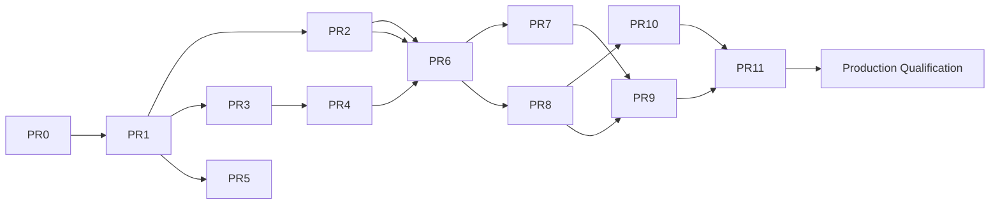

# MCP Implementation Slices

The delivery sequence: **PR-0 … PR-11, followed by a separate Production Qualification gate.** **No PR-12
exists** — any reinstatement of a distinct connectivity/PR-12 slice is deferred to
[`OPEN-DECISIONS.md`](OPEN-DECISIONS.md) (D-12). **Status: PR-0 design artifact (Proposed).** This is a
plan; **no slice is implemented.** Per-slice fields: objective, scope, non-goals, trust boundary,
dependencies, security requirements, tests, acceptance criteria, rollback, owner, reviewer, release gate.

> **Editorial normalization:** the source DOCX listed connectivity adapters (PR-11) and shadow/canary
> (PR-12) as separate slices. Per the PR-0 execution instruction, shadow/canary is **PR-11**. The
> **local-listener** wiring for Model A folds into **PR-5** (dedicated listener/runtime) and CP/DP snapshot
> semantics into **PR-10**. `SOURCE REVIEW REQUIRED` for the folding.
>
> **Updated by D-8 (2026-07-24, [`ADR-0024 §D-8`](../../adr/0024-mcp-agent-security-gateway-trust-boundary.md)):**
> the **outbound connector (Model B) is NOT assigned to PR-11** and is **not** in V1 — PR-11 stays
> Shadow/Canary. The connector is a **post-V1 slice with its own design gate** (unless a human-approved
> roadmap change renumbers slices). The DMZ endpoint (Model C, D-9) is **default-off and deferred**.
> Inbound Origin/Host defence is **split**: the validation **primitive** (`MCP-INSP-008`) remains in
> **PR-1**, while the **listener-side enforcement** (`MCP-INSP-009` — bind configured interfaces, allowlist
> evaluated **per request / per H2 stream after header parsing** — never once per connection, since
> `Host`/`Origin` do not exist at socket accept — **E2E** rebinding proof **over a reused connection**) is **PR-5** for Model A / the Future DMZ gate for Model C. PR-1 binds
> no listener.

Delivery rule (BLUEPRINT §23): every slice needs a defined trust boundary, acceptance criteria, tests and
rollback. **PR-1 does not begin before PR-0 approval AND a numbered, Accepted ADR under `docs/adr/`**
(Option B — now [`docs/adr/0024`](../../adr/0024-mcp-agent-security-gateway-trust-boundary.md)).

> **PR-1 entry gate (updated 2026-07-24, [`ADR-0024`](../../adr/0024-mcp-agent-security-gateway-trust-boundary.md)).**
> ADR-0024 is `Status: Proposed`; PR-1 also requires: **(a)** ARB + Security Architecture ratification of
> ADR-0024 (→ Accepted); **(b)** **D-1 (protocol-version baseline) externally verified and human-approved**
> — because PR-1 *is* the Protocol Kernel, D-1 **must not** be left for closure during implementation; and
> **(c)** the **repository build/test baseline run and recorded** (the PR-0 session executed neither).

---

## PR-0 — Design Baseline (this package)
- **Objective:** repository-grounded design package enabling a PR-1 go/no-go.
- **Scope:** documentation under `docs/design/mcp/` only.
- **Non-goals:** any runtime/CI/config/dependency change; any listener.
- **Trust boundary:** none (documentation).
- **Dependencies:** the current repository at HEAD `c0ae2bc`.
- **Security requirements:** MCP-OPS-004 (document V1 limits).
- **Tests:** Phase 5 documentation consistency checks (no build/test executed).
- **Acceptance:** evidence-backed; two capabilities kept separate; go/no-go cleared; ADR **proposal**
  present.
- **Rollback:** delete the docs directory (no runtime effect).
- **Owner:** Staff Eng + Product Sec. **Reviewer:** ARB + all roles ([`PR0-REVIEW-CHECKLIST.md`](PR0-REVIEW-CHECKLIST.md)).
- **Release gate:** GO-NO-GO cleared; numbered ADR accepted before PR-1.

## PR-1 — Protocol Kernel
- **Objective:** MCP parser/framing, version adapters, bounds, and a test harness — **no public listener**.
- **Scope:** an `internal/mcp/*` protocol-kernel package (**working name `internal/mcp/protocol` — `[REC]`, subject to implementation review**); inbound Origin/Host validation. **ADR-0024 §Decision item 8 ratifies the `internal/mcp/*` *namespace and boundary*, not the exact leaf-package name** — the concrete name/split stays `[REC]` in [`RECOMMENDED-ARCHITECTURE.md`](RECOMMENDED-ARCHITECTURE.md) even after ADR-0024 is Accepted.
- **Non-goals:** policy, identity, upstream calls.
- **Trust boundary:** TB-1 (agent/client ↔ Culvert).
- **Dependencies:** PR-0 approved; **ADR-0024 Accepted (ARB + Sec-Arch ratified)**; **D-1 protocol baseline externally verified + approved**; **repository build/test baseline recorded**. *(All three are hard PR-1 entry gates — [`ADR-0024` PR-1 entry gate](../../adr/0024-mcp-agent-security-gateway-trust-boundary.md).)*
- **Security requirements:** **MCP-PROTO-001..014** (protocol-kernel framing, structural bounds, UTF-8/Unicode identifier handling, version negotiation/adapter equivalence, protocol-lifecycle/opaque-session-context — the concrete replacement for the former undefined "protocol bounds") and **MCP-INSP-008** (the **pure Origin/Host validation primitive + test harness — NO listener**). **PR-1 binds no listener:** listener binding, configured-interface binding, host-allowlist enforcement and end-to-end rebinding are **MCP-INSP-009 at PR-5**. **`MCP-OPS-002` is NOT a PR-1 requirement** — deployed-listener/runtime bounding is **PR-5**; PR-1's parse-time bounds live in `MCP-PROTO-006/008`. **Identity is a non-goal in PR-1** — `MCP-PROTO-012` covers protocol lifecycle + an *immutable opaque* session context only; resolved-identity binding / no-rebind is **MCP-ID-008 at PR-3**.
- **Tests:** protocol-kernel fuzz (parser/framing/adapter/cancellation, panic/crash detection), race, structural-limit + parser-differential + protocol-state suite, compatibility fixtures (**D-1-gated**), inbound-rebinding, malformed JSON-RPC (all **new**; see [`TEST-TRACEABILITY-MATRIX.md`](TEST-TRACEABILITY-MATRIX.md) and [`CI-GATES.md`](CI-GATES.md)).
- **Acceptance:** no public listener; the protocol-kernel fuzz + race + structural/differential/protocol-state suites are green as **blocking PR-1 gates**; Origin/Host validated. **Compatibility conformance is green only after D-1 (protocol baseline) is externally verified and its fixtures exist — it MUST NOT be reported green before D-1 closes.**
- **Rollback:** feature-flag disabled build; no listener bound.
- **Owner:** Eng. **Reviewer:** Product Sec.
- **Release gate:** the **new blocking PR-1 protocol-kernel fuzz gate** (a bounded PR-time `go test -fuzz` wired into the Fast/Deep gate — **not** the advisory `fuzz-nightly.yml`), `-race`, and the structural/differential/protocol-state suites are green; **compatibility green only after D-1**. **CodeQL:** MCP code under `internal/mcp/**` is **already analyzed** by `codeql.yml` (its PR filter globs `internal/**`, verified at `origin/main` `2eef667`); `codeql.yml` is **not** branch-protection-required, so making it *block* MCP PRs is an optional branch-protection change, not a path-filter edit (finding M-1). See [`CI-GATES.md`](CI-GATES.md) for the gate homes; **no CI file is changed by PR-0 or this remediation**.

## PR-2 — Registry & Catalog
- **Objective:** server registration/discovery, tool fingerprints, drift classification, quarantine.
- **Scope:** `internal/mcp/registry`, `internal/mcp/catalog` [REC].
- **Non-goals:** policy decisions, execution.
- **Trust boundary:** TB-2.
- **Dependencies:** PR-1.
- **Security requirements:** MCP-SERVER-001,002,003; MCP-TOOL-001,002,003,005.
- **Tests:** canonicalization, drift fixtures, malicious/non-compliant server fixtures, identity-change.
- **Acceptance:** unknown/changed behavior deterministic and tested; unregistered denied.
- **Rollback:** registry read-only / disabled; no catalog publication.
- **Owner:** Sec/Eng. **Reviewer:** Sec Arch. **Release gate:** drift + malicious-server suites green.

## PR-3 — Identity Principal
- **Objective:** human/workload/agent/client/tenant model + token/audience/resource validation.
- **Scope:** `internal/mcp/identity` [REC]; separate OAuth clients/scopes for Mgmt vs Gateway.
- **Non-goals:** reuse of SWG identity/OIDC-flow assumptions; policy.
- **Trust boundary:** TB-1.
- **Dependencies:** PR-1.
- **Security requirements:** MCP-AUTH-001..008; **MCP-ID-001..008** (`MCP-ID-008` = resolved-identity binding to a protocol session + no mid-session rebind, the identity half split out of the PR-1 `MCP-PROTO-012`).
- **Tests:** negative auth matrix, wrong-audience, wrong-resource, replay, tenant-escape, cross-session; **one resolved identity bound to one protocol session; mid-session identity rebind denied; concurrent sessions do not leak/exchange identity (MCP-ID-008)**.
- **Acceptance:** no reuse of SWG identity; negative auth matrix passes; replay defense present; **exactly one resolved identity per session, rebind denied, no cross-session identity leakage; PR-1 remains identity-agnostic (carries only the immutable opaque session context — `MCP-PROTO-012`)**.
- **Rollback:** identity module disabled → gateway denies (fail-closed).
- **Owner:** IAM/Eng. **Reviewer:** Sec Arch. **Release gate:** OAuth-negative + replay suites green.

## PR-4 — Credential Broker
- **Objective:** credential profiles, provider interface, rotation, scope, fail-closed semantics.
- **Scope:** `internal/mcp/credentials` [REC]; reuse `internal/secret` KEK/provider prior art.
- **Non-goals:** exposing secrets to agent/events.
- **Trust boundary:** TB-2.
- **Dependencies:** PR-3.
- **Security requirements:** MCP-CRED-001..006; MCP-AUTH-005.
- **Tests:** credential-flow, scope-mismatch, broker-failure, secret-scan, event-redaction.
- **Acceptance:** no secret in logs/events; failure policy tested; agent never holds a credential.
- **Rollback:** broker disabled → high-risk fails closed.
- **Owner:** IAM/PAM. **Reviewer:** Sec Arch. **Release gate:** secret-scan clean; fail-closed proven.

## PR-5 — Observe Runtime
- **Objective:** dedicated MCP listener, bounded pools, test/observe mode; **no SWG regression**.
- **Scope:** `internal/mcp/runtime` [REC]; separate ports for Gateway + Management; **folds connectivity
  listener wiring**.
- **Non-goals:** enforcement, upstream execution in production.
- **Trust boundary:** TB-1, TB-4.
- **Dependencies:** PR-1..PR-4.
- **Security requirements:** MCP-OPS-001,002; **MCP-INSP-009** (inbound listener: bind configured interfaces **at accept** + evaluate the host-allowlist and invoke the PR-1 `MCP-INSP-008` primitive **after header parsing on every request and every HTTP/2 stream — never once per connection**, since `Host`/`:authority`/`Origin` do not exist at socket accept + **E2E** rebinding enforcement **including connection reuse** — the listener the PR-1 Protocol Kernel deliberately did not bind).
- **Tests:** MCP-off overhead regression, load/soak/slowloris/queue bounds, streaming/reconnect, **E2E inbound-rebinding against the live listener (MCP-INSP-009)**.
- **Acceptance:** MCP disabled → no measurable SWG regression; bounds hold under load; **listener binds only configured interfaces and rejects rebinding end-to-end**.
- **Rollback:** listener disabled; runtime dormant.
- **Owner:** SRE/Eng. **Reviewer:** SRE. **Release gate:** MCP-off benchmark ≈ zero overhead.

## PR-6 — Policy Engine
- **Objective:** deterministic, I/O-free engine; nine actions; reason codes; simulator.
- **Scope:** `internal/mcp/policy` [REC]; **separate** from SWG `PolicyRule`.
- **Non-goals:** adding MCP fields to SWG PolicyRule; any network I/O during eval.
- **Trust boundary:** TB-5 (publication), decision at TB-1/TB-2.
- **Dependencies:** PR-2, PR-3.
- **Security requirements:** MCP-POLICY-001..007; MCP-TOOL-004,006.
- **Tests:** determinism/property, default-deny, action-matrix, reason-code, unknown-tool, ordering.
- **Acceptance:** pure evaluation; traceable reason codes + revisions; unknown/expansion never auto-allow.
- **Rollback:** policy set to default-deny; previous snapshot retained.
- **Owner:** Sec/Eng. **Reviewer:** Sec Arch. **Release gate:** determinism + authorization-negative green.

## PR-7 — Inspection
- **Objective:** schema/size bounds, secret/DLP, destination/SSRF, redirect, redaction.
- **Scope:** `internal/mcp/inspection` [REC]; reuse `internal/ssrf` `Control` + `internal/redaction`.
- **Non-goals:** guaranteeing detection of every secret/injection (best-effort, residual R-2).
- **Trust boundary:** TB-1 (input), TB-2 (output).
- **Dependencies:** PR-1, PR-6.
- **Security requirements:** MCP-INSP-001..007.
- **Tests:** private-IP matrix, DNS-rebinding lab, redirect chains, synthetic-secret corpus, injection corpus, latency budget.
- **Acceptance:** abuse corpus blocked/labeled; latency within budget (design target).
- **Rollback:** inspection fail-closed for high-risk; disabled → deny high-risk.
- **Owner:** Sec/Eng. **Reviewer:** Sec Arch/Privacy. **Release gate:** SSRF + DLP suites green.

## PR-8 — Durable Decision Events
- **Objective:** durable, backpressured, replay-addressable decision events; exporters; loss policy.
- **Scope:** `internal/mcp/events` [REC]; **not** the audit ring; may refactor from `internal/reqlog` prior art.
- **Non-goals:** reusing the 500-entry audit ring as production evidence.
- **Trust boundary:** TB-4.
- **Dependencies:** PR-6.
- **Security requirements:** MCP-EVENT-001..006; MCP-PRIVACY-002.
- **Tests:** queue-saturation **and a distinct post-admission spool-commit-failure case** (`ENOSPC` / `fsync` error / encryption-key failure — admission is not a commit), event-durability, integrity/tamper, replay-id, export-authz, secret-scan, and the
  **denial-event durability-lockout** test (drop a denial event under saturation; assert the critical degraded state
  **and** that a subsequent *allowed* write/high-risk operation is blocked until durability returns).
  **Per-class commit-before-side-effect assertions are mandatory**: for each critical class the test MUST assert the ABSENCE OF THAT CLASS'S OWN side effect — write/destructive: **no upstream call occurred**; configuration publication: **no new revision, nothing signed or pushed, every DP on the prior epoch**; credential: **broker state unchanged — nothing minted, rotated or revoked**; state-affecting Management: **no state change**. **SLICE TIMING — `state-affecting Management` has NO V1 mechanism** (ADR-0024 §D-13 defers every Management mutation to a post-V1 decision), so PR-8 can only **stub** this class; the **real-path** assertion is assigned to the ****Future Management-Mutation Gate** (IMPLEMENTATION-SLICES, D-13), which MUST NOT be marked green without it** (amendment 18's dual ownership, as for the PR-10 publication re-run). Observing fail-closed plus degraded state is NOT sufficient — an act-first implementation that reports `ENOSPC` after the side effect satisfies that and is rejected by `MCP-EVENT-002`.
- **Acceptance:** zero loss for critical classes under tested conditions (or **fail closed AND** degrade+alert); for a
  non-persistable auth-failure/authz-denial event, the **critical degraded state + durability lockout** is observed —
  fail-closed-plus-alert alone does **not** satisfy this slice.
- **Rollback:** degraded mode → fail-closed for write/high-risk.
  **Additionally: for every critical class the side effect is proven not to have occurred**, and a spool-commit failure after admission fails closed identically to saturation.
- **Owner:** SRE/Sec. **Reviewer:** Sec Arch. **Release gate:** durability-under-saturation green **+ the spool-commit-failure case green + every per-class side-effect-absence assertion green** (`MCP-EVENT-002`).

## PR-9 — API & GUI
- **Objective:** inventory, policies, simulator, approvals, health; RBAC + OpenAPI + GUI parity.
- **Scope:** `internal/mcp/adminapi` [REC] + `static/index.html` MCP panels + Management MCP access panel.
- **Non-goals:** exposing Management MCP mutation tools (read-only default).
- **Trust boundary:** TB-5, TB-7.
- **Dependencies:** PR-2..PR-8.
- **Security requirements:** MCP-POLICY-007; MCP-MGMT-001..004.
- **Tests:** RBAC parity (C1/C1.5/C2 pattern), OpenAPI coverage gate, mutation-negative, approval-UX, GUI e2e.
- **Acceptance:** RBAC + OpenAPI + GUI parity; approval dialog complete; no mutation reachable.
- **Rollback:** routes gated/removed; GUI panel hidden.
- **Owner:** Eng. **Reviewer:** API governance. **Release gate:** OpenAPI + governance gates green.

## PR-10 — CP/DP & HA
- **Objective:** immutable signed snapshots (epoch + revisions + min_dp_version + content_hash + signature),
  fencing, acknowledgements, rollback; **connector snapshot semantics**.
- **Scope:** MCP snapshot fields extending the CP/DP machinery; reuse `halease`/`dpObserveEpoch`/`configver`.
- **Non-goals:** DP depending on CP per call.
- **Trust boundary:** TB-3.
- **Dependencies:** PR-6, PR-8.
- **Security requirements:** MCP-CPDP-001..003; MCP-HA-001,002; **MCP-EVENT-002** (the configuration-publication commit-before-publication assertion, which PR-8 can only stub because the signed publication path does not exist until this slice).
- **Tests:** mixed-version, stale-epoch, corrupt/partial snapshot, rollback, restart/failover, **plus a re-run of the PR-8 event-durability suite against the REAL signed publication path**: with the decision event non-persistable (queue saturated **or** spool commit failed), assert **no new configuration revision exists, nothing was signed or pushed, and every DP remains on the prior epoch**. **Plus a separate ROLLBACK failure-injection case, because rollback's side effect is a SWAP and not a revision:** those forward-path assertions **all pass vacuously for an act-first rollback**, so the suite MUST invoke a rollback with the decision event non-persistable and assert **no swap occurred and the CURRENT snapshot remains active** (DFD-11, `MCP-EVENT-002`).
- **Acceptance:** whole-snapshot validation; atomic swap; rollback within SLO target; stale/corrupt rejected; **a non-persistable publication decision event leaves the configuration state byte-unchanged**.
- **Rollback:** atomic swap to previous snapshot; last-known-good served.
- **Owner:** Eng/SRE. **Reviewer:** Arch. **Release gate:** mixed-version + corrupt-snapshot + rollback green **+ the PR-8 durability re-run green against the real publication path** — this slice **MUST NOT** be marked green without it (`MCP-EVENT-002`, amendment 18: an assertion must run in a slice where the mechanism exists).

## PR-11 — Shadow & Canary
- **Objective:** rollout modes, scope controls, dashboards, rollout guardrails for the **Model A (local
  enterprise client)** deployment. *(D-8: connector/DMZ hardening is **out of PR-11** — see the post-V1
  connector slice below.)*
- **Scope:** mode ladder (Disabled→Observe→Shadow→Canary→Production) for the local-client model.
- **Non-goals:** production enablement without Production Qualification; the outbound connector (Model B, post-V1); any DMZ endpoint (Model C, default-off/deferred).
- **Trust boundary:** TB-1.
- **Dependencies:** PR-1..PR-10.
- **Security requirements:** MCP-PRIVACY-001 (DLP-before-egress); hard-fail-in-shadow set. *(Connector/DMZ requirements are **not** in PR-11: **MCP-CONNECT-001, MCP-CONNECT-002 and the connector aspect of MCP-CONNECT-004** move to **PR-C**; **MCP-CONNECT-003 and the DMZ aspect of MCP-CONNECT-004** move to the **Future DMZ Architecture & Production-Readiness Gate**. PR-11 remains Shadow/Canary for **Model A only**.)*
- **Tests:** shadow decision parity, egress DLP gate.
- **Acceptance:** production-readiness evidence complete; hard failures blocked even in Shadow.
- **Rollback:** emergency disable → Observe/Disabled; snapshot rollback.
- **Owner:** SRE/Sec. **Reviewer:** Ops Readiness. **Release gate:** rollout guardrails green.

## PR-C (post-V1) — Outbound Connector (Model B) *(D-8 — not in V1; own design gate)*
- **Objective:** the outbound-only connector for approved cloud-AI vendors — **only** after a named vendor
  integration is verified against authoritative, date-stamped requirements.
- **Scope:** customer-initiated, tenant-bound, mTLS-identified, revocable, cert-rotating, bounded,
  observable connector; **no production upstream credentials stored/received**; DLP-before-egress.
- **Non-goals:** any V1 commitment; any claim of vendor support pre-verification; a public DMZ endpoint (D-9).
- **Trust boundary:** TB-6.
- **Dependencies:** V1 GA; a separate connector design ADR/gate.
- **Security requirements:** MCP-CONNECT-001, 002, 004 (connector tenant-binding) + MCP-PRIVACY-001. **MCP-CONNECT-003 is NOT in PR-C** — it belongs to the Future DMZ gate below.
- **Tests:** connector impersonation/rollover/replay, tenant-binding, egress DLP gate, per-vendor compatibility validation.
- **Acceptance:** named vendor validated; failure/reconnect/HA/upgrade/incident behavior proven.
- **Owner:** Net/Sec/Privacy. **Reviewer:** Arch/Privacy. **Release gate:** connector suites + vendor validation green.

## Future DMZ Architecture & Production-Readiness Gate (post-V1, not a PR slice) *(D-9 — DMZ default-off/deferred)*
- **Objective:** a hardened, publicly routable DMZ MCP endpoint (Model C) — considered **only** under a
  separate architecture + production-readiness approval with signed customer risk acceptance (ADR-0024 §D-9).
- **Non-goals:** any V1 exposure; enabling public ingress by default.
- **Security requirements:** **MCP-CONNECT-003** (OAuth/WAF/Origin-Host/rate-limit/internal-mTLS) and the
  DMZ aspect of **MCP-CONNECT-004** (tenant-bound DMZ session), plus **MCP-INSP-009** (listener-side host
  allowlist + bind-configured-interfaces + E2E rebinding enforcement).
- **Tests:** DMZ-abuse, OAuth/WAF/rate-limit, listener-side rebinding E2E.
- **Owner:** Sec Arch/Exec. **Reviewer:** Arch + Exec. **Gate:** signed risk acceptance + production-readiness approval; **not** reachable via PR-11.

## Future Management-Mutation Gate (post-V1, not a PR slice) *(D-13 — Management mutation deferred)*
- **Objective:** the first Management MCP operation that **changes state** — deferred out of V1 entirely by
  ADR-0024 §D-13 (V1 Management is read-only/draft-validate: `MCP-MGMT-001`), and admitted only under a
  separate architecture decision with plan→validate→approve→apply and four-eyes approval (DFD-3).
- **Non-goals:** any V1 mutation capability; treating a PR-8 stub as coverage of this path.
- **Security requirements:** `MCP-MGMT-001` (no mutation tool in V1) and **`MCP-EVENT-002` for the
  `state-affecting Management operation` class** — this gate **OWNS the real-path assertion**, because PR-8
  can only stub it: no Management mutation mechanism exists before this gate.
- **Tests:** the PR-8 event-durability suite **re-run against the REAL Management mutation path**, with the
  decision event non-persistable via **either** queue saturation **or** spool commit failure, asserting
  **NO Management state change occurred** — observing the returned error or degraded mode is NOT sufficient.
- **Owner:** Sec Arch. **Reviewer:** ARB + Security Architecture. **Gate:** this gate **MUST NOT be marked
  green without that re-run** (amendment 18 dual ownership, as for the PR-10 publication re-run); **not**
  reachable via PR-11, and **not** a Production Qualification dependency (post-GA, like PR-C and the DMZ gate).

## Production Qualification (separate gate — not a PR slice)
- **Objective:** full evidence pack + Joint Go/No-Go sign-off **for V1 (Model A) scope**.
- **Scope:** evidence aggregation across Security/Reliability/Compatibility/Operations/Privacy/Support/
  Release/Connectivity ([`ROLLOUT-AND-ROLLBACK.md`](ROLLOUT-AND-ROLLBACK.md) §6), **bounded to the V1
  feature set: connectivity Model A (`local-client`) only**.
- **Non-goals:** new features; **any evidence owned by PR-C (Model B connector) or the Future DMZ
  Architecture & Production-Readiness Gate (Model C)**.
- **Dependencies:** PR-0..PR-11. **Explicitly NOT dependent on PR-C or the Future DMZ gate** — those
  slices begin only after V1 GA, so requiring their evidence here would make GA depend on post-GA work.
- **Security requirements:** MCP-PRIVACY-003; MCP-SUPPLY-003,004; MCP-OPS-003. **Model A tenant binding is
  covered by `MCP-ID-007`** ("tenant identity MUST be bound and enforced on every call; cross-tenant access
  MUST be denied", **PR-3**, tenant-escape tests) — that is the V1 control with a V1 test/evidence chain.
  **No `MCP-CONNECT-*` requirement is V1 evidence:** `MCP-CONNECT-004` is defined for **connector/DMZ**
  sessions and gated at PR-C / the Future DMZ gate, so V1 qualification does **not** claim any aspect of it;
  **MCP-CONNECT-001/002** (+ 004 for the connector) are PR-C evidence, and **MCP-CONNECT-003** (+ 004 for the
  DMZ, plus **MCP-INSP-009**'s DMZ-facing E2E) is Future-DMZ-gate evidence.
- **Tests:** the complete taxonomy in [`TEST-TRACEABILITY-MATRIX.md`](TEST-TRACEABILITY-MATRIX.md) green
  **for rows whose Slice column is PR-0..PR-11**; rows owned by PR-C / the Future DMZ gate are **deferred,
  not waived** — they are tracked as **Missing** and block *their own* gate, never V1 GA. Signed
  SBOM/provenance verified.
- **Acceptance:** [`GO-NO-GO-CHECKLIST.md`](GO-NO-GO-CHECKLIST.md) fully cleared **at V1 scope** — its
  Connectivity and On-prem-connectivity domains are satisfied by Model A alone, and V1 GA **MUST NOT** be
  gated on connector/DMZ validation (that circularity is called out explicitly in those rows).
- **Rollback:** hold production enablement.
- **Owner:** Eng + Product + SRE. **Reviewer:** Joint Go/No-Go Board. **Release gate:** all blocking conditions cleared.

---

## Dependency graph

