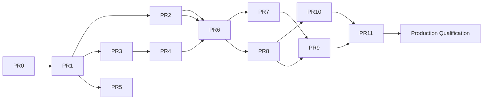

# MCP Implementation Slices

The delivery sequence: **PR-0 … PR-11, followed by a separate Production Qualification gate.** **No PR-12
exists** — any reinstatement of a distinct connectivity/PR-12 slice is deferred to
[`OPEN-DECISIONS.md`](OPEN-DECISIONS.md) (D-12). **Status: PR-0 design artifact (Proposed).** This is a
plan; **no slice is implemented.** Per-slice fields: objective, scope, non-goals, trust boundary,
dependencies, security requirements, tests, acceptance criteria, rollback, owner, reviewer, release gate.

> **Editorial normalization:** the source DOCX listed connectivity adapters (PR-11) and shadow/canary
> (PR-12) as separate slices. Per the PR-0 execution instruction, shadow/canary is **PR-11** and
> connectivity adapters fold into **PR-5** (dedicated listener/runtime) and **PR-10** (CP/DP + connector
> snapshot semantics); the connectors themselves harden during **PR-11** and are proven at Production
> Qualification. `SOURCE REVIEW REQUIRED` for the folding.

Delivery rule (BLUEPRINT §23): every slice needs a defined trust boundary, acceptance criteria, tests and
rollback. **PR-1 does not begin before PR-0 approval AND a numbered, Accepted ADR under `docs/adr/`**
(Option B — see [`ADR-PROPOSAL-mcp-trust-boundary.md`](ADR-PROPOSAL-mcp-trust-boundary.md)).

---

## PR-0 — Design Baseline (this package)
- **Objective:** repository-grounded design package enabling a PR-1 go/no-go.
- **Scope:** documentation under `docs/design/mcp/` only.
- **Non-goals:** any runtime/CI/config/dependency change; any listener.
- **Trust boundary:** none (documentation).
- **Dependencies:** the current repository at HEAD `c0ae2bc`.
- **Security requirements:** MCP-OPS-004 (document V1 limits).
- **Tests:** Phase 5 documentation consistency checks (no build/test executed).
- **Acceptance:** evidence-backed; two capabilities kept separate; go/no-go cleared; ADR **proposal**
  present.
- **Rollback:** delete the docs directory (no runtime effect).
- **Owner:** Staff Eng + Product Sec. **Reviewer:** ARB + all roles ([`PR0-REVIEW-CHECKLIST.md`](PR0-REVIEW-CHECKLIST.md)).
- **Release gate:** GO-NO-GO cleared; numbered ADR accepted before PR-1.

## PR-1 — Protocol Kernel
- **Objective:** MCP parser/framing, version adapters, bounds, and a test harness — **no public listener**.
- **Scope:** `internal/mcp/protocol` (name [REC], pending ADR); inbound Origin/Host validation.
- **Non-goals:** policy, identity, upstream calls.
- **Trust boundary:** TB-1 (agent/client ↔ Culvert).
- **Dependencies:** PR-0 approved; ADR accepted.
- **Security requirements:** MCP-INSP-008, MCP-OPS-002, protocol bounds.
- **Tests:** fuzz, race, compatibility fixtures, inbound-rebinding, malformed JSON-RPC (all **new**).
- **Acceptance:** no public listener; fuzz/race/compat block; Origin/Host validated.
- **Rollback:** feature-flag disabled build; no listener bound.
- **Owner:** Eng. **Reviewer:** Product Sec. **Release gate:** fuzz+race+compat green; CodeQL wired for `internal/mcp/**`.

## PR-2 — Registry & Catalog
- **Objective:** server registration/discovery, tool fingerprints, drift classification, quarantine.
- **Scope:** `internal/mcp/registry`, `internal/mcp/catalog` [REC].
- **Non-goals:** policy decisions, execution.
- **Trust boundary:** TB-2.
- **Dependencies:** PR-1.
- **Security requirements:** MCP-SERVER-001,002,003; MCP-TOOL-001,002,003,005.
- **Tests:** canonicalization, drift fixtures, malicious/non-compliant server fixtures, identity-change.
- **Acceptance:** unknown/changed behavior deterministic and tested; unregistered denied.
- **Rollback:** registry read-only / disabled; no catalog publication.
- **Owner:** Sec/Eng. **Reviewer:** Sec Arch. **Release gate:** drift + malicious-server suites green.

## PR-3 — Identity Principal
- **Objective:** human/workload/agent/client/tenant model + token/audience/resource validation.
- **Scope:** `internal/mcp/identity` [REC]; separate OAuth clients/scopes for Mgmt vs Gateway.
- **Non-goals:** reuse of SWG identity/OIDC-flow assumptions; policy.
- **Trust boundary:** TB-1.
- **Dependencies:** PR-1.
- **Security requirements:** MCP-AUTH-001..008; MCP-ID-001..007.
- **Tests:** negative auth matrix, wrong-audience, wrong-resource, replay, tenant-escape, cross-session.
- **Acceptance:** no reuse of SWG identity; negative auth matrix passes; replay defense present.
- **Rollback:** identity module disabled → gateway denies (fail-closed).
- **Owner:** IAM/Eng. **Reviewer:** Sec Arch. **Release gate:** OAuth-negative + replay suites green.

## PR-4 — Credential Broker
- **Objective:** credential profiles, provider interface, rotation, scope, fail-closed semantics.
- **Scope:** `internal/mcp/credentials` [REC]; reuse `internal/secret` KEK/provider prior art.
- **Non-goals:** exposing secrets to agent/events.
- **Trust boundary:** TB-2.
- **Dependencies:** PR-3.
- **Security requirements:** MCP-CRED-001..006; MCP-AUTH-005.
- **Tests:** credential-flow, scope-mismatch, broker-failure, secret-scan, event-redaction.
- **Acceptance:** no secret in logs/events; failure policy tested; agent never holds a credential.
- **Rollback:** broker disabled → high-risk fails closed.
- **Owner:** IAM/PAM. **Reviewer:** Sec Arch. **Release gate:** secret-scan clean; fail-closed proven.

## PR-5 — Observe Runtime
- **Objective:** dedicated MCP listener, bounded pools, test/observe mode; **no SWG regression**.
- **Scope:** `internal/mcp/runtime` [REC]; separate ports for Gateway + Management; **folds connectivity
  listener wiring**.
- **Non-goals:** enforcement, upstream execution in production.
- **Trust boundary:** TB-1, TB-4.
- **Dependencies:** PR-1..PR-4.
- **Security requirements:** MCP-OPS-001,002.
- **Tests:** MCP-off overhead regression, load/soak/slowloris/queue bounds, streaming/reconnect.
- **Acceptance:** MCP disabled → no measurable SWG regression; bounds hold under load.
- **Rollback:** listener disabled; runtime dormant.
- **Owner:** SRE/Eng. **Reviewer:** SRE. **Release gate:** MCP-off benchmark ≈ zero overhead.

## PR-6 — Policy Engine
- **Objective:** deterministic, I/O-free engine; nine actions; reason codes; simulator.
- **Scope:** `internal/mcp/policy` [REC]; **separate** from SWG `PolicyRule`.
- **Non-goals:** adding MCP fields to SWG PolicyRule; any network I/O during eval.
- **Trust boundary:** TB-5 (publication), decision at TB-1/TB-2.
- **Dependencies:** PR-2, PR-3.
- **Security requirements:** MCP-POLICY-001..007; MCP-TOOL-004,006.
- **Tests:** determinism/property, default-deny, action-matrix, reason-code, unknown-tool, ordering.
- **Acceptance:** pure evaluation; traceable reason codes + revisions; unknown/expansion never auto-allow.
- **Rollback:** policy set to default-deny; previous snapshot retained.
- **Owner:** Sec/Eng. **Reviewer:** Sec Arch. **Release gate:** determinism + authorization-negative green.

## PR-7 — Inspection
- **Objective:** schema/size bounds, secret/DLP, destination/SSRF, redirect, redaction.
- **Scope:** `internal/mcp/inspection` [REC]; reuse `internal/ssrf` `Control` + `internal/redaction`.
- **Non-goals:** guaranteeing detection of every secret/injection (best-effort, residual R-2).
- **Trust boundary:** TB-1 (input), TB-2 (output).
- **Dependencies:** PR-1, PR-6.
- **Security requirements:** MCP-INSP-001..007.
- **Tests:** private-IP matrix, DNS-rebinding lab, redirect chains, synthetic-secret corpus, injection corpus, latency budget.
- **Acceptance:** abuse corpus blocked/labeled; latency within budget (design target).
- **Rollback:** inspection fail-closed for high-risk; disabled → deny high-risk.
- **Owner:** Sec/Eng. **Reviewer:** Sec Arch/Privacy. **Release gate:** SSRF + DLP suites green.

## PR-8 — Durable Decision Events
- **Objective:** durable, backpressured, replay-addressable decision events; exporters; loss policy.
- **Scope:** `internal/mcp/events` [REC]; **not** the audit ring; may refactor from `internal/reqlog` prior art.
- **Non-goals:** reusing the 500-entry audit ring as production evidence.
- **Trust boundary:** TB-4.
- **Dependencies:** PR-6.
- **Security requirements:** MCP-EVENT-001..006; MCP-PRIVACY-002.
- **Tests:** queue-saturation, event-durability, integrity/tamper, replay-id, export-authz, secret-scan.
- **Acceptance:** zero loss for critical classes under tested conditions (or fail-closed + alert).
- **Rollback:** degraded mode → fail-closed for write/high-risk.
- **Owner:** SRE/Sec. **Reviewer:** Sec Arch. **Release gate:** durability-under-saturation green.

## PR-9 — API & GUI
- **Objective:** inventory, policies, simulator, approvals, health; RBAC + OpenAPI + GUI parity.
- **Scope:** `internal/mcp/adminapi` [REC] + `static/index.html` MCP panels + Management MCP access panel.
- **Non-goals:** exposing Management MCP mutation tools (read-only default).
- **Trust boundary:** TB-5, TB-7.
- **Dependencies:** PR-2..PR-8.
- **Security requirements:** MCP-POLICY-007; MCP-MGMT-001..004.
- **Tests:** RBAC parity (C1/C1.5/C2 pattern), OpenAPI coverage gate, mutation-negative, approval-UX, GUI e2e.
- **Acceptance:** RBAC + OpenAPI + GUI parity; approval dialog complete; no mutation reachable.
- **Rollback:** routes gated/removed; GUI panel hidden.
- **Owner:** Eng. **Reviewer:** API governance. **Release gate:** OpenAPI + governance gates green.

## PR-10 — CP/DP & HA
- **Objective:** immutable signed snapshots (epoch + revisions + min_dp_version + content_hash + signature),
  fencing, acknowledgements, rollback; **connector snapshot semantics**.
- **Scope:** MCP snapshot fields extending the CP/DP machinery; reuse `halease`/`dpObserveEpoch`/`configver`.
- **Non-goals:** DP depending on CP per call.
- **Trust boundary:** TB-3.
- **Dependencies:** PR-6, PR-8.
- **Security requirements:** MCP-CPDP-001..003; MCP-HA-001,002.
- **Tests:** mixed-version, stale-epoch, corrupt/partial snapshot, rollback, restart/failover.
- **Acceptance:** whole-snapshot validation; atomic swap; rollback within SLO target; stale/corrupt rejected.
- **Rollback:** atomic swap to previous snapshot; last-known-good served.
- **Owner:** Eng/SRE. **Reviewer:** Arch. **Release gate:** mixed-version + corrupt-snapshot + rollback green.

## PR-11 — Shadow & Canary
- **Objective:** rollout modes, scope controls, dashboards, rollout guardrails; **connector/DMZ hardening**.
- **Scope:** mode ladder (Disabled→Observe→Shadow→Canary→Production); connector/DMZ controls.
- **Non-goals:** production enablement without Production Qualification.
- **Trust boundary:** TB-1, TB-6.
- **Dependencies:** PR-1..PR-10.
- **Security requirements:** MCP-CONNECT-001..004; MCP-PRIVACY-001; hard-fail-in-shadow set.
- **Tests:** shadow decision parity, connector impersonation/rollover/replay, DMZ-abuse, egress DLP gate.
- **Acceptance:** production-readiness evidence complete; hard failures blocked even in Shadow.
- **Rollback:** emergency disable → Observe/Disabled; snapshot rollback.
- **Owner:** SRE/Sec. **Reviewer:** Ops Readiness. **Release gate:** rollout guardrails + connector suites green.

## Production Qualification (separate gate — not a PR slice)
- **Objective:** full evidence pack + Joint Go/No-Go sign-off.
- **Scope:** evidence aggregation across Security/Reliability/Compatibility/Operations/Privacy/Support/
  Release/Connectivity ([`ROLLOUT-AND-ROLLBACK.md`](ROLLOUT-AND-ROLLBACK.md) §6).
- **Non-goals:** new features.
- **Dependencies:** PR-0..PR-11.
- **Security requirements:** MCP-PRIVACY-003; MCP-SUPPLY-003,004; MCP-OPS-003.
- **Tests:** the complete taxonomy in [`TEST-TRACEABILITY-MATRIX.md`](TEST-TRACEABILITY-MATRIX.md) green;
  signed SBOM/provenance verified.
- **Acceptance:** [`GO-NO-GO-CHECKLIST.md`](GO-NO-GO-CHECKLIST.md) fully cleared.
- **Rollback:** hold production enablement.
- **Owner:** Eng + Product + SRE. **Reviewer:** Joint Go/No-Go Board. **Release gate:** all blocking conditions cleared.

---

## Dependency graph

