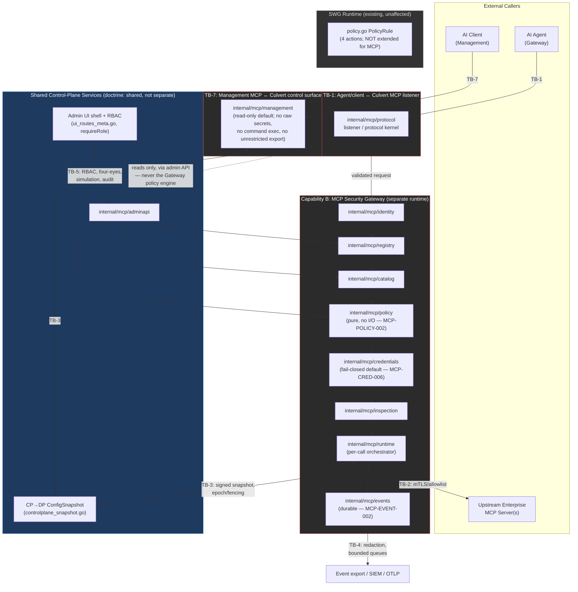

# Recommended Architecture — MCP Capabilities on the Culvert Platform

Culvert is adding two MCP capabilities on top of the existing SWG (Secure Web Gateway) runtime:
Capability A (Culvert Management MCP Server) and Capability B (MCP Security Gateway). This document
recommends how the two capabilities are separated from each other and from the SWG runtime, evaluates a
proposed Go package layout for the new subsystem, and defines the interfaces, trust-boundary mapping, data
ownership, failure ownership and prohibited couplings that PR-1 onward must respect. It does not define
threat IDs or requirement IDs — those are owned by [`THREAT-MODEL.md`](THREAT-MODEL.md) and
[`SECURITY-REQUIREMENTS.md`](SECURITY-REQUIREMENTS.md) and are only referenced here.

**Status: PR-0 design artifact (Proposed).** Package names and file boundaries in this document are
**[REC]** — evaluated, not adopted. The trust-boundary decisions are now recorded in
[`docs/adr/0024`](../../adr/0024-mcp-agent-security-gateway-trust-boundary.md) (`Status: Proposed` —
adoption completes on ARB + Security Architecture ratification); the exact package split/naming stays
[REC] pending that ratification. See [`README.md`](README.md#adr-scope--option-b-adopted-for-pr-0-promoted-2026-07-24).

---

## 1. Shared Platform vs. Separate Runtimes

**[REC]** following the doctrine stated in the PR-0 authoring brief and [`BLUEPRINT.md`](BLUEPRINT.md) §03:

> "One Culvert platform; shared Control Plane services; SEPARATE enforcement engines and trust
> boundaries."

Three runtimes exist side by side in the same binary/process family, but they are **not** the same
listener, the same policy engine, or the same pool:

| Runtime | Capability | Listener | Policy Schema | Status |
|---|---|---|---|---|
| SWG runtime | Existing forward-proxy (HTTP/HTTPS/SOCKS5) | `-port` (proxy), `-ui-port` (admin UI) | `PolicyRule`, `policy.go:91-188` (**[FACT]**), 4 actions Allow/Drop/Block_Page/Redirect (`policy.go:19-27`, **[FACT]**) | Existing, unaffected |
| MCP Security Gateway runtime (Capability B) | `AI Agent → /mcp/gateway/{server-id} → Approved MCP Server → Enterprise System` (Blueprint §03) | New, separate listener(s) under `/mcp/gateway/{server-id}` | New MCP policy tuple, nine MCP policy actions (see [`MCP-POLICY-MODEL.md`](MCP-POLICY-MODEL.md)) | PR-0 design only; **NO existing MCP/JSON-RPC listener in inspected paths** (**[FACT]**, VERIFIED EVIDENCE) |
| Management MCP runtime (Capability A) | `AI Client → /mcp/management → Culvert management` (Blueprint §03) | New, separate listener under `/mcp/management` | Read-only-default management authorization, distinct from both the SWG PolicyRule and the Gateway policy tuple | PR-0 design only; not present in the repository |

The doctrine's "Shared vs. Separate" table (Blueprint §03) is authoritative and is not restated in full
here; the operative constraint for this document is:

- **Shared** (Control-Plane services only): admin UI shell and authentication, RBAC framework
  (`RoleAdmin`/`RoleOperator`/`RoleViewer`, `store.go:317-336`, `requireRole`, `ui_rbac.go:46-53` —
  **[FACT]**), configuration publication and immutable snapshots (the CP→DP `ConfigSnapshot` mechanism,
  `controlplane_snapshot.go:22-112` — **[FACT]**, extended per [`CP-DP-HA-MODEL.md`](CP-DP-HA-MODEL.md)),
  audit conventions and export infrastructure, OpenAPI/CI/release infrastructure.
- **Separate, per runtime**: listeners and port/endpoint exposure, OAuth clients and scopes, policy
  schemas and decision-action vocabularies, decision-event namespaces, runtime pools and resource limits,
  failure semantics, rate limits, audit/event categories, threat models, runbooks.

Concretely: Capability A and Capability B **MUST NOT** share a listener, a policy engine instance, a
credential broker instance, or an **active/logical decision-event stream** with each other or with the SWG
runtime, even though all three may run inside the same `culvert` process and reuse the same admin-UI shell,
RBAC middleware chain, and config-snapshot transport.

> **Refinement — D-13 (2026-07-24, [`ADR-0024 §D-13`](../../adr/0024-mcp-agent-security-gateway-trust-boundary.md)
> items 3–6).** "Do not share" is scoped to **active state and logical planes**, not to reviewed
> implementation code or physical infrastructure. The two capabilities **may** share reviewed
> implementation libraries and selected Control-Plane infrastructure; **may** share a policy-engine
> **implementation library** (but never shared active policy state, rule bundles, namespaces or
> authorization decisions — those stay per-capability); and **may** share the **underlying durable event
> transport** *only when* events are separated by authorization domain, tenant, category, partitioning,
> retention and query policy. Two **physically** separate event systems are **not** required when logical +
> security isolation is enforceable and tested. What must never be shared: a listener, an active policy
> engine instance / rule set, a credential-broker instance, or a logical (unpartitioned) event stream.

---

## 2. Package Ownership (Evaluation, Not Adoption)

Repo convention (**[FACT]**, `CLAUDE.md`, ADR-0002): the repository is flat `package main` at the root,
with logic/state/persistence extracted into leaf packages under `internal/` (57 `internal/` packages
today per VERIFIED EVIDENCE) and thin root-level shim/`_vars.go` files that hold aliases, singletons, and
wiring. New engines are expected to land under `internal/`, not re-inlined into root files.

`BLUEPRINT.md` §09 proposes eleven `internal/mcp/*` subpackages. Splitting the MCP subsystem into
`internal/mcp/*` leaf packages is **consistent with the ADR-0002 pattern** — subpackages under a shared
`internal/mcp/` parent rather than 11 flat `internal/` siblings is a reasonable refinement given the
subsystem's size, but the **exact split, naming, and file boundaries are [REC]**. **[ADR-0024 §Decision
item 8](../../adr/0024-mcp-agent-security-gateway-trust-boundary.md) ratifies the `internal/mcp/*`
*namespace and trust boundary*, NOT the exact leaf-package names** — so the specific names in the table
below (`internal/mcp/protocol`, `…/policy`, `…/runtime`, etc.) remain **`[REC]`, subject to implementation
review, even after ADR-0024 is Accepted** (finding L-4). The table below evaluates each proposed package's
responsibility and prohibition, mirroring the component table in `BLUEPRINT.md` §09.

| Proposed Package | Responsibility (evaluated) | Must NOT (evaluated) |
|---|---|---|
| `internal/mcp/protocol` | MCP listener/protocol kernel: transport termination, JSON-RPC/SSE framing, version adapters, connection lifecycle, and the structural/size/depth/framing/state bounds now specified by **`MCP-PROTO-001..014`** ([`SECURITY-REQUIREMENTS.md`](SECURITY-REQUIREMENTS.md)). | Decide business policy or embed business rules (Blueprint §09: "Decide business policy or contain business rules"). Must not be the place tool-risk or credential logic lives. |
| `internal/mcp/identity` | Resolve and validate the calling principal: token validation, audience/resource checks, agent/client/workload attribution, tenant binding. | Rely on IP alone or invent/assume identity when validation is inconclusive (Blueprint §09). Must not perform policy evaluation itself. |
| `internal/mcp/registry` | Server registry: registered upstream MCP server endpoints, ownership, TLS identity, environment, connection status. | Allow traffic to an unregistered server (Blueprint §09). Must not itself execute or proxy calls. |
| `internal/mcp/catalog` | Tool catalog: tool definitions, canonical fingerprints/hashes, risk classification, approval history, drift detection inputs. | Trust server-supplied annotations/descriptions as the sole security boundary (Blueprint §09) — catalog data informs policy, it does not decide. |
| `internal/mcp/policy` | Deterministic policy evaluation over identity + server + tool + arguments + resource + risk; returns a decision, reason code, matched rule, and revision context. | Perform network or other I/O during evaluation (Blueprint §09; **MCP-POLICY-002**, [`SECURITY-REQUIREMENTS.md`](SECURITY-REQUIREMENTS.md)) — must be a pure function of its inputs. Contrast the SWG policy engine, which does DNS and other I/O mid-evaluation (`policy.go` `Evaluate:1083-1143`, DNS resolution at `:1387` → `geoip.go` `resolveHost:125-204` — **[FACT]**); that pattern must not be reused for MCP. |
| `internal/mcp/credentials` | Credential broker: select/mint a short-lived, scoped upstream credential only after an ALLOW-class policy decision. | Expose a raw secret to the agent or to the decision-event pipeline (Blueprint §09; **MCP-CRED-004**). Must not run before policy has decided (confused-deputy risk, threat MCP-T-046). |
| `internal/mcp/inspection` | Input/output inspection: schema conformance, size limits, secret/DLP pattern matching, destination/URL controls, redaction. | Become a single unbounded queue (Blueprint §09) — must be bounded and independently failure-scoped per stage. |
| `internal/mcp/events` | Durable decision-event pipeline: event construction, sampling policy, bounded queues with backpressure, export/spool. | Reuse a small debug audit ring as production evidence (Blueprint §09) — specifically, must not reuse `internal/audit`'s bounded ring (`MaxRing=500`, `internal/audit/audit.go:49` — **[FACT]**) as the durable decision-event store. |
| `internal/mcp/runtime` | Per-request orchestration: sequences identity → registry/catalog lookup → policy → credentials → inspection → upstream call → event emission for a single MCP call; owns the runtime pool and resource limits for the Gateway. | Duplicate policy logic, duplicate credential logic, or bypass the pipeline ordering owned by the components above. |
| `internal/mcp/management` | Capability A business logic: read-only explanation/health/analytics tool handlers, draft/validate/simulate handlers; enforces "no raw secrets / no command exec / no unrestricted export" and gates any future mutation behind plan→validate→approve→apply. | Expose raw secret access, arbitrary command execution, or unrestricted trace/log export as an MCP tool (Blueprint §06 non-goals). Must not reuse the Gateway's policy/credential engines as its authorization model — Capability A authorization is a distinct schema (Trust Boundary TB-7, §4 below). |
| `internal/mcp/adminapi` | Engine-side support for the admin-UI/API surface specific to MCP (server/tool/policy CRUD data access, decision-event query support) that a root-level `apiXxx` shim in the existing admin-UI layer (`ui_routes_meta.go`, `register*Routes` pattern — **[FACT]**) calls into. | Register `mux.HandleFunc` routes directly — per repo convention, route registration and `uiRoutes` metadata stay in root-level `register*Routes` helpers and `ui_routes_meta.go` (**[FACT]**, `CLAUDE.md` Admin UI / Control Plane section), not inside `internal/`. |

**[REC]**: Whether Capability A (`internal/mcp/management`) and Capability B (`internal/mcp/runtime` +
friends) end up as fully separate package trees (e.g. `internal/mcpmgmt/*` vs `internal/mcpgw/*`) or as a
shared `internal/mcp/*` tree with capability-scoped subpackages is an **open naming/decomposition question
left to implementation review** — ADR-0024 fixes the `internal/mcp/*` namespace and the separation
doctrine, not the leaf-package tree shape —
either is consistent with ADR-0002, but the doctrine in §1 requires that whichever layout is chosen, the
**runtime instances** (listeners, policy engine instances, credential broker instances, event streams) are
never shared between the two capabilities, regardless of package tree shape.

---

## 3. Interfaces Between Components

**[REC]** dependency direction, evaluated from `BLUEPRINT.md` §09's component table and the Sellable-MVP
workflow (Blueprint §08):

```
protocol kernel → identity → registry/catalog → policy → credentials → inspection → runtime → events
```

This is presented as the logical call order for the Gateway path (Capability B); Capability A's
`management` package sits beside `identity`/`policy` as a distinct authorization path (§1, TB-7) rather
than inside this chain.

Rules governing the interfaces:

- **One-way dependency, no back-edges.** `protocol` depends on nothing else in this list; `identity`
  depends only on `protocol`'s validated request; `registry`/`catalog` are looked up using the identity's
  claims; `policy` consumes identity + registry/catalog + risk inputs and returns a decision; `credentials`
  is invoked only after `policy` returns an ALLOW-class decision (**MCP-POLICY-004**,
  [`SECURITY-REQUIREMENTS.md`](SECURITY-REQUIREMENTS.md)); `inspection` runs on the request before the
  upstream call and on the response after it; `runtime` is the orchestrator that sequences all of the
  above for one call; `events` is written to at each stage transition but is never read by any component
  earlier in the chain (no cyclic dependency back into decision-making).
- **`policy` MUST be pure.** Per **MCP-POLICY-002** (`SECURITY-REQUIREMENTS.md`), the policy engine must
  be deterministic and must not perform network or other I/O during evaluation. All inputs it needs
  (identity claims, catalog risk tier, registry status, historical decision context) must be resolved and
  passed in by `runtime` **before** calling `policy`; `policy` must not call back into `registry`,
  `catalog`, `credentials`, or any network/disk primitive mid-evaluation. This is the direct contrast case
  cited in VERIFIED EVIDENCE: the SWG policy engine violates this property today (`policy.go` `Evaluate`
  does DNS/GeoIP resolution inline, `policy.go:1387` → `geoip.go:125-204` — **[FACT]**), and that pattern
  is explicitly not reusable for MCP policy (Blueprint §09, MCP-POLICY-002).
- **`credentials` is a one-way sink from `policy`'s perspective.** `policy` never receives a credential
  value as an input and never emits one; it only emits a decision that `runtime` uses to decide whether to
  invoke `credentials`.
- **`events` never blocks the decision path.** `runtime` emits to `events` after the decision/inspection
  outcome is known; `events`' own backpressure/failure semantics (§5, MCP-EVENT-002) must not be able to
  stall or alter a policy decision already made.

---

## 4. Trust Boundaries

Trust boundaries TB-1 through TB-7 are **defined in** [`THREAT-MODEL.md`](THREAT-MODEL.md) §4 and are not
redefined here. This section only maps the components in §2 onto those boundaries:

| Trust Boundary (see THREAT-MODEL.md §4) | Components on each side |
|---|---|
| **TB-1** Agent/client ↔ Culvert MCP listener | `internal/mcp/protocol` is the boundary-owning component (token validation, Origin/Host, protocol bounds, rate limits happen at/behind this boundary). |
| **TB-2** Culvert ↔ upstream MCP server | `internal/mcp/runtime` (outbound call) and `internal/mcp/credentials` (credential selection) sit on the Culvert side; `internal/mcp/registry` defines the allowlisted far side. |
| **TB-3** Control Plane ↔ Data Planes | Shared CP→DP snapshot mechanism (existing `controlplane_snapshot.go` extended per [`CP-DP-HA-MODEL.md`](CP-DP-HA-MODEL.md)) — not owned by any single `internal/mcp/*` package; `internal/mcp/policy`, `catalog`, and `registry` are all consumers of the snapshot on the DP side. |
| **TB-4** Runtime ↔ event/export | `internal/mcp/events` is the boundary-owning component. |
| **TB-5** Admin ↔ policy publication | `internal/mcp/adminapi` plus the shared root-level admin-UI RBAC/audit layer (`ui_routes_meta.go`, `requireRole` — **[FACT]**). |
| **TB-6** Cloud AI ↔ customer network | Outside the `internal/mcp/*` package set entirely — owned by the connectivity model in [`ON-PREM-CONNECTIVITY.md`](ON-PREM-CONNECTIVITY.md); `internal/mcp/protocol` only sees whatever arrives after that boundary. |
| **TB-7** Management MCP ↔ Culvert control surface | `internal/mcp/management` is the boundary-owning component, distinct from TB-1/TB-2 (Capability B's boundaries). |

---

## 5. Data Ownership

Assets A-1 through A-12 are **defined in** [`THREAT-MODEL.md`](THREAT-MODEL.md) §1. This section maps each
asset to its owning component:

| Asset (see THREAT-MODEL.md §1) | Owning Component |
|---|---|
| A-1 Upstream production credentials (broker-held) | `internal/mcp/credentials` |
| A-2 Client/agent bearer tokens | `internal/mcp/identity` |
| A-3 Policy bundle + reason-code semantics | `internal/mcp/policy` |
| A-4 Tool catalog + fingerprints | `internal/mcp/catalog` |
| A-5 Server registry (endpoints, TLS identity, ownership) | `internal/mcp/registry` |
| A-6 Decision events (durable audit) | `internal/mcp/events` |
| A-7 CP→DP configuration snapshot | Shared CP/DP snapshot mechanism (§4, TB-3) — `internal/mcp/policy`/`catalog`/`registry` each own their slice of the snapshot payload, not `events` or `runtime` |
| A-8 Approval state | `internal/mcp/policy` (approval is a policy-lifecycle state — REQUIRE_APPROVAL/ALLOW_ONCE/ALLOW_FOR_SESSION dispositions), surfaced through `internal/mcp/adminapi` |
| A-9 Enterprise data in tool arguments/responses | `internal/mcp/inspection` (in transit); no component stores this by default (Blueprint §06 non-goal: "Do not store raw arguments or raw tool outputs by default") |
| A-10 Tenant isolation boundary | `internal/mcp/identity` (tenant binding at resolution time), enforced again by `internal/mcp/policy` (tenant-scoped rule evaluation) |
| A-11 Management MCP capabilities | `internal/mcp/management` |
| A-12 Outbound connector / DMZ endpoint identity | `internal/mcp/protocol` (inbound listener identity) and the connectivity layer at TB-6, outside `internal/mcp/*` |

---

## 6. Failure Ownership

Failure-mode ownership for the three MUST-fail-closed requirements the brief calls out, each defined in
[`SECURITY-REQUIREMENTS.md`](SECURITY-REQUIREMENTS.md):

| Requirement | Statement | Owning Component | Failure Posture |
|---|---|---|---|
| **MCP-POLICY-001** | Policy evaluation **MUST** default-deny when no rule matches. | `internal/mcp/policy` | Fail closed always — no-match is a DENY, never an implicit ALLOW. Mirrors the SWG default-deny posture (`policy.go:1142`, `proxy.go:543-556` — **[FACT]**, cited as precedent only, not shared code). |
| **MCP-CRED-006** | Broker failure **MUST** fail closed for write/high-risk; fail-open **MAY** be allowed only with a valid cached credential and explicit policy for read-only low-risk. | `internal/mcp/credentials` | Conditional fail-closed: default is fail-closed; a narrow, explicitly-configured fail-open path exists only for read-only/low-risk with a still-valid cached credential — never for write/high-risk. |
| **MCP-EVENT-002** | Loss of authentication/deny/configuration/high-risk events **MUST NOT** occur silently; for the critical **write/destructive/config-publication/credential** classes the operation **MUST fail closed AND** the system **MUST** enter the defined degraded mode with alert + loss counter (both, not either). **For an authentication-failure or authorization-denial event** — whose triggering request is **already denied**, so there is no operation to "fail closed" — the system **MUST** instead enter the **critical degraded state**, alert, increment the loss counter, and **block new *allowed* write/high-risk operations until critical-event durability is restored**. | `internal/mcp/events` | Fail-closed **and** degraded-mode-with-alert for the critical classes named. **Denial-event branch — a distinct posture, not a synonym:** when an authentication-failure or authorization-denial event cannot be persisted, the triggering request is already denied, so `events` **MUST** raise the **critical degraded state** and the **durability lockout**, and `internal/mcp/runtime` **MUST** block new *allowed* write/high-risk operations until durability is restored; fail-closed-plus-alert alone is **not** an equivalent posture and an implementation that stops there keeps doing privileged work after denial evidence has been lost. ordinary/low-risk event loss under backpressure may be handled (under an explicit degraded-mode policy) by sampling/spooling per [`EVENT-MODEL.md`](EVENT-MODEL.md), but the critical classes are never silently dropped. |

General principle carried into `internal/mcp/runtime`: when any of `policy`, `credentials`, or `events`
reports a failure, `runtime` must propagate the most restrictive applicable posture (deny the call) rather
than substituting a default that the failing component did not itself return — `runtime` is an
orchestrator, not a second place where fail-open/fail-closed policy is decided.

---

## 7. Prohibited Coupling

The following couplings are explicitly out of bounds for the MCP subsystem, regardless of package layout:

- **MUST NOT** add MCP fields to the existing SWG `PolicyRule` (`policy.go:91-188`, ~34 destination-selector
  fields, 4 actions at `policy.go:19-27` — **[FACT]**; grep for MCP action verbs in that struct returns
  zero — **[FACT]**, VERIFIED EVIDENCE). The MCP policy tuple and its nine actions
  ([`MCP-POLICY-MODEL.md`](MCP-POLICY-MODEL.md)) are a separate schema evaluated by a separate engine
  (`internal/mcp/policy`), never a superset of `PolicyRule`.
- **MUST NOT** reuse the existing SWG OIDC flow as a generic MCP authentication model. The SWG OIDC
  implementation validates audience as `client_id` (`auth_oidc_flow.go:523` — **[FACT]**), has only an
  optional `RequiredAudience` (`auth_oidc.go:247` — **[FACT]**), implements no RFC 8707 resource indicator
  (grep 0 — **[FACT]**), and has no bearer-access-token replay defense or DPoP/`cnf` sender-constraint
  (grep 0 — **[FACT]**). `internal/mcp/identity` needs audience/resource binding and sender-constraint
  properties the existing flow does not provide, and must not inherit its gaps by reuse.
- **MUST NOT** reuse the audit ring (`internal/audit/audit.go`, `MaxRing=500` — **[FACT]**) as the
  decision-event pipeline. The audit ring is a bounded, in-memory debug convenience with best-effort JSONL
  rotation (errors swallowed, `:135` — **[FACT]**); `internal/mcp/events` needs bounded-queue backpressure,
  durable export, and replay/correlation IDs (**MCP-EVENT-001**, **MCP-EVENT-004**) that the audit ring was
  never designed to provide.
- **MUST NOT** share listeners/ports between Capability A, Capability B, and the SWG runtime. Each has its
  own listener per §1 (`/mcp/management`, `/mcp/gateway/{server-id}`, and the existing SWG `-port`/
  `-ui-port`), consistent with the "Separate: listeners and endpoint exposure" row of the Shared-vs-Separate
  doctrine (`BLUEPRINT.md` §03).
- **MCP policy engine MUST NOT do network I/O.** Contrast the SWG policy engine, which performs DNS
  resolution mid-evaluation (`policy.go:1387` — **[FACT]**, cited above in §3 and §2). `internal/mcp/policy`
  must be a pure function per **MCP-POLICY-002**.

---

## 8. Component Diagram



Notes on the diagram:

- Capability B (Gateway) and Capability A (Management) are drawn as separate subgraphs with no direct
  edge between their runtime components — the only connection between them is through the **shared**
  Control-Plane subgraph (admin UI/RBAC and the CP→DP snapshot), never a direct call from `management` into
  `policy`, `credentials`, or `events`.
- The SWG runtime subgraph has no edges into either MCP subgraph — it is drawn only to make the
  "existing, unaffected, not extended" posture visually explicit.
- Trust-boundary labels (TB-1, TB-2, TB-3, TB-4, TB-5, TB-7) on edges/subgraphs are placement references
  into [`THREAT-MODEL.md`](THREAT-MODEL.md) §4, not new definitions. TB-6 (Cloud AI ↔ customer network) is
  outside this component diagram's scope — see [`ON-PREM-CONNECTIVITY.md`](ON-PREM-CONNECTIVITY.md).

---

## Cross-References

- Doctrine source: [`BLUEPRINT.md`](BLUEPRINT.md) §03 "Two MCP Capabilities, One Culvert Platform" and §09
  "Target Architecture and Trust Boundaries".
- Trust boundaries TB-1..TB-7: [`THREAT-MODEL.md`](THREAT-MODEL.md) §4.
- Assets A-1..A-12: [`THREAT-MODEL.md`](THREAT-MODEL.md) §1.
- Requirements MCP-POLICY-001/002/004, MCP-CRED-004/006, MCP-EVENT-001/002/004:
  [`SECURITY-REQUIREMENTS.md`](SECURITY-REQUIREMENTS.md).
- Policy tuple and nine actions: [`MCP-POLICY-MODEL.md`](MCP-POLICY-MODEL.md).
- CP→DP snapshot extension: [`CP-DP-HA-MODEL.md`](CP-DP-HA-MODEL.md).
- Connectivity/TB-6: [`ON-PREM-CONNECTIVITY.md`](ON-PREM-CONNECTIVITY.md).
- ADR promotion path: [`README.md`](README.md#adr-scope--option-b-adopted-for-pr-0),
  [`ADR-PROPOSAL-mcp-trust-boundary.md`](ADR-PROPOSAL-mcp-trust-boundary.md).

**Risk note on this document's claims:** Low for the read-only Phase 1 investigation, but the current
repository test baseline remains unverified in this session.
