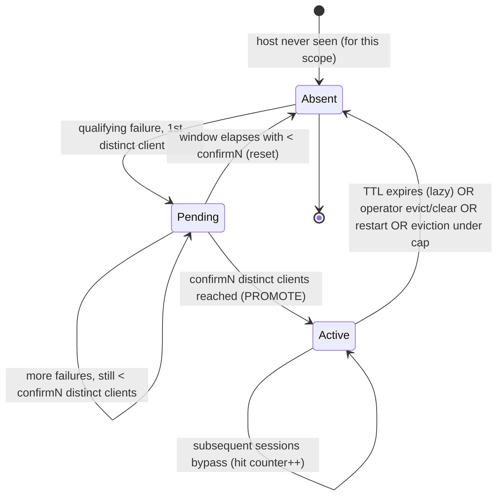
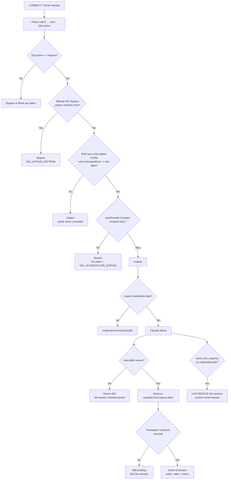

# Adaptive Decryption Exclusions (Fail-Open + Auto-Learn)

**Official product documentation** · Culvert Secure Web Gateway
Feature area: SSL/TLS Decryption · Availability: shipped, including admin-tunable cache parameters (confirm-count/TTL/window/cap, F10) · Audience: administrators, support, security, engineering

> **What this is in one sentence.** Culvert can *learn at runtime* which hosts are
> incompatible with SSL inspection and transparently bypass decryption for them —
> under strict, per-policy, poison-resistant guardrails — so that pinned apps and
> client-certificate origins keep working without an administrator hand-authoring a
> bypass entry for every one.

### How to read this document

| If you are… | Start at | Then read |
|---|---|---|
| An administrator enabling the feature | [Part 1](#part-1--executive-overview), [Part 4](#part-4--administrator-guide) | [Part 5](#part-5--runtime-examples), [Part 9](#part-9--security-considerations) |
| A support engineer on a ticket | [Part 7](#part-7--troubleshooting-guide) | [Part 6](#part-6--edge-cases), [Part 8](#part-8--faq) |
| A security / audit reviewer | [Part 9](#part-9--security-considerations) | [Part 3](#part-3--architecture), [Part 10](#part-10--operational-runbook) |
| A developer new to the code | [Part 2](#part-2--background), [Part 3](#part-3--architecture) | [Part 12](#part-12--internal-engineering-notes) |

**Related documents**

- Operator quick-guide: [`docs/operator/decryption-auto-exclusions.md`](../operator/decryption-auto-exclusions.md)
- Design plan & decision log: `roadmap/auto-exclusion-cache-plan.md`
- Manual bypass (the sibling feature): SSL Bypass patterns (`internal/sslbypass`)

---

## Part 1 — Executive Overview

### The problem this feature solves

A forward proxy that performs SSL inspection (MITM) must present a locally-signed
certificate to the client and complete a fresh TLS handshake to the origin. A
meaningful minority of real-world traffic **cannot survive that interception**:

- **Certificate-pinned applications** (many mobile apps, some desktop agents)
  reject any certificate not signed by their pinned key — including the proxy's.
- **Origins that require a client certificate** (mutual TLS) cannot be satisfied by
  the proxy, which does not hold the client's private key.
- **Genuine TLS-parameter incompatibilities** where the origin and the proxy's
  inspection profile share no protocol version or cipher.

When inspection is mandatory for these flows, the user sees a hard failure (a
`502`). The traditional remedy is a **manually curated bypass list** — but that
requires an administrator to *already know* every incompatible host. In a large
enterprise the long tail of pinned apps and mTLS origins is effectively unknowable
in advance, and it changes with every app update.

### Why existing behavior was insufficient

Culvert already ships **manual SSL Bypass** (operator-authored glob/regex patterns
that always override inspection). That covers *what you know breaks*. It does not
cover *what you don't* — and by construction it never will, because it is a static,
hand-maintained list. The result before this feature: every newly-pinned app was a
support ticket, an investigation, and a manual bypass edit, during which real users
were broken.

### What changed

Culvert now has an **adaptive** counterpart to manual bypass. When a policy rule's
**Decryption Profile** opts into **fail-open**, and an inspected tunnel to a host
fails for a *recognized decryption-incompatibility reason*, Culvert:

1. **Learns** the host into a volatile, bounded, expiring in-memory cache — but only
   after the **same failure is confirmed from multiple distinct clients**;
2. **Bypasses** subsequent sessions to that host (for rules sharing the same
   profile scope) until the entry expires;
3. In one narrow, structurally-proven case (origin requires a client certificate),
   **rescues the triggering session live** so even the first user does not see a
   failure.

Every learn event is **audited, alerted, counted as a metric, and listed in an admin
panel** with its blast radius, where an operator can evict it.

### The security philosophy

Auto-disabling inspection is a security decision, so the design is **fail-closed by
default and fail-safe under every error**:

- **Opt-in, per policy.** Nothing is ever learned or bypassed unless an
  administrator explicitly set a Decryption Profile to fail-open *and* bound a rule
  to it. With no fail-open profile the feature is inert and inspection is
  byte-for-byte unchanged.
- **Scoped, not global.** Every learned exclusion is owned by the decryption
  profile that matched the failing session. One team's fail-open profile can never
  open a hole in another's — even for the same host. See [Blast radius](#blast-radius).
- **Poison-resistant.** A host is not excluded on one failure; it takes a
  **confirm-count of distinct client evidence** (default 2). A single malicious or
  broken endpoint cannot force a bypass.
- **Narrow triggers.** Only *specific, structured* can't-decrypt signals learn. An
  untrusted or expired origin certificate — a **block** decision and the classic
  exfiltration vector — is *never* learned. Ambiguous, origin-controlled alerts are
  never learned. Misclassification can therefore only ever keep inspecting.
- **Loud.** Every exclusion is an audited, alertable, metered event. Inspection
  going dark for a host is never silent.

### When an administrator SHOULD enable it

- A **BYOD or guest segment** where pinned consumer apps are common and breaking
  them generates support load with little security benefit.
- A **known-messy traffic class** (e.g., a population of mobile devices) where you
  want resilience against the pinned-app long tail without hand-maintaining a list.
- Any rule where **availability of that traffic outranks mandatory inspection**, and
  you accept that a learned host stops being inspected until its TTL expires.

### When an administrator should NEVER enable it

- On a **catch-all / `*` rule** or any broad rule. Fail-open on a broad rule is an
  inspection-coverage hole waiting to be found. Bind it to **specific** rules.
- On traffic to **inspection-mandatory or DLP-critical destinations** — banking,
  identity providers, software-update origins, regulated data flows. Keep these on
  **fail-close** rules, where they are un-poisonable by construction.
- As a substitute for **fixing trust**. If a business-critical SaaS uses a private
  enterprise CA, the correct fix is to add that CA to Culvert's trust store and keep
  inspecting — not to fail-open. (An untrusted issuer is never auto-excluded anyway,
  so that origin stays a visible `502` until you fix trust — surfacing the
  misconfiguration rather than silently going dark.)

---

## Part 2 — Background

### How Culvert behaved before this feature

```
Client ──TLS──▶ Culvert (inspect) ──TLS──▶ Origin
                     │
        pinned app / mTLS origin / param mismatch
                     │
                     ▼
              Handshake fails → 502 to the client
```

Inspection was all-or-nothing per rule. If a rule said *inspect*, every matched
host was inspected; an incompatible host produced a hard failure with no adaptive
recovery. The only escape valve was the **manual SSL Bypass list**.

### Customer pain points

- **Unknowable long tail.** Administrators could not enumerate every pinned app in
  advance; each new one was a fresh outage until discovered.
- **Reactive, manual toil.** Remediation was: user complains → support investigates
  → identify host → edit bypass list → validate. Slow, and repeated forever.
- **Blunt overreaction.** To stop the tickets, some operators disabled inspection
  for whole categories or broad rules — throwing away inspection coverage far beyond
  the few hosts that actually needed it.

### Typical failure scenarios

| Scenario | Symptom before this feature |
|---|---|
| Employee installs a pinned banking/chat app | App fails to connect through the proxy; hard error, no obvious cause |
| Partner API requires client certificate (mTLS) | `502` on every call; integration blocked |
| Legacy origin negotiates only TLS 1.0 while profile floors at 1.2 | `502`; appears as an intermittent outage |

### Why manual SSL Bypass was not enough

Manual bypass is **static and prior-knowledge-bound**. It is excellent for hosts you
*know* break (and remains the recommended tool for those — it guarantees
first-session success). It structurally cannot cover the hosts you have not yet
discovered, which is precisely the population that generates outages. The two are
complementary: **manual bypass = what you know; auto-exclusion = what you don't.**

### Why this feature exists

To convert a reactive, manual, per-host outage-and-remediation cycle into an
**adaptive, self-healing, auditable** one — while keeping inspection the default and
making every deviation an explicit, scoped, logged, revocable decision. It models
PAN-OS's *local SSL decryption exclusion cache*, adapted for a multi-tenant forward
proxy with additional guardrails (profile scoping, confirm-count, narrow classifier).

### Before → After

**Before**

```
New pinned app appears
        ↓
Users broken (hard 502)
        ↓
Support ticket → manual investigation
        ↓
Admin identifies host
        ↓
Admin edits manual bypass list
        ↓
Fixed — until the next app
```

**After**

```
New pinned app appears (on a fail-open rule)
        ↓
Failures observed from N distinct clients
        ↓
Host auto-learned → audited + alerted + metered
        ↓
Subsequent sessions bypass automatically (self-heal)
        ↓
Admin reviews the Decryption Exclusions panel
        ↓
Keep (let TTL manage it) or evict / promote to manual bypass
```

Inspection-mandatory hosts stay on fail-close rules throughout and are never
affected.

---

## Part 3 — Architecture

### Component overview

| Component | Location | Responsibility |
|---|---|---|
| **Cache engine** | `internal/autoexclude` | Pure, in-memory store: pending observations, promotion on confirm-count, TTL/expiry, bounded eviction, stats. No policy, no I/O. |
| **Hot-path glue** | `autoexclude_resolve.go` (package main) | Gates learn+read on the rule's fail-open opt-in; classifies TLS failures into learnable reasons; derives client-evidence token; fires audit/alert/metric on promotion. |
| **Decision point** | `proxy.go` → `resolveSSLAction` | Per-CONNECT consult: if the rule is fail-open and the host is excluded, downgrade Inspect → Bypass. |
| **Failure sites** | `proxy_tunnel.go`, `proxy_tunnel_h2.go` | Where an inspect handshake fails; call `maybeFailOpenOrigin` / `maybeFailOpenClient`. |
| **Decryption Profile** | `internal/decryptprofile` | Holds the `OnInspectError` field; `FailOpenScope(name)` is the no-copy hot-path accessor returning `(profileID, securityGen, ok)` (ok iff the profile exists and is fail-open). |
| **Admin API** | `apiDecryptionExclusions` (`ui_policy.go`) | `GET` list+stats+footprint (viewer), `DELETE` evict/clear (operator). |
| **Cache Tuning API** | `ui_policy.go` (`GET`/`PUT /api/decryption-exclusions/tunables`) | `GET` defaults+bounds (viewer), `PUT` full-set update of the five engine parameters (admin). |
| **UI** | Decryption Exclusions panel (`static/index.html`) | Read/evict surface, the **Cache Tuning** section (admin-only), and the fail-open toggle on the profile editor. |
| **Metrics** | `metrics.go` + `autoexclude_resolve.go` | Prometheus counters/gauges. |

### The scoped key (policy isolation)

Every entry — active and pending — is keyed by **`(scopeID, host)`**, where
`scopeID` is the **stable identity of the decryption profile** that matched the
failing session (not the profile name; a rename preserves the ID).

```
active map key  =  scopeID \x00 host
pending map key =  scopeID \x00 host \x00 reason
```

Host-only keying would *not* be policy isolation; the scope is. A host learned under
profile *A* is consulted **only** for sessions that also match profile *A*.

### Security-generation fencing (a security edit invalidates learned entries)

The profile ID is stable across edits (renames preserve it), so keying on
`(scopeID, host)` alone would let a security-relevant edit to a fail-open profile
keep consulting exclusions learned under the *old* posture. Every entry therefore
also records the **security generation** of its owning profile — a deterministic
fingerprint (`decryptprofile.computeSecurityGen`) over only the security-effective
fields (`OnInspectError`, `CertVerification`, `OnUnsupported`, `MinTLSVersion`,
`MaxTLSVersion`, `InspectHTTP2`). `Observe`/`Contains` are keyed on
`(scopeID, gen, host)`: a generation mismatch is a miss, so editing any of those
fields invalidates every exclusion learned under the prior generation immediately —
no waiting out the TTL or clearing the cache by hand. A rename or any
non-security-effective edit keeps the generation and preserves learned entries. The
generation is computed locally on every node from the profile's current fields
(never persisted or synced), so Control Plane and Data Plane nodes always agree on
which exclusions are valid, identically across restarts.

### Cache lifecycle



- **Pending** observations live in a separate map, evicted independently but sharing
  the active cap (`maxPending = MaxEntries` = 4096 — it is not a separate tunable).
  They never bypass anything.
- **Active** entries are what the hot path reads. Bounded by `MaxEntries`
  (default 4096) with oldest-first eviction down to a low-water mark.
- **Expiry is lazy**: an expired entry reads as absent immediately; physical removal
  happens on the next eviction pass or `List()`.

### Policy evaluation & decision flow



**Precedence (highest first):** manual SSL Bypass → learned auto-exclusion (same
scope) → policy Inspect.

### Runtime behavior — the two legs of failure

An inspected tunnel can fail on either leg, handled at the failure sites:

- **Origin leg** (`maybeFailOpenOrigin`): the proxy-as-client handshake to the
  origin fails. Learnable reasons: `client_cert_required` (the origin sent a
  `CertificateRequest` — **this reason live-rescues**) and `unsupported_params`
  (our own stack found no version overlap — **learn-only**).
- **Client leg** (`maybeFailOpenClient`): the client rejects our forged leaf with a
  certificate alert (pinning). Reason: `client_pinned` — **learn-only**, shorter
  TTL, spoofable, so it leans hardest on the confirm-count.

The **native-HTTP/2 path** (`proxy_tunnel_h2.go`) is **learn-only on both legs** —
it does not live-rescue even for `client_cert_required` (a documented deferral).

### Data structures

**`Entry`** (active exclusion — serialized to the API):

| Field (JSON) | Meaning |
|---|---|
| `scope_id` | Owning decryption-profile identity |
| `scope_name` | Human-readable profile name (cached at learn time) |
| `host` | Normalized host (host-only, lowercased, port/trailing-dot stripped) |
| `reason` | `client_cert_required` \| `unsupported_params` \| `client_pinned` |
| `security_gen` | Owning profile's security generation at learn time (see [Security-generation fencing](#security-generation-fencing-a-security-edit-invalidates-learned-entries)); omitted when empty |
| `learned_at` | Promotion time |
| `expires_at` | `learned_at + TTL` (pinned reason uses the shorter pinned TTL) |
| `hits` | Sessions that bypassed because of this entry (blast-radius / triage signal) |
| `client_count` | Distinct client-evidence tokens observed before promotion (provenance) |

**`Stats`** (posture — serialized to the API):

| Field (JSON) | Default |
|---|---|
| `active` | current active exclusions |
| `pending` | current in-progress observations |
| `confirm_n` | `2` |
| `ttl_secs` | `43200` (12h) |
| `pinned_ttl_secs` | `3600` (1h) |
| `window_secs` | `600` (10m) |
| `max_entries` | `4096` |

### Metrics

| Metric | Type | Meaning |
|---|---|---|
| `culvert_decrypt_autoexclude_total{reason,scope}` | counter | Learn (promotion) events by reason and owning profile |
| `culvert_decrypt_autoexclude_hit_total` | counter | Sessions bypassed due to a learned exclusion |
| `culvert_decrypt_autoexclude_active` | gauge | Current active exclusions — **alert on this** |
| `culvert_decrypt_autoexclude_pending` | gauge | Current in-progress (unconfirmed) observations |

`{reason,scope}` cardinality is capped at 200 label pairs; overflow scopes fold into
a shared `_other_` bucket. Note the `_total` series only appears **after the first
learn** (there is no series until there is data); the `_hit_total` counter and the
`_active`/`_pending` gauges are always present. A "missing metric" symptom usually
just means nothing has been learned yet — see [7.5](#75-no-metrics).

### Audit events & alerts

| Action | Actor | When |
|---|---|---|
| `decryption.autoexclude.learn` | triggering **client IP** (poison source is traceable) | On promotion. Also raised as a `decryption_autoexclude` alert to syslog/SIEM. |
| `decryption.autoexclude.evict` | admin session identity | Operator evicts one host |
| `decryption.autoexclude.clear` | admin session identity | Operator clears all |

Log lines (structured logger, `sanitizeLog`-wrapped): `SSL_AUTOEXCLUDE_LEARN …` on
promotion, `SSL_AUTOEXCLUDE_BYPASS …` on each hit.

### API

`GET /api/decryption-exclusions` (role: **viewer**) →

```json
{
  "exclusions": [ /* Entry[], newest first */ ],
  "stats": { "active": 0, "pending": 0, "confirm_n": 2, "ttl_secs": 43200,
             "pinned_ttl_secs": 3600, "window_secs": 600, "max_entries": 4096 },
  "fail_open_profiles": 1,
  "fail_open_rules": 2,
  "scope_rule_counts": { "<scope_id>": 2 },
  "scope_names": { "<scope_id>": "byod" }
}
```

`DELETE /api/decryption-exclusions?scope=<id>&host=<host>` (role: **operator**) →
evict one. `DELETE /api/decryption-exclusions` (no `host`) → clear all. Both audit.
There is **no create/update path** for entries — the cache is runtime state, not
configuration.

`GET /api/decryption-exclusions/tunables` (role: **viewer**) → defaults + bounds
for the five engine parameters (`confirm_n`, `ttl_secs`, `pinned_ttl_secs`,
`window_secs`, `max_entries`); current effective values live on the Stats block
above, not here. `PUT /api/decryption-exclusions/tunables` (role: **admin**) → a
full-set replacement (an omitted or zero field resets to its default); persists to
durable per-node admin settings before applying live. See the [operator
guide](../operator/decryption-auto-exclusions.md#tuning-the-cache-durable-per-node)
for the parameter table and tuning guidance.

> A deleted profile's `scope_id` is intentionally **omitted** from `scope_names`
> (with `scope_rule_counts` = 0). The UI reads that absence as the signal to badge
> the row "deleted profile" and falls back to the entry's cached `scope_name`.

### State ownership & volatility

The cache is **volatile**: in-memory only, **per-node**, never persisted, never
synced Control-Plane→Data-Plane, and **absent from config export/import and version
rollback**. A restart empties it and it re-learns cheaply. This matches PAN-OS's
per-firewall local cache and is a deliberate security property (see
[Part 9](#part-9--security-considerations)).

---

## Part 4 — Administrator Guide

> **Screenshots.** Placeholders below mark where to capture UI images for the
> published KB. Each gives the exact navigation and what the shot must show.

### Prerequisites

- Admin or operator role for changes; viewer suffices to read the panel.
- SSL inspection configured (a CA bundle, `CULVERT_CA_PASSPHRASE`) — auto-exclusion
  only acts on rules that inspect.

### Step 1 — Enable fail-open on a Decryption Profile

1. Navigate to **Policy → Decryption Profiles**.
2. Create or edit a profile (e.g., `byod`).
3. Set **On Inspect Failure ⚠ → Fail-open (auto-exclude + learn)**.
4. A **red security warning** appears explaining that inspection can be
   auto-disabled for learned hosts. Read it, then **Save**.

> **[SCREENSHOT 4.1 — Decryption Profile editor, fail-open selected]**
> *Capture:* Policy → Decryption Profiles → edit → open the **On Inspect Failure**
> dropdown (`#dp-oninspecterr`) and select **Fail-open (auto-exclude + learn)**.
> *Must show:* the dropdown value and the red progressive-disclosure warning with
> its expandable “what this means” detail.

### Step 2 — Assign the profile to a policy rule

1. Navigate to **Policy → Rules**.
2. Edit a **specific** rule (never a catch-all `*`) whose traffic you want to
   fail-open — e.g., the BYOD source segment.
3. Set its **Decryption Profile** to the fail-open profile from Step 1. **Save.**

Only traffic matched by this rule is ever learned or auto-bypassed.

> **[SCREENSHOT 4.2 — Policy rule editor, Decryption Profile bound]**
> *Capture:* Policy → Rules → edit a specific rule → set Decryption Profile to
> `byod`. *Must show:* the rule scope (source/destination) making clear it is
> narrow, and the bound profile.

### Step 3 — View exclusions

Navigate to **Monitor → Decryption Exclusions** (`data-view="decexclusions"`).

The panel shows, top to bottom:

- **Footprint line** — the affirmative provable-OFF / over-adoption evidence:
  - *0 fail-open rules:* “Fail-open is not configured — SSL inspection cannot be
    auto-disabled on this node.”
  - *otherwise:* “⚠ N fail-open profile(s), referenced by M policy rule(s) — those
    rules can auto-disable inspection.”
- **Stats line** — active / pending counts, confirm-count, TTLs, cap.
- **Exclusions table** — one row per active exclusion.

> **[SCREENSHOT 4.3 — Decryption Exclusions panel, populated]**
> *Capture:* Monitor → Decryption Exclusions with at least two learned hosts.
> *Must show:* footprint line, stats line, and a table with host, reason badge,
> hits, distinct-clients, learned, expiry, and the per-row **Evict** button.
> Capture in **both light and dark themes**.

> **[SCREENSHOT 4.4 — Decryption Exclusions panel, empty / provable-OFF]**
> *Capture:* same panel on a node with no fail-open profile. *Must show:* the
> “cannot be auto-disabled” footprint line and the empty table state.

### Step 4 — Interpret the statistics

| Column / stat | How to read it |
|---|---|
| **Reason** | Why it was learned (see [Part 5](#part-5--runtime-examples)). |
| **Hits** | How much traffic rode the bypass. High + unexpected host = investigate. |
| **Distinct clients** | Provenance — how many independent clients confirmed the failure. |
| **Learned / Expires** | When it entered the cache and when it will auto-clear. |
| **Footprint** | The auditable “can inspection be disabled here at all” fact. A high *rule* count is your over-adoption signal. |

### Step 4b — Verify it is working (post-enable checklist)

Run this once after enabling fail-open on a profile, to confirm the feature is live
and correctly scoped **before** relying on it in production. Each step names exactly
what to look for.

1. **Footprint is correct.** Open **Monitor → Decryption Exclusions**. The footprint
   line should read “⚠ 1 fail-open profile(s), referenced by N policy rule(s)” with
   **N equal to the number of rules you intentionally bound** to the profile. If N is
   higher than expected, a broad rule is sharing the profile — narrow it before
   proceeding (see [7.17](#717-footprint-shows-more-rules-than-expected)).
2. **Learning happens.** From a client matched by the fail-open rule, reach a
   host you know is inspection-incompatible (a pinned app, or a lab origin requiring a
   client cert). Repeat from a **second distinct client** (or two authenticated
   users). Expected: the `pending` stat rises to 1 after the first failure, then an
   **active row** appears after the second.
3. **The learn is observable.** Confirm all three fire on promotion:
   - **Log:** `SSL_AUTOEXCLUDE_LEARN <ip> -> "<host>" (scope="<profile>" reason=…)`.
   - **Audit:** an `decryption.autoexclude.learn` entry, actor = the triggering client
     IP, object `<profile>/<host>`.
   - **Metric:** `culvert_decrypt_autoexclude_total{reason,scope}` increments and
     `culvert_decrypt_autoexclude_active` = 1.
4. **Self-heal works.** From a third session to the same host under the same rule,
   confirm it now **bypasses**: `SSL_AUTOEXCLUDE_BYPASS` in the log and
   `culvert_decrypt_autoexclude_hit_total` increments; the row's **Hits** column
   climbs.
5. **Scope isolation holds.** From a rule bound to a **different** (or fail-close)
   profile, reach the same host and confirm it is **still inspected** (no bypass log).
   This proves one profile's exclusion does not leak into another's traffic.
6. **Eviction restores inspection.** Click **Evict** on the row; confirm the next
   session to that host is inspected again (and an `decryption.autoexclude.evict`
   audit entry is written).

If any step deviates, go to [Part 7](#part-7--troubleshooting-guide) — the failing
step maps directly to a ticket there (learning → 7.1, self-heal → 7.3, isolation →
7.3/7.11, metrics → 7.5).

### Step 5 — Evict an entry

Click **Evict** on a row. A **confirmation dialog** ("Re-enable SSL inspection for
`<host>` now?") explains that inspection resumes immediately and the host may
re-learn if still incompatible. Confirm. The action is audited
(`decryption.autoexclude.evict`).

> **[SCREENSHOT 4.5 — Evict confirmation dialog]**
> *Capture:* click Evict on any row. *Must show:* the confirm dialog text and the
> **Evict** action button label.

Use **Clear all** to evict every entry at once (audited as
`decryption.autoexclude.clear`).

### Step 6 — Disable the feature / rollback

- **Turn off one profile:** set its **On Inspect Failure** back to **Fail-close**.
  Rules using it immediately stop consulting *and* populating the cache. Still-cached
  entries for that scope are simply no longer read (they expire out).
- **Fully disable:** ensure no profile is fail-open. The cache becomes inert.
- **Clear residual state:** optionally **Clear all** to drop cached entries now
  (they are volatile and would clear on restart regardless).
- **Version rollback / downgrade:** safe. `OnInspectError` is an additive profile
  field; an older binary ignores the unknown key and the profile resolves to
  fail-close. See [Part 6 → Downgrade](#downgrade).

---

## Part 5 — Runtime Examples

Each example uses this baseline unless noted: a rule `r-byod` (source = BYOD subnet)
bound to a fail-open profile `byod` (`scope_id = P1`); defaults `confirmN=2`,
TTL 12h, pinned TTL 1h.

### 5.1 Certificate pinning (learn-only, self-heal)

- **Environment:** BYOD phones running a pinned chat app to `chat.example`.
- **Policy:** `r-byod` inspects; `byod` is fail-open.
- **What happened:** each phone's TLS client rejects the forged leaf with
  `bad certificate`. Phone A fails (`502`), pending (1 client). Phone B fails
  (`502`), pending reaches `confirmN=2` → **promote**, reason `client_pinned`.
- **Why:** client-leg pinning is spoofable, so it is learn-only and needs distinct
  clients; the first two sessions still fail.
- **Audit:** `decryption.autoexclude.learn` actor = Phone B's IP, object
  `byod/chat.example`.
- **Metrics:** `…_total{reason="client_pinned",scope="byod"}` +1; `…_active` +1.
- **UI:** row `chat.example`, reason **Client pinned**, expiry **1h**.
- **Operator action:** if this is a known permanent pinned app, add it to **manual
  SSL Bypass** for guaranteed first-session success.

### 5.2 Origin requires a client certificate (live rescue)

- **Environment:** partner API `mtls.partner.example` demands mutual TLS.
- **What happened:** on the origin leg the proxy receives `certificate required`.
  Reason `client_cert_required` → **the triggering session is rescued live**
  (transparent bypass, no `502`) *and* an observation is recorded.
- **Why:** this is a specific, structured signal and the one reason permitted to
  live-rescue (strip path). The rescue of the *triggering* session is
  **confirm-count-exempt** — but the **learn event** (the persistent cache entry
  future sessions read, plus its audit/alert/metric) *always* requires the
  confirm-count of distinct clients. There is no configuration that makes the learn
  fire on a single observation.
- **Audit/metric/UI:** the learn event fires once the confirm-count is met (2 distinct
  clients); reason **Client-cert required**, expiry 12h. The very first user is
  rescued transparently even though no entry has been promoted yet.
- **Operator action:** none required; verify the host is expected. If DLP-critical,
  move it to a fail-close rule and add trust instead.

### 5.3 Unsupported TLS parameters (learn-only)

- **Environment:** legacy origin `legacy.example` negotiates only TLS 1.0; profile
  floors at 1.2.
- **What happened:** our own stack reports *server selected unsupported protocol
  version*. Reason `unsupported_params`, **learn-only** (no live rescue). After 2
  distinct clients → promote (12h).
- **Why:** a genuine per-origin incompatibility detected locally; lower confidence
  than client-cert-required, so it never rescues the triggering session — the next
  session self-heals.
- **Classifier note (support):** only the client-side *"server selected unsupported
  protocol version"* signal learns here. The look-alike local config error *"no
  supported versions satisfy MinVersion and MaxVersion"* is deliberately **not**
  matched — it reflects the profile's own floor, not the origin, and matching it
  would learn every host. Do not confuse the two when triaging.
- **Operator action:** consider whether lowering the profile's min-TLS is
  appropriate, or leave the exclusion to manage it.

### 5.4 Certificate validation failure (NEVER learned)

- **Environment:** `evil.example` presents a certificate signed by an unknown CA.
- **What happened:** origin cert verification fails. The classifier recognizes this
  as a **block** decision → **nothing is learned**, session returns `502`.
- **Why:** auto-bypassing an untrusted cert is an exfiltration channel. This is the
  single most important negative case — it is the poisoning vector and is refused by
  design.
- **UI/metric:** no entry, no learn metric. The `502` is the correct, visible signal.
- **Operator action:** if the origin is legitimate and uses a private CA, **add the
  CA to the trust store** and keep inspecting. Do not fail-open around a bad cert.

### 5.5 Successful learning (end to end)

Combine 5.1: two distinct clients → `Observe` returns `promoted=true` → active entry
created → audit + alert + `…_total` + `…_active` → third client's session calls
`Contains` → **hit** → `SSL_AUTOEXCLUDE_BYPASS` log + `…_hit_total` +1 → user
succeeds without inspection.

### 5.6 Pending observation (below confirm-count)

- One client fails once. `Observe` records a pending entry, returns `promoted=false`.
- **UI:** `pending` stat = 1; **no** row in the table (pending are not active).
- **Metric:** `…_pending` = 1; `…_active` unchanged.
- If no second distinct client fails within the **10-minute window**, the pending
  observation resets and is dropped.

### 5.7 Cache expiry

- A `client_pinned` entry reaches its **1h** TTL: the next `Contains` reads it as
  absent → the session is **inspected again**. If still pinned, it re-enters pending
  and re-learns after the confirm-count.
- A `client_cert_required` / `unsupported_params` entry expires at **12h** the same
  way.

### 5.8 Manual eviction

- Operator clicks **Evict** on `chat.example`. `Remove(P1, chat.example)` deletes the
  entry. Next session is inspected. Audited `decryption.autoexclude.evict`.

### 5.9 Restart

- Process restarts. The cache is empty (volatile). All previously-learned hosts are
  inspected again and re-learn on demand. No persistence, by design.

### 5.10 Fail-close rule (never learns)

- The same host `chat.example` matched by a **fail-close** rule `r-corp` is inspected
  and returns `502` on pinning — **never learned, never consulted**. Even though
  `chat.example` is actively excluded under scope `P1` (BYOD), scope `P2` (corp)
  does not see it. This is the scope isolation guarantee.

### 5.11 Fail-open rule (learns within its scope only)

- `chat.example` learned under `P1` is bypassed for `r-byod` sessions only. A second
  fail-open profile `P3` on a different rule keeps inspecting `chat.example` until it
  independently learns it.

---

## Part 6 — Edge Cases

| Edge case | Expected behavior |
|---|---|
| **High availability (CP/DP)** | The cache is **per-node**. CP and each DP learn independently; nothing is synced. A failover node starts with an empty cache and re-learns. This is intentional — a learned bypass is never propagated across the fence. |
| **Restart** | Cache empties; hosts re-learn on demand. No on-disk state. Proven by `TestRolloutRehearsal` step 8. |
| **Cache full (active)** | At `MaxEntries` (4096) a new promotion triggers oldest-first eviction down to a low-water mark (~94%). Eviction only ever **re-enables inspection** (fail-closed). |
| **Pending map full** | `maxPending` (= `MaxEntries` = 4096; evicted separately, not a separate tunable) bounds in-progress observations; over-cap triggers window-drop then oldest-first eviction. Evicting a pending observation only forces re-accumulation — it can never create an exclusion. |
| **TTL expiry** | Lazy: expired entries read as absent immediately; physical removal on next eviction/`List`. Pinned reason = 1h, others = 12h. |
| **Concurrent observations** | Writers take the write lock; the confirm-count set is a map of distinct tokens, so concurrent failures from the same client count once. Reads (`Contains`) take the read lock and bump hits atomically — fully parallel across hosts. |
| **Repeated failures from one client** | Count as **one** distinct token; cannot alone reach `confirmN`. This is the core anti-poison property. |
| **Renamed profile** | Entries key on the profile **ID**, which is stable across rename. The panel resolves the *current* name by ID; the cached `scope_name` is only a display fallback. No exclusion is lost on rename. |
| **Deleted profile** | Entries for the deleted `scope_id` remain until TTL/eviction but are no longer consulted (no rule references the profile → `FailOpenScope` returns false). The panel badges them "deleted" (scope name omitted, blast radius 0). |
| **Policy changes** | Changing a rule's profile or SSLAction changes which scope (if any) is consulted on the next request. Existing entries under the old scope simply stop being read. |
| **Multi-rule behavior** | Multiple rules can share one fail-open profile (one scope). An exclusion learned via any of them is consulted for all of them (same scope). The `fail_open_rules` count is this blast radius. |
| **Rollback (config version)** | The cache is **off the rollback surface**. Rolling config back does not restore or remove cached entries; only the *profiles/rules* roll back, changing what is consulted going forward. |
| **Upgrade** | Enabling fail-open on a new build is additive; existing profiles default to fail-close until explicitly changed. |
| **Downgrade** | See [below](#downgrade). Safe — the field degrades to fail-close. |
| **API failure** | If the admin API is unavailable, the cache still functions (learn/read are in the proxy hot path, independent of the API). Only the read/evict *surface* is affected. |
| **Metrics backend unavailable** | Learning/bypass are unaffected; only observability is degraded. The gauges are computed at scrape time from live cache state. |
| **Audit backend unavailable** | Promotion still occurs (availability of traffic is not gated on audit write). The learn is still logged and metered. Treat a missing audit backend as an operational gap to fix, not a functional blocker. |

### Downgrade

`OnInspectError` is an additive, `omitempty` decryption-profile field. An older
binary that does not know the key ignores it on load; the profile parses and
resolves to **fail-close** (pre-feature behavior). Enabling fail-open on a new build
and rolling back the binary therefore never breaks profile loading — it only turns
the adaptive behavior off. Proven by the downgrade-compat test and
`TestRolloutRehearsal` step 9.

---

## Part 7 — Troubleshooting Guide

A support playbook. Each issue: **Symptoms → Likely cause → Verification → Logs →
Metrics → Audit → Resolution.**

### 7.1 A host never learns

- **Symptoms:** a known-incompatible host keeps returning `502`; nothing appears in
  the panel.
- **Likely cause:** (a) the matching rule's profile is **not** fail-open; (b) the
  failure reason is **not learnable** (untrusted cert, generic alert); (c) fewer than
  `confirmN` distinct clients have failed; (d) the failures are on the native-H2 path
  and below confirm-count.
- **Verification:** confirm which rule matched (policy simulator); confirm its
  profile `OnInspectError == fail-open`; check the `pending` stat and
  `…_pending` gauge.
- **Logs:** look for the absence of `SSL_AUTOEXCLUDE_LEARN`; a `502` with a
  cert-verify error means it will *never* learn (by design).
- **Metrics:** `…_pending` rising but `…_active` flat ⇒ stuck below confirm-count.
- **Audit:** no `decryption.autoexclude.learn` for the host.
- **Resolution:** if it should learn, ensure the rule is fail-open and that the
  failure is a learnable reason; if it's an untrusted private-CA origin, **add the
  CA and keep inspecting** (correct fix). For a known pinned app, add it to **manual
  SSL Bypass**.

### 7.2 A host never expires

- **Symptoms:** an entry stays in the panel longer than expected.
- **Likely cause:** continuous re-learning — the host keeps failing, so a fresh
  entry replaces the expired one; the *host* persists even as *entries* rotate.
- **Verification:** watch `learned_at` — if it advances, it is re-learning, not
  failing to expire.
- **Metrics:** steady `…_hit_total` growth + periodic `…_total` increments.
- **Resolution:** expected for a persistently-incompatible host. If undesirable,
  evict + fix the root cause (trust, profile min-TLS) or move to manual bypass.

### 7.3 Bypass not occurring (host learned but still inspected)

- **Symptoms:** entry is in the panel, but sessions still fail/inspect.
- **Likely cause:** the current session's **rule scope differs** — it matched a
  different profile (different `scope_id`) or a fail-close rule; the exclusion is
  scoped and does not apply.
- **Verification:** compare the entry's `scope_id`/`scope_name` with the profile the
  current session's rule uses.
- **Logs:** no `SSL_AUTOEXCLUDE_BYPASS` for that session ⇒ different scope or manual
  bypass not matching.
- **Resolution:** this is correct scope isolation. If the other rule *should* also
  bypass, bind it to the same fail-open profile (or its own).

### 7.4 Unexpected bypass (host bypassed that should be inspected)

- **Symptoms:** a host you expected to inspect is being bypassed.
- **Likely cause:** it was learned under a fail-open profile bound to a **too-broad**
  rule (over-adoption); or a manual SSL Bypass pattern matches it.
- **Verification:** check the panel's **footprint** (rule count) and the entry's
  scope; check manual bypass patterns.
- **Logs:** `SSL_AUTOEXCLUDE_BYPASS` (learned) vs `SSL_BYPASS_PATTERN` (manual).
- **Audit:** the `decryption.autoexclude.learn` actor IP shows who triggered it.
- **Resolution:** **evict** the entry, narrow the fail-open rule, and move
  inspection-mandatory destinations to a fail-close rule. Treat an unexpected
  inspection-off host as a **security incident** ([Part 10](#part-10--operational-runbook)).

### 7.5 No metrics

- **Symptoms:** `culvert_decrypt_autoexclude_*` absent from `/metrics`.
- **Likely cause:** the `_total{reason,scope}` series only appear **after the first
  learn** (no series until there is data); the gauges and `hit_total` always appear.
- **Verification:** `curl /metrics | grep autoexclude`. Gauges present, `_total`
  absent ⇒ simply nothing learned yet.
- **Resolution:** none needed if nothing has learned. Otherwise verify the metrics
  scrape and token.

### 7.6 No alerts

- **Symptoms:** learns happen (panel/audit show them) but no SIEM alert.
- **Likely cause:** no alert channel configured, or the `decryption_autoexclude`
  alert type is filtered.
- **Verification:** check Alerts configuration; the learn also logs
  `SSL_AUTOEXCLUDE_LEARN` and audits regardless.
- **Resolution:** configure a syslog/SIEM alert channel; alert on
  `culvert_decrypt_autoexclude_active` as a backstop.

### 7.7 Exclusion immediately returns after eviction

- **Symptoms:** you evict a host and it reappears within minutes.
- **Likely cause:** the host is genuinely, persistently incompatible; clients keep
  failing and re-confirm the exclusion.
- **Resolution:** expected. Fix the root cause or move it to manual bypass (a durable
  decision) rather than fighting the adaptive cache.

### 7.8 Profile disabled but hosts still bypass

- **Symptoms:** you set a profile to fail-close but a host still bypasses.
- **Likely cause:** a **different** fail-open profile/rule also matches that host and
  learned it under its own scope; or a manual bypass pattern matches.
- **Verification:** check every fail-open profile's footprint and manual bypass.
- **Resolution:** identify the actual matching scope; disable/narrow it. Remember the
  disabled profile's own entries are no longer consulted (they expire out).

### 7.9 Cache empty but traffic still bypasses

- **Likely cause:** **manual SSL Bypass**, not auto-exclusion — it has higher
  precedence and is independent of the cache.
- **Verification:** logs show `SSL_BYPASS_PATTERN` (manual), not
  `SSL_AUTOEXCLUDE_BYPASS`.
- **Resolution:** edit the manual bypass list.

### 7.10 Inspection still fails after eviction

- **Symptoms:** you evicted the entry to force inspection, but the session still
  `502`s.
- **Likely cause:** the host is actually incompatible with inspection — eviction only
  removes the *learned bypass*; it does not make an incompatible host compatible.
- **Resolution:** this is the underlying problem the feature exists to paper over. To
  keep it working, it must be bypassed (auto or manual). To inspect it, resolve the
  incompatibility (trust the CA, adjust TLS params) — or accept the `502`.

### 7.11 First connection to a new host fails (expected)

- **Symptoms:** a user reports the *first* attempt to a newly-incompatible host
  failed, then it worked.
- **Likely cause:** **by design.** For pinning / unsupported-params / native-HTTP/2,
  the feature is learn-only — the first sessions fail (`502`) until the confirm-count
  promotes the host; the next session self-heals. Only origin-requires-client-cert on
  the strip path rescues the first session.
- **Verification:** the timeline shows early `502`s then `SSL_AUTOEXCLUDE_BYPASS`.
- **Metrics:** `…_pending` then `…_active` +1, then `…_hit_total` climbing.
- **Resolution:** expected; explain the confirm-count. For a **known-permanent**
  incompatibility, add the host to **manual SSL Bypass** for guaranteed first-session
  success.

### 7.12 Feature enabled but nothing ever learns anywhere

- **Symptoms:** fail-open is set, but no host ever appears and `pending` stays 0.
- **Likely cause:** (a) SSL **inspection is not actually happening** on that traffic
  (the rule bypasses, or a manual SSL Bypass pattern already matches), so there is no
  inspect failure to observe; (b) the profile is set on a rule that no live traffic
  matches; (c) the traffic genuinely inspects fine.
- **Verification:** confirm the rule's SSLAction is *inspect*; confirm no manual
  bypass pattern shadows the traffic (look for `SSL_BYPASS_PATTERN`); confirm live
  sessions match the rule (policy simulator / rule hit counters).
- **Resolution:** if inspection isn't occurring, fix the rule/bypass first —
  auto-exclusion only learns from *inspect failures*.

### 7.13 Two nodes show different exclusions

- **Symptoms:** the Decryption Exclusions panel differs between CP and DP (or two DPs).
- **Likely cause:** **by design.** The cache is **per-node and volatile**; each node
  learns independently and nothing is synced across the HA fence.
- **Verification:** compare `learned_at`/hosts per node — they reflect each node's own
  traffic.
- **Resolution:** none needed. If you want a host bypassed cluster-wide and durably,
  use **manual SSL Bypass** (which *is* config and *is* synced), not the adaptive
  cache. See [HA behavior](#part-6--edge-cases).

### 7.14 After a config rollback, exclusions didn't change

- **Symptoms:** you rolled config back to an earlier version, but the panel is
  unchanged.
- **Likely cause:** **by design.** The cache is **off the config-version surface** —
  rollback restores profiles/rules, not runtime learned state. What *changes* is which
  scope is consulted going forward.
- **Verification:** confirm the rolled-back profile's `OnInspectError` value; entries
  under a now-fail-close scope simply stop being read and expire out.
- **Resolution:** if you need entries gone now, **Clear all** (they are volatile
  anyway).

### 7.15 I renamed a profile — will exclusions break?

- **Symptoms:** concern that renaming a fail-open profile orphans its exclusions.
- **Likely cause:** none — entries key on the profile **ID**, stable across rename.
- **Verification:** after rename, the panel shows the **new** name for existing rows
  (resolved by ID); bypass continues uninterrupted.
- **Resolution:** none needed. Rename freely.

### 7.16 Panel shows rows badged "deleted profile"

- **Symptoms:** rows appear with a "deleted" badge and blast radius 0.
- **Likely cause:** the owning profile was deleted while entries were still cached.
  They are no longer consulted (no rule references the profile) and will expire out.
- **Verification:** the row's scope name falls back to the cached value; `scope_names`
  omits the ID (the deletion signal).
- **Resolution:** cosmetic; **Evict** them to clear immediately, or let TTL handle it.

### 7.17 Footprint shows more rules than expected

- **Symptoms:** the footprint line reads a higher rule count than the rules you
  knowingly bound.
- **Likely cause:** **over-adoption** — multiple rules (or a broad/catch-all rule)
  reference the same fail-open profile, so its blast radius is larger than intended.
- **Verification:** `GET /api/decryption-exclusions` → `scope_rule_counts`; find every
  rule referencing the profile.
- **Resolution:** narrow or unbind the unintended rules. **Never** leave a fail-open
  profile on a catch-all rule. This is a security finding, not cosmetic.

### 7.18 Memory / "cache full" concern

- **Symptoms:** an operator worries the cache could grow unbounded.
- **Likely cause:** none — active and pending maps are each capped at 4096 with
  amortized oldest-first eviction; measured retention is single-digit MB even under a
  12k-host flood.
- **Verification:** `stats.active` / `stats.pending` vs `max_entries` (4096).
- **Resolution:** if `active` regularly nears 4096 you have genuine broad
  incompatibility (reconsider inspecting that traffic) or over-adoption (narrow the
  rules) — not a capacity bug.

### 7.19 A pinned app breaks again every hour

- **Symptoms:** a known pinned app works, then fails on first use ~hourly, then
  recovers.
- **Likely cause:** `client_pinned` entries use the **shorter 1h TTL** by design
  (client-side, spoofable). On expiry the host is re-inspected, fails once per
  confirming client, then re-learns.
- **Verification:** the row's reason is **Client pinned** and expiry is ~1h;
  `learned_at` advances hourly.
- **Resolution:** for a known-permanent pinned app, add it to **manual SSL Bypass**
  (durable, no re-learn gap, first-session success).

### 7.20 Operator/viewer cannot evict (permission denied)

- **Symptoms:** a user can see the panel but the Evict/Clear action returns 403.
- **Likely cause:** **RBAC** — reading is **viewer**, evicting/clearing is
  **operator** (or admin).
- **Verification:** check the user's role; `GET` succeeds, `DELETE` 403 ⇒ viewer.
- **Resolution:** grant operator role, or have an operator perform the eviction.

---

## Part 8 — FAQ

**Q: Why did my first connection to a newly-broken host fail?**
For most reasons (pinning, unsupported params, native-H2), the feature is
**learn-only**: it cannot rescue a client that has already refused our certificate
without prior knowledge of the host. The *next* session self-heals after the
confirm-count. The single exception is an origin that **requires a client
certificate** on the strip path, which is rescued live. For known-permanent
incompatibilities, use **manual SSL Bypass** for guaranteed first-session success.

**Q: Why wasn't this host learned at all?**
Either the rule is not fail-open, or the failure reason is not learnable (untrusted
cert, generic alert, reset/timeout), or fewer than `confirmN` distinct clients have
failed. See [7.1](#71-a-host-never-learns).

**Q: Why does another rule still inspect the same host?**
Exclusions are **scoped to the decryption profile**. A host learned under profile A
is bypassed only for A's sessions. Another rule using a different profile keeps
inspecting until it independently learns the host. This is intentional isolation.

**Q: Why did the exclusion disappear?**
It expired (12h, or 1h for pinning), was evicted by an operator, was pushed out under
the cache cap, or the node restarted. All are normal.

**Q: Why isn't this synchronized between nodes?**
By design. The cache is **per-node and volatile**. A learned bypass is a local
resilience decision, not policy — propagating it across the HA fence would let one
node's runtime observation silently disable inspection cluster-wide. Each node
learns what it sees.

**Q: Can attackers abuse this?**
The design assumes they will try. A single endpoint cannot force a bypass
(confirm-count over distinct clients). Untrusted/expired certs and generic alerts are
never learned (the exfil vectors are refused). Everything is scoped, audited, and
revocable. Residual risk is bounded and documented in
[Part 9](#part-9--security-considerations).

**Q: Why doesn't an invalid certificate learn?**
Because auto-bypassing a certificate you could not validate is exactly how an
attacker would turn "inspection" into "open passthrough." An untrusted/expired/
mismatched origin cert is a **block** decision; it stays a visible `502` so the
misconfiguration (or attack) is surfaced, not hidden.

**Q: How do I permanently bypass an application?**
Add it to the **manual SSL Bypass** list. That is durable, guarantees first-session
success, and has the highest precedence. Auto-exclusion is for the *unknown* long
tail; manual bypass is for the *known* permanent cases.

**Q: Does fail-open reduce my inspection coverage?**
Only for learned hosts under fail-open rules, and only until their TTL. The panel's
footprint line and `culvert_decrypt_autoexclude_active` make the current erosion
explicit and alertable.

---

## Part 9 — Security Considerations

### Threat model

The feature can disable SSL inspection for a host based on a runtime signal.
The adversary's goal is to **induce a bypass for a host they want uninspected**
(exfiltration / C2 evasion). Attack surfaces considered:

1. **Self-poisoning** — a single controlled endpoint repeatedly failing to force an
   exclusion.
2. **Malicious origin** — an attacker-controlled origin emitting TLS signals to
   trigger a learn/rescue.
3. **Cross-scope contamination** — using one rule's fail-open to open a hole in
   another's.
4. **Bad-cert passthrough** — getting an untrusted certificate auto-bypassed.

### Fail-open philosophy

"Fail-open" here means **availability-preferring for an explicitly chosen traffic
class** — never a global default. It is opt-in per profile, per rule. The system's
default and every error path are **fail-closed** (inspect/block). Misclassification,
dangling references, and resource pressure can only ever *keep inspecting* or *evict*
— never newly create a bypass.

### Poisoning protections

| Vector | Protection |
|---|---|
| Self-poison (1 endpoint) | **Confirm-count** over *distinct* client-evidence tokens (default 2). One token can never promote. |
| Distributed poison | Tokens prefer **authenticated identity**; unauthenticated fall back to client IP (IPv6 → /64, IPv4 raw). Authentating clients maximizes device-independence. |
| Malicious origin, generic alerts | Generic/origin-controlled alerts (`handshake_failure`, `no_application_protocol`) are **never learned**. |
| Malicious origin, bad cert | Cert-verify failures are **never learned** (block decision). |
| Malicious origin, client-cert demand | `client_cert_required` *can* rescue one session, but only under a rule the operator deliberately made fail-open; bounded, scoped, audited. **Residual risk — see below.** |
| Cross-scope | **Scoped key** `(scopeID, host)`. A fail-open profile's exclusions are consulted only for that profile's sessions. |
| Unbounded growth (DoS) | `MaxEntries` + `maxPending` caps with amortized eviction; pending map bounded independently. |

### Blast radius

The blast radius of any exclusion is exactly **the set of rules bound to its owning
profile** — surfaced as `fail_open_rules` / `scope_rule_counts` in the API and the
panel footprint. A fail-open profile on a narrow rule has a small, visible blast
radius; on a catch-all rule it is large — which is why over-adoption is an explicit
anti-pattern and is measured.

### Auditability

Every promotion is audited (`decryption.autoexclude.learn`, **actor = triggering
client IP** so the source is traceable), alerted (`decryption_autoexclude`), metered
(`…_total`, `…_active`), and logged (`SSL_AUTOEXCLUDE_LEARN`). Every operator
eviction is audited. The provable-OFF footprint lets an auditor assert that a node
*cannot* auto-disable inspection at all (0 fail-open rules) — a stronger statement
than "the cache is currently empty."

### Operational recommendations

- Keep **IdP/SSO, banking, software-update, and DLP-critical** destinations on
  **fail-close** rules — un-poisonable by construction.
- **Authenticate clients** on fail-open segments to get the strongest distinct-client
  signal.
- **Alert** on `culvert_decrypt_autoexclude_active` and on `decryption_autoexclude`
  learn events; treat an unexpected inspection-off host as an incident.
- Prefer **manual SSL Bypass** for known-permanent cases (durable, first-session).

### Deployment guidance / recommended rollout strategy

1. Enable fail-open on **one narrow profile** bound to **one specific rule** (e.g.,
   a BYOD or pinned-app segment) — never a `*` rule.
2. Observe the panel and `…_active` for ~1 week. Confirm the learned hosts and a
   small blast radius.
3. Wire SIEM alerts on learn events and the active gauge.
4. Expand to more profiles only after the above is stable. Keep every
   inspection-mandatory host on fail-close throughout.

Proven end-to-end by the staged-rollout rehearsal test (`TestRolloutRehearsal`).

### Residual risks (stated plainly)

- **Live-rescue downgrade.** `certificate_required` is origin-emitted; an
  attacker-controlled origin *under a fail-open rule* can demand a client cert to
  force a **one-session** bypass. Bounded by the per-profile opt-in and scope; the
  persistent cache still requires the confirm-count. Mitigation: keep sensitive
  destinations on fail-close.
- **Shared-egress NAT.** Unauthenticated devices behind one egress IP count as one
  client, so a host broken only for such a fleet needs two distinct egress IPs (or
  two authenticated users) to promote. Mitigation: authenticate clients.
- **Client-pinning spoofability.** `client_pinned` is client-side and spoofable;
  mitigated by the confirm-count and the shorter (1h) TTL, but it is the
  lowest-confidence reason. Mitigation: rely on it least; use manual bypass for known
  pinned apps.
- **Coverage erosion is real.** Fail-open trades inspection for availability on
  learned hosts. That is the point — but it must be measured (`…_active`) and
  reviewed.

---

## Part 10 — Operational Runbook

### Health checks

- **Feature posture:** `GET /api/decryption-exclusions` → `fail_open_profiles`,
  `fail_open_rules`, `stats`. `0/0` = inert.
- **Occupancy:** `stats.active` / `stats.pending` vs `max_entries` (4096).
- **Node scope:** remember the cache is per-node; check each CP/DP.

### Daily checks

- **New learns since yesterday.** Scan `decryption.autoexclude.learn` audit events
  (or the `…_total` rate). For each new host, confirm it is an *expected* class of
  incompatibility. **Any learn for a host on your inspection-mandatory allowlist is a
  same-day incident** ([incident response](#incident-response--an-inspection-mandatory-host-is-bypassed)).
- **Active gauge trend.** `culvert_decrypt_autoexclude_active` per node — flat or
  slow growth is normal; a step change means a new broadly-incompatible host or an
  over-adopted rule.
- **Pending pressure.** `…_pending` near 4096 on any node = a flood/poison attempt or
  a very noisy segment — investigate the actor IPs in the learn audits.

### Weekly checks

- **Blast-radius drift.** Re-read the footprint (`fail_open_rules` /
  `scope_rule_counts`). If the rule count grew, a rule was bound to a fail-open
  profile — confirm it was intentional and narrow if not ([7.17](#717-footprint-shows-more-rules-than-expected)).
- **Review the active list.** Confirm every entry is an expected host. Promote any
  **known-permanent** incompatibility to **manual SSL Bypass** and evict its learned
  entry (durable, first-session, no hourly re-learn gap).
- **Rescue-reason mix.** Break `…_total` down by `reason`. A rising `client_cert_required`
  share on internet-facing traffic warrants a look (it is the one live-rescue reason —
  see [residual risks](#residual-risks-stated-plainly)).

### Monitoring

| Signal | Source | Watch for |
|---|---|---|
| Active exclusions | `culvert_decrypt_autoexclude_active` | Sudden jumps; sustained growth |
| Bypass volume | `culvert_decrypt_autoexclude_hit_total` (rate) | Spikes on unexpected hosts |
| Learn rate | `culvert_decrypt_autoexclude_total` (rate, by reason/scope) | New scopes; a scope dominating |
| Pending | `culvert_decrypt_autoexclude_pending` | Near cap = flood/poison attempt |

### Recommended alerts

- **`active` gauge** rises above a per-deployment baseline → review new entries.
- **Any `decryption.autoexclude.learn`** for a host on a **sensitive-domain
  allowlist** → page (an inspection-mandatory host must never appear here).
- **`pending` near `max_entries`** → possible poisoning/flood; investigate source IPs
  from the learn actor.
- **`hit_total` rate spike** on a single scope → possible over-adoption or abuse.

### Dashboards

Suggested panel set: active gauge (per node), learn-rate by `reason`, learn-rate by
`scope`, hit-rate by scope, pending occupancy, and a table view mirroring the admin
panel (host / reason / hits / expiry). Include the footprint (fail-open rule count)
as a single-stat tile per node.

### Capacity planning

- Each active entry is a small struct + two map keys; **4096 active + 4096 pending**
  retain single-digit MB (measured post-GC: ~2 MB under a 12k-host adversarial
  flood). Memory is bounded by construction; you do not tune it for capacity.
- If `active` regularly approaches 4096 you have either genuine broad
  incompatibility (reconsider inspecting that traffic) or over-adopted fail-open
  (narrow the rules).

### Periodic review

- **Weekly** during rollout, **monthly** steady-state: review the panel; confirm
  learned hosts are expected; check blast radius (rule counts) has not crept up;
  promote any known-permanent host to manual bypass and evict its learned entry.

### Incident response — "an inspection-mandatory host is bypassed"

1. **Evict** the entry immediately (inspection resumes for that host).
2. Read the `decryption.autoexclude.learn` **actor IP(s)** and `client_count` to
   identify the source(s).
3. **Move the destination to a fail-close rule** so it can never be learned again.
4. **Narrow the fail-open rule** that learned it (over-adoption is the usual root
   cause).
5. If poisoning is suspected, correlate the actor IPs; consider blocking them.
6. Record the timeline from the audit ring and metrics.

### Maintenance

- **Restart** clears the cache (expected); no maintenance action needed.
- **Upgrades** are additive; **downgrades** are safe (field degrades to fail-close).
- No persistence to back up — the cache is volatile by design.

---

## Part 11 — Release Notes

### New capability

**Adaptive Decryption Exclusions (fail-open + auto-learn).** Culvert can now learn
at runtime which hosts are incompatible with SSL inspection — pinned apps, origins
requiring a client certificate, and genuine TLS-parameter mismatches — and
transparently bypass decryption for them under strict, per-policy, poison-resistant
guardrails. Enable it per Decryption Profile via **On Inspect Failure → Fail-open
(auto-exclude + learn)** and bind the profile to a specific rule. Monitor and manage
learned hosts in **Monitor → Decryption Exclusions**.

### Limitations

- **Learn-only for most reasons.** Only an origin that *requires a client
  certificate* rescues the triggering session live (strip path); pinning,
  unsupported-params, and the native-HTTP/2 path are learn-only — the first session
  fails and the next self-heals.
- **Per-node, volatile.** Not synchronized across HA nodes; cleared on restart.
- **Node-local tuning.** The five cache parameters (confirm-count, TTL, pinned TTL,
  window, cap; PAN-OS-aligned defaults) are admin-tunable via the Cache Tuning
  panel/API and durable across restart, but deliberately **not** synced Control
  Plane → Data Plane, exported, or subject to version rollback — each node is tuned
  independently.
- **NAT/DHCP.** Unauthenticated devices sharing an egress IP count as one client for
  the confirm-count.

### Known constraints

- Untrusted/expired/mismatched origin certificates are **never** auto-excluded (by
  design) — such origins remain a visible `502` until trust is fixed.
- Native-HTTP/2 path does not live-rescue (deferred).

### Migration notes

- **Nothing to migrate.** The feature is off until an administrator sets a profile to
  fail-open. Existing profiles default to fail-close.
- The Decryption Profile gains an additive `onInspectError` field; it round-trips
  through config export and version rollback.

### Compatibility notes

- **Downgrade-safe:** an older binary ignores the `onInspectError` key and resolves
  the profile to fail-close.
- **No new top-level config surface, flag, or port.** Management is entirely via the
  existing Decryption Profile editor and the Decryption Exclusions panel/API.

---

## Part 12 — Internal Engineering Notes

### Architectural decisions

- **Pure engine / policy at the edge.** `internal/autoexclude` stores and answers; it
  never reads policy. The caller (`autoexclude_resolve.go`) gates **both** learn and
  read on the rule's fail-open opt-in. This keeps the security-critical gate in one
  place and makes the engine trivially testable.
- **Scoped key from day two.** The original single-host key was reworked to
  `(scopeID, host)` (blocker B1). Host-only keying is not policy isolation; the
  profile-ID scope is. This is the single most important security property.
- **Security-generation fencing (PR2).** The profile ID is stable across edits, so a
  same-ID security-relevant change (e.g. flipping `OnInspectError`, tightening
  `CertVerification`) could otherwise leave stale exclusions live. Keying narrows to
  `(scopeID, gen, host)` with the generation precomputed at store-write time so the
  hot path never hashes — see [Security-generation
  fencing](#security-generation-fencing-a-security-edit-invalidates-learned-entries).
- **Confirm-count over distinct evidence, not raw failures.** Prevents
  single-endpoint self-poisoning (B4). Token prefers authenticated identity; IPv4
  stays raw (a /24 would over-collapse a NAT fleet), IPv6 collapses to /64
  (single-host churn).
- **Narrow classifier, fail-safe default.** Only specific structured signals learn;
  cert-verify failures and generic alerts never do (B2). Misclassification can only
  fail closed.
- **Restricted live-rescue.** Only `client_cert_required` on the strip path rescues
  the triggering session, and only that (B3). Everything else is learn-only.
- **Volatile by design.** No persistence, no CP→DP sync, off every config surface —
  a learned bypass is local runtime resilience, not policy.

### Rejected alternatives

- **Learn on certificate-verification failure.** The original premise — rejected by
  security review as backwards: a cert-verify failure is a *block* decision and the
  primary exfiltration vector. Auto-bypassing it would be a vulnerability.
- **Global (host-only) cache.** Rejected — no policy isolation; one tenant could open
  a hole in another.
- **Persisting / syncing the cache.** Rejected — would propagate a runtime bypass
  across the HA fence and require it on the config surface (rollback/export hazards).
- **Sharding / lock-free cache.** Considered for the hot path; **rejected on
  measurement** — a single RWMutex read path already scales with cores (reads bump
  hits atomically). Added complexity was unjustified.
- **Confirm-count over raw client IP /24 buckets.** Rejected — collapses legitimate
  enterprise NAT fleets; replaced with identity-first evidence.

### Implementation trade-offs

- **Amortized batch eviction.** Evicting down to a ~94% low-water mark (not exactly
  the cap) turns an O(cap·log cap)-per-insert worst case under a sustained flood into
  amortized O(log cap) — a qualification finding (Track 4).
- **Double-checked, cardinality-capped metric.** The `{reason,scope}` learn counter
  caps at 200 pairs with an `_other_` overflow bucket to bound Prometheus
  cardinality against an admin-created scope name.
- **No-copy `FailOpenScope` accessor.** The hot path needs only `(scopeID, bool)`; a
  full profile resolve/copy was avoided so the feature-off path stays
  allocation-free (Track 2: `FeatureUnused` 301 ns/op, 2 allocs — a single
  nil-profile check over baseline).

### Future improvements (planned)

- **Native-HTTP/2-path live rescue** (currently learn-only there).
- **Curated predefined pinned-app exclusion list** (well-known apps, first-session).
- **`learn-review` posture** — record + alert, bypass only after operator approval.

### Technical debt / deferred work

- **Confirm-count exemption for live-rescue** is a deliberate residual downgrade risk
  (documented, bounded by scope + opt-in). A stricter posture would require a
  first-session proof-of-work that does not exist for `certificate_required`.
- **NAT/DHCP evidence weakness** for unauthenticated shared-egress fleets is inherent
  to IP-based evidence; the mitigation is client authentication.

### Test coverage (map for maintainers)

| Concern | Test |
|---|---|
| Confirm-count anti-poison | `TestConfirmCount_DistinctTokens` |
| Scope isolation | `TestScopeIsolation` |
| TTL / reason split | `TestExpiry_ReasonTTL` |
| Window reset | `TestWindow_ResetsPartialObservation` |
| Bounded pending / active | `TestPendingBounded`, `TestEviction_CapBoundsGrowth` |
| Reason-set drift guard | `TestAllReasons_Exhaustive` |
| Classifier narrowing (origin/client) | `autoexclude_test.go` classify tests |
| Staged rollout + volatility + downgrade | `TestRolloutRehearsal` |
| Adversarial resource bound | `TestResourceBounded_UnderAdversarialLoad` |
| Hot-path cost | `autoexclude_bench_test.go` |

---

*End of document. Maintainers: when the feature changes, update the affected Part and
the [test map](#test-coverage-map-for-maintainers); keep this file and
[`docs/operator/decryption-auto-exclusions.md`](../operator/decryption-auto-exclusions.md)
consistent (this is the comprehensive reference; that is the operator quick-guide).*
